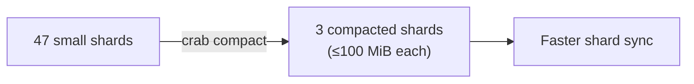

## Metadata Compaction

Every push creates new metadata shards that describe which chunks belong to which files. Over time, incremental pushes produce many small shards. Each fetch or hydrate must download and parse every shard individually — so shard count directly impacts sync performance.

Compaction merges many small shards into fewer large ones, reducing network round-trips and speeding up subsequent operations.



## How Compaction Works

1. Pins the repository's current shard inventory and validates its size and
   entry bounds.
2. Downloads shards with bounded concurrency into a temporary maintenance
   workspace, verifying each content hash before parsing.
3. Merges the complete set with xet-core's shard merging algorithm, respecting
   the maximum shard size limit.
4. Uploads hash-verified replacement shards and the new immutable shard index.
5. Atomically updates the shard-list with compare-and-swap and publishes
   candidate roots before the new list is visible.
6. Reconciles the partitioned ref registry without dropping roots registered by
   a concurrent push.

Source shards are left in place for garbage collection to clean up later.

## Usage

### Preview without making changes

```bash
crab compact --repo org/models --bucket my-crab-bucket --dry-run
```

Reports how many shards would be merged without downloading or uploading anything.

### Compact with defaults (100 MiB max shard size)

```bash
crab compact --repo org/models --bucket my-crab-bucket
```

### Custom shard size limit

```bash
crab compact --repo org/models --bucket my-crab-bucket --max-shard-size 50MiB
```

Smaller compacted shards trade fewer total shards for lower per-shard download latency — useful when shard sync latency matters more than minimizing shard count. The value must be greater than zero and cannot exceed Xet's native 100 MiB shard cap.

## When to Compact

| Signal | Action |
|--------|--------|
| Dozens of small shards accumulated | Compact to reduce sync overhead |
| `crab fetch` or `crab hydrate` feels slow | Fewer shards = fewer round-trips |
| After many incremental pushes | Periodic maintenance (e.g., weekly in CI) |

## Concurrency Safety

Compaction holds a renewable repository maintenance lease and is safe to retry.
Pushes may continue: immutable candidate objects are safe before publication,
the manifest compare-and-swap prevents stale commits, and registry
reconciliation preserves concurrent push roots. Cancellation is checked between
bounded download, parse, and publish units.

## Compaction vs. Repacking

| | `crab compact` | `crab repack` |
|---|---|---|
| **Operates on** | Metadata shards | Git pack files |
| **Goal** | Reduce shard count for faster sync | Reduce pack count for faster listing |
| **Impact** | Speeds up fetch/hydrate | Speeds up clone/fetch |

## CLI Reference

For complete command syntax and all available flags, see the [crab compact reference](/docs/cli/reference/crab-compact).
