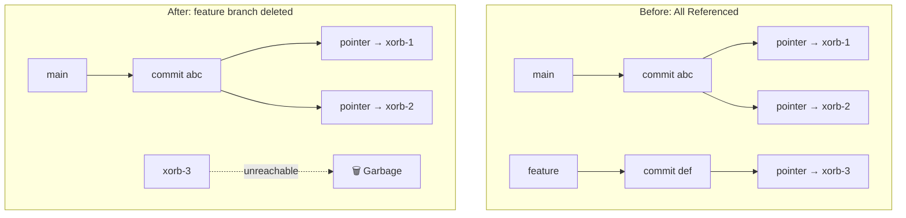
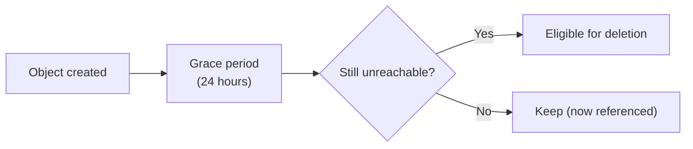

# Garbage Collection

Over time, your cloud bucket accumulates objects that are no longer referenced
by current repository state, recovery roots, or workflow artifacts. Garbage
collection identifies these unreachable objects and removes them, reclaiming
storage space and reducing cloud costs.

Crab retains immutable manifest history for `crab recover history`. A deleted
branch, force-push, or repack does not make its old objects collectible while a
historical root still references them. Crab currently retains those roots
without a time or count limit by default. To trade older recovery points for
storage reclamation, preview and apply an explicit generation boundary:

```bash
crab recover history prune --keep-last 20
crab recover history prune --keep-last 20 --apply
crab gc --scope repo --dry-run
crab gc --scope repo
```

Retention counts distinct generations and preserves every alternate root in a
kept generation. Pruning removes only root manifests. GC separately proves
which dependent objects became unreachable and still applies its grace period.

## What Becomes Garbage?

Objects become unreachable when the refs that pointed to them are gone:



Common sources of garbage:
- **Deleted branches** — Experiment branches that were cleaned up
- **Force pushes** — Rewritten history leaves old objects behind
- **Deleted files** — Files removed from tracking in newer commits
- **Failed pushes** — Partially uploaded objects from interrupted operations

## The Grace Period

Garbage collection uses a **grace period** (default: 24 hours) to avoid deleting objects from in-progress operations. If someone is mid-push when you run GC, their newly uploaded xorbs might appear unreachable (not yet linked to a ref). The grace period protects them.



## Running Garbage Collection

### Preview what would be collected

```bash
crab gc --dry-run
```

```
GC dry run:
  Unreachable xorbs:       42 (1.2 GB)
  Unreachable shards:      8 (45 MB)
  Unreachable file indices: 15 (2.1 MB)
  Total reclaimable:       1.25 GB
  (no objects deleted — dry run)
```

### Run GC

```bash
crab gc
```

### Force-collect recent objects

```bash
crab gc --force
```

This bypasses age protection after confirmation. It does not bypass writer
fencing, reachability, registry/coordinator proof, or closure validation. Use
only when the operational impact of reclaiming recently-created unreachable
objects is understood.

## Safety Guarantees

Crab's GC is designed to be safe by default:

1. **Never deletes referenced objects** — Current state, journal transactions, workflow artifacts, and every immutable recovery root are protected.
2. **Grace period** — Recently created objects are protected even if currently unreachable.
3. **Configured grace** — Omitted `--grace-period` uses the configured value
   (24 hours by default); non-force runs clamp values below one hour.
4. **Confirmation required** — `--force` prompts for confirmation unless `--yes` is also passed.
5. **Atomic ref reads** — The reachability scan uses a consistent snapshot of refs.
6. **Writer/sweep fencing** — Destructive GC takes an exclusive renewable
   sweep fence across mark, planning, deletion, and reconciliation. Writers
   hold shared global/repository fences through publication, so an unfinished
   upload cannot be reclaimed by a concurrent sweep.
7. **Explicit partial failure** — Failed repository deletions or metadata reconciliation return `CRAB-E0322` with structured counters and a non-zero exit status.

Bucket scope scans every registered repository's current and retained history
with bounded concurrency. It streams global shard and xorb namespaces into
durable candidate batches, stores reachability marks in partitioned run-owned
objects, and consumes strict shard closures without referenced-shard body GETs.
Generation-pinned file-index rows are reconciled before object deletion and the
completion marker is retried safely after a crash.

Destructive repository scope also streams current, historical, journal,
workflow, and pack roots into durable key marks. Pack segments, candidate
batches, and store-only delete outcomes are bounded; dry-run and repair paths
remain collection-oriented because they are non-destructive or administrative.

## When to Run GC

| Scenario | Frequency |
|----------|-----------|
| Active development (many branches) | Weekly |
| After major cleanup (deleted old branches) | Once after cleanup |
| Cost optimization | Monthly |
| After force-push rewrite | Once after rewrite |

GC is not something you need to run constantly. Cloud storage is cheap, and the grace period means you can't accidentally delete in-use data. Run it when you want to reclaim space or reduce costs.

## GC vs. Prune vs. Cache Clean

| Command | What it removes | Where |
|---------|----------------|-------|
| `crab gc` | Unreachable objects | Remote (cloud storage) |
| `crab prune` | Oldest cached chunks, xorbs, and shards beyond budget | Local cache |
| `crab cache clean` | All cached objects | Local cache |

These are complementary: `crab gc` cleans the remote, `crab prune` cleans the local cache.

## CLI Reference

For complete command syntax, all options, and JSON output format, see the [crab gc reference](/docs/cli/reference/crab-gc).
