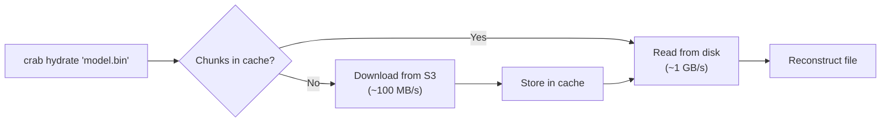

# Local Cache

Crab keeps several disposable local accelerators: decoded xorb ranges, complete
xorbs and shards, and persistent metadata indexes. Fetch, explicit hydrate,
filter smudge, mount, and worktree prefetch share the decoded-range cache. Complete objects are
also reused when a workflow has deliberately installed them.

The shared read runtime attaches this cache using the object cache's root and
budget; unsafe or unavailable cache storage is bypassed. Warm payload reuse
does not guarantee fully offline access: metadata and authorization may still
need the network. Cross-process and provider qualification remains tracked in
[Plan 017](https://github.com/crab-build/crab/blob/main/plans/017-local-cache-read-hardening.md).

## How the Cache Works



Cached xorbs and shards are content-addressed and verified before use. Decoded
ranges are keyed by xorb identity and chunk-index range. This means:

- **Cross-file sharing** — Files that reference the same xorb ranges can reuse one cached range.
- **Cross-branch sharing** — Checkout and mount reads reuse ranges cached by earlier compatible read paths.
- **Verified fallback** — Corrupt content-addressed bodies are rejected and fetched again from the remote.

## Cache Location

| Priority | Source | Default Path |
|----------|--------|-------------|
| 1 | `$CRAB_CACHE_DIR` environment variable | Custom path |
| 2 | Default | `~/.cache/crab/` (range cache under `chunks/`) |

To use a fast NVMe drive for the cache:

```bash
export CRAB_CACHE_DIR=/mnt/nvme/crab-cache
```

## Cache Size Management

The configured cache budget defaults to 10 GiB. Configure it in bytes:

```toml
[cache]
max_bytes = 10737418240
```

Range and object caches receive this budget. Unified admission, all-family
accounting, and automatic maintenance are still being completed in Plan 017;
do not treat it as a proven hard limit on total disk usage yet. The old
`chunk_cache_bytes`, `shard_cache_bytes`, and `[cache].chunk_cache_dir` fields
are no longer supported.

Within one process, all live decoded-range handles for the same canonical cache
directory must resolve the same `max_bytes` value. A conflicting caller bypasses
its local range cache and continues through verified origin reads instead of
silently using another repository's limit. The directory can reopen with a new
budget after its final live handle closes.

## Inspecting the Cache

```bash
crab cache stats
```

Shows the shared budget and per-family logical/allocated usage, including
databases, hints, bloom files, temporaries, and retained state. Add `--json`
for a versioned report. Inspection leaves missing roots missing, reads the
catalog without mutation, validates shard-hint SQLite schema and row shape, and
does not initialize Xet state or repair entries. A failed family remains visible
without hiding independent family counts; partial reports have a nonzero exit.
These are live linked-entry measurements, not an atomic snapshot, full
integrity verification, or proof of budget enforcement.
See
[`crab cache stats`](/docs/cli/reference/crab-cache#stats) for the exact scope.

## Cleaning the Cache

```bash
# Remove eligible cached payloads (re-download on next hydrate)
crab cache clean

# Evict oldest cache objects until configured budgets are satisfied
crab prune
```

`crab prune` is usually preferred when you want to keep the cache but trim it
back to budget. Use `crab cache clean` to remove eligible payloads.

Cleanup preserves unknown subtrees, maintenance workspaces, mirror repositories,
retained profiles, databases and their side files, and unpublished temporaries.
It skips active readers and concurrent publishers, and reports retained, busy,
and unsafe entries separately from actual removed files and bytes. It does not
wipe the cache root. Object/range pruning and verification now use the same
private payload boundary and retain unknown and busy entries. SQLite/root
ownership, full reservation protection, and complete resource accounting remain
part of Plan 017; these payload safeguards do not close those gaps.

Clean, verify, and prune reject cache roots that resolve to the filesystem root,
home directory, current directory, or its ancestors, including relative paths.
Their `crab optimize cache` equivalents share the same checks. A missing cache
is a no-op, not a reason to create directories during maintenance.

## Pre-warming the Cache

To pre-warm selected ranges for hydration, checkout, mount, or worktree reads:

```bash
crab fetch --include '*.safetensors'
```

This verifies each selected file into a discard sink without changing the
worktree. Do not rely on it for offline explicit `crab hydrate` until Plan 017's
cross-command reuse gate is delivered.

## When to Clean vs. Prune

| Situation | Action |
|-----------|--------|
| Running low on disk space | `crab prune` (LRU eviction to budget) |
| Removing reusable payloads | `crab cache clean` (retained state survives) |
| Suspected payload corruption | `crab cache clean` (eligible payloads only) |
| Want to trim cache to budget | `crab prune` |

## Remote Cache Service

The local cache is per-machine — each developer and CI runner maintains their own. For teams, Crab offers an optional **remote cache service** (`crab-cache-server`) that shares cached objects across all machines in your organization.

Local cache files can reconstruct private repository content. Keep the cache
root private to one operating-system user; do not share it through permissive
filesystem permissions. Use the authenticated remote cache service for team
reuse.

When configured, the lookup order is: local cache → remote cache → cloud storage. The first fetch from any team member warms the remote cache, and subsequent fetches from anyone else are served at network-local speed instead of cloud latency.

For deployment and configuration details, see the [Cache Service](/docs/cli/cache-service) guide.

## CLI Reference

For complete command syntax, see the [crab cache reference](/docs/cli/reference/crab-cache).
