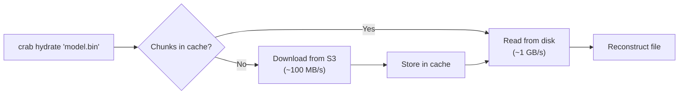

# Local Cache

Every time Crab downloads chunks from cloud storage (during hydration or fetch), it stores them in a local cache. The next time you need those chunks — re-hydrating the same file, switching branches, or a teammate hydrating shared content on a shared machine — the data is served from local disk instead of the network.

## How the Cache Works



The cache is a content-addressed store — chunks are identified by their blake3 hash. This means:

- **Cross-file sharing** — If two files share chunks (common in dataset versions), the cache serves both from a single copy.
- **Cross-branch sharing** — Switching branches and re-hydrating reuses cached chunks from the previous branch.
- **Idempotent** — Fetching the same chunk twice is a no-op; it's already cached.

## Cache Location

| Priority | Source | Default Path |
|----------|--------|-------------|
| 1 | `$CRAB_CACHE_DIR` environment variable | Custom path |
| 2 | `.crab/config.toml` `cache.dir` setting | Custom path |
| 3 | Platform default | `~/.cache/crab/` |

To use a fast NVMe drive for the cache:

```bash
export CRAB_CACHE_DIR=/mnt/nvme/crab-cache
```

## Cache Size Management

The cache grows as you hydrate files. You can set a maximum size:

```toml
# .crab/config.toml
[cache]
max_size = "50GB"
```

When the cache exceeds this limit, least-recently-used chunks are evicted. Eviction is lazy — it happens during the next cache write, not in the background.

## Inspecting the Cache

```bash
crab cache stats
```

Shows total size, number of objects, hit rate, and cache directory path.

## Cleaning the Cache

```bash
# Remove everything (re-download on next hydrate)
crab cache clean

# Evict oldest cache objects until configured budgets are satisfied
crab prune
```

`crab prune` is usually preferred when you want to keep the cache but trim it
back to budget. Use `crab cache clean` when you want a completely fresh cache.

## Pre-warming the Cache

If you know you'll need certain files later (going offline, preparing for a demo), pre-warm the cache:

```bash
crab fetch --include '*.safetensors'
```

This downloads chunks without hydrating files. Later hydration can reuse the cached data instead of fetching those chunks from the remote again.

## When to Clean vs. Prune

| Situation | Action |
|-----------|--------|
| Running low on disk space | `crab prune` (LRU eviction to budget) |
| Switching to a different project | `crab cache clean` (fresh start) |
| Suspected cache corruption | `crab cache clean` (nuclear option) |
| Want to trim cache to budget | `crab prune` |

## Remote Cache Service

The local cache is per-machine — each developer and CI runner maintains their own. For teams, Crab offers an optional **remote cache service** (`crab-cache-server`) that shares cached objects across all machines in your organization.

When configured, the lookup order is: local cache → remote cache → cloud storage. The first fetch from any team member warms the remote cache, and subsequent fetches from anyone else are served at network-local speed instead of cloud latency.

For deployment and configuration details, see the [Cache Service](/docs/cli/cache-service) guide.

## CLI Reference

For complete command syntax, see the [crab cache reference](/docs/cli/reference/crab-cache).
