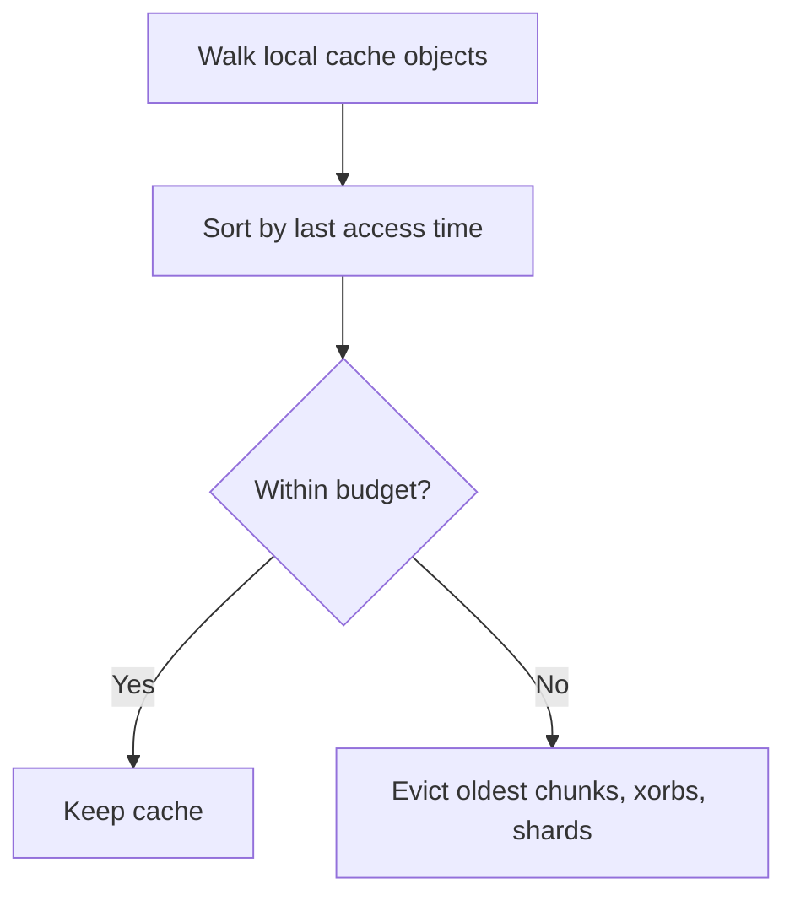

## Reclaiming Local Cache Space

As you work with different branches and files, Crab's local cache accumulates chunks, xorbs, and shards. Pruning evicts the least-recently-used cache objects until the cache fits its configured budgets, freeing disk space without touching the remote store.



## How Pruning Works

Prune is purely local and never mutates the configured remote:

1. Walks the local cache directory (`~/.cache/crab/` or `$CRAB_CACHE_DIR`).
2. Sorts chunk/xorb objects by least-recently-used order under the shared data-object budget.
3. Sorts shard objects by least-recently-used order when a shard budget is configured.
4. Removes the oldest objects needed to bring the cache back under budget.

The remote store is the authoritative copy. Pruned objects can be fetched again
when the remote remains reachable and still contains the referenced data.

## Usage

### Preview what would be removed

```bash
crab prune --dry-run
```

```text
prune (dry run): would remove 15 objects (234567890 bytes)
```

### Run the prune

```bash
crab prune
```

```text
prune complete: removed 15 objects (234567890 bytes freed)
```

### Verbose output (see each object)

```bash
crab prune --verbose
```

## When to Prune

| Scenario | Why it helps |
|----------|-------------|
| After heavy hydrate/fetch work | Trims oldest cached data back to budget |
| Disk space is low | Reclaims cache space without affecting the remote |
| Periodic maintenance | Keeps the cache lean over time |

## Prune vs. GC

These are different operations at different scopes:

| | `crab prune` | `crab gc` |
|---|---|---|
| **Scope** | Local cache only | Remote store |
| **Safety** | Remote is untouched; later reads may need network access | Requires careful reference checking |
| **Reversibility** | Objects re-fetched on next hydrate | Deleted objects are gone permanently |
| **When to use** | Free local disk space | Remove unreachable remote objects |

## Cache Location

The local cache defaults to `~/.cache/crab/`. Override with:

```bash
export CRAB_CACHE_DIR=/path/to/cache
```

## Verify reclaimed space

Compare the dry-run plan with the terminal result and a new usage report:

```bash
crab prune --dry-run --json
crab prune --json
crab du
```

The removed-object count can differ if cache access or another Crab process
changes recency between plan and apply. After pruning, hydrate one representative
file to confirm the configured remote can refill missing cache objects. Use
`crab cache clean` only when you intend to remove the full local cache rather
than enforce its budgets.

## CLI Reference

For complete command syntax and all available flags, see the [crab prune reference](/docs/cli/reference/crab-prune).
