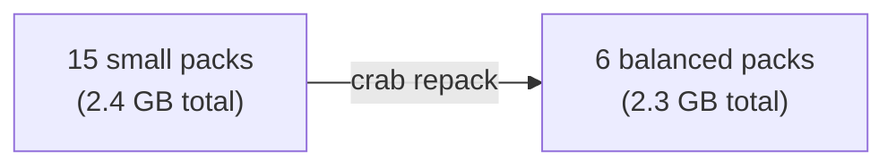

## Optimizing Remote Storage Layout

Every push creates a new pack file in the remote store. Over time, dozens or hundreds of small packs accumulate. This increases S3 listing latency, adds per-object overhead costs, and slows down clone and fetch operations.

Repacking uses Git's geometric policy to roll up smaller packs into fewer,
progressively larger ones. Large stable packs stay in place, so maintenance
does not repeatedly rewrite the full history.



## How Repacking Works

1. Pins the canonical manifest and segmented pack inventory.
2. Downloads packs and indexes with bounded concurrency after a free-space
   preflight.
3. Verifies every source pair and the complete pinned ref graph, then runs
   Git's geometric repack.
4. Validates every replacement pack with strict Git checks.
5. Uploads immutable replacement objects and repairs missing metadata sidecars.
6. Atomically updates the manifest using compare-and-swap (CAS).
7. Publishes the rebound visibility proof, exact locators, and generation
   receipt before reporting success.

Old pack files leave the active manifest after the update, but immutable
recovery history continues to reference them. Repack therefore reduces the
pack count used by clone and fetch. To reclaim old pack bytes, preview and apply
an explicit history-retention boundary with `crab recover history prune
--keep-last N`, then run repo-scoped `crab gc`.

### Atomicity and Safety

The manifest update uses CAS to prevent concurrent maintenance or push activity
from corrupting state. Apply mode holds the repository maintenance lease. If
the manifest changes between repack and commit, the operation fails without
replacing newer state; rerun against the new generation. Missing post-CAS
evidence is repairable on a rerun without advancing an already consolidated
generation. Dry-run reports current bytes; replacement size is unknown until
Git performs the repack.

## Usage

### Preview pack statistics

```bash
crab repack --dry-run
```

`repack dry run: 15 packs, 2400000000 bytes, 0.1s`

### Run the repack

```bash
crab repack
```

```text
repack complete: 15 → 6 packs, 2400000000 → 2300000000 bytes, 4.2s
```

## When to Repack

| Signal | Action |
|--------|--------|
| Many small pushes accumulated | Repack to consolidate |
| `crab du --remote` shows high object count | Repack to reduce listing overhead |
| Clone/fetch feels slow | Fewer packs = fewer round-trips |
| Periodic maintenance | Run weekly in CI for active repos |

The `repack_auto_threshold` config option emits an advisory warning after a
fetch when the pack count exceeds a threshold. It does not run consolidation
on the developer's push/fetch path:

```toml
# .crab/config.toml
repack_auto_threshold = 20
```

## Repack vs. Xorb Optimization

These optimize different things:

| | `crab optimize packs` | `crab optimize xorbs` |
|---|---|---|
| **Operates on** | Git pack files | Content-addressed xorbs |
| **Goal** | Reduce pack count and listing overhead | Optimize xorb size for access patterns |
| **When** | After many pushes | When xorb sizes don't match your workload |

## CLI Reference

For complete command syntax and all available flags, see the [crab repack reference](/docs/cli/reference/crab-repack).
