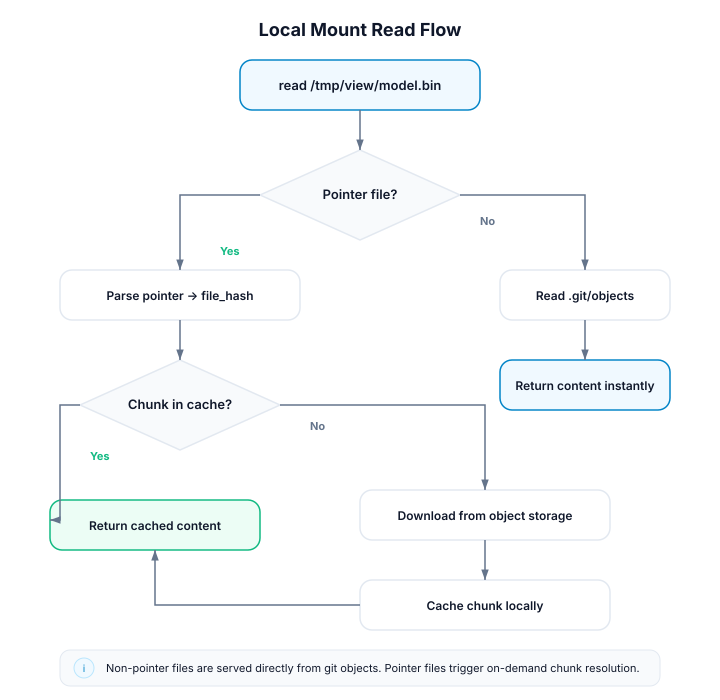

# Local Mount

A local mount uses an existing `.git` directory on disk to present a
repository (or a different branch of it) as a virtual filesystem. No clone, no
network — reads are served directly from the local object database.

## Use Case

You're working on `feature-branch` but need to reference files from `main`
without switching branches. A local mount gives you a read-only view of any ref
in the same repository, mounted at a separate path. Unmount or switch the
existing mount before opening another view of the same repository.

Common scenarios:

- **Code review** — mount a PR branch to browse it alongside your current work
- **Comparison** — switch the mount between branches and compare exported views
- **Build artifacts** — mount a release tag to inspect its state
- **Avoid stashing** — view another branch without disrupting uncommitted changes

## Mount local content

```bash
# View main while working on a feature branch
crab mount --repo . --mountpoint /tmp/main-view --ref=main

# Browse files
ls /tmp/main-view/src/
cat /tmp/main-view/README.md

# Unmount when done
crab unmount --mountpoint /tmp/main-view
```

## How It Differs from Remote Mount

| | Local Mount | Remote Mount |
|---|---|---|
| **Source** | Local filesystem path | `crab://`, `s3://`, `gs://`, `az://` URL |
| **Clone step** | None — uses `.git` directly | Blobless clone (cached) |
| **Startup work** | Build a local snapshot | First mount downloads tree objects |
| **Network** | Not needed for git-native files | Required for initial clone and hydration |
| **Pointer files** | Hydrated from object storage (needs network) | Hydrated from object storage |
| **Cache directory** | `~/.crab/mounts/repos/<hash>/` (hash of absolute path) | `~/.crab/mounts/repos/<hash>/` (hash of URL) |

The key difference: local mounts read tree and blob objects from the local
`.git/objects` directory. For regular git files, this means zero network
access and local reads. The mount is ready after the snapshot can be
built from the local ODB.

## Pointer File Hydration

If the repository uses crab for large file tracking, some files are stored as
pointer blobs in git. When you read one of these files through the mount:

1. The resolver detects it's a pointer file (not a regular git blob).
2. The hydration service resolves the pointer to chunks in object storage.
3. Chunks are downloaded and reconstructed into the full file content.

This means **pointer-tracked files still require network access**, even in a
local mount. The crab remote must be configured in the repository for hydration
to work.

If no crab remote is configured, pointer files return EIO with a warning in
the logs. Git-native files continue to work normally.



## Examples

### Mount a different branch for code review

```bash
# Mount the PR branch
crab mount --repo /home/user/my-project --mountpoint /tmp/pr-review --ref=fix/auth-bug

# Open files in your editor
code /tmp/pr-review/src/auth.rs

# Clean up
crab unmount --mountpoint /tmp/pr-review
```

### Mount for side-by-side comparison

```bash
# Mount both branches
crab mount --repo . --mountpoint /tmp/main --ref=main
crab mount --repo . --mountpoint /tmp/feature --ref=feature-branch

# Compare
diff -r /tmp/main/src/ /tmp/feature/src/

# Or use a visual diff tool
meld /tmp/main/src/ /tmp/feature/src/

# Clean up
crab unmount --all
```

### Mount a bare repository

```bash
# Bare repositories work too; point at the .git directory
crab mount --repo /srv/git/project.git --mountpoint /tmp/browse --ref=main
```

### Mount read-only for safety

```bash
crab mount --repo . --mountpoint /tmp/browse --ref=release-v2.0 --read-only
```

With `--read-only`, all write operations return EROFS. No overlay is created.

### Mount the current directory's repo

```bash
# "." resolves to the repo containing the current directory
crab mount --repo . --mountpoint /tmp/other-branch --ref=develop
```

## Notes

- Local mounts participate in the same coordinator as remote mounts. They
  share the chunk cache and hydration pool.
- The refresh loop is active for local mounts too — if someone pushes new
  commits to the local repo (e.g., via `git fetch`), the mount picks them up
  automatically.
- Overlay writes (if not `--read-only`) are stored in
  `~/.crab/mounts/repos/<hash>/overlay/upper/`, not in the source repository.
  They do not affect the original repo's working tree.
- Only one local mount can be active for a given repo cache at once.
  Use `crab mount switch` or unmount before opening another branch view.
