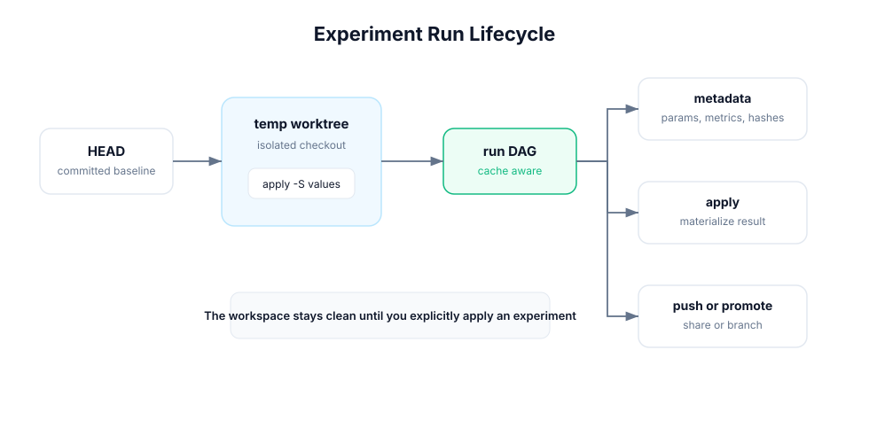

# Experiments

Experiments run the workflow DAG in a temporary worktree with parameter
overrides. Your current workspace stays clean while Crab records metadata,
metrics, stage hashes, and the base commit.



## Run an Experiment

```bash
crab exp run -S train.lr=0.001 -S train.epochs=50 -n low-lr
```

`-S` and `--set` apply parameter overrides. The run starts from the current
`HEAD`, so commit the baseline workflow before running experiments that need to
be shared.

Use JSON for automation:

```bash
crab exp run -S train.lr=0.001 -n low-lr --json
```

## List and Show

```bash
crab exp ls
crab exp show low-lr
crab exp show <experiment-id> --json
```

Experiments have UUID-style IDs and optional human names. Use names for local
exploration and IDs for scripts.

## Compare Experiments

```bash
crab exp diff low-lr high-lr
crab exp diff low-lr high-lr --json
```

Diff output includes parameter overrides, stage hashes, and collected metrics.
Use it before applying an experiment to avoid promoting a run whose outputs are
not actually better.

## Apply, Save, Rename, and Promote

Apply a completed experiment snapshot to the workspace:

```bash
crab exp apply low-lr
```

Save the current workspace as an experiment without running:

```bash
crab exp save -n manual-baseline
```

Rename an experiment label:

```bash
crab exp rename low-lr lr-0-001
```

Promote an experiment to a branch:

```bash
crab exp promote lr-0-001 --branch experiments/lr-0-001
```

Apply when you want files in your current workspace. Promote when you want a
branch boundary for review or follow-up work.

## Push and Pull Experiments

```bash
crab exp push --all
crab exp pull --all
```

Pushing publishes experiment metadata and associated cache references to the
configured Crab remote. Pulling lets another clone inspect or apply experiments
without rerunning them.

For teams, use this pattern:

```bash
crab exp run -S train.lr=0.001 -n candidate --json
crab exp push candidate
```

Then a reviewer can run:

```bash
crab exp pull candidate
crab exp show candidate
crab exp apply candidate
```

## Remove and Garbage Collect

Remove selected local metadata:

```bash
crab exp remove old-run
```

Keep selected experiments and remove the rest:

```bash
crab exp remove --keep best-run
```

Prune old experiment metadata:

```bash
crab exp gc --keep 100
crab exp gc --keep 20 --dry-run
```

Use dry runs before broad cleanup on shared workstations.

## Naming Conventions

Use short names that encode the intent, not every parameter:

```text
baseline
lr-0-001
efficientnet-b0
regularized-v2
```

Let `crab exp show` and `crab exp diff` carry the full parameter record.

## Local and Remote Lifecycle

| State | Where it lives | How to move it |
|-------|----------------|----------------|
| Local metadata | `.crab/workflow/exp/` | Created by `crab exp run` or `crab exp save` |
| Temporary worktree | Local temp area | Cleaned by successful runs or `crab exp clean` |
| Remote experiment | Crab remote | Uploaded with `crab exp push`, downloaded with `crab exp pull` |
| Workspace result | Current working tree | Materialized with `crab exp apply` |
| Branch result | Git ref | Created with `crab exp promote` |

See [Hydra](./hydra) for config-group composition and [Queues](./queues) for
batch experiment execution.
