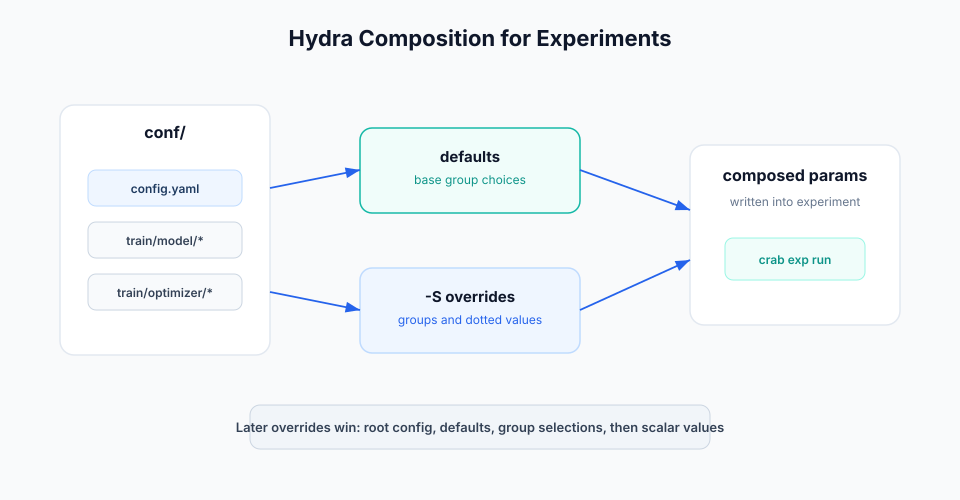

# Hydra Workflows

Crab can compose Hydra-style config groups before running experiments. This is
useful when model, optimizer, dataset, or deployment choices live in separate
config files instead of one flat params file.



## Enable Hydra Composition

```bash
# Optional explicit opt-in is no longer needed; set false only to opt out.
crab config set hydra.enabled true
crab config set hydra.config_dir conf
crab config set hydra.config_name config.yaml
```

These settings live in `.crab/local.toml`, which is local by default. Commit
workflow YAML and config files, but do not commit credentials or machine-local
paths.

## Recommended Layout

```text
conf/
  config.yaml
  train/
    model/
      linear.yaml
      efficientnet.yaml
    optimizer/
      adam.yaml
      sgd.yaml
params.yaml
crab.yaml
```

Root config:

```yaml
# conf/config.yaml
defaults:
  - train/model: linear
  - train/optimizer: adam

train:
  epochs: 20
```

Config group:

```yaml
# conf/train/model/efficientnet.yaml
train:
  model:
    name: efficientnet
    variant: b0
```

Another group:

```yaml
# conf/train/optimizer/adam.yaml
train:
  optimizer:
    name: adam
    lr: 0.001
```

## Run with Config Groups

```bash
crab exp run \
  -S train/model=efficientnet \
  -S train.optimizer.lr=0.0005 \
  -n efficientnet-low-lr
```

Group overrides select config files. Dotted overrides update scalar values in
the composed config. Crab then applies the composed params to the experiment
worktree before executing the DAG.

## Override Precedence

Use this mental model:

1. Load `hydra.config_name` from `hydra.config_dir`.
2. Apply defaults listed in the root config.
3. Apply config-group overrides such as `train/model=efficientnet`.
4. Apply dotted scalar overrides such as `train.optimizer.lr=0.0005`.
5. Run the workflow in the experiment worktree.

When the same value appears in multiple places, the later step wins.

## Stage Declarations

Stages should depend on the values they actually use:

```yaml
params:
  - params.yaml

stages:
  train:
    cmd: python src/train.py --params params.yaml
    deps:
      - src/train.py
      - data/features.parquet
    params:
      - train.model.name
      - train.model.variant
      - train.optimizer.lr
      - train.epochs
    outs:
      - models/model.pkl
    metrics:
      - metrics/train.json
```

This keeps stage hashes honest. If a config value changes the output, declare
that value as a stage param.

## Production Tips

- Keep config groups small and named by product choice, such as model family or
  optimizer, not by one-off experiment names.
- Prefer `crab exp run -S group=value -S key=value` over editing committed
  params for exploratory runs.
- Commit baseline config files before running experiments that teammates must
  reproduce.
- Use `crab exp show <experiment-id> --json` to record the composed settings in automation.
- Avoid secrets in Hydra configs. Use environment or cloud credential chains
  for credentials.

## Troubleshooting

If an override does not take effect:

```bash
crab exp run -S train/model=efficientnet --dry --json
```

Check that `hydra.enabled` is true, the config directory exists, the root config
name is correct, and the group path matches the directory structure.

If an experiment works locally but not in another clone, confirm the config
files are committed and the other clone has the same Hydra config settings.
