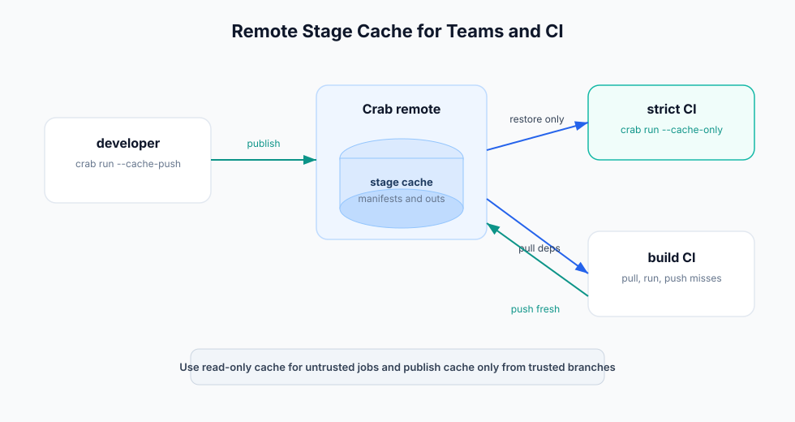

# Remote Cache and CI

Remote stage cache lets one machine produce outputs and another machine reuse
them without re-running expensive commands.



## Cache Publishing Modes

Publish as each stage completes:

```bash
crab run --cache-push
```

Backfill all local cache entries:

```bash
crab workflow push-cache --all
```

Use `--cache-push` for normal production runs. Use `push-cache --all` after
offline work or after enabling remote cache for an existing repo.

## Cache Consumption Modes

Require every needed stage to exist in cache:

```bash
crab run --cache-only
```

Pull missing deps only for stages that must execute:

```bash
crab run --pull --allow-missing
```

Run and publish fresh misses:

```bash
crab run --pull --allow-missing --cache-push
```

## CI Pattern: Verify Lockfile and Cache

Use this job when CI should fail if the committed workflow state is not fully
reproducible from remote cache:

```bash
crab init
crab config set workflow.enabled true
crab run --validate
crab run --cache-only --json
crab metrics show --json
```

This is fast and strict. It proves the lockfile and remote cache are complete.

## CI Pattern: Build Missing Cache

Use this job on trusted branches:

```bash
crab init
crab config set workflow.enabled true
crab run --validate
crab run --pull --allow-missing --cache-push --jsonl
crab workflow push-cache --all --json
```

This lets CI hydrate only required inputs, run stale stages, and publish new
cache entries for later jobs.

## Read-Only Cache Policy

Some environments should read workflow cache but never publish it:

```bash
crab config set workflow.remote_cache_readonly true
```

Use this for untrusted pull requests or ephemeral review jobs. Trusted mainline
jobs can leave it false and publish cache.

## Recommended Branch Policy

| Branch type | Suggested behavior |
|-------------|--------------------|
| Pull request from fork | `--cache-only` or read-only cache. Do not publish. |
| Pull request from trusted branch | `--pull --allow-missing`, publish only if policy allows. |
| Main branch | `--pull --allow-missing --cache-push`. |
| Nightly rebuild | `--force --cache-push` when you intentionally refresh outputs. |

## Artifacts to Upload

Upload these as CI artifacts when available:

- `workflow-events.jsonl` from `crab run --jsonl`.
- `params.diff.json` from `crab params diff --json`.
- `metrics.diff.json` from `crab metrics diff --json`.
- HTML plot output from `crab plots diff --format html`.

Never upload cloud credentials, `.crab/config.toml` files with secrets, or raw
object-store credentials.

## Failure Handling

- Exit code 3 from `--cache-only` means a cache entry was missing.
- Scheduler lock errors usually mean another workflow run is active.
- Missing deps mean the workspace is incomplete or `--pull` was not used.
- Cache misses with unchanged inputs should be investigated with
  `crab run --dry --explain-miss`.
