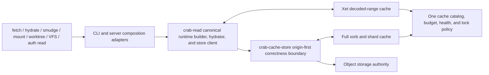

# Plan 017: Harden local cache, deduplication, and hydration

> **Executor instructions**: Deliver one phase per PR. Read the whole phase,
> its dependencies, and its STOP conditions before editing. Rebuild the
> evidence map when the drift check finds changes. Every PR must delete the
> path it replaces, update this plan's status/evidence, and prove the listed
> acceptance criteria. Do not add compatibility for disposable local state or
> unshipped configuration.
>
> **Drift check (run first)**:
> `git diff --stat 63bfc8c..HEAD -- crab/src/main.rs crab/src/cache crab/src/cmd/cache.rs crab/src/cmd/clone.rs crab/src/cmd/doctor.rs crab/src/cmd/fetch.rs crab/src/cmd/hydrate.rs crab/src/cmd/mount.rs crab/src/cmd/prune.rs crab/src/cmd/release.rs crab/src/cmd/worktree.rs crab/src/core/config.rs crab/src/git crab/src/lfs crab/src/metadata crab/src/read crates/crab-auth-server crates/crab-cache crates/crab-cache-store crates/crab-metadata crates/crab-read crates/crab-vfs packages/web/content/docs/cli/storage/local-cache.mdx packages/web/content/docs/cli/daily-workflow/fetching-updates.mdx packages/web/content/docs/cli/reference/crab-cache.mdx crab/docs/design/cache.md crab/docs/guides/cache.md`
> If hydration ownership, cache layout, chunk-index generation handling,
> replica restore, or any cache configuration changed, refresh the current-
> state table before implementation. Read `crates/AGENTS.md` before changing a
> shared crate.
> Also inspect `git status --short` and `git diff --stat`: the commit-only
> drift check does not include uncommitted implementation work.

## Status

### Required local RustFS qualification

User-requested delivery gate: qualify the actual Crab executable against a
local RustFS S3 service, using the supplied local credentials without retaining
them in source, reports, or logs. Use bucket `crabbuild` and a unique per-run
repository prefix; preserve existing service data and never run bucket-wide GC.
The console is not the S3 endpoint: verify the running service and use its S3
API endpoint for command traffic.

Context: in-process adapter tests cannot prove command configuration, remote
helper installation, cache persistence across process exits, or real S3 request
behavior. This gate supplements, and does not replace, the provider/platform
and lifecycle acceptance criteria below.

Execution and acceptance:

1. Record executable revision/features, RustFS image identity, isolated cache
   roots, unique remote prefix, and independent fixture hashes. Use generated
   large files with duplicate and partially modified versions. Keep artifacts
   on the mounted workspace volume, outside the source checkout.
2. Run real init/add, Git commit, Crab push, lazy clone, and hydrate processes.
   Every hydrated version must equal its independently recorded input bytes;
   verify pointer state before hydration and clean Git state afterward.
3. Exercise duplicate/modified pushes and inspect actual xorb/shard traffic and
   remote objects. Report observed deduplication; do not infer it from matching
   files, elapsed time, or a success exit code alone.
4. Use separate processes for cold hydration, warm rehydration, and fetch then
   hydrate. Attribute requests by family; warmed eligible xorb body reads must
   be zero while metadata remains available. An enforced body-read denial
   must still permit byte-identical warm hydration.
5. Exercise disposable-cache corruption, cache unavailability, and scoped
   clean/prune followed by reconstruction. Healthy origin must recover correct
   bytes; unavailable/corrupt origin must fail without publishing partial files
   or replacing pointers. Preserve unrelated cache/service sentinels.
6. Retain machine-readable commands, exit status, byte/request evidence, and
   failed cases. Repeat affected cases after fixes. Separate measured passes
   from skipped or blocked gates; RustFS alone is not AWS/GCS/Azure or native
   mount qualification.

Status: PARTIAL. Draft PR #147 is an implementation checkpoint, not phase
acceptance or permission to merge unfinished work. Retained local results are
below; provider, native mount, resource, and full lifecycle gates remain open.

**Retained Phase 3 failure and repair, 2026-09-03:** explicit prune left deleted
payloads charged in the catalog. A fresh, fully private installed RustFS run at
`863911c` removed 268,374,371 bytes, but stats still reported 268,796,148 catalog
bytes against 462,761 observed linked logical bytes. Both inventories were
complete and error-free. The earlier 63-check workflow did not assert catalog
reconciliation and does not close this gate. Installed revision `767f4eb` now
passes the original assertion plus exact remaining-payload reconciliation:
202,403,212 bytes removed, four catalog entries / 421,777 bytes remaining.
See the Phase 3 deletion-lifecycle execution slice for proof and open gates.

### Installed RustFS command checkpoint, 2026-09-03

Run `cache-f410.E7nt8I` used the existing RustFS service on port 9000 and unique
repository prefix `cache-qualification/cache-f410.E7nt8I` in `crabbuild`.
No pre-existing service data was deleted. The installed CLI was built by
`make install` at revision `67d3a9f`; SHA-256
`df2266780679f5af3da66037ebe43e6aa0794f503633343759ac651f84a9e1e9`.
RustFS image identity:
`sha256:41fe89380f4120a337790c02af192c3fe7bb55c3edc2e6e9357b487b47c6ab21`.
Generated inputs, command logs, hashes, request records, and failed attempts
are retained outside the checkout on the workspace volume under that run ID.

| Measured case | Result and retained evidence |
|---|---|
| Initial add/commit/push/lazy clone | Three 128 MiB files, including an exact duplicate and a one-MiB variant; add preserves bytes and Git stores pointers. Push creates four xorbs totaling 135,467,870 bytes. |
| Fresh reader, cold/warm hydration | Independent hashes pass. Cold hydration makes 14 xorb GETs; warm hydration with all origin xorb GETs denied makes zero. No complete xorb cache entries installed. `fresh-reader-workload/report.json`. |
| Separate-process fetch then hydrate | Fetch makes 10 xorb GETs and leaves pointers. Later hydrate succeeds with xorb GETs denied, zero attempted xorb reads, matching hashes, and clean Git state. Same report. |
| Corruption, clean, unavailable origin | Corrupt seven real range entries, recover correct bytes from origin; scoped clean preserves an unrelated sentinel; denied cold origin fails and leaves all pointers unchanged; restored origin succeeds. Same report. |
| Incremental duplicate/delta | A fourth exact duplicate adds no xorbs. A one-MiB edit creates one 1,154,373-byte xorb, retaining existing xorbs. Updated 512 MiB checkout hydrates correctly. `incremental-workload/report.json`. |
| Unsafe root | A root symlink is bypassed; origin hydration succeeds and its external target contains only the unchanged sentinel. Same report. |
| Natural root/prune | FAIL on the installed checkpoint: filter-process creates `bloom.bin` under a 0755 root; later private-cache access is disabled and prune rejects it. `incremental-workload/report-with-prune.json`. Earlier warm fixtures precreated 0700 roots and did not cover this producer. |

The first request gateway rejected SlateDB checkpoint writes and caused a
timed-out cold hydrate. The corrected gateway permits bounded writes only to
this run's repository metadata; it still denies xorb body reads when requested.
The interrupted attempt and its empty temporary files remain recorded; the
fresh-reader run uses a separate checkout, not erased failure evidence.

Open findings: hydrate JSONL labels failed per-file reads `skipped` and the
batch boundary loses typed causes; cold range hydration transfers substantially
more bytes than the unique xorb set; reusable qualification tooling has not yet
been integrated into the repository. These passes do not close those gaps.

### Fresh-root bloom producer repair — focused and installed proof

`CleanSession` now delegates persistence to `LocalCache` at the fixed disposable
path `hints/clean-bloom.bin`. The standalone ambient writer and unbounded reader
are removed. The synchronous cache boundary reuses pinned descriptor access,
the existing byte reservation, publication lease, and completed-file catalog
registration. Encoding remains product-owned; input is capped at one MiB.
No new configuration, runtime, dependency, or remote format is introduced.
The synchronous `CleanSession` signatures present in tag `v1.1.0` are preserved.
The old root-level `bloom.bin` is not read or migrated and remains outside
automatic cleanup authority. Existing unsafe roots are not silently chmodded.

Focused proof passes: two actual filter processes under umask 022 create/reopen
a missing root with private modes, followed by successful prune and clean.
All 218 cache tests pass with all features, 166 with only `local-cache`, and
116 with only `xet-chunk-cache`; strict all-target cache Clippy passes each
feature combination. The 56 clean and 37 filter-process tests pass, as do six
actual CLI clean/maintenance tests. Read/write bounds, missing-root inspection,
budget bypass, symlink target preservation, catalog registration, and scoped
cleanup have new regressions. The new leaf-link fixture initially assumed
publication must reject a symlink; the shared `renameat` contract safely
replaces the link itself. The corrected fixture proves read rejection and
unchanged external target bytes, without changing the production primitive.
Installed RustFS requalification passes all 24 command steps in
`fixed-bloom-workload/report.json`, without precreating any cache root and with
umask 022. Artifact SHA-256:
`f819746058ed08a29187d6995b9a03dc47837b903f78d83557289964e58e8913`;
build label `67d3a9f-bloom-dirty`, with the exact source-diff fingerprint retained
in the report. The four 128 MiB files independently match their expected hashes.
Cold hydrate makes 15 xorb body requests; warm hydrate makes zero even with
origin xorb reads denied. Cold fetch makes 14, and a separate hydrate process
again makes zero under denial. Eight corrupt ranges recover correctly; cache
clean preserves unrelated state. Cold denial returns nonzero with all pointers
unchanged, and restoring origin recovers the files. Adding unchanged hydrated
content leaves Git's index unchanged. Configuring a one-MiB budget, pruning the
naturally created root, and hydrating again all succeed; the sentinel survives,
no retained range file exceeds that entry budget, and Git state is clean.
This closes the reproduced bloom root-poisoning path, not physical-root byte
accounting, the JSONL failure diagnostic, or the other producer/platform gates.
Workspace formatting and whitespace checks pass. Strict CLI library Clippy
still stops in `crates/crab-vfs/src/nfs.rs` and `coordinator.rs` on eight
previously recorded diagnostics; no suppression or unrelated fix is included.
The sibling global JSON shard-hint writer, optional profiling producer, and
persistent index owners still require the Phase 4/5 audit. Bloom positives still
require the canonical remote file-index/shard proof, so last-writer-wins hint
replacement cannot itself authorize omitting staged content.

- **Priority**: P1
- **Effort**: XL, eight independently landable phases
- **Risk**: HIGH
- **Depends on**: current v1 xorb/shard layouts and chunk-index generation
  contract
- **Category**: correctness, availability, security, performance,
  operability, tests, documentation
- **Planned at**: commit `63bfc8c`, 2026-09-02
- **Delivery status**: IN PROGRESS (Phase 0 delivered)

**Current database gate — implementation and qualification in progress.** The
original root-replacement failures are now fixed by a descriptor-bound SQLite
owner; both rollback and connection-drop tests pass unchanged. Native macOS
WAL/root-swap, process-death recovery, and writer-exclusion tests also pass.
The intermittent reservation `BUSY` failure was traced to maintenance's
deferred read-to-write upgrade. Maintenance now acquires its writer before
reading owners; the unchanged eight-thread regression passes 200 consecutive
runs. This closes that attributed race, not every contention/lifecycle gate.
Catalog maintenance, owner release, and fill publication now share a retained
root: new regressions reproduced and fixed mutation of a replacement catalog.
Published fills retain a payload lease through registration, including across
explicit object/range maintenance. Main-file replacement inside the retained
root, other index owners, and complete crash/accounting proof remain open.
Non-mutating inspection and full product/platform acceptance remain open.
The earlier passing test counts below are historical checkpoints, not a claim
that every current gate has passed.
See [database lifetime execution slices](#database-lifetime-execution-slices)
for the reproduction, owner contract, dependencies, and acceptance criteria.
The database gate still blocks release claims for the affected surface, not
independent implementation or qualification work.

### Hydration completion reporting checkpoint, 2026-09-03

The installed bloom-repair artifact reproduced a second user-visible failure:
denied xorb GETs left pointers intact and exited nonzero, but ordinary JSONL
reported those files as skipped with their full logical sizes. The command
then emitted a success result before `main` emitted its terminal error.
`hydrate-outcomes-baseline/report.json` retains the failed regression attempt.

The working fix streams actual `HydrateFileResult` outcomes in both JSONL
modes, with per-file duration and zero materialized bytes on failure. A bounded
single typed cause survives batch collection, alongside the total failure
count. Machine-mode failures return before emitting a success result; `main`
owns the terminal error envelope. Recovery and CoW phase errors also drain
completed events, and reporting tasks abort when their owning future is
dropped. This does not bound the existing per-file event queue.

The `HydrateSummary` Clone contract and four-field `ManifestHydrateFileRow`
Rust shape from tag `v1.1.0` remain intact. Manifest wire rows gain `status`
through a private serialization wrapper. `thiserror` 2.0.18 exposes the retained
`Arc<CrabError>` as the typed source; a pointer-identity regression proves the
cause is shared, not recreated from its display string. The existing
`tokio-util` 0.7.18 abort-on-drop handle owns the reporting tasks; no dependency
or error-code catalog entry was added.

Error, error-catalog, and retry modules pass 79 tests, including the new typed
cause and retry regressions; both error-code integration tests also pass
without golden-file updates. Hydration module: 74/75
pass, including ordinary/manifest outcome serialization, first-cause retention,
and a real reconstruction batch combining an auth-expired failure with a
verified skip. The failing test is
`concurrent_cow_clone_publication_never_exposes_partial_content`: after one
publisher renames its verified inode, a competing publisher can replace the
destination before the first compares its descriptor stat to the path. The
CoW function is byte-identical to `5ac3c8c`; this run is not a green module
result, and the failure must not be hidden by changing its expectations.

Installed proof passes 29 checks across eight commands in
`hydrate-outcomes-fixed/report.json`: ordinary JSONL, manifest JSONL, and JSON
each fail under real xorb GET denial with exactly one terminal error. Failed
rows have zero bytes; all failed pointers remain unchanged. Local recovery
publishes one correct success row while three other files fail. Restoring
origin verifies all four 128 MiB files independently and leaves Git clean.
Artifact SHA-256:
`99cb01ab969de525185abc34d06710c5fb93b4b9e84b0a5f323c22e4ca484899`;
build label `5ac3c8c-hydrate-outcomes-dirty`. Source-only patch SHA-256 against
`5ac3c8c`:
`7664f6b3a9b8dbfa8cc1dbbd55df7bafe3b1bf7ee6ff8afed72e9e0376832605`.
Both release feature shapes were built and installed through `make install`
into an isolated prefix. Strict CLI library Clippy still stops on the eight
recorded VFS/coordinator diagnostics. No baseline/inventory or suppression
was changed. Actual denial still reports `CRAB-E0099`/exit 9: the source and
failure count now survive, but nested storage classification remains open.

Remaining execution slices; Phase 2 and release acceptance remain open:

| Slice | Context and owning boundary | Acceptance criteria |
|---|---|---|
| Nested storage diagnostics | `core/error/read_failure.rs` recognizes product, origin-integrity, and I/O causes but not every nested `crab_storage::StorageError`. Retaining the source alone does not produce the correct public diagnostic. | Actual denied origin GETs preserve the storage-specific code/category/exit/retry policy through Xet, batch collection, and JSON/JSONL; table tests compare nested and direct conversion without string matching or cloning opaque SDK errors. |
| Concurrent publication proof | CoW and ordinary atomic hydration both compare their published descriptor with the current pathname. A successful competing publication can invalidate that equality. | Define the publication/proof ownership rule once; unchanged concurrent CoW test passes repeatedly, ordinary atomic writes share it, and changed content/pointers never receive a false clean Git stat or add-validation token. Do not weaken source verification or accept foreign inode stats. |
| Installed outcome qualification | Pure serialization tests cannot prove stream termination or mixed-phase output through the actual binary. | Fresh installed CLI: ordinary JSONL, manifest JSONL, and JSON each produce one terminal error under real RustFS denial; failed rows report zero bytes and unchanged pointers; mixed local recovery retains its success row; restored origin yields independently verified bytes and clean Git state. |

### Published-inode proof repair, 2026-09-03

The CoW failure above also exists on current `origin/main`. CoW and ordinary
atomic hydration compared a retained published descriptor to a pathname that
another successful publisher could already have replaced. A failed equality
then misreported the earlier completed publication as an internal failure.

Both producers now finish through `published_write`. The producer captures
verified metadata before rename; the shared finish step checks the same open
descriptor afterward, permitting the ctime change caused by rename but rejecting
changes to the verified payload's other stat fields. It never adopts metadata
from a replacement pathname. Ordinary hydration also rejects a length mismatch
before replacing the destination. CoW hashes and publishes through the same
retained file handle, opened without following a leaf symlink on Unix.

This is a completed-publication proof, not a claim that the destination can
never change afterward. `refresh_verified_index_stats` checks current path
identity and the indexed pointer before writing the captured stat;
`record_verified_paths` independently checks current path, index stat, pointer,
and mode-bound token. Sibling-worktree hints still check the captured stat and
hash the candidate before accepting it. No consumer may refresh a stale proof
using a replacement file's metadata.

Source/dependency map:

| Surface | Caller and owner | Contract and proof |
|---|---|---|
| Ordinary publication | Remote atomic hydration, smudge, staging recovery, and `--recover-from` → `persist_verified_temp` → `published_write` | `tempfile` 3.27.0 atomically replaces the destination and returns the original file handle; its Unix implementation uses rename. Length errors occur before that replacement. |
| CoW publication | `run_cow_phase` → `try_cow_clone_candidate` → `published_write` | The verified handle survives hashing, permission/mtime preparation, and rename. Pre-publication clone failures remain advisory; cancellation and post-publication verification failures still propagate. |
| Proof consumers | `refresh_hydrated_index_entries`, add-validation recording, sibling candidate lookup | Gix 0.51.0 descriptor stats include inode/device, size, ownership, and timestamps; consumers compare exact captured fields rather than borrowing current path stats. Replaced content and pointers do not seed clean-index or validation proofs. |

Focused macOS proof: all 80 hydration tests pass. The unchanged CoW concurrency
regression and the new ordinary atomic-write concurrency regression both pass
100 consecutive invocations. Deterministic tests cover a replaced published
inode, a same-inode content edit, invalid length without destination mutation,
and rejection of a stale publication by Git/add-validation/sibling-hint
consumers. The 21 adjacent CoW, Git worktree, add-validation, and hydrated-pointer
tests also pass. No expectation or baseline was weakened. This does not establish
native Linux/Windows behavior, crash durability, or snapshot isolation against
arbitrary external filesystem/timestamp manipulation.

Installed release qualification reuses the existing RustFS instance and isolated
repository prefix, with a fresh reader/cache. `publication-workload/report.json`
retains **111 passing checks / 50 commands**: cold/warm reads, separate-process
fetch-to-hydrate reuse, corrupted-range repair, scoped clean, denied origin reads,
and ten rounds of two concurrent CLI hydrators in one linked worktree. All 20
hydrators succeed with four CoW clones each; all ten rounds make zero xorb body
attempts while the gateway denies them. Independent content hashes, unchanged
sibling content, unchanged indexed pointers after add, and final clean Git state
pass. The same artifact passes the **29 checks / 8 commands** outcome workload
again, retained in `hydrate-outcomes-publication/report.json`. Reports and the
external prototype harnesses live under the qualification root recorded above;
they are not yet maintained Phase 7 tooling.

Artifact identity: `publication/bin/crab`, build label
`a725621-publication-dirty`, built 2026-09-03 07:42:50 UTC through isolated
`make install`. Binary SHA-256:
`b837071f485a19c07a53b6c9a4531cd2a950498b03f30cc9cbdd0b83a45714cf`.
Source-only patch SHA-256 against `a725621`:
`4758e4b414dec230acd0c3d39937eed154be5ad5283ebda4a82e9c8f15107d91`.
Both installed release feature shapes and format/diff checks pass. Strict CLI
no-dependency library Clippy still reports 478 findings; the three in hydration
are unchanged outside the publication edits. This is not a green lint gate.
Nested storage classification and the remaining Plan 017 acceptance gates stay
open.

### Nested storage diagnostic repair, 2026-09-03

The tightened installed check fails on `886c10d`: actual denied xorb GETs
still produce `CRAB-E0099`, category `internal`, and exit 9. The retained
`hydrate-outcomes-storage-baseline/report.json` records this before-fix
result; completion-row and failure-count checks pass before the diagnostic
assertion fails.

Two owner boundaries need correction. `CacheStoreError` used thiserror's
transparent form, which forwards `source()` to the inner error's own source:
source-free storage errors such as `Forbidden` disappear from the typed chain.
The wrapper now preserves both `StorageError` and `CacheError` themselves as
sources, with identical display text and unchanged enum fields/conversions.
This follows the pinned thiserror 2.0.18 contract, rather than adding special
knowledge of skipped wrapper fields in each consumer. Tests prove exact inner
pointer identity for both siblings and recognition of storage cancellation
through the pinned Xet reconstruction bridge.

At the CLI boundary, `ReadFailure` recognizes typed storage before descending
into an SDK's implementation-level I/O source. It copies only diagnostic
fields into the existing product variants and delegates their code, exit,
category, details, guidance, and retry policy. Opaque SDK/I/O errors stay
borrowed; the original source chain stays owned by the read failure. Raw
object-store retry classification shares the existing product helper. Writer
I/O remains terminal: retry metadata does not authorize replaying partial
output. No dependency, config, cache key, remote format, or error-code catalog
entry changes.

Focused proof: all 25 typed storage cases agree with direct product conversion
on diagnostics; each nested source keeps its original identity. I/O's terminal
writer policy is explicit.
A real Xet reconstruction with only xorb body reads blocked proves that
`NetworkTransient` takes precedence over its SDK's nested I/O cause. All 81
CLI error/catalog/retry tests and 80 hydration tests pass. All 60 cache-store
tests (remote client enabled), 39 minimal-feature cache-store tests, all 84
shared-read tests, both auth-server source-preservation tests, both error-code
integration tests, strict all-target
all-feature cache-store Clippy, and strict shared-read library Clippy pass.
CLI no-dependency library Clippy still reports 478 findings, none in
`read_failure.rs`; this remains a failed gate, not a waiver.

Installed repair: **33 passing checks / 8 commands** in
`hydrate-outcomes-storage-fixed/report.json`. Ordinary JSONL, manifest JSONL,
JSON, and mixed local recovery now return `CRAB-E0031`, category `permanent`,
`retryable: false`, exit 7, and the denied xorb path in structured details.
Each command emits one terminal error, failed rows report zero bytes, failed
pointers remain unchanged, and successful local recovery retains its row.
Restoring origin independently verifies all four 128 MiB files and clean Git
state. The baseline report is retained unchanged.

Artifact: `storage-diagnostics/bin/crab`, label
`886c10d-storage-diagnostics-dirty`, built 2026-09-03 08:06:45 UTC via isolated
`make install`; both release feature shapes pass. Binary SHA-256:
`b65ee4430b6b7e230fd034b89da9c898cdbed8b3ab80b676dd98593258fba7e0`.
Source-only patch SHA-256 against `886c10d`:
`a38241d2afd1c56e64f9ff6b9beb2fef2865ceca7a32c4693a2c660999381ce0`.
The prototype harness gained a required-diagnostic check for this repeat; it
has not yet been integrated as maintained Phase 7 qualification tooling.

The same artifact also passes **111 checks / 50 commands** in
`publication-storage-workload/report.json`: cold/warm hydration, separate
fetch-to-hydrate, corruption repair, scoped clean, cold origin denial and
recovery, unchanged add/index, and ten two-process CoW hydration rounds.
Warm hydration, fetch-to-hydrate, and every concurrent round make zero xorb
body attempts under enforced denial. Independent hashes and final clean Git
state pass. These are 144 checks across 58 commands for this artifact; the
earlier add/commit/push/delta proof remains the separately identified checkpoint.

The production growth implements borrowed diagnostic dispatch for shared Xet
errors that cannot be moved or cloned safely; it reuses product policy instead
of adding a second code/category/guidance table. The source-field mapping is
checked against the owned `From<StorageError>` conversion. Most additional
lines are the exhaustive diagnostic and source-boundary regression fixtures.

Qualification limits and next actions:

- The installed denial matrix above closes the reproduced xorb permission
  classification gap, not all read-error provenance or provider behavior.
- The initial fixture blocked shard and metadata bodies as well as xorbs and
  returned `CRAB-E0070`. Its fall-through from shard lookup into file-index
  lookup needs separate source-attribution proof. Denying only xorbs qualifies
  the reproduced xorb path; it does not close metadata diagnostics.
- Auth-server retains shared read sources but has its own user-facing policy;
  complete its native failure-classification proof. VFS-to-CLI conversion
  delegates `VfsError::Read` to the same product conversion, but native mounted
  error behavior is still unqualified. Other cache-family faults, provider
  qualification, and all remaining phase gates stay open.

### Delivery ledger

| Phase | Status | Retained proof |
|---|---|---|
| 0. Observable contract and truthful docs | DONE | `crab-storage` request classifier tests; cache-store non-installing origin-shape regression; web build/typecheck/lint/tests/link check |
| 1. Canonical read runtime | IN PROGRESS; acceptance open | Shared builder owns range attachment; inline/delayed reads share verified reconstruction; CLI reopening and actual VFS warm-range/startup regressions pass; VFS cache consolidation and separate-process/provider proof outstanding |
| 2. Cache failure isolation | IN PROGRESS; acceptance open | Source-specific xorb/body/metadata repair and bounded fallback pass; actual reconstruction retains origin/restore/writer failures; remaining family faults and broader diagnostic/provider qualification outstanding |
| 3. Unified budget/lifecycle | IN PROGRESS; acceptance open | Incoming-space admission, root-bound reservation/publication/registration, and payload-lease handoff have focused proof; full accounting, crash recovery, and bounded owner cleanup remain outstanding |
| 4. Private tenancy | IN PROGRESS; acceptance open | Unix private payload/maintenance paths plus descriptor-bound catalog/xorb-index SQLite connections. Catalog inventory/deletion, reservation release, and fill publication now use the same retained root; non-mutating health, main-file replacement, other index owners, ACLs, and native OS qualification remain open. |
| 5. Operability/state cleanup | IN PROGRESS; acceptance open | Both stats commands inspect private payloads without repair; catalog inspection denies writes and preserves quiet/retained WAL state in native macOS tests. Complete health/JSON/accounting, doctor/verify wiring, scoped hints, state removal, and resource/platform proof remain outstanding |
| 6. Concurrency/startup | IN PROGRESS; acceptance open | Retained xorb results own/charge buffers and keys; four whole-file consumers stream; shared outputs reject size violations and close owned resources on cancellation. Configured output/decode admission, cross-process fills, startup, and resource qualification remain open |
| 7. Qualification/release docs | IN PROGRESS; acceptance open | Maintained cache-service isolation and report-contract hardening; installed RustFS checkpoints retained. Large-file prototype integration, remaining lifecycle/resource/provider/native proof, and broad release gates remain open. |

### Design refresh: baseline versus working tree

The evidence map below describes **planning baseline `63bfc8c`**, not every
current working-tree behavior. On 2026-09-02 the tree already contains partial
implementation of Phases 1–4 and 6. Preserve that work; reconcile it against the
acceptance criteria rather than implementing the baseline fixes a second time.
`IN PROGRESS` records implementation, not acceptance. Only `DONE` records an
accepted phase. Earlier proof entries have not been rerun by this documentation
refresh; a named test below is an existing fixture, not a fresh passing result.

| Area | Present in the working tree | Still required before acceptance |
|---|---|---|
| Read ownership | `ReadRuntimeBuilder` now opens decoded ranges from the object cache's root/budget; caller-controlled attachment and old hydrator constructors are removed. `HydrationRuntime` and delayed smudge delegate reconstruction to `crab-read`. Typed availability failures now survive Xet and CLI atomic reconstruction. | Complete separate-process and full sibling-surface proof, including real restore/provider failure cases. |
| Warm reuse | The configured hydration fixture exposed Xet's detached cache-write race during later qualification. `hydrator/cache_completion.rs` now tracks operation-local cache owners through scheduled/running writes; the shared hydrator waits before success and cancels writes on cancellation/drop. The unchanged reopen/blocked-origin fixture passes. | Separate-process `crab fetch` → `crab hydrate` proof through actual commands; provider matrix. Reopening in one process is stronger than manually injecting a cache but is not process-boundary proof. Cache writes remain best-effort; failed admission/eviction cannot promise a later hit. |
| VFS startup | `ChunkCache::open` now degrades to a non-storing trait handle; pipeline/coordinator no longer precreate chunk directories. The four failing fixtures use private cache children with retained owners. Real shared-hydrator ranges and pipeline startup have focused byte/request proof; daemon/coordinator restart preserves live sentinels. | The separate file-window cache still needs failure isolation, per-read identity/lifecycle, private I/O, and budget ownership. Complete canonical VFS cache consolidation and actual native mounted-read qualification; feature-enabled unit tests are not kernel-mount proof. |
| Failure isolation | `crates/crab-cache-store/src/xorb_read.rs` separates local/service/origin verified attempts; term resolution shares its metadata path. Bounded service-body failures reach origin. `StoreClient` and the Xet reconstruction wrapper retain typed sources; CLI classification preserves origin integrity, product availability errors, and writer I/O. | Complete body/index/hint/write faults and classification for remaining shared failure classes. Unknown reconstructed failures retain their source but still use the internal diagnostic. Actual auth-view and real-provider failure qualification remain open. |
| Unified capacity | `[cache].max_bytes`, a Crab-owned range store, and the catalog exist. Admission accounts for incoming bytes and active reservations. Root-bound fills retain their byte reservation and shared payload lease through registration; object/range maintenance skips that handoff. | All-family accounting, actual access-based LRU, bounded reconciliation, command/background lifecycle, and multi-process crash/publication proof remain acceptance work. Catalog totals are not exact physical-root accounting. |
| Private tenancy | `crates/crab-cache/src/private_fs.rs` pins Unix payload parents and maintenance. Catalog/xorb-index connections retain a private SQLite VFS through close. Catalog maintenance and fill owners now retain one root through publication, registration, and release; root-swap fixtures pass on macOS. | Complete main-file replacement/generation proof, remaining index caller ownership, non-mutating WAL inspection, aggregate contention/cancellation bounds, effective-permission/ACL review, and remaining consumers. The implementation is gated to Linux/macOS; native Linux proof and Windows support are not delivered. |
| Cache ownership | Shared `clean_cache` replaces both whole-root deletion paths. Catalog deletion rechecks fixed payload layouts, leases, and reservations under a writer transaction. Inventory streams through pinned directories without opening SQLite files. Live workspaces, mirrors, and profiles still have cache-root consumers in `crab/src/cmd/repack.rs`, `crab/src/cmd/mirror.rs`, and `crab/src/core/tracing_init.rs`. | Move retained/live state to its owner or establish explicit lifetime protection before broadening catalog eviction. Bounded-time reconciliation and complete byte accounting remain open. Never classify an unknown subtree as disposable merely by its location. |
| Diagnostics and hints | `crab/src/cmd/doctor.rs::check_cache` still reports directory size; `crates/crab-cache/src/shard_hints.rs` still rewrites JSON. | Shared health model, non-mutating inspection, transactional scoped hints, and removal of unused local-placement state without deleting remote proof records. |
| Read memory | `XorbReadState` owns/charges retained slices and keys. Release verification and speculation use verified sinks; Crab-to-LFS migration and protected-view repacking stream through operation-owned files. `ReconstructionBuffer` uses checked/fallible reservation and rejects growth or short success. The shared writer rejects overlong writes and closes its destination independently of retained upstream handles. | Configured pointer/range output admission, aggregate decoded length checks before allocation, queued output, caller-held results, cross-process fill coordination, and measured whole-process resource bounds remain open. Fallible allocation is not a memory budget. |

### Immediate mitigation checkpoints

These are residual working-tree gaps, not instructions to discard the partial
implementation. The owning phases below supply the complete acceptance bar.

| Checkpoint | Concrete source boundary | Required regression before closing |
|---|---|---|
| Remaining error provenance | Generic object bodies, cache indexes/hints, and shared diagnostic classification | Extend the passing xorb/reconstruction matrix to remaining families and error classes; verify actionable classification as well as retained sources. |
| Restore/service qualification | Actual restore orchestrator and authenticated view entry points | Build on passing injected-availability and CLI atomic-read proof with real restore/service failure cases; cancellation and cleanup retain the same contract. |
| Maintenance cleanup authority | Explicit cleanup, catalog inventory, object/range stats/prune/verify, and targeted object eviction use private payload access; SQLite authority remains open | Complete database/root ownership and reservation protection across maintenance. Private payload deletion alone does not authorize later pathname-based index cleanup or establish cancellation bounds during SQLite waits. |
| Incoming space and database ownership | `CacheCatalog::reserve_sync`, `maintain_locked`, SQLite owner lifecycle | Below-high-watermark admission, reservation retention, and non-creating Drop have focused proof. Still close physical accounting, live-database protection, interrupted publication, and owner release under contention. |
| Complete private access | `private_fs` plus every cache-root filesystem/SQLite consumer | Each consumer uses the common verified boundary or explicitly bypasses cache. Native OS tests prove owner-only access, not merely Unix mode bits or a cross-compile. |
| VFS cache ownership | Chunk-cache startup now has degradation and private-creation proof. `HydrationService` still owns separate file-window payloads/sidecars and verification state. | Close file-window cache read/write failure isolation and byte identity through the actual read method, then consolidate lifetime/accounting with the canonical read cache. Qualify native mounted reads, not only startup or isolated helpers. |
| Actual cross-command reuse | CLI fetch/hydrate composition and `ReadRuntimeBuilder` | Launch separate configured CLI processes, warm via fetch, deny origin xorb body reads, hydrate and independently compare bytes. No manually attached test cache substitutes for this test. |

### Read-runtime implementation proof, 2026-09-02

Against the uncommitted `63bfc8c` working tree, not a release artifact:

- Shared builder derives decoded-range placement/capacity from `LocalCache`;
  CLI and server adapters no longer open or attach it themselves. The shared
  crate declares the range-cache feature it actually consumes.
- `crab/src/git/prefetch.rs` now retains protocol tasks and temporary outputs
  only. It clones the canonical hydrator, including its byte semaphore and
  restore hook, and submits the complete pointer for hash/size verification.
  The separate Xet constructor, chunk-to-byte budget conversion, and shared
  hint-injection API are deleted. Completed outputs are removed at shutdown.
- The five `git::prefetch::tests` pass; the configured hydration regression
  passes warm inline/delayed reads, rejects inconsistent pointer size, and
  verifies output-temp deletion. Three `crab-read` hydrator tests pass, including
  automatic root/budget attachment and unsafe-root degradation.
- Two `core::config::tests::overlay_cache` tests pass: `max_bytes` resolves and
  retired/unknown capacity/root fields fail parsing. `CacheOverlay` already
  enforces `deny_unknown_fields`; no extra parser compatibility was needed.
- `cargo check -p crab -p crab-auth-server --locked` passes. The four migrated
  add/push/incomplete-shard integration targets compile through the new factory.
- All 121 cache tests and 63 shared-read tests pass. The term-resolver repair
  fixture now injects a private cache explicitly instead of mutating the
  process-wide cache-root environment.
- `cargo clippy -p crab-cache --all-targets --all-features --locked -- -D warnings`
  and `cargo clippy -p crab-read --lib --locked -- -D warnings` pass. Read
  `--all-targets` remains red on the unchanged baseline test lint at
  `upload_pack.rs:2343`, confirmed in `git show HEAD`. No suppression or
  baseline edits were made.
- User docs now describe shared range attachment and `[cache].max_bytes`
  without claiming fully offline or globally bounded operation. A fresh web
  build, typecheck, nine tests, and link check (398 pages / 4,292 fragments)
  pass. Web lint exits successfully with 16 warnings in untouched sources.

At this checkpoint, the remaining restore-error fix covered the dependency path:
`RestoreAvailability` → `StoreClient::map_read_error` → Xet reconstruction →
`ShardHydrator::reconstruct_to_writer_unverified` → `CrabError`. Both the
adapter and reconstruction boundary then stringified errors. The later
reconstruction proof below covers that source-preservation gap; changing only
the final `Availability` conversion would not have restored the lost type.

All compiling commands used the external `crab-f410` target directory required
below. These results advance Phase 1; they do not close its real-command,
process-boundary, provider, or OS acceptance gates.

### Bounded cache-service fallback proof, 2026-09-02

- `CachingStore::get_with_etag_bounded` uses the HTTP client's single bounded
  GET rather than a separate cache HEAD followed by another size-check policy.
  Both declared oversize and streamed oversize now reach the same origin
  fallback, with structured family/operation/path/recovery diagnostics.
- Dependency contract: `CacheClient::get_bounded` checks `Content-Length`
  before collecting and checks every chunk before extending the body.
  `LocalCache::get_or_fetch_bounded_with` already bounds and verifies local
  bytes, so the redundant outer local-size check is removed too.
- `bounded_read_bypasses_oversized_cache_service_and_still_verifies_origin`
  exercises a real loopback HTTP server with fixed-length and chunked bodies.
  Healthy origin succeeds and populates verified cache; wrong-hash and
  oversized origins still fail without publishing invalid bytes.
- Request counts remain exact: one origin GET for healthy/wrong-hash bodies;
  two attempts for an oversized origin because `crab-storage::retry` already
  gives `StorageError::CorruptObject` one retry. No retry policy changed here.
- Cache-store tests pass with `remote-client` (47) and without it (27).
  Strict all-target/all-feature cache-store clippy passes after mechanical
  fixture borrow cleanup; the inverted-range assertion still tests the same
  invalid bounds using an explicit `Range` value.

This closes the optional-service bounded-body failure gap, not all Phase 2
acceptance. Xorb/metadata and reconstruction progress are recorded below.

### Source-specific xorb repair proof, 2026-09-02

- Moved xorb range/result-cache mechanics into
  `crates/crab-cache-store/src/xorb_read.rs`. Each local/service/origin attempt
  now reads and validates its own metadata and payload. Origin parser failures
  no longer trigger a second origin attempt under the label of cache repair.
- `xorb_chunk_metadata` is the shared metadata boundary. Term resolution now
  consumes its verified metadata instead of carrying a second footer parser,
  hash checker, and fallible-eviction repair loop. The common Xet parser also
  enforces format/chunk limits and validates compression/offset metadata that
  the deleted parser skipped.
- Replaced `LocalCache::get_or_fetch_read_xorb_with` with `put_read_xorb`;
  source routing stays in cache-store, while cache persistence stays in cache.
  Complete read-cache installation still avoids the add-side placement index.
  The first refactor pass violated that separation; its existing regression
  caught it, and the source implementation was corrected.
- `corrupt_origin_xorb_fails_once_with_origin_provenance` passes 15 combinations
  of footer/metadata/payload/truncation corruption and non-installing/full/
  selective/metadata reads. Assertions cover exact HEAD/range/body counts,
  retained verification-error type, and absence of invalid cache fills.
- `repair_preserves_read_policy_when_cache_eviction_fails` passes all four
  read modes with writable and non-writable cache parents. Healthy origin
  results survive failed removal and failed reinstallation; request shape and
  the caller's installation policy remain unchanged.
- Invalid requested ranges leave a verified local xorb intact and issue no
  origin request. A malformed loopback cache-service response falls through
  to one non-installing origin body read; an invalid origin then fails with
  origin provenance instead of being retried as another cache fault.
- Cache-store tests pass with remote service support (49) and without (28).
  All-feature cache tests pass (148). Shared-read tests pass (61); two tests
  of the removed duplicate metadata parser are replaced by the source-boundary
  matrix, while the term-resolver repair integration still passes.
- Direct shared-error conversion tests pass for CLI and auth-server, retaining
  the source. The CLI uses the existing corruption code `CRAB-E0020`, integrity
  category, exit 4, and terminal retry classification. This is conversion
  proof, **not** proof that the Xet reconstruction path preserves that error.
- CLI/auth-server consumer compilation passes. No persistent object format,
  provider transport retry policy, dependency version, or error-code golden
  file changed in this refactor.

The next implementation step retained sources through the adapter and upstream
reconstruction wrapper. The pinned Xet client provides `ClientError::internal`
for a typed error, but its `InternalError` and `FileReconstructionError` variants
do not expose that nested error via `std::error::Error::source`. The shared
boundary must explicitly bridge that contract; the following proof exercises
actual failing reconstruction, not only enum conversions.

### Reconstruction error identity proof, 2026-09-02

- `StoreClient::map_read_error` now uses `ClientError::internal`; no text or
  cloned client error replaces the source. `ReconstructionError` borrows
  through the pinned dependency's Arc wrappers to expose the standard source
  chain. Runtime initialization also retains its typed error.
- Shared reconstruction tests exercise real shard/xorb bytes and Xet calls:
  corrupt origin, typed availability denial, failing writer with writer-drop
  proof, token cancellation, source-reported cancellation, and healthy
  byte-identical output. Both upstream and final-flush failures retain the same
  writer source/replay policy. All 68 shared-read tests pass; strict library clippy
  passes. No dependency patch/version change was needed.
- CLI `ReadFailure` adds user-facing classification without taking ownership
  away from that shared source chain. Origin integrity uses `CRAB-E0020` /
  exit 4; writer I/O uses `CRAB-E0070` / exit 5 and cannot replay a potentially
  partial writer. Product restore failures retain their existing diagnostic,
  details, hints, and retry policy, except I/O replay remains terminal.
  The non-test LOC increase pays for these two owner boundaries: Xet's borrowed
  Arc-backed source cannot be moved into an owned product error without loss.
  The wrappers replace text-only conversions, not a second reconstruction path.
- `hydrate_preserves_failure_diagnostics_without_publishing` passes through
  configured product assembly and atomic reconstruction. Expired restore
  credentials and corrupt origin retain typed causes and leave the pointer
  destination unchanged with no temporary output left behind. Its read-only
  writer case also retains I/O identity. Origin damage is injected directly
  into the isolated in-memory backend: the production immutable writer
  correctly refused the fixture's initial attempt to overwrite an xorb.
- All 50 CLI error tests and two auth-server error tests pass. Auth view/repack
  now uses the shared server conversion instead of its text-only converter.
  The final auth-server dependency/consumer compilation check passes.
  Unknown reconstructed failures retain their source rather than being
  discarded, but broader diagnostic classification remains acceptance work.
- The configured warm-cache hydration regression, five delayed-smudge tests,
  and both error-code catalog tests pass; no golden file changed. Formatting,
  local design links, and `git diff --check` pass.
- Strict CLI library clippy is **not passing**. With dependencies it stops on
  eight VFS findings in files identical to `HEAD`; `--no-deps` reports 477 CLI
  findings. A focused diagnostic capture reports no finding in `ReadFailure`;
  it still reports existing workflow/pack conversion and catalog match arms.
  This is not a clean CLI lint result or proof that every other finding is
  unrelated. No lint suppression or baseline edits were made.

This advances Phases 1–2, not full acceptance: separate-process commands,
real archival restore/provider errors, actual protected-view failure cases,
remaining cache families, and native OS/resource gates remain open. The local
CLI linker reports the existing large `__eh_frame` warning; tests exit zero.

### Ownership-aware explicit cleanup proof, 2026-09-02

- Deleted the CLI's recursive size/delete helpers and `LocalCache::clean`.
  `crab cache clean` and `crab optimize cache clean` both use the shared
  `clean_cache` implementation and the real command cancellation token.
- Cleanup streams fixed payload layouts through pinned directory descriptors,
  never traverses unknown subtrees, and leaves directories in place. It retains
  databases and side files, mirrors, workspaces, profiles, unknown files, and
  unpublished temporaries. File/byte counts come from successfully removed
  descriptors, not a pre-delete recursive estimate. Retained subtrees count
  once; busy and unsafe entries have separate counts. Missing roots stay missing.
- Common payload deletion now validates the opened file and obtains both the
  parent's mutation lock and the file's exclusive lock. Atomic publication
  participates in the same nonblocking parent lock. A second-process test proves
  publication/deletion cannot acquire that lock while it is held; an active
  reader still prevents removal. This does not yet cover catalog or legacy
  pathname mutations, nor does it protect against a same-user process deliberately
  ignoring the advisory lock protocol.
- Dependency evidence: pinned `fs4` uses advisory `flock` on Unix; its contract
  requires an open readable/writable descriptor and careful duplicate handling.
  Directory streams share the live descriptor and release mutation locks
  explicitly before continuing. Pinned `errno` 0.3.14 is now a direct optional
  dependency so directory iteration distinguishes errors from EOF; no version,
  checksum, override, or vendor change. Tokio's child-token/drop-guard contract
  cancels a dropped caller's worker without cancelling its parent token.
- All 155 cache tests pass; local-cache-only cleanup tests pass (6); strict
  all-target/all-feature cache clippy passes. Cache-store's 49 all-feature tests
  pass, including unsafe-cache and failed-eviction origin fallback cases.
  The range-cache-only feature check and all three CLI cache-command unit
  tests pass. Formatting and `git diff --check` pass. Strict CLI clippy remains
  unqualified as recorded in the preceding reconstruction proof.
- `crab/tests/cache_clean.rs` launches the built CLI twice, once for each
  command spelling. Both remove a real cached chunk, preserve a workspace
  sentinel, and print accurate removal totals. This is native macOS command
  proof, not an installed-release or Linux/Windows qualification claim.
- Docs no longer promise a root wipe or a nonexistent clean `--dry-run` flag.
  The shared API has dry-run coverage; CLI help confirms only logging options
  are exposed today. Web build/typecheck, nine tests, lint (16 warnings in
  untouched sources), and links (398 pages / 4,292 fragments) pass.

The additional shared policy/descriptor code replaces duplicate deletion paths;
its remaining LOC increase pays for ownership filtering, streaming traversal,
cross-process locking, and safety regressions. No destructive operation touched
real user cache data: removal tests use disposable fixtures only.

Acceptance remains open. Next: migrate catalog and legacy prune/verify scanning
and deletion onto this ownership/private-filesystem boundary, then resolve
SQLite lifecycle, incoming-space admission, all-family accounting, effective
ACLs, and native OS/resource qualification. Do not broaden automatic eviction
or mark Phases 3–4 accepted based on explicit cleanup alone.

### Catalog deletion ownership proof, 2026-09-02

- `CacheCatalog::evict_candidate` now checks the shared fixed payload layout
  before any deletion. A broad or forged family label cannot authorize removing
  an unknown file, profile, or database. Candidate deletion uses `private_fs`
  with the same pinned-parent and actual-file locking as explicit cleanup.
- Candidate selection remains paginated. After selection, an immediate SQLite
  writer transaction rechecks both leases and reservations and spans unlink plus
  catalog row removal. Late owners are retained; successful deletion reports the
  byte length of the opened file rather than assuming the scanned length was
  still current. `final_bytes` remains catalog-derived, not a quiescent filesystem
  measurement; complete accounting is not accepted by this change.
- The maintenance lock uses a private descriptor-relative open instead of
  pathname creation/chmod. A symlinked lock leaves its target's bytes and mode
  unchanged and prevents maintenance from starting.
- Owner Drop opens existing SQLite only, with no creation/schema initialization.
  SQLite's NOFOLLOW contract covers filename components. Its first use rejected
  macOS `/var` aliases and left owner rows behind; the regression caught this.
  Drop now resolves only ambient ancestors outside the cache root, preserving
  root/database components for NOFOLLOW. Missing and symlink-replaced databases
  remain untouched. This is not a replacement for a pinned SQLite VFS/owner
  boundary or proof against concurrent pathname replacement.
- Dependency evidence: pinned rusqlite 0.34 maps `TransactionBehavior::Immediate`
  to `BEGIN IMMEDIATE`; bundled SQLite's WAL writer path admits one writer.
  READ_WRITE without CREATE requires an existing database. No dependency,
  lockfile, configuration, or persistent format change was needed in this slice.
- Three old eviction tests used non-payload names such as `shards/old`. Those
  paths are intentionally retained now. Tests use hash-addressed private files
  and explicit timestamps, removing their timing sleeps. New tests cover forged
  family labels, post-selection owners, an actual read descriptor, replaced
  payload parents, a lock symlink, and stale owner Drop.
- All 161 cache tests pass; all 11 catalog tests pass with local-cache only.
  Strict all-target/all-feature cache clippy and the range-cache-only compile
  check pass. Test code now lives in `catalog/tests.rs`; production deletion
  removes the previous independent pathname/locking implementation.
- All 49 cache-store tests and the real CLI cleanup smoke test pass after this
  change. CLI compilation retains the existing large `__eh_frame` linker
  warning; this is not a clean strict CLI-clippy claim. Formatting and
  `git diff --check` pass. All deletion tests use disposable fixture roots.

Phases 3–4 remain in progress. At this proof checkpoint, the catalog's recursive
scanner still used pathnames; the subsequent inventory slice below replaces it.
Database and side-file access, legacy prune/verify scanners/deletion, incoming-space
admission, owner release under contention, and native OS/resource gates remain
acceptance work. Do not interpret this deletion proof as full catalog safety.

### Pinned catalog inventory: current proof and remaining design

The Unix catalog scanner now uses descriptor-relative `fstatat` with
`AT_SYMLINK_NOFOLLOW`. It streams one entry at a time, rejects unsafe
owner/mode/type/link state, and bounds traversal depth to 32. Invalid UTF-8
catalog keys are rejected instead of merging names through lossy conversion.
Failed inventory rolls back reconciliation before unseen rows or payloads can
be removed. `CacheCatalog::maintain_sync` retains one `PinnedRoot` through lock
creation, inventory, and payload deletion.

This is deliberately metadata-only. Bundled SQLite in `libsqlite3-sys` 0.32.0
documents that closing another descriptor for a locked inode releases the
process's POSIX locks. Opening database files merely to stat them would violate
that dependency contract; scanning must not bypass SQLite's deferred-close
ownership. The actual second-process writer-lock regression passes.

Observed on this working tree: `cargo test -p crab-cache --locked --all-features`
passes **167 tests** using the worktree's external Cargo target. New inventory
fixtures cover root replacement during traversal, 5,000 files, excessive
depth, unsafe-entry rollback, SQLite writer-lock preservation, and invalid
catalog keys. The macOS fixture filesystem rejects non-UTF-8 filenames, so
that case tests key rejection without claiming an on-disk invalid-name scan.
This run does not requalify every earlier consumer, provider, or platform.

Complete these bounded slices before accepting Phases 3–4; keep them within
the existing private-filesystem and catalog owners:

| Slice / context | Deliverable | Acceptance criteria |
|---|---|---|
| Root lifetime: pathname replacement can separate accounting from deletion | Bind database, lock, inventory, and mutation to one validated root identity, or abort/bypass before mutation when identity cannot be retained. Audit the pinned SQLite/OS contracts before choosing the mechanism. | Filesystem scans plus catalog/root replacement, owner release, and reserved publication now pass. Continue main-file replacement, remaining index owners, and native-platform qualification; replacement/outside sentinels must remain unchanged. |
| Database ownership: private initialization is implemented; ongoing SQLite I/O remains pathname-based | Complete the owner for DB/WAL/SHM inspection, checkpoint, close, and removal. Shared private precreation/metadata checks have replaced pathname chmod, but they do not establish lifetime identity; no generic file eviction of database files. | Parent/leaf swaps cannot redirect writes; cross-process writer locks remain intact; owner Drop never recreates state; cancelled/failed open leaves no unsafe files. Static mode/link rejection and permissive-umask creation now pass; replacement/lifecycle proof remains open. |
| Maintenance convergence: a safe streaming scan can still monopolize one transaction | Bounded reconciliation pages, cancellation, and explicit incomplete-generation state; migrate legacy prune/verify to the same access boundary. | Interrupted pages do not authorize unseen-row deletion; concurrent reads stay live; repeated passes converge; million-entry proof reports transaction duration, RAM, descriptors, and cancellation latency against predeclared limits. |
| Admission: incoming demand is now implemented; physical accounting remains open | Preserve the passing demand-aware maintenance and transactional reservation path while completing database/temporary accounting and crash-safe publication. | The 10 MiB budget / 8 MiB existing / 3 MiB incoming regression passes, including leased-entry bypass. Still prove multi-process writes, crash/restart, and root-byte reconciliation against the full declared allowance. |

The scanner's bounded depth and 5,000-entry fixture are not million-entry
resource proof. The catalog still uses one full-scan transaction and opens
SQLite separately by pathname. Its recorded total is not an atomic filesystem
snapshot. Those limitations remain release gates, not accepted exceptions.

### Incoming-space admission and reservation handoff proof

- `reserve_sync` checks registered bytes plus active reservations and inserts
  the new reservation in one immediate writer transaction. If it cannot fit,
  it makes one coalesced maintenance attempt with the incoming byte demand,
  then rechecks transactionally. A stale maintenance result never grants space.
- Maintenance subtracts both incoming bytes and other reservations from the
  available capacity. It preserves fixed-layout deletion authority and active
  leases/reservations; no new payload family becomes eligible. No-room remains
  a cache bypass, not an origin-data failure.
- All four publication paths—object bytes, file-backed xorbs, preverified
  file-backed xorbs, and decoded ranges—hold their reservation until the
  completed entry is registered. The common registration method consumes the
  guard and is now crate-private; there are no external production callers.
  Test-only SQLite triggers reject registration without a matching live
  reservation, so a swallowed registration error cannot make the test pass.
- Focused regressions cover replacement below the high watermark, leased
  working sets, simultaneous fill reservations, eight concurrent connections,
  real `LocalCache` replacement/reuse, and all publication paths. Filesystem
  regressions prove repeated pinned-root scans and deletion after root rename
  do not affect a replacement tree.
- Observed: all **176** cache tests, strict cache all-target/all-feature
  Clippy, **20** local-cache-only catalog tests, and **19** range-cache-only
  catalog tests pass. Compiling commands use the per-worktree external target.
  No dependency, lockfile, config, or stored-format changes in this slice.
- Consumer proof: all **50** cache-store tests and strict all-target/all-feature
  cache-store Clippy pass. The new leased-working-set regression returns exact
  origin bytes with one body request, retains the leased payload, and skips the
  unadmittable cache entry. The actual CLI cleanup integration test passes for
  both command spellings. CLI linking still emits the existing large
  `__eh_frame` warning; no clean whole-CLI Clippy claim is made. Formatting and
  `git diff --check` pass.

This closes the identified admission and normal publication handoff defects,
not Phase 3. Failure/crash between publication and registration, stale-owner
cleanup under contention, exact DB/WAL/SHM/temporary accounting, bounded
maintenance, SQLite root identity, and native OS/provider qualification remain
open. Concurrent-connection proof is not eight-process crash qualification.

### Retained xorb-result memory ownership

- Pinned `bytes` 1.11.1 implements `Bytes::slice` by cloning the backing owner
  and changing the visible region. The raw-chunk parser returns such slices.
  Previously the result cache charged only visible bytes and offsets: a tiny
  result could retain a complete xorb, and both owned range-key copies were
  omitted from its budget.
- `XorbReadState` now copies retained data into its own allocation, charges
  actual buffer capacities plus both keys and entry structures, and caps
  entries at 4,096 as well as the existing 64 MiB charge budget. Allocation
  failures and entries that cannot fit bypass only this optional cache. The
  verified cold result remains unchanged. Table/queue slack is bounded by
  entry count but is not included in the 64 MiB charge; no RSS cap is claimed.
- Unit fixtures cover backing-allocation independence, both key copies,
  byte-pressure eviction, small-entry pressure, oversized key capacity, empty
  results, and duplicate insertion. Actual `CachingStore` reads prove a tiny
  warm range owns separate storage, incurs no new origin request, and installs
  no full xorb. Cold/warm overlapping requests preserve order and multiplicity.
- The audit also confirmed why compressed-body limits cannot stand in for
  decoded admission: the Crab builder may pack compressed data whose decoded
  sum approaches the u32 shard/offset boundary. Do not impose the 256 MiB
  compressed-object limit on decoded output without bounded request splitting
  through the owning read APIs and sibling-consumer proof.
- Observed after this slice: **59** all-feature and **38** no-default-feature
  cache-store tests, strict all-target/all-feature cache-store Clippy, and all
  **68** shared read tests pass. The latter exercise actual Xet reconstruction,
  origin/availability/writer failures, cancellation, and byte identity. No
  dependency, public API, configuration, or remote-format change was needed.
- The configured CLI hydration regression also passes: real staged/pushed
  fixtures, runtime reopening, inline/delayed warm reads, and unchanged atomic
  destinations on failure. This is still one-process command-path proof, not
  the pending separate-process fetch/hydrate qualification. The existing large
  `__eh_frame` linker warning remains. Formatting, whitespace, and local-doc
  links pass; full CLI lint/provider/OS acceptance is not implied.

Phase 6 remains open. At this checkpoint, `reconstruct_file` and
`reconstruct_range_from_pointer` still preallocated directly from pointer/range
sizes; the later output-safety slice below makes reservation checked/fallible
without yet adding configured admission. Xorb range collection still needs
checked aggregate decoded lengths before allocation. Queued data, metadata,
caller-held outputs, startup scans, and multi-process fills are not bounded by
this retained-result fix. The following caller migration removes four whole-file
collectors; VFS range consumers still need bounded output admission and
cached/uncached sibling proof.

### Streaming whole-file consumers: implementation and focused proof

- Release deep verification and speculative warming now use the canonical
  verified writer with a sink. Release compares the verified pointer hash and
  actual streamed size to the manifest only after reconstruction succeeds.
  Pointer equality alone cannot pass deep verification. Speculative pointer
  probes are capped at the existing Crab/LFS format boundaries.
- Both marked and inline Crab-to-LFS conversion branches call
  `lfs_pointer_for_crab_content`. It verifies into an owned temporary file,
  hashes incrementally for LFS, uses the existing verified multipart upload,
  and atomically installs the local object. No decoded whole-file `Vec` or
  upload-sized `Bytes` copy remains in that conversion. Raw Git/LFS export
  parsing and other migration modes are unchanged; no full migration memory
  bound is claimed.
- Protected-view repacking verifies into an anonymous file, then feeds the
  existing chunker in 64 KiB reads on a blocking worker. Dropping the rewrite
  cancels reconstruction and signals the worker; the worker checks between
  reads. Repacking errors abort the enclosing view before publication.
  Pinned `tempfile` 3.27.0 owns anonymous-file cleanup through the last handle,
  including process death; no pathname reopening is needed for these bytes.
- The auth boundary retains worker join errors and boxes its shared read
  error payload. This fixes the enlarged-result production lint failure while
  preserving nested sources, verified by the existing error-chain tests.
- Observed: **37** filter tests, **16** release tests, **79** LFS migration
  selector/module tests, **68** shared-read tests, and **83** auth-server tests
  pass. Real shard/xorb fixtures exercise cold/warm speculation, unchanged
  pointer files, corrupt origin, wrong pointer size, and release manifest
  hash/size mismatch. The **13 MiB** LFS local/remote round trip exercises
  multipart upload and independently compares bytes; invalid sources leave no
  installed object, remote payload, or temporary file. The filtered-view test
  now reconstructs its published multi-window content and compares all bytes.
- Strict auth-server **library and binary** Clippy passes. All-target Clippy
  still reports two unchanged receive-test findings: a cloned slice reference
  in `receive/workflow.rs:796` and the tuple complexity in
  `receive.rs:3237`. Those files have no working-tree diff. Full CLI lint is
  not newly qualified here; the existing large `__eh_frame` linker warning
  persists. Formatting and whitespace checks pass.

This is prerequisite implementation, **not Phase 6 acceptance**. Still prove
above-limit supported journeys after defining the in-memory contract, complete
marked/inline history-rewrite and process-kill tests, qualify actual request
cancellation, and measure temporary disk/RSS. View builders/export parsers,
caller-held outputs, queued decode, and process-wide resource accounting remain
open. The later output-safety slice below classifies size violations as
integrity failures; a dedicated resource-admission diagnostic remains open.
The non-test code increase pays for bounded probes, operation-owned streaming
conversion, and off-runtime chunking; the old whole-file paths were removed.
One test-only stored-file fixture is shared by the three CLI consumers.

### Reconstruction output safety: current implementation and remaining work

- `crates/crab-read/src/hydrator/buffer.rs` replaces the growing cursor with
  checked `u64` → `usize` conversion, `try_reserve_exact`, and a writer that
  cannot append beyond the declared output. Exact clamped ranges succeed;
  short successful reconstruction and overlong writes are integrity failures.
  An original source failure takes precedence over incomplete output.
- The operation owns the buffer independently of upstream writer handles.
  Dropping the operation releases its allocation and seals remaining handles.
  The full-file hasher similarly owns the destination and takes it before
  returning an error. A cancellation test initially exposed a retained-writer
  race; fixing ownership, not relaxing the assertion, resolved it.
- Scalar and vectored writes are checked before forwarding bytes. Whole-file
  success still requires actual Blake3 and exact size; shard-coverage summation
  uses checked addition. Existing CLI integrity classification maps these size
  violations to `CRAB-E0020`. Allocation failure currently retains an I/O
  source; it is not the future resource-admission diagnostic.
- Dependency contract: pinned Tokio-util 0.7.18's child-token drop guard signals
  child cancellation without cancelling the caller's parent. Cancellation is
  not a task join; explicit ownership prevents retained handles from retaining
  the output. An arbitrary blocking destination that never returns from
  `Write` is not covered by a bounded cancellation-latency claim.
- Fresh focused proof: all **80** `crab-read` library tests pass. This includes
  impossible capacity without panic, no-growth overrun, short-range rejection,
  source-error precedence, exact/empty/EOF ranges, scalar/vectored admission,
  cancellation during availability, and dropping a pending reconstruction.
- Fresh downstream proof: **16** CLI release tests, both `crab_to_lfs` tests,
  `hydrate_preserves_failure_diagnostics_without_publishing`,
  `hydrate_command_materializes_pointer_from_replica_backed_hydrator`, and all
  **83** auth-server library tests pass. These runs use `cargo test --locked
  --lib` with the named package/filter and the external worktree target.
  LFS size violations now exercise `CRAB-E0020`; warm inline/delayed bytes and
  unchanged atomic destinations still pass. The CLI linker retains its large
  `__eh_frame` warning. The separate VFS run below is failing, not qualified.

No public return type, configured limit, or remote format changed in this
slice. A large representable pointer can still reserve a large allocation;
successful `Vec<u8>` results have no attached memory reservation. Therefore
neither per-runtime admission nor a whole-process memory bound is accepted.
The decision and execution gates are recorded in Phase 6 below.

### VFS sibling proof: initial failure and startup repair

Initial diagnostic command:

```bash
CARGO_TARGET_DIR="$HOME/Workspace/crabbuild-target/crab-f410" \
  cargo test -p crab-vfs --locked --features nfs --lib hydration::tests
```

The initial run observed **23 passed / 4 failed** on native macOS. Failures:
`store_backed_xorb_fetcher_reads_warmed_local_xorb_range`,
`prefetch_next_read_window_skips_when_window_cache_is_unavailable`,
`read_window_prefetch_claims_each_window_once_until_failure`, and
`read_window_prefetch_claims_compact_when_key_set_fills`. They fail during
cache setup with `UnsafeRoot`, before exercising reconstruction. A prior
default-feature invocation selected **zero** hydration tests because the
module requires `nfs` or `fuse`; that invocation is not hydration proof.

The fixtures passed ordinary `tempfile::tempdir()` roots directly to the cache.
Pinned tempfile 3.27.0 documents default, potentially world-readable directory
permissions; it does not promise `0700`. The shared private-cache check now
correctly rejects those roots. The helper also dropped its temporary-directory
owner immediately after construction. The corrected fixtures give the cache
an owned private child and retain the temporary owner through the test.

The source audit found the corresponding production integration work:

- Pipeline/coordinator precreated chunk directories using ordinary defaults;
  both branches are now removed. `crab-cache` owns private creation and
  validation; existing unsafe directories are not chmodded into acceptance.
- `ChunkCache::open` previously propagated a disposable cache failure through
  pipeline, daemon, and coordinator startup. It now logs that degradation and
  returns a stateless non-storing cache handle. Xet's public trait explicitly
  permits a miss after a put. This creates no alternate storage or read path.
- `Result<Self>` and the trait-returning `xet_handle` signatures are present
  in both release tags `v1.0.1` and `v1.1.0` and remain unchanged. The no-storage
  handle preserves that source contract without making caching mandatory.
  Remaining VFS API consolidation shares the open source-compatibility
  decision in Phase 6; no approval is assumed.
- A CRC-valid wrong chunk could survive subsequent fills. The shared range
  owner now verifies the existing `crab-chunk` namespace against its decoded
  Blake3 identity and removes only the bad entry through private filesystem
  access. VFS consumes the shared namespace constant. Other xorb-range keys
  retain their existing semantics; invalid chunk-range requests do not evict
  healthy data. The repair test first failed, then passed after fixing this
  owner boundary rather than dropping the repair assertion.
- The VFS synchronous cache bridge bypasses current-thread Tokio runtimes;
  pinned Tokio 1.52.1 documents that `block_in_place` panics there. Optional
  cache access no longer introduces that panic. Old `DiskCache`/manager
  ownership comments were removed from the adapter.

**Focused proof:** the original hydration module's **27** tests pass. New
tests exercise actual shard/xorb data through both configured window-cache
and uncached VFS reads, including a window-spanning request, EOF, and clamping.
The first read makes exactly **one** xorb body request; after that path is
blocked, all tested ranges return independently compared bytes with **zero**
additional xorb body attempts. Pipeline hydration startup also reads actual
origin data while retaining an unavailable chunk-cache sentinel and live
overlay sentinel, then shuts down its workers.

With `fuse,nfs`, **10** chunk-cache tests, **31** hydration-selected tests,
**13** coordinator tests, and **35** daemon tests pass. These include a dedicated
child-process permissive-umask check, unsafe mode/symlink/file roots, corruption
repair, coordinator owner release across restart, and continued registry use.
The `crab-cache` range-only feature's **16** tests and strict all-target,
all-feature cache Clippy pass. A test-only feature enables the existing shared
origin counter; no dependency versions or remote formats changed.
All **59** all-feature cache-store tests, **80** shared-read library tests,
and the configured CLI warm-hydration regression also pass after this change.
The CLI linker still emits the existing large `__eh_frame` warning.

Strict VFS `fuse,nfs` Clippy is **not passing**: library checks report six
`unused_async` trait implementations and one option expression in unchanged
`nfs.rs`, plus the unchanged drain/collect expression in coordinator shutdown.
All-target checks also report existing test findings. One new test-fixture
borrow warning was fixed, and four old `expect`-then-compare assertions in the
touched chunk module became direct equality assertions without weakening
their expected values. No production lint suppression or baseline file changed. The
diagnostic-span audit found no remaining primary span on edited/new lines;
that is scoped evidence, not a clean whole-VFS lint result. VFS production
source shrank by 25 lines including comments; the added shared guard owns the
chunk namespace's identity invariant rather than adding another read path.
Strict **minimal-feature VFS library** Clippy passes; this does not replace
the failing feature-enabled library/all-target gates above.

**Remaining acceptance:** do not interpret startup/fixture proof as fully
qualified mounts. The separate `read_ranges` file-window cache still performs
pathname reads/writes, propagates some local failures, and uses a per-session
verified flag followed by a length-only shortcut. It is not covered by the
chunk-record identity fix. Its payloads/sidecars and VFS-specific cache roots
and default capacities still need canonical budget/lifetime ownership. The
tagged-API decision covers removing this duplicate ownership cleanly rather
than adding another permanent cache policy. Preserve registry, snapshots,
overlays, and active mount state during that work. Required proof includes
same-length post-warm corruption, failed window writes, path replacement,
cancelled fills, and actual mounted reads on supported native runners.

Broader product release, recovery, provider, security, and supportability gates
are coordinated in [Plan 018](018-product-readiness-roadmap.md). This plan
remains the implementation owner for local caching and reads.

## Outcome

Crab will have one canonical read runtime for fetch, explicit hydrate, filter
smudge, clone auto-hydrate, mount, worktree prefetch, VFS, and authenticated
reads. All those paths will use the same bounded local cache policy and the
same byte-identical reconstruction contract.

A successful fetch or cold hydrate will populate the Xet decoded xorb-range
cache. A later hydrate of the same ranges will work with xorb body reads disabled
and issue zero origin body GETs. The full-xorb cache remains a separate
optimization for workflows that intentionally install whole xorbs; ordinary
hydration will not write a duplicate full-xorb body.

Local cache state remains disposable. Missing, corrupt, stale, oversized,
permission-denied, or schema-incompatible cache data cannot make valid origin
data unavailable. One product-level byte budget bounds every cache family.
Cache contents are private to one OS user. Stats, verify, prune, and doctor
report the complete cache without mutating it merely by inspection.

## Why this mattered at the planning baseline

Crab already has useful local accelerators, but they are not one product:

- fetch, filter smudge, mount, and worktree prefetch attach the Xet range
  cache; the explicit remote-backed hydrate path deliberately does not;
- the cache-backed object reader downloads an entire cold xorb for a range
  request but does not persist that full body;
- product documentation promises fetch-to-offline-hydrate reuse that the
  explicit hydrate path cannot currently deliver;
- the documented `[cache].max_size` setting is unsupported, while the real range
  and shard budgets use unrelated fields and the local object cache has a
  private 10 GiB default;
- normal writes do not invoke object-cache pruning, the shard cache is
  unbounded by default, and several SQLite/JSON cache families are outside
  stats, verify, and budget accounting;
- one bounded read path treats a local stat/oversize failure as fatal before
  trying a healthy origin;
- cache directories contain reconstructable private repository data but use
  ordinary process umask and documentation currently suggests machine-wide
  sharing;
- two store clients and two hydrators split the same reconstruction invariant
  between the product binary and `crab-read`.

This is not a request for another cache layer. It is a hardening and ownership
plan for the layers already present.

## Evidence map at planning baseline `63bfc8c`

| Surface | Current evidence | Product consequence |
|---|---|---|
| Fetch entry point | `crab/src/cmd/fetch.rs:123-135` attaches an Xet chunk-cache handle to the CLI hydrator. | Fetch can populate decoded xorb ranges. |
| Explicit hydrate | `crab/src/main.rs:4219-4227` constructs `ShardHydrator` without the Xet cache because the full-xorb cache is assumed sufficient. | Fetch-to-explicit-hydrate reuse is not wired. |
| Filter smudge | `crab/src/main.rs:5968-5993` attaches the Xet cache. | Git checkout behavior differs from explicit hydrate. |
| Mount and worktree | `crab/src/cmd/mount.rs:2121-2133` and `crab/src/cmd/worktree.rs:845-859` attach the Xet cache. | Sibling read surfaces have duplicated cache construction and failure policy. |
| Other CLI consumers | `crab/src/cmd/clone.rs:471`, `crab/src/cmd/release.rs:808-811`, `crab/src/lfs/migrate.rs:675-695`, and `crab/src/read/mod.rs:398` construct the CLI hydrator. | Consolidation must cover clone, release, migration, and read-session callers, not only command names that expose hydrate. |
| Dead alternate entry point | `crab/src/cmd/hydrate.rs:3246-3260` defines `run_hydrate_with_cache`; no production caller exists. | The apparent shared path does not establish product behavior. |
| CLI hydration mechanics | `crab/src/cmd/hydrate.rs:1250-1292`, `:1432-1446`, and `:1570-1594` use the range cache only when a caller attaches it. | Cache use is caller policy rather than a canonical read invariant. |
| Xorb range retrieval | `crab/src/git/store_client.rs:639-655` always calls `get_xorb_chunks_without_install`. | A cold range read does not install a full local xorb. |
| Cold non-installing read | `crates/crab-cache-store/src/lib.rs:299-388` downloads a complete cold xorb and returns requested ranges without storing the body. | The range cache must receive decoded ranges or the download has no local reuse. |
| Existing regression proof | `crates/crab-cache-store/src/lib.rs:3643-3683` proves a cold full-coverage non-installing request performs one origin GET and leaves the full-xorb cache empty. | Current behavior is intentional at the object-cache boundary. |
| Duplicate read owners | `crab/src/git/store_client.rs:71`, `crab/src/cmd/hydrate.rs:600`, `crates/crab-read/src/store_client.rs:37`, and `crates/crab-read/src/hydrator.rs:18` split store and hydration orchestration. | Cache policy and reconstruction can drift across product surfaces. |
| Shared read callers | `crates/crab-vfs/src/integration.rs:11` accepts `crab-read`; `crates/crab-auth-server/src/view.rs:317-321` constructs it at a server composition boundary. | A CLI-only factory cannot establish the invariant; assembly must be reusable across composition boundaries. |
| Shared-crate boundary | `crates/AGENTS.md` assigns reusable read/hydration orchestration to `crab-read` and cache fallback to `crab-cache-store`. | Canonical mechanics belong below the binary; product restore/config wiring stays in `crab`. |
| Chunk dedup index | `crab/src/metadata/metadb/stores/chunk_index.rs:1-11`, `:49-73`, and `:107-290` implement memory to SQLite to remote lookup with lazy local fill. | Local persistent dedup lookup is present and useful. |
| Generation invalidation | `crab/src/metadata/metadb/mod.rs:525-576` invalidates local chunk tiers when the remote GC generation changes. | A stale local dedup index is not placement authority. |
| Candidate revalidation | `crab/src/git/push.rs:11380-11585` revalidates candidate chunks against their remote xorb before reuse. | Dedup correctness remains origin-bound. Preserve this. |
| Unused local placement index | `crates/crab-cache/src/local_cache.rs:719` exposes local cached-xorb candidate lookup; repository search finds no production caller. | Local placement tables and writes add state without accelerating production. |
| Remote xorb proof index | `crab/src/git/push.rs:942-1069` and `:1271-1324` consume remote xorb proof/index records. | Do not delete the whole xorb-index database; separate live remote proof data from unused local placement data. |
| Shard hints | `crates/crab-cache/src/shard_hints.rs:1-14` defines advisory hints; `:264-275` rewrites one JSON file. | Concurrent processes can lose unrelated hints; fallback is safe but locality degrades. |
| Product budgets | `crab/src/core/config.rs:1049-1053`, `:1276-1277`, and `:2095-2099` define a 256 MiB range-cache default and an unbounded shard cache. | Product limits do not cover one coherent resource. |
| Object-cache budget | `crates/crab-cache/src/local_cache.rs:34-38` and `:180-215` privately default chunks/xorbs to 10 GiB and shards to no limit. | Runtime behavior differs from product configuration. |
| Prune invocation | `crab/src/cmd/prune.rs:57-91` applies product budgets; repository search finds no normal write-time prune caller. | Cache growth depends on a user remembering a maintenance command. |
| Xet cache contract | `Cargo.toml:50-53` pins `xet-client`; its disk cache evicts on put and initializes by scanning existing entries. | The range layer is bounded, but startup and ownership must be handled explicitly. |
| Xet integration boundary | `crates/crab-cache/src/xet_chunk_cache.rs:1-115` obtains an upstream cache behind the public `ChunkCache` trait; the pinned 1.6.0 implementation keys process instances by directory and randomly evicts. | Crab can retain the reconstructor trait contract while replacing upstream disk ownership with a budget-aware local implementation. |
| Bounded cache read | `crates/crab-cache-store/src/lib.rs:735-847` propagates `cached_size` failure before origin fallback. | Disposable local damage can block a healthy remote read. |
| Cache integrity | `crates/crab-cache/src/local_cache.rs:1105-1138` verifies object families and evicts corrupt entries. | Integrity foundations exist but do not cover all cache families. |
| Cache stats | `crab/src/main.rs:6044-6104` opens an Xet cache before scanning and omits SQLite, hints, bloom data, and object chunk bytes from the displayed object total. | A read-only diagnostic can initialize state and cannot explain total disk use. |
| Cache verify | `crab/src/cmd/cache.rs:143-173` covers local objects and Xet range files. | Persistent indexes and hints have no user-facing health proof. |
| Doctor | `crab/src/cmd/doctor.rs:999-1017` reports only directory existence and size. | Permissions, corruption, budget drift, and disabled families are not actionable. |
| Cache root | `crates/crab-cache/src/root.rs:5-18` uses `CRAB_CACHE_DIR`, then the home cache path. | `crab/src/cmd/cache.rs:3` incorrectly mentions `XDG_CACHE_HOME`; a custom Xet-only directory further fragments roots. |
| Permissions | `crates/crab-cache/src/local_cache.rs:1469-1482`, `crates/crab-cache/src/xet_chunk_cache.rs:87-101`, and `crates/crab-cache/src/shard_hints.rs:212-247` rely on ordinary directory/file creation. | The OS umask, not Crab, protects reconstructable repository bytes. |
| Baseline web documentation | At the planned commit, `packages/web/content/docs/cli/storage/local-cache.mdx` and `packages/web/content/docs/cli/daily-workflow/fetching-updates.mdx` promised cross-command reuse, hit-rate output, multi-user sharing, and unsupported `[cache].max_size`. Phase 0 now documents the current limitations. | Phase 1 and later must remove limitations only with retained acceptance proof. |
| Live qualification | `crab/tests/replica_live_cross_region.rs:1749` proves push/clone/hydrate correctness. | No retained test proves fetch, disabled origin, and zero-GET hydrate reuse. |

The relevant local cache families today are:

| Family | Default location under cache root | Role | Correctness authority |
|---|---|---|---|
| Decoded xorb ranges | `chunks/` | Hydration/read reuse | No |
| Full xorbs | `xorbs/` | Whole-object reuse and selected write workflows | No |
| Full shards | `shards/` | Metadata/read reuse | No |
| Persistent chunk index | `buckets/<bucket>/chunk-index.sqlite` | Dedup lookup accelerator | No; candidates require remote validation |
| Remote xorb proof/index | `xorb-index/index.db` | Avoid repeated proof/metadata work | No; records remain origin-bound |
| Local xorb placements | tables in `xorb-index/index.db` | Intended local dedup accelerator | No; currently unused by production |
| Shard hints | `shard-hints.json` | File-to-shard locality hint | No |
| Bloom/manifests/stages | cache-root subtrees | Negative lookup and workflow accelerators | No |

## Target architecture



Each product/server composition adapter owns its resolved configuration,
credentials, replica/tier restore policy, and command/server observability.
One `crab-read` runtime builder owns common cache/store/hydrator assembly;
`crab-read` also owns reusable range selection and byte reconstruction.
`crab-cache-store` owns the rule that every cache miss or cache-only failure
falls through to origin. `crab-cache` owns local layout, integrity, budget
accounting, permissions, locking, and diagnostics.

## Design decisions

### Acceptance vocabulary: warm payload reuse is not universal offline access

Unless explicitly called **fully offline**, “disabled origin” tests in this
plan disable origin xorb body GETs and report metadata/HEAD/auth requests
separately. Fully offline tests must also warm every required pointer, index,
and shard, restart the process, disable all network access, and document the
supported local authorization/session conditions. Neither case may bypass
current protected-view authorization or promise that cached bytes disappear
when remote access is revoked. Do not advertise universal offline access from
a zero-xorb-body-GET test.

### 1. Object storage remains authoritative

No cache row, hint, bloom result, local placement, or cached body proves that a
remote placement is committed and readable. Existing generation checks and
remote candidate validation remain mandatory. Cache corruption is repaired by
evicting/quarantining only the affected derived family and retrying origin.
Origin corruption or a byte-identical reconstruction failure remains fatal.

### 2. The decoded xorb-range cache is the canonical hydration cache

Every hydrated read uses one attached Xet cache handle. A cold origin read
validates the complete xorb, decodes requested chunks, and stores the decoded
ranges. A subsequent request for those ranges does not need a full-xorb body.

Ordinary hydrate must not install a second full-xorb copy. Full-xorb install is
reserved for callers whose declared workflow needs complete-body reuse. This
keeps one physical cached representation for the common read path while
preserving the existing whole-object optimization where it pays rent.

### 3. One read implementation, one shared runtime builder

Move reusable CLI hydration/store mechanics to `crab-read` and delete the
duplicate implementation from `crab`. Route every read surface through one
shared runtime builder. Keep replica/tier restoration and configuration
composition at the CLI/server boundary; if the shared hydrator needs it,
inject the smallest pre-read availability interface rather than making a
shared crate depend on a product/server crate or duplicating the hydrator.

`crab` may keep one narrow adapter that maps its resolved `Config` into the
shared builder. `crab-auth-server` may do the same for its view-local temporary
cache and server policy. Those adapters cannot implement cache fallback,
selection, reconstruction, or cache-handle policy themselves.

Do not preserve `run_hydrate_with_cache`, aliases, old constructors, or dual
paths after all callers move. Tests alone do not justify compatibility.

### 4. One root and one product byte budget

`CRAB_CACHE_DIR` remains the only root override. Hard-cut product
configuration to:

```toml
[cache]
max_bytes = 10737418240
```

The default is 10 GiB. Delete the top-level `chunk_cache_bytes` and
`shard_cache_bytes` settings and `[cache].chunk_cache_dir`; they describe
implementation layers rather than a product resource. Do not migrate or
alias unshipped settings. Configuration must reject unknown cache keys, so
`max_size` and typos fail with an actionable parse error rather than silently
doing nothing.

The budget covers every disposable payload and index under the cache root.
Credentials, profiles, retained qualification evidence, and authoritative
repository staging must not live under this budgeted root. If a current
subtree is authoritative or cannot be safely evicted, move it to its owning
state root before enabling unified pruning.

Use a 100% high watermark and 90% low watermark. Writes reserve space; command
completion and long-lived background maintenance prune to the low watermark.
An object larger than the total budget is served from origin but not cached.
Budget accounting includes SQLite side files and temporary files. Eviction
never removes an active reader/writer lease.

Implement the public `xet_client::chunk_cache::ChunkCache` trait in
`crab-cache` and make that Crab-owned decoded-range store participate in the
same catalog, reservations, integrity, tenancy, and leases as every other
family. Delete direct use of upstream `get_cache`/`DiskCache`; retain the
public trait consumed by Xet reconstruction. This avoids an uncoordinated
random inner eviction policy and a second directory-scanning state manager.
Do not patch or vendor `xet-client`.

Use one transactional, disposable SQLite catalog for family, relative path,
logical key, size, last access, and active reservation/lease metadata. Cached
bodies remain self-identifying and hash/checksum-verifiable so catalog loss can
be rebuilt in bounded pages. Batch access-time updates; do not write SQLite on
every chunk hit. Normal startup trusts the last clean catalog generation and
does not scan the root. An unclean generation reconciles incrementally under
the maintenance lock while reads continue through verified files and origin.

### 5. Local cache is private to one OS user

The default and custom root are single-user state. On Unix, create directories
with mode `0700` and files with mode `0600`, independent of umask. Refuse to
read or write through a symlinked cache component. An owner mismatch or unsafe
root disables local cache and falls back to origin; `doctor` reports the exact
path and repair command. Apply the platform-equivalent private ACL on Windows.

Do not add a shared-local-cache mode. Multi-user/team sharing belongs to the
authenticated remote cache service because local files contain enough data to
reconstruct private repository content.

### 6. Diagnostics observe; maintenance mutates explicitly

`crab cache stats` uses read-only scanners and does not create a missing cache,
open a write-capable database, or initialize Xet state. Failure to inspect one
family does not hide healthy families. Human and JSON output report effective
root, effective budget, total bytes, temporary bytes, over-budget state, and
per-family entries/bytes/health.

Do not report a persistent hit rate until a retained metrics design exists.
Commands may emit invocation-local source counts such as origin, range-cache,
full-xorb, and shard-cache bytes.

`crab cache verify` covers every family, including SQLite `quick_check`, schema
identity, referenced local files, hint/catalog decoding, and Xet range files.
It may remove or rebuild only derived state whose exact family is proven
invalid. `doctor` is non-mutating and turns the same health model into concrete
repair guidance.

## Scope

In scope:

- local range, xorb, shard, index, hint, bloom, manifest, and workflow cache
  policy;
- fetch, hydrate, smudge, clone auto-hydrate, mount, worktree, VFS, and auth
  read wiring;
- local persistent dedup lookup and its remote validation boundary;
- local security, budget, integrity, concurrency, startup, diagnostics, tests,
  and user/developer documentation.

Out of scope:

- remote cache-service implementation and deployment;
- cloud xorb/shard layout or hashing changes;
- Git object-pack caching;
- authoritative add/staging/push ownership from Plans 011-016;
- remote GC policy;
- speculative cache warming or predictive prefetch;
- compatibility or migration for current local cache contents/configuration.

## Phase 0: Lock the observable contract and correct documentation

**Context**

The present documentation makes claims that are neither configured nor
measured. Implementation work needs an origin-request-counting harness so
later phases can prove cache reuse without timing assertions. This phase must
not add a test that canonizes the known missing explicit-hydrate wiring.

**Work**

1. Add a provider-neutral test origin that counts HEAD, range, and full-body
   GETs and can be disabled after warming. Exercise it in existing passing
   cache-store and hydration tests.
2. Define one source-outcome test vocabulary: range-cache hit, full-object hit,
   origin hit, cache repair, and reconstruction failure.
3. Correct web docs, CLI help, `crab/docs/design/cache.md`, and
   `crab/docs/guides/cache.md` to describe behavior at this commit. Remove the
   unsupported `[cache].max_size`, persistent hit-rate claim, `XDG_CACHE_HOME`
   claim, fetch-to-offline-explicit-hydrate guarantee, and multi-user sharing
   recommendation.
4. Link this plan as the tracked path to the target contract. Do not document
   later-phase behavior as already available.

**Acceptance criteria**

- The test origin deterministically distinguishes cache hits from origin
  reads and can fail any unexpected request.
- Existing cache-store non-installing behavior and byte-identical hydration
  pass through the new harness.
- Every documented setting maps to a parsed field and a runtime consumer.
- `rg` finds no remaining user-facing recommendation of `max_size`, an XDG
  cache root, shared-local use, a persistent CLI hit rate, or
  fetch-to-offline-explicit-hydrate behavior.
- Documentation clearly labels local cached data as reconstructable private
  repository content.

**Proof**

- Focused cache-store and hydration tests with request counters.
- Web typecheck, lint, tests, and link check for affected docs.
- A config-documentation field audit included in the PR description.

**STOP if** the harness cannot distinguish metadata/proof requests from xorb
body requests. Fix observability before claiming a zero-origin acceptance
result.

## Phase 1: Establish one canonical read runtime and cache reuse

**Context**

The highest-value gap is not missing storage; it is inconsistent attachment of
the existing range cache. Fixing one hydrate constructor would leave duplicate
owners and invite the next divergence. This phase moves the invariant to its
intended boundary.

**Work**

1. Move reusable `StoreClient` and `ShardHydrator` mechanics from `crab` into
   `crab-read`. Reconcile with the existing shared implementations rather than
   adding a third abstraction.
2. Add one shared `crab-read` runtime builder that accepts the resolved cache
   policy, opens one Xet handle, constructs `CachingStore`, and accepts an
   optional pre-read availability hook. Keep only narrow composition adapters
   in `crab` and `crab-auth-server`.
3. Route fetch, explicit hydrate, filter smudge, clone auto-hydrate, mount,
   worktree prefetch, VFS, and authenticated reads through the factory.
4. On a cold range request, populate decoded ranges after complete xorb
   identity/footer/payload validation. Preserve non-installing full-xorb
   behavior.
5. Delete the old CLI store client/hydrator, `run_hydrate_with_cache`,
   duplicated cache-open branches, obsolete tests, and old exports.

**Acceptance criteria**

- Fetch followed by disabled-origin explicit hydrate reconstructs identical
  bytes and issues zero xorb body GETs.
- Cold explicit hydrate populates decoded ranges; a second hydrate with origin
  disabled issues zero xorb body GETs.
- Smudge, mount, worktree prefetch, VFS, and auth reads use the same constructor
  and pass the same warm/offline contract where the surface supports offline
  execution.
- Cold ordinary hydrate leaves the full-xorb object cache empty.
- A caller that explicitly requests whole-xorb install still reuses a verified
  full-xorb body.
- Repository search finds one production `ShardHydrator`, one reusable store
  client, and one shared cache/store/hydrator assembly policy. Composition
  adapters contain mapping and injection only.
- All exit and cancellation paths close `crab-read`/SlateDB resources.

**Proof**

- Unit tests for range-cache population, full-xorb non-installation, and
  corruption rejection.
- Multi-surface integration matrix using the Phase 0 origin counter.
- E2E: fetch, disable origin, explicit hydrate, compare digest, assert zero
  origin xorb body GETs.
- Existing replica/restore and live cross-region hydration tests.

**STOP if** canonicalization requires `crab-read` to depend on `crab`, if
replica restoration is silently dropped, or if any read surface cannot name
which owner enforces byte-identical reconstruction.

## Phase 2: Make disposable cache failures non-authoritative

**Context**

At the planning baseline, a bounded path performed a fallible cached-size
check before origin fallback. The working tree now has bounded-body fallback
and source-specific xorb repair proof. Complete the same policy across generic
bodies, indexes, hints, and writes; preserve it through reconstruction instead
of repeating the already-delivered xorb refactor. See the delivery ledger for
the distinction between passing boundary tests and open end-to-end acceptance.

**Work**

1. Replace preflight size authority with a bounded verified local read. On
   local stat, open, size, digest, decode, or schema failure, quarantine/evict
   the exact entry and continue to origin.
2. Treat cache directory creation, cache write, rename, metadata update, and
   maintenance failures as best-effort at the read boundary. Emit structured
   diagnostics without changing successful origin results.
3. Keep origin size/digest/footer/decode failures fatal and distinguish them
   from cache failures in error types and telemetry.
   Attach provenance at the read boundary; a parser's error type alone does
   not identify where its input came from. Preserve typed restore/availability
   errors through the CLI conversion so recovery guidance remains actionable.
   In `StoreClient`, use the pinned client's typed-error entry point; bridge
   the upstream reconstruction wrapper's missing `Error::source` links in
   `crab-read`. Preserve the same source through CLI and auth-server adapters.
   Do not stringify, parse display text, clone `ClientError` (its pinned clone
   implementation stringifies), or patch the dependency. Test the real Xet
   reconstruction call, not only direct error conversions.
4. Make corrupt chunk-index, xorb-index, bloom, and hint state rebuildable from
   their owning authoritative source. Do not broaden one corrupt family into a
   whole-root delete.
5. Preserve request bounds: fallback may not turn a bounded read into an
   unbounded memory allocation.

**Acceptance criteria**

- Truncated, oversized, wrong-hash, unreadable, and disappearing local entries
  all fall through to a valid origin and return identical bytes.
- Read-only/full-disk cache roots do not fail a valid origin read.
- A corrupt SQLite index is quarantined and rebuilt or bypassed without using
  unvalidated placement data.
- If a read reaches a corrupt origin xorb, it fails with origin provenance;
  cache repair does not retry or relabel that failure. A valid immutable warm
  cache hit need not contact origin merely to discover remote corruption.
- Actual failing reconstruction retains the typed origin-integrity or restore
  source through `std::error::Error::source`, with the intended CLI code,
  category, retry policy, and server classification. Writer I/O errors remain
  attributable; cancellation is distinguishable and releases owned resources.
- Peak memory remains within the existing bounded read limit during repair.
- Every cache failure emits family, operation, path-safe identity, and recovery
  action without credentials or repository contents.

**Proof**

- Fault-injection table tests at every local read/write boundary.
- Property tests combining cache corruption position with requested range.
- Integration test with healthy origin plus an unwritable cache root.
- Existing reconstruction and cache-store suites.

**STOP if** an error cannot be attributed to cache versus origin, or if repair
would require deleting authoritative staging/user data.

### Decoded-range read/repair identity execution slice

**Context and evidence map.** At `bc0fe3b`, `CrabRangeCache::get` calls
`read_entry`, which drops its descriptor before the caller invokes
`remove_bad_entry(path)`. That callback resolves the path again through
`catalog::remove_file`; a completed replacement can therefore be removed for
the old reader's error. Catalog transactions serialize the deletion itself,
but cannot identify which file failed earlier. `LocalCache` bounded/object/xorb
reads and `CachingStore::xorb_read_failed` contain sibling pathname invalidation
paths and remain explicit follow-up work. Maintenance verification already
checks the same descriptor under an exclusive lease and directory lock.
Current `origin/main` uses upstream `DiskCache`; this is a race in the branch's
replacement range implementation, not an established main regression.

**Design and acceptance.** Keep the opened private root and original file
descriptor until range parsing, CRC, and namespace-specific chunk identity
validation finish. The async reader uses one duplicate of that description.
Once that reader finishes, release only its shared lease and compare retained
device/inode identity against the candidate under the existing parent mutation
lock and exclusive payload lease. Retaining the original descriptor prevents
inode reuse during this comparison. Apply the existing catalog transaction to
that conditional deletion, rolling back the row when a replacement is retained.
Do not turn a failed open or request-bound rejection into pathname deletion.
Other active readers must still exclude removal. Exercise real publication
between failure and cleanup, root replacement, and removal of the original
corrupt file; repeat installed corruption recovery and warm/offline reuse.

**Implementation checkpoint, 2026-09-03.** The range reader and repair now share
this lifetime. The old unconditional range `remove_bad_entry` path is deleted;
private reads share one descriptor-opening primitive. The added production code
owns the root/descriptor handoff and conditional repair, not a second parser or
body buffer. Three deterministic regressions split validation from cleanup,
publish through the real range writer, and prove replacement bytes/rows survive,
including a root swap. Independent live readers survive and original corrupt
entries retire their rows. Existing checksum, chunk-identity, bounds, and
maintenance tests are unchanged. The dependency contracts inspected are
`fs4` 0.13.1's shared/exclusive advisory locks, Rust Unix device/inode metadata,
and `xet-client` 1.6.0's decoded range/offset contract. New private-open errors
retain their typed source through the upstream I/O variant rather than its
stringifying `general` constructor.

All 268 all-feature tests and the 28 range-only tests passed. A local-only
private-filesystem run passed 39/40: the existing native/OFD interoperability
test returned `DatabaseBusy` at its native `BEGIN IMMEDIATE` after dropping a
raw reservation descriptor. Its isolated rerun and the unchanged 40-test
parallel repeat passed. This test's raw/native locking path does not call the
changed payload
reader, but intermittent lock behavior is not considered resolved or waived.
Installed requalification is pending. Remaining work includes object/xorb and
manifest sibling readers, LRU touch identity, complete cancellation/resource
qualification, catalog generation changes during a read, and external in-place
mutations; this slice does not establish full Phase 2 acceptance.

## Phase 3: Enforce one cache budget and lifecycle

**Context**

The baseline split range/object budgets and relied on explicit object pruning.
The working tree has the single configuration field, Crab-owned range cache,
and a partial catalog. Incoming-demand admission and normal reservation handoff
now have focused proof. All-family accounting, database ownership, interrupted
publication, and maintenance lifecycle remain open; code presence does not
establish a bounded disk budget.

**Work**

1. Introduce the single `[cache].max_bytes` contract and reject unknown cache
   keys. Delete the old layer-specific fields and custom range-cache root.
2. Replace direct upstream `DiskCache` use with a Crab-owned decoded-range
   implementation of the public `ChunkCache` trait. Register its entries and
   active leases in the common cache catalog.
3. Build one transactional cache catalog with a separate non-mutating
   inspection interface. Account for every file under the effective root,
   including the catalog itself, SQLite WAL/SHM files, and temporaries.
4. Add active leases/reservations and one cross-process maintenance lock.
   Evict least-recently-used disposable entries to the 90% low watermark.
5. Enforce the budget after writes, at short-lived command completion, and in
   bounded background maintenance for mount/filter/auth processes. Coalesce
   maintenance rather than scanning on every chunk.
6. Do not cache a single entry larger than the budget. Serve it with bounded
   origin streaming.
7. Move any authoritative state discovered under the root to its correct
   repository/product state owner before enabling eviction.
8. Treat a SQLite database and its side files as one owner-managed lifecycle,
   not independent LRU victims. Reserve for the incoming object before filling
   it, including atomic-replacement overhead; maintenance must make space for
   that request even when current usage alone is below the high watermark.
   Keep read leases on the actual open descriptor and make cancellation clean
   up owned temporaries without recreating a removed catalog during Drop.

**Acceptance criteria**

- After a command reaches quiescence, total cache-root bytes are at or below
  90% of `max_bytes`.
- During writes, total bytes never exceed `max_bytes` plus explicitly reported
  active reservations and one atomic-write temporary copy.
- Active readers/writers survive concurrent prune; closed entries are evicted
  in deterministic LRU order.
- Eight concurrent processes cannot each perform a full-root prune or corrupt
  accounting.
- An entry larger than the budget returns correct bytes, leaves no cached copy,
  and does not trigger an eviction loop.
- Missing cache state and an empty root remain valid.
- Losing or corrupting the catalog preserves every authoritative/live-state
  sentinel; bounded rebuild does not delete an open SQLite side file.
- A cache below the high watermark can admit a new fitting object by evicting
  eligible older entries. It does not remain permanently unable to replace a
  full cache working set.
- The only user-facing capacity setting is `[cache].max_bytes`; unknown keys
  fail parsing.
- Xet reconstruction consumes the same public `ChunkCache` trait, while
  repository search finds no production `get_cache` or `DiskCache` use.

**Proof**

- Deterministic clock LRU tests across all families.
- Multi-process writer/reader/pruner tests with kill injection.
- Scale proxy with at least one million catalog entries and bounded peak RAM,
  file descriptors, and scan concurrency.
- Filesystem-size reconciliation before and after every destructive test.

### Deletion-lifecycle execution slice

**Context and observed failure.** Retained installed probe
`prune-accounting-863911c.B0fpdY/report.json` cloned the previously qualified
RustFS remote into a new reader/cache, hydrated all four large files, lowered
the budget to one MiB, pruned, and inspected the quiescent cache. Independent
file hashes still match. Prune reports eight range files removed, freeing
268,374,371 bytes; linked allocation is then 479,232 bytes. Catalog entries and
bytes remain unchanged at 12 / 268,796,148. This run has no unsafe sentinel,
no inventory errors, and complete scans before and after. Its reconciliation
assertion fails and remains recorded as a failure, not a passed qualification.
Harness SHA-256:
`72d96279b1be503f868008dfb7534230e214a87ec05ef8325e2950004200bfe1`.

**Failure-checkpoint evidence map.** At `863911c`,
`crab/src/cmd/prune.rs::run_prune_with_cancel` invokes separate
object and range pruning. `local_cache/maintenance.rs` and `xet_chunk_cache.rs`
delete through `PinnedRoot::remove_file_if` without deleting catalog rows.
Explicit clean's `private_fs/platform/cleanup.rs` similarly removes payloads
directly. Targeted `LocalCache::evict` and read-side corrupt-entry removal share
that gap. In contrast, `catalog.rs::evict_candidate` holds an immediate writer
transaction across its final owner check, filesystem removal, and row deletion.
Its full reconciliation path can repair stale rows later, but is not invoked by
explicit prune and aborts on an unsafe unrelated entry. These are distinct
paths; removing the sentinel is neither the fix nor required to reproduce it.

**Implementation sequence.** Move successful payload deletion and accounting
retirement behind one cache-owned boundary, used by explicit prune, verify,
clean, targeted eviction, and read-side corruption removal. Retain the pinned
root and database generation. Serialize the final reservation/lease check and
row retirement with publication; a post-unlink pathname reopen cannot safely
remove a row belonging to a replacement. Preserve dry-run non-mutation and
descriptor leases. Keep SQLite ownership above the filesystem mechanics rather
than making the low-level directory walker own catalog policy. Do not add a
full-root reconciliation after each deleted range: that increases work and can
fail on unrelated retained state. Preserve the tagged `v1.1.0` cleanup contract
that payload cleanup does not require a usable disposable index; any optional
accounting path needs explicit error reporting and must not hide stale totals.
The implementation checkpoint below still needs installed and lifecycle review,
not only wiring.

**Acceptance.** Repeat the retained installed probe against the new binary with
the same reconciliation assertion. Add sibling regressions for object/range
prune, corrupt-entry verify/read eviction, explicit clean, and targeted eviction.
Assert no missing payload remains charged after successful healthy-catalog
deletion; dry-run changes neither bytes nor rows. Race a replacement writer,
active readers, cancellation, and root/database replacement against deletion;
the new entry's row and all protected payloads must survive. Missing/corrupt/
busy catalog fixtures must retain safe cleanup/origin availability and provide
honest accounting diagnostics. Repeat the larger RustFS byte/dedup/denied-warm
workflow after the canonical deletion change. Physical database/temp allocation,
global low-watermark policy, and all-family lifecycle acceptance remain separate
requirements, not waived by passing this slice.

**Implementation checkpoint, 2026-09-03.** A shared `catalog/removal.rs` owner
now wraps successful payload removal and row retirement. Automatic catalog
eviction reuses its final owner-check/row-deletion transaction. Explicit object
and range prune/verify, clean, targeted eviction, and read-side corrupt-entry
removal use the same transaction contract. Cleanup traversal retains filesystem
mechanics and calls upward-owned removal policy through a callback. No full
reconciliation scan, schema/config change, dependency, or payload-copy buffer is
added. The new module increases non-test code because it owns transaction/error
handling and couples multiple existing deletion paths; the prior raw async
deletion entry point and duplicate automatic owner-check SQL are removed.

The first broad run rejected standalone range directories under ambient
non-private parents. The source now captures the range leaf and optional private
parent together; it never opens an ambient parent catalog. All seven previously
failing tests pass unchanged. New tests cover sibling row retirement, failed/
declined operation rollback, writer exclusion until commit, missing/corrupt/busy
catalogs, and root/database replacement. All 265 cache tests and strict cache
Clippy pass; the seven local-only and eight range-only removal tests also pass.
The malformed-schema fixture also removes `cache_entries`; the fixed cleanup
statements recognize SQLite's exact `SQLITE_ERROR` alongside corrupt/not-a-
database results. They do not treat all unmapped errors as schema corruption;
generation and I/O failures still stop the transaction path. All 265 cache
tests, both feature-isolated removal sets, strict all-target Clippy, and workspace
formatting were repeated successfully at `767f4eb`.

**Installed prune proof, 2026-09-03.** A stable-source `make install` rebuilt
revision `767f4eb2839c8823efcb30f101afb4654d6d2938`; CLI SHA-256:
`66a50fb21f239d2ab9f494f61b8d6fad1e2ef4a4bc130273597366e4dd893c58`.
Run `prune-accounting-767f4eb.C5rAMC/report.json` passes eight checks / seven
commands against the retained qualified RustFS remote with a new private clone
and cache. Six decoded ranges / 202,403,212 bytes are removed. Catalog totals
fall from ten entries / 202,824,989 bytes to four entries / 421,777 bytes,
exactly matching remaining payload-family files and bytes. The complete linked
inventory is 462,761 logical / 479,232 allocated bytes, including the retained
catalog files. All four independent file hashes remain unchanged. The original
failed run is retained; it is not relabeled as passing. Probe SHA-256:
`06ae12d4521939f90dfb554ae9342eb7a222dc8d3e52d859c69acdab564d0261`.
**Installed full-workflow repeat.** The same installed binary passes 63 checks /
53 commands with 1,555 gateway requests in `generation-767f4eb.Kf5lnY/report.json`.
Its fresh remote is
`crab://crabbuild/cache-qualification/cache-f410.E7nt8I/generation-767f4eb.Kf5lnY`.
Three initial 128 MiB files (including a duplicate and one-MiB variant) create
four xorbs totaling 135,495,185 bytes. An added exact duplicate creates no new
xorb; the subsequent one-MiB edit creates one 1,244,605-byte xorb. Independent
hashes and clean Git state pass after real add/commit/push, lazy clone, hydration,
range corruption recovery, clean/prune, and unsafe/unbound-cache bypass. Cold
hydrate uses 16 xorb GETs; cold fetch uses 17. Both warm hydrate and fetch-then-
hydrate succeed with origin xorb bodies denied and zero attempted xorb GETs.
Denied cold reads fail with every pointer unchanged; restored origin and fsck
succeed. No command times out and no prior or newly created remote xorb is
removed. RustFS uses the image recorded above and the user-supplied local
credentials, without recording credential values. The Make install also builds
the cache server from the unrelated dirty evidence files; this qualification
claims the committed CLI/read/cache source, not an exact-head cache-server build.

The same binary's diagnostic extension passes 33 checks / 12 commands in
`generation-767f4eb.Kf5lnY/catalog-diagnostics-yefkl5av/report.json`. Negative
reservation sizes and a malformed maintenance marker cause both stats spellings
to report catalog unavailability while preserving independent shard counts.
Doctor reports the issue. Each inspection preserves tree names, identities,
modes, sizes, mtimes, and bytes; restoring SQL fixture values restores baseline
totals. The deliberately retained non-private sentinel warning is preserved,
not repaired to force successful stats exits.

These runs qualify the deletion repair and exercised command correctness, not
all phase criteria. Cold-read amplification persists; generated fixtures and
concurrent range selection differ from earlier runs, so their request-count
difference is not a controlled performance comparison. Filesystem unlink and
SQLite commit are not jointly crash-atomic: a failed commit warns and may retain
an overcharge, while a later generation/transaction error stops removal.
Crash recovery, bounded verification lock tenure, stale read-decision races,
old stale-row reconciliation, and full physical-budget acceptance remain open.

**STOP if** cataloging requires a repository-sized in-memory map, an active
lease can be evicted, or any budgeted subtree is not provably disposable.
Before enabling destructive maintenance, Phase 4's race-safe path boundary is
also required. Accounting-only work may land first; a pathname precheck is not
authorization to recursively delete through a subsequently swapped directory.

## Phase 4: Enforce private local tenancy

**Context**

Cached xorbs, chunks, and shards can reconstruct private repository content.
Ordinary umask and a shared-directory recommendation are not an adequate
security boundary.

**Decoded-range maintenance checkpoint, 2026-09-02 — partial delivery**

- `xet_chunk_cache.rs` no longer enumerates or deletes range files through
  ambient pathnames. One pinned root covers scanning and subsequent actions.
  The shared scan accepts a selection policy; catalog inventory retains its
  existing full metadata-only traversal, while range maintenance traverses
  only the fixed layout from `clean.rs`. Unknown names and subtrees are not
  deletion authority. Missing roots remain missing.
- `private_fs::PinnedRoot::remove_file_if` keeps the parent mutation lock and
  exclusive payload lease across verification and conditional unlink. A
  healthy replacement cannot be published through the shared writer during
  this interval. Cancellation/errors retain the file and release both locks.
  Dry-run pruning takes the same locks and reports actual eligible sizes;
  busy/disappeared entries are skipped, not counted as removed or verified.
- Range verification streams one descriptor in 64 KiB blocks. Length, offset
  coverage, CRC, and the existing `crab-chunk` namespace's Blake3 identity are
  checked. Normal xorb-range keys are not interpreted as decoded-data hashes.
  A scan uses a child cancellation token, so dropping its async owner signals
  the blocking worker without cancelling sibling work. This is cooperative
  cancellation, not an OS-blocking-I/O latency guarantee.
- Existing range fixtures now use real Base64 key/item names and private
  writers. The old `ab-key/old` fake payload is intentionally not cleanup
  authority; prune's equivalent fixture now accounts for the real 12-byte
  range header. No golden/baseline/suppression was changed.
- Dependency contracts checked: pinned Xet 1.6.0 cache-item serialization;
  fs4 0.13.1 shared/exclusive advisory locks and nonblocking acquisition.
  Existing payload publication, explicit cleanup, and catalog deletion use
  the same parent/file lock boundary. This does not protect against a process
  with the same user's authority deliberately ignoring advisory locks.

Fresh retained proof against this working tree:

- 22 decoded-range tests with only `xet-chunk-cache` enabled; 16 private-FS,
  21 catalog, and 5 cleanup tests with all cache features; 51 object-cache
  tests with only `local-cache` enabled. All pass.
- `crab/tests/cache_maintenance.rs` launches real CLI processes with isolated
  configuration. `cache verify` removes a CRC-consistent wrong chunk;
  `prune --dry-run --json` retains a healthy range and reports its exact
  16-byte record; `prune --json` removes it. Both unknown and unpublished
  sentinels survive. The existing `cache_clean` integration test also passes
  for both command spellings. Total: 117 distinct focused tests in this slice.
- The new CLI fixture initially used unsupported `cache verify --json` and
  put a cache budget in the tracked project config. The harness was corrected
  to existing source contracts: text-only verification, JSON prune envelopes,
  and `REPO_CONFIG_REL` (`.crab/local.toml`). No product flags/config policy or
  expected correctness outcome changed to make the fixture pass.
- Strict cache Clippy passes both all-feature/all-target and minimal
  `local-cache`/all-target combinations. CLI-target strict Clippy stops in
  `crab-vfs` on the same eight earlier NFS/coordinator diagnostics; it does
  not establish a clean CLI lint gate. Formatting and whitespace checks pass.
  The CLI build retains the existing Darwin large-`__eh_frame` linker warning.
- No cloud/provider operation, installed-release test, or native mounted-read
  qualification was performed. Current API-change approval remains pending;
  this slice preserves existing public function signatures and remote formats.

Execution slices and remaining acceptance, in order:

| Slice | Context and implementation boundary | Acceptance criteria |
|---|---|---|
| Object-cache payload maintenance — implemented, broader acceptance open | `local_cache/maintenance.rs` now owns one eviction loop plus streaming stats/verify through shared pinned selection and conditional deletion. `local_cache/xorb_file.rs` owns file-based metadata and full verification. | Maintain the payload regression matrix below. Finish SQLite/index ownership and reservation coverage in the next slice before accepting complete maintenance safety. |
| Destructive-command root scope — implemented | Private modes and canonical payload names alone do not make a checkout a disposable cache. Clean, verify, and prune now share the CLI root guard before either object/range pass. | Actual command spellings reject the current directory and ancestors, including relative paths, without touching payloads; missing roots stay absent. The focused matrix below passes. This policy check does not replace descriptor/database identity proof. |
| Catalog/database authority — root-bound catalog and fills implemented, broader qualification open | Maintenance opens SQLite through its pinned inventory/deletion root. Lease/reservation release reopens relative to the captured directory, never the replaced root pathname. Fills use that same root through private temporary publication and registration, retaining a payload lease through the handoff. | Preserve the root-swap and object/range maintenance matrix. Qualify main-file replacement within a retained root, xorb-index/persistent-index caller ownership, crash/publication recovery, and aggregate cancellation bounds; root pinning is not per-file generation proof. |
| Native tenancy and diagnostics | Mode checks alone do not establish effective ACLs or Windows support, and doctor still lacks the shared health model. | Native supported-OS tests prove effective owner-only access and non-mutating diagnostics; otherwise record an explicit release gate. |

Prune still collects up to one million range entries for sorting. Complete
physical accounting, catalog-row reconciliation, reserved fills, truthful busy
diagnostics, and bounded-time maintenance remain Phases 3/5/6 work. This
checkpoint does not accept Phase 4 or the complete `crab cache verify` command.

**Object-cache maintenance checkpoint, 2026-09-02 — partial delivery**

`LocalCache::prune`, `prune_with_options`, `evict_bytes`, `verify`, and `stats`
now live in `local_cache/maintenance.rs`. They use the same pinned root,
fixed-layout selection, and conditional deletion boundary as decoded ranges.
Three eviction implementations and the old pathname walkers/deleters are
removed. Sorting remains bounded by the existing million-entry cap; stats
and verify stream without collecting all entries. Public signatures and
existing chunk/xorb versus optional shard limit semantics are unchanged.

Unknown filenames/subtrees, unpublished temporaries, live owners, and database
files are retained rather than classified as corrupt payloads. Busy files
are excluded from checked/removed totals. Operational I/O failures propagate;
only invalid content/format or a truncated xorb authorizes corrupt-entry
removal. Stats count recognized object families without opening SQLite or
creating a missing root. These family totals are not physical-root accounting.

File-based metadata and full xorb verification now share `xorb_file.rs`.
Async adapters transfer the owned descriptor into a cancellable blocking
worker; identity-only operations return that same descriptor when a caller
needs further reads. No clone can keep seeking through a caller's reused
cursor after cancellation. Full verification checks aggregate identity,
each decoded chunk, and the footer payload digest. The previous file checker
checked chunks but omitted that serialized digest. Metadata-only and explicitly
preverified contracts remain distinct; the latter still requires a digest from
already-verified bytes. Pinned Tokio 1.52.1 `into_std` completion/ownership and
Xet 1.6.0 keyed `HashedWrite` contracts were read before changing these paths.

The earlier invalid-filename deletion test is intentionally removed with that
policy. Its replacement verifies retained filenames and live subtrees across
prune, verify, and stats; no expected/golden/baseline file was changed. Do not
reintroduce broad cleanup merely to satisfy the retired assertion.

At this historical payload checkpoint, xorb index row cleanup still used a
pathname-based SQLite connection. The descriptor-bound owner below replaces
that opener, but its busy timeout can still delay cancellation.
Payload guards do not share one root identity with that database or consult
every catalog reservation; doctor and CLI stats are not yet non-mutating.
Those are the next acceptance gates, not claims covered by this checkpoint.

Fresh proof for the object-maintenance slice (267 distinct focused tests):

- 56 object-cache tests with only `local-cache`; 22 decoded-range, 16 private
  filesystem, 5 cleanup, and 21 catalog tests. The private filesystem tests
  also pass without the range feature. All pass.
- 59 cache-store and 80 read tests pass through the changed file-based
  metadata/verification path. The configured CLI warm-hydration regression
  still returns identical bytes with origin xorb bodies blocked.
- Three actual CLI integration tests pass: both cleanup spellings, decoded
  range verify/prune, and chunk/shard/xorb verify/prune. The object test checks
  exact byte totals, retained unknown files, and preserved remote xorb proof
  records after local payload/index-row deletion.
- All four prune command tests pass. Two fixtures previously used non-private
  temporary roots; they now use a private child, seed under the normal budget,
  and then lower the budget. This models a valid configuration change without
  depending on writes violating admission. Existing assertions are unchanged.
- Strict cache Clippy passes all-feature/all-target, minimal `local-cache`,
  and minimal `xet-chunk-cache` combinations. Formatting and whitespace checks
  pass. Earlier CLI/VFS lint blockers are not cleared or suppressed by this
  work; the Darwin large-`__eh_frame` link warning remains.
- The new footer-digest fixture proves aggregate identity and all decoded
  chunks remain valid while the footer digest is wrong. Memory validation,
  file-backed put, `contains_verified`, and maintenance all reject that file.
  An operational-read-error fixture confirms I/O errors are not corruption.

No public Rust return type, CLI flag, dependency version, or remote format
changed. No provider, installed-release, or mounted-read qualification was
performed. The tagged API decision remains open and the full plan remains
unaccepted.

**Destructive-command root checkpoint, 2026-09-02 — partial delivery**

Source review found `cache clean` had a broad-root guard that `cache verify`
and `prune` did not call. The new real-command regression failed before the
fix: verification accepted a disposable checkout as its cache root. Canonical
payload names and private permissions do not authorize treating a live checkout
as disposable. The shared CLI guard now rejects filesystem/home roots and the
current directory or its ancestors before either payload pass. Existing missing
roots remain no-ops. No new configuration, public Rust API, or remote format is
introduced; `crab optimize cache` aliases reach the same owners.

The canonical path is only policy validation. Original paths still reach the
private-I/O boundary for no-follow checks and descriptor pinning. This does not
close a pathname replacement between validation and SQLite open, effective ACLs,
catalog reservations, or native Windows access. Those acceptance rows stay open.

Fresh focused proof (12 Rust tests, not a full-suite claim):

- `cargo test -p crab --locked --test cache_maintenance --test cache_clean`:
  five tests pass. One fixture covers 32 rejection cases: eight command forms
  across current/ancestor roots and absolute/relative spellings. Another covers
  eight missing-root no-ops. Rejected cases retain both corrupt canonical payloads
  and ordinary user files; existing safe-root maintenance and remote-proof tests
  still pass. Every destructive target is test-created, not a real user root.
- `cargo test -p crab --locked --lib cmd::cache::tests`: three pass, including
  cancellation, symlink rejection, and recognized-only cleanup.
- `cargo test -p crab --locked --lib cmd::prune::tests`: four pass, including
  cancellation and preview/apply behavior. All Cargo runs used the dedicated
  external `crab-f410` target. Formatting and whitespace checks pass.
- Web typecheck, lint (zero errors, 16 existing warnings), nine tests, fresh
  production build, and link check (398 pages, 4,292 fragments) pass after the
  root-policy documentation update. No deployment was performed.

The local prune guide also no longer advertises worktree-reference scanning,
`--verify-remote`, unconditional re-fetchability, or nonexistent summary fields.
Current modification-time ordering and incomplete physical-root accounting are
explicit. CLI/VFS strict-lint blockers from the earlier checkpoint are not
cleared or suppressed; the Darwin linker warning remains. Full-plan acceptance,
provider/installed-artifact/native-mount proof, and the tagged API decision remain
open. The next implementation boundary is database/root ownership.

**Historical private SQLite initialization checkpoint, 2026-09-02**

This section records the earlier preflight-only owner and its proof. The
descriptor-bound implementation below supersedes its pathname lifetime;
non-mutating inspection and complete caller/root integration remain open.

`private_fs/platform/database.rs` now owns opening policy for the catalog and
local xorb index. Catalog stats and lease/reservation cleanup use the same path
without creating a missing root/database. The xorb index validates the whole
cache-owned chain, not just its immediate `xorb-index` directory. Existing main,
journal, WAL, and SHM entries receive owner/mode/type/link checks through
`fstatat`; neither inspection nor creation opens/closes an extra descriptor for
an existing SQLite inode. Inventory now shares that metadata primitive.

New databases are created exclusively through the pinned parent as `0600`, then
closed before SQLite opens. Other Crab openers serialize on the parent during
this interval. SQLite receives `NOFOLLOW` and no `CREATE` flag; only ambient OS
aliases outside the cache root are resolved. All pathname chmod has been removed
from these database owners. This adds one shared creation/inspection policy
instead of a second schema or compatibility reader; production-code growth is
the private precreation and metadata enforcement, not API forwarding.

Dependency proof: pinned rusqlite 0.34.0 delegates open/close to SQLite and sets
its default busy timeout to five seconds. Bundled libsqlite3-sys 0.32.0's Unix
VFS derives journal/WAL mode from the main database (`findCreateFileMode`) and
SHM mode from the open database's metadata (`unixOpenSharedMemory`). Its
`NOFOLLOW` handling rejects symlinks during full-path resolution. Existing
catalog/index timeouts remain two/thirty seconds; read-only/owner cleanup use
the dependency's five-second value. Directory contention has a bounded wait
using that caller policy, not a new user-facing setting. These waits are not
yet cancellation-aware or an aggregate operation deadline.

Historical checkpoint proof, 266 distinct focused Rust tests, before the
root-replacement regressions below were added:

- 57 local-object tests, 22 all-feature catalog tests, 20 private-filesystem
  tests, and 22 decoded-range tests pass. Private-FS tests pass under each
  minimal `local-cache` and `xet-chunk-cache` feature set. Catalog's second-
  process writer-lock check now also reopens/closes through the shared helper.
- New fixtures reject main/journal/WAL/SHM symlinks, hard links, and public
  modes for create, read, and existing-write access without changing targets.
  Cache-root/intermediate links, traversal, and unsafe modes are rejected.
  Catalog and xorb-index callers separately prove target bytes/modes survive.
- An isolated child with umask zero creates private main/journal/WAL/SHM files
  without chmod. Eight separate creators retain all eight committed rows.
  Missing non-creating opens leave the path missing; reopen retains contents.
- A concurrency run exposed a macOS unlink race: `fstatat` returned a regular
  journal with `nlink=0`. That is now treated as disappearance, while multiple
  links still fail closed. The existing 64-thread/eight-round remote proof test
  passes 20 consecutive runs; its assertions were not weakened.
- 59 cache-store and 80 shared-read tests pass. Five real CLI cleanup/
  maintenance tests and configured warm hydration pass, including preserved
  remote-proof records, retained files, and identical 143,360-byte output.
- Strict cache Clippy passes all-feature/all-target and both minimal feature
  combinations. Formatting and whitespace checks pass. All Cargo commands use
  the dedicated external `crab-f410` target. Earlier CLI/VFS lint blockers and
  the Darwin linker warning are not cleared or suppressed by this slice.

**Acceptance left open at that checkpoint:** standard SQLite still resolves
pathnames after the private preflight. A root replaced between preflight/open or before later
journal/WAL/SHM operations is not bound to the pinned payload root. Read-only
SQLite queries can still update/create WAL bookkeeping; the stats API comment
now states that limitation. Finish lifetime/root identity, non-mutating health,
contention-safe owner cleanup, and cancellation before accepting the database
owner. Root-swap tests must cover open, transaction, checkpoint, and close—not
just static links or filesystem inventory. No dependency version, schema,
public return type, or remote format changed. No provider, installed-release,
or native-mount qualification ran. The tagged API decision remains open.

### Database lifetime execution slices

**Original failure, before the descriptor-bound owner.** The former
`crates/crab-cache/src/private_fs/platform/database.rs::open_database` validated
the directory and entries, then returned a native path-backed SQLite connection.
The pinned directory did not remain SQLite's authority. The earlier macOS run
on 2026-09-02 at `63bfc8c` plus the uncommitted tree gave:

| Existing regression | Observed result |
|---|---|
| `rollback_after_root_replacement_preserves_replacement_files` | FAIL: replacement journal is absent after rollback and close. |
| `connection_drop_after_root_replacement_preserves_replacement_files` | FAIL: replacement journal is absent after dropping the active connection. |
| `ofd_reservations_interoperate_with_native_sqlite_across_processes` | PASS: the RESERVED-byte probe excludes a conflicting writer in both cross-process directions on this host. |

The root-swap fixture opens a private database, starts a write transaction,
moves the root, recreates the original name, and installs replacement database
and journal sentinels. The database sentinel survives; reading the journal
sentinel returns `NotFound`. All mutations are inside test-owned temporary
directories. This demonstrates redirected cleanup, not loss of an acknowledged
remote push or a demonstrated cross-user exploit. The subsequent implementation
below preserves both original regression assertions.

Reproduce separately so a failed safety gate cannot hide the lock probe:

```bash
CARGO_TARGET_DIR="$HOME/Workspace/crabbuild-target/crab-f410" \
  cargo test -p crab-cache --locked --no-default-features \
  --features local-cache --lib after_root_replacement_preserves_replacement_files
CARGO_TARGET_DIR="$HOME/Workspace/crabbuild-target/crab-f410" \
  cargo test -p crab-cache --locked --no-default-features \
  --features local-cache --lib ofd_reservations_interoperate_with_native_sqlite_across_processes
```

Before the owner implementation, the first command exited 101 with two
failures; the second exited 0 with one pass. The first now passes unchanged.
These results qualify only their measured properties; full platform and
installed-product proof remains open.

**Dependency contract.** `Cargo.lock` pins rusqlite 0.34.0 and libsqlite3-sys
0.32.0. In the latter's bundled `sqlite3/sqlite3.c`, `sqlite3PagerClose` calls
`pagerUnlockAndRollback`; its moved-database check does not bind every cleanup
operation to Crab's directory. `sqlite3WalOpen` requests a read-write/create WAL
handle before interpreting the returned access flags. A read-only main open
therefore does not by itself prove non-mutating inspection. `unixSetSystemCall`
ignores its VFS parameter and changes a shared syscall table: overriding that
table is not per-cache isolation. Re-read these contracts when the lockfile
changes; do not infer lifetime safety from `NOFOLLOW` alone.

**Target owner contract.** One crate-private database owner must retain the
verified root and the connection through its entire lifetime. Main database,
journal, WAL, SHM, temporary-file creation, checkpoint, rollback, and cleanup
must resolve through that authority. Close the connection before releasing its
filesystem/VFS context. Local database failure degrades the disposable cache;
it never authorizes removing or repairing an unrelated replacement entry.
Preserve remote proof records and publication invariants at the callers.

A descriptor-relative SQLite VFS is now the working-tree implementation under
qualification. It uses SQLite's public extension boundary and an explicitly
selected, non-default VFS. Do not patch the dependency, change
process-global cwd/syscalls, switch journal modes merely to silence the test,
or load the complete database into memory as a substitute for bounded storage.
Any alternative must satisfy the same full-lifetime and locking tests.

| Slice / owner | Context and deliverable | Prerequisite | Acceptance criteria |
|---|---|---|---|
| Lifetime and lock contract / cache + storage reviewer | Inventory catalog, xorb-index, stats, cleanup, and other cache-root SQLite consumers; choose the narrow owner mechanism against pinned SQLite contracts. | Existing failing fixtures; current schema/caller inventory | Every open/close/side-file operation has a named authority. Record rollback and WAL lock-state behavior, descriptor lifetime, busy/cancel bounds, and same-process plus cross-process interoperability. A RESERVED-byte pass alone cannot select the backend. |
| Owner implementation / cache | Bind file creation, access, removal, and connection destruction to the verified owner; eliminate the replaced ambient-path owner. | Reviewed mechanism and locking contract | Both red tests pass unchanged. Root/parent replacement before open, during transaction, checkpoint, rollback, and close leaves replacement bytes/modes intact. Failure at partial initialization releases every descriptor and lock; process death permits safe restart. |
| Caller and inspection integration / cache + CLI | Route catalog, xorb-index, owner cleanup, and health through the selected owner; audit persistent dedup databases separately rather than assuming they use this helper. | Owner implementation; Phase 2 cache-failure policy | Real caller tests preserve remote proofs and active reservations. Missing or contended state cannot create a replacement database on Drop. Inspection changes no database, journal, WAL, or SHM bytes/entries; inability to inspect is reported, not repaired. No live database is labelled immutable to bypass locking. |
| Platform and product qualification / cache + release | Exercise the integrated owner, cache bypass, and maintenance under native OS and process faults. | Caller integration; Plan 018 Phase 0 support matrix | Fresh full affected-package tests and strict lints pass; separate processes commit/reopen consistently under WAL and rollback modes. Native supported OS fixtures cover permissions, path swaps, read-only access, cancellation, and kill/restart. Valid origin still hydrates when local ownership cannot be established. |

**Specific locking gate.** The implementation uses open-file-description locks.
Proof now covers rollback/WAL cross-process writer exclusion, PENDING-reader
exclusion, WAL regions, and killed-writer recovery, not only one RESERVED byte.
All simultaneous in-process catalog/index connections must use this owner;
mixing native POSIX and custom OFD connections to the same inode in one process
is unsupported. Keep that caller boundary explicit, audit new consumers, and
qualify the remaining native platforms. Do not reach into SQLite's private
file layouts or describe these fixtures as exhaustive lock-state proof.

**STOP.** A mechanism requires an unapproved dependency patch, leaves a path-
based side-file escape, weakens transaction/recovery locking, or claims
read-only health by bypassing a live WAL. Keep the gate red and record the
specific unresolved contract. The tagged read-buffer/VFS API decision is
separate; it does not authorize source-breaking database changes.

### Descriptor-bound SQLite implementation checkpoint

`private_fs/platform/database.rs` now returns a crate-private `Database` owner.
The catalog and xorb-index callers retain it through their transactions and
close. A connection-specific VFS retains the pinned parent, uses descriptor-
relative file operations, and is unregistered only after SQLite confirms close.
No default VFS, process-global syscall table, dependency, schema, public return
type, or remote format is changed. `DerefMut<Connection>` is deliberately not
exposed: moving a connection out could outlive its callback storage.

The filesystem boundary is split by responsibility into `vfs.rs`, `file.rs`,
`locking.rs`, and `shm.rs`. The additional production code owns real SQLite I/O,
rollback locking, WAL mappings/locks, sync, and lifetime; it is not an adapter
around the old ambient-path opener. The old opener is removed. This is a
substantial FFI surface and still needs independent/native-platform review.

Current contracts and limits:

- Open-file-description locks use SQLite's byte ranges, including retained
  PENDING state on a failed exclusive upgrade and WAL dead-man initialization.
  Main and side files share a connection-owned directory authority.
- All simultaneous in-process connections to these private files must use
  this owner. The caller audit finds the runtime catalog/index paths routed
  through it. Native SQLite interoperability is qualified across processes,
  not mixed native/custom descriptors for the same inode in one process.
  Persistent dedup indexes remain a separate owner audit.
- Namespace creation/removal uses a short directory lock with the caller's
  existing busy timeout. A direct macOS probe reproduced `openat(O_CREAT)`
  returning `ENOENT` during concurrent leaf deletion despite a live parent.
  The retained owner-level regression covers coordinated creation/removal.
  Callback waits are bounded individually, not yet cancellation-aware or one
  aggregate deadline.
- `CANTOPEN` is retained for failed opens: pinned SQLite's `hasHotJournal`
  uses it to recover a disappeared-journal race under an exclusive lock.
- At this historical checkpoint, SQLite read-only **main** connections retained native writable
  WAL/SHM bookkeeping semantics. Enforcing read-only side files here broke
  seven catalog inspection tests. The later non-mutating catalog inspection
  checkpoint replaces that behavior with exclusive, write-denying inspection;
  full health-model integration and qualification remain open.
- Unnamed SQLite temporaries are private, immediately unlinked, and descriptor-
  owned. Their live physical bytes still need explicit Phase 3 accounting;
  directory totals alone cannot count unlinked open files.
- SQLite closes before its VFS registration. If a forgotten statement makes
  close return BUSY, the exceptional path retains both owners rather than
  creating dangling C callbacks. No production caller may forget statements;
  normal transaction/statement lifetimes remain borrowed.

New focused native macOS fixtures pass: root replacement before the first
transaction; WAL commit/rollback/checkpoint/close with replacement sentinels;
native/custom writer exclusion in both process directions and both journal
modes; killed dirty-page writers recovering only committed rows; PENDING-lock
reader exclusion; eight independent WAL writers retaining 64 transactions;
and a WAL index spanning multiple mapping regions. Existing rollback/Drop,
private creation, static-link, and concurrent-creator tests are preserved.

**Maintenance contention fix.** A 200-repeat stress attempt reproduced `BUSY`
at `scan_catalog`'s insertion after `remove_stale_owners` read the deferred
transaction. Pinned SQLite's `btreeBeginTrans` deliberately does not wait on
a conflicting read-to-write upgrade; increasing the busy timeout would not
repair that ordering. `maintain_locked` now begins IMMEDIATE before reading
owners, matching reservation admission and final eviction. The remaining
xorb-index transactions write first, so they do not share this read-upgrade
path. No retries, timeout, schema, or test assertions were relaxed.

After the fix, the original eight-thread reservation regression passed 200
consecutive runs. All-feature cache tests (207), minimal decoded-range tests
(110), and strict cache all-target Clippy with all features and each minimal
`local-cache` / `xet-chunk-cache` selection passed. These are focused macOS
results, not native Linux/Windows, provider, installed-artifact, or full-plan
acceptance. The final local-cache-only selection also passes 156 tests. Five
actual CLI cleanup/maintenance tests pass, preserving remote proof records and
retained state. The configured hydration test initially failed and led to the
separate cache-write completion correction below; it was not waived. The
existing Darwin linker warning and earlier CLI/VFS lint blockers are not
cleared by these focused results.

The killed-writer fixture additionally retains both child pipes through reap
and requires SIGKILL termination. Rust's `Child::wait` otherwise closes stdin,
which can race signal delivery and let the child unwind its transaction;
ordinary rollback must not count as process-death recovery proof.

### Root-bound catalog and publication checkpoint

Two additional native macOS regressions first failed: maintenance mutated a
replacement catalog after its payload root had been pinned, and owner Drop
removed matching owner rows from a copied replacement catalog. The fix routes
catalog opening through `PinnedRoot::open_database` and retains that root in
leases and reservations. Maintenance locks, inventory, SQLite access, and
victim deletion use one directory authority. Release opens existing state
relative to that authority and does not initialize a missing database.

The same reservation now owns its relative destination through temporary-file
creation, publication, catalog registration, and release. `ReservedFile` moves
the reservation with the unpublished file; byte-backed and file-backed writers
use that owner rather than reopening a configured root midway. Registration
derives the destination from the reservation instead of accepting another
pathname. The old path-based payload creation entry points are test fixtures
only; production has one reserved fill path.

Publication retains a shared payload flock until registration/owner release.
This closes the rename-to-registration interval for clean, prune, verify, and
targeted eviction without adding a second SQL lookup to each maintenance path.
The payload descriptor remains leased while the owner row is removed, so
deletion cannot slip between row release and descriptor release. A dropped
unpublished fill cleans its own temporary and reservation.

Directory descriptors have the opposite lock requirement: distinct operations
must not share flock ownership. `descendant_parent` now reopens `.` relative
to the pinned descriptor instead of using `File::try_clone`. Dependency proof:
Rust documents that `try_clone` shares the underlying handle; pinned fs4
0.13.1 uses `rustix::fs::flock` on Unix and tests lock replacement semantics.
A native regression proves independent exclusion for root-level and nested
parents opened from the same pinned root. Payload clones intentionally share
their lease; directory operation descriptors intentionally do not.

Regression matrix:

- `maintenance_keeps_catalog_and_inventory_in_the_same_replaced_root`:
  replacement catalog/payload bytes unchanged; original eligible payload evicted.
- `owner_cleanup_releases_only_the_original_root_after_replacement`: copied
  replacement catalog unchanged; original lease and reservation rows released.
- `reserved_fill_publishes_and_registers_in_its_original_root`: byte-backed
  and streamed fills publish/register in the original root; replacement bytes
  survive and no replacement catalog is created.
- `publication_lease_survives_cleanup_until_registration` and
  `range_publication_lease_survives_all_range_maintenance`: object/range
  cleanup, prune/preview, and verify skip active publication; object targeted
  and byte-target eviction also retain it. Eligibility returns after release.
- `dropping_an_unpublished_fill_releases_temporary_and_reservation`: no
  published payload or abandoned temporary/reservation after owner Drop.

This adds one retained root descriptor and, during a fill, one payload lease;
it does not keep a SQLite connection open for every reservation. No public
signature, configuration, dependency, schema, or remote-format change is needed.
Root correlation is now implemented for these callers, but replacing a main
database file within the retained directory still needs generation/lifetime
proof. Other xorb-index and persistent-dedup caller paths, non-mutating health,
crash publication, complete physical-byte accounting, and aggregate cleanup
deadlines remain open. This checkpoint does not accept Phases 3 or 4.

Fresh focused proof: all-feature cache tests **214**, minimal `local-cache`
tests **162**, and minimal `xet-chunk-cache` tests **116** pass. Strict cache
all-target Clippy passes with all features and each minimal selection. The
eight-thread reservation regression passes **50** additional consecutive runs
after the root/publication changes. Cache-store **59**, shared-read **83**, and
actual CLI cleanup/maintenance **5** tests pass. These are local macOS results
using the external `crab-f410` target, not full-workspace/provider/native-mount
or installed-release proof. The existing Darwin linker warning remains.
The configured reopened warm-hydration fixture also passes with identical
143,360-byte output and blocked origin xorb bodies; the NFS-feature-enabled
VFS canonical-range regression passes. Formatting, whitespace, and 21 local
Markdown links pass validation.

The separate catalog-only `CacheLease` API currently has fixture consumers,
not production read consumers. Its row alone does not protect against every
explicit maintenance path; production readers and the new publication owner
hold actual file leases. Resolve that redundant ownership surface before
accepting the complete lifecycle, rather than claiming SQL leases alone now
protect all callers.

### Main-inode replacement checkpoint — local qualification

Two additional regressions on `434915d` failed before this change:

- `main_replacement_preserves_replacement_side_files_during_cleanup`:
  rollback-mode commit/close removed a private replacement journal after the
  original main and side files were renamed aside.
- `replaced_main_cannot_replay_another_database_wal`: opening a valid replacement
  main while the original WAL remained returned the original database's row.
  Checking only the old connection's `HAS_MOVED` callback would miss this case.

Dependency evidence: bundled SQLite in libsqlite3-sys 0.32.0 calls `xDelete`
after closing the rollback journal in `pager_end_transaction`. Its
`databaseIsUnmoved` hook does not cover every finalization operation. WAL
recovery does not establish which main inode owns its pages. SQLite documents
the corruption risk of mismatching a main file and its journal, and of renaming
an open database, in [How To Corrupt An SQLite Database File](https://sqlite.org/howtocorrupt.html).
Crab must establish ownership outside the journal format, without modifying
SQLite or claiming that native SQLite protects against arbitrary replacement.

The local implementation adds `database/generation.rs` to the existing owner:

| Contract | Implementation / acceptance |
|---|---|
| Persistent main binding | `<database>-owner`, private 0600 regular single-link file. Exactly 24 bytes: `CRABDB01`, little-endian 64-bit device, little-endian 64-bit inode. Main/owner descriptors remain open through SQLite close. This is disposable local metadata, not a remote or SQLite format change. |
| Concurrent lifetime | Initialization occurs under the retained directory's mutation lock. A shared fs4 flock on the owner survives for the connection lifetime; rebinding requires an exclusive owner lock. Existing SQLite OFD byte-range locks remain unchanged. |
| Initialization and recovery | Only `Create` may initialize/rebind, only with no other generation lease and no journal/WAL/SHM entries, including empty entries. A matching owner permits ordinary SQLite recovery. Missing or incomplete ownership plus recovery files fails closed, leaving the recovery bytes intact. No journal deletion, mode change, permissive reader, or dependency patch is introduced. |
| Main replacement during use | SQLite receives a clone of the already-bound main descriptor. Main/owner identity is rechecked on named open/access/delete, page read/write/truncate, and new database/WAL lock/mapping activity. Unlock still releases original locks after replacement. Parent-directory renames remain valid because checks use the retained directory. |
| Existing-only callers | `ReadOnly` and `ReadWrite` never create/rebind ownership. Missing ownership for an existing main returns an ownership error, not `NotFound`; catalog stats must not label it empty. Explicit cleanup retains owner files and catalog inventory accounts for their ordinary file length. |

The namespace-concurrency fixture now races side-file creation/deletion through
real database registrations. Repeatedly unlinking the fixture's main file is
no longer a valid healthy operation under the new lifetime contract. Its eight
threads and 100 iterations retain the original open-success/exclusion property.
The static unsafe-entry and permissive-umask fixtures additionally cover owner
files. A cleanup-fixture expansion initially double-counted two files inside
one retained subtree; the redundant added fixture entry was removed, preserving
the established one-count-per-retained-subtree report contract.

Focused native macOS proof passes: all-feature cache **223** tests, minimal
`local-cache` **171**, minimal `xet-chunk-cache` **121**, and cache-store **60**.
Strict cache all-target Clippy passes for all features and both minimal
selections. Formatting and whitespace checks pass. The additional production
code owns a persistent binding and connection-lifetime lease; it replaces
pathname reopening for SQLite's main descriptor rather than adding a second
reader. Installed/native-platform/performance proof remains open below.

Acceptance still open; do not infer full Phase 4 completion from these tests:

1. Carry the database generation through catalog reservation/lease lifetimes,
   not only through their short-lived connections. A root token alone does not
   prevent a later cleanup connection from accepting another main generation.
   Acceptance: copied replacement catalogs retain matching owner rows; old
   reservations cannot publish/register/release against the replacement.
2. Bind independent journal/WAL/SHM replacement and cleanup to their own leaf
   identity. Acceptance: side-file-only swaps, without a main swap, cannot
   redirect deletion, mappings, or recovery. Current main-binding tests do not
   establish that stronger property.
3. Qualify identity reuse after every old descriptor closes, owner-file loss,
   injected fsync/write errors, native-process interaction, and kill/restart at
   binding-publication boundaries. Device/inode alone is not proof against
   inode reuse across lifetimes. Acceptance: no stale WAL adoption, no loss of
   recoverable committed rows, no unrelated repair; native OS and filesystem
   results name their supported identity/locking contract.
4. Measure extra descriptors, identity-check syscalls, binding fsync cost, and
   contention against the existing workload. Repeat installed RustFS cold/warm,
   corrupt/unavailable-cache recovery, and concurrent hydration with this exact
   artifact. Earlier installed results predate this source and cannot qualify it.
5. Reconcile `main` before the next pushed implementation checkpoint. CI for
   `434915d` fails compilation of the synthetic merge because `main` adds
   `StorageError::MultipartJournal` and the borrowed diagnostic match lacks that
   variant. Rust quality run `33732227574`, job `100574723219`, and NFS gate run
   `33732227513`, job `100574571078`, report E0004. This is an integration defect,
   not a feature-gated variant or an infrastructure failure. Preserve its source
   and canonical product diagnostic policy; do not add a wildcard to hide it.

The continuation integrates `main` at `e26d139` without changing dependencies,
lockfiles, or the user's generated web files. The missing multipart arm now
borrows the journal source's display and retains the original error chain.
The comparison fixture includes interrupted I/O, denied I/O, and opaque journal
failures: code, exit, category, hints, details, display, retry class, and retained
storage-source identity must equal direct product conversion. It deliberately
preserves current CLI `object_store::Generic` policy, including its transient
retry class; the storage-layer journal retry class remains fatal. Reconciling
that pre-existing cross-layer policy difference is separate from fixing the
compile failure and is not silently changed by the borrowed mapping.

The combined default library/binary check and the exact NFS/gix-all binary
check pass locally. The latter still emits existing reduced-feature unused/dead
code warnings; it is not a strict-lint pass or native mounted-read proof.
The full CLI error module passes **59** tests, including the new multipart
table cases and actual Xet reconstruction classification; all **41** filter-
process tests pass after integration. The locked default debug CLI binary also
builds, retaining the existing Darwin unwind-table linker warning. The following
installed repeat qualifies that integrated artifact; broader CI remains open.

#### Integrated installed repeat, 2026-09-03

Production source `00893ee39937b0a6354923abab433fc3934ded56`; installed through
`make install` with both install destinations isolated on the workspace volume.
Version `crab 1.0.1 (00893ee)`, built at `2026-09-03 08:46:47 UTC`; binary SHA-256
`4533d4ac8c0d2fbef29af4ae217284455ffcd34fb46395e05c8c41b1dc393988`.
Both release feature shapes and the cache server build successfully. The
existing RustFS image is unchanged from the command checkpoint above. No
credentials, global installation, service reset, or remote deletion is part of
the retained evidence.

All report paths below are relative to workspace-volume run `cache-f410.E7nt8I`.
The binary lives in `generation-00893ee.IIsZIA/bin/crab`; all three successful
reports record the same binary fingerprint. They contain **206 passing checks
across 111 commands**, with no timeouts. Expected origin-denial commands exit 7;
these are asserted failure-path successes, not successful hydration commands.

| Installed workload | Result / report |
|---|---|
| Fresh add/commit/push/clone/read/fault/maintenance workflow | **62 checks / 53 commands**. `generation-00893ee-repeat.9Ej4hE/report.json`; fresh repository prefix `cache-qualification/cache-f410.E7nt8I/generation-00893ee-repeat.9Ej4hE`. Three 128 MiB inputs become four files/512 MiB after the duplicate commit. Fresh initial push adds four xorbs/135,414,077 bytes; duplicate push adds zero; one-MiB edit adds one xorb/1,160,702 bytes. Earlier CAS objects remain unchanged. Independent hashes, pointer commits, final Git state, and `fsck` pass. |
| Cold versus warm payload reads | Fresh cold hydrate: 18 xorb GETs/943,036,827 bytes and seven shard GETs. Cold fetch: 19 xorb GETs/877,046,757 bytes and seven shard GETs. Warm hydrate and separate fetch→hydrate: **zero xorb and shard GETs**, with xorb GET denial enforced. Ordinary hydration installs decoded ranges, not full-xorb entries. These are observed request counts, not a cold-transfer efficiency pass. |
| Cache faults and maintenance | Real corrupted ranges recover. An incomplete catalog owner plus retained WAL bytes causes cache bypass: healthy origin hydrates identical bytes; main/owner/WAL hashes stay unchanged and no decoded ranges are admitted. Unsafe-root targets and clean/prune sentinels survive. A one-MiB budget is applied through `crab config set`; existing lazy-checkout settings survive, prune succeeds, and over-budget hydration remains correct. Same fresh report. |
| Concurrent publication repeat | **111 checks / 50 commands**, `publication-generation/report.json`. Existing retained remote/manifest, fresh reader/cache roots; ten rounds of two linked-worktree hydrators. Byte identity, zero warm xorb attempts under denial, sibling worktree, unchanged add/index, and clean Git state pass. |
| Diagnostic outcome repeat | **33 checks / 8 commands**, `hydrate-outcomes-generation/report.json`. JSON, ordinary/manifest JSONL, partial local recovery with denied origin, unchanged failed pointers, restored-origin hashes, and clean Git state pass. Denials retain `CRAB-E0031`, non-retryable/permanent classification, exit 7, and the xorb cause path. |

The first fresh attempt is retained separately in
`generation-00893ee.IIsZIA/report.json`: **55 checks / 47 commands**, one failed
harness assertion that `.crab/local.toml` should not already exist. Clone's
`setup_crab_config` / `configure_lazy_checkout` deliberately create it. The
corrected fresh run uses the product config setter and compares the complete
TOML before/after, allowing only the requested budget change. The failed report
is neither erased nor counted as a passing run. The prototype needs Python
3.11+ for `tomllib`; the successful run used the already-bundled Python 3.12.

These external prototypes are not maintained Phase 7 qualification tooling.
They do not establish peak process resources, generation-publication crash
safety, all index-owner behavior, native mounts/OSes, or AWS/GCS/Azure parity.
Cold transfer amplification remains visible despite successful warm reuse.

CI on `00893ee`: NFS feature gate, binary/integration contracts, protocol
unit/transcript tests, offline feature/evidence gates, and documentation quality
pass. Architecture guardrails still fail on the previously recorded protected
inventory/scope findings (run `33734708275`, job `100582451435`). Rust quality
still fails while linking tests with signal 7 (run `33734708302`, job
`100582714721`); no resource cause is inferred solely from that signal.
Cache-service smoke still fails `cli-cold-hydrate-cache-service-origin-fetches-flat`
(run `33734708208`, job `100582451687`). Its server unit/integration and evidence
tests passing does not waive the failed real-command smoke. Required CI remains
red; skipped native/provider jobs are not qualification evidence.

#### Catalog owners across connection lifetimes

Initial status at `6f65281`: design/read-path audit only. At that checkpoint,
`catalog.rs::reserve_sync` and `lease_sync` return owners retaining the root but
not `database/generation.rs::Generation`; their registration connection closes.
`record_completed_sync` later calls `record_sync`, which opens/initializes a
catalog again. `remove_owner_row` opens existing state, but has no captured
main/owner identity to compare. Existing root-replacement and missing/symlink
tests do not prove safety for a valid replacement main with copied owner rows.
The continuation below reproduces and repairs these paths; the execution and
acceptance contract remains:

| Ordered slice / context | Execution and acceptance |
|---|---|
| 1. Capture database ownership before connection close | Extend the existing private database owner with a retained main/owner binding, without holding a SQLite connection per reservation or adding another catalog reader. A live reservation/lease must keep the owner lock and main descriptor alive. Prove a new normal opener cannot rebind a replaced main until all old owners release; root renames must remain valid. |
| 2. Reopen only the captured generation | Route registration and owner-row cleanup through that binding before any schema/row mutation. Check both main and owner identity: holding an old owner-file lock alone cannot protect against replacement of the owner file itself. Copied matching lease/reservation rows in a valid replacement catalog must remain unchanged after old-owner Drop and failed registration. Missing state must not be recreated. |
| 3. Couple publication to that authority | Cover byte-backed `CacheReservation::write`, streamed `ReservedFile::commit`, and synchronous `write_sync` bloom persistence. Reject a stale generation before publishing/registering; a preflight check followed by an unguarded reopen is insufficient. Preserve descriptor-relative temporary cleanup and the payload lease through registration. No healthy-origin hydration may fail solely because the cache becomes unavailable. |
| 4. Qualify lifecycle and cost | Add deterministic swaps before temporary creation, before commit, and before registration/Drop; include independent owner-file swaps and same-root copied catalogs. Repeat original-root publication, concurrent reservation capacity, object/range registration, clean/prune/verify, and cross-process locking fixtures. Measure retained descriptors and contention, cancellation/kill recovery, both cache feature selections, and fresh installed RustFS fault/warm-read behavior before closing this slice. |

Production SQL leases currently have fixture consumers, whereas actual payload
readers use file leases. Resolve that redundancy with the complete consumer and
tagged-contract audit already required above; do not silently delete the public
lease surface or mistake its tests for production read wiring. This slice does
not replace the separate side-file identity, inode-reuse, non-mutating health,
remaining index-owner, or platform acceptance gates.

**Retained-generation implementation checkpoint.** New regressions on
`6f65281` failed: a live reservation allowed a different main to be rebound;
old-owner cleanup changed a valid replacement catalog containing copied owner
rows; a fill accepted a changed generation before temporary creation. The
expanded fill fixture additionally covers replacement before streamed commit
and before registration, and the cleanup fixture covers owner-only replacement.

`DatabaseLease` retains the existing generation's main/owner descriptors through
reservation and SQL-lease lifetime without retaining a SQLite connection. Bound
reopen validates the expected main and owner before opening, and compares the
new descriptors before returning a connection; missing state is never created.
It opens independent descriptions rather than cloning an old main into a second
connection, preserving OFD writer exclusion. Byte-backed, streamed, and
synchronous bloom fills share the reserved publication boundary. Registration,
subsequent accounting, and maintenance keep one bound connection; the former
unqualified reopen after releasing a reservation is removed. Shared catalog
configuration preserves WAL/NORMAL and schema; bound opens retain the existing
two-second writer and five-second owner-cleanup timeouts.

Extending descriptor lifetime exposed a separate close contract: the callback
test retained a main description, closed a SQLite file with a partial byte-lock
acquisition, and still observed a conflicting lock. Bundled SQLite's
`unixClose` explicitly calls `unixUnlock(NO_LOCK)` before closing; descriptor
Drop alone is no longer sufficient. Crab's close callback now clears that
description's OFD byte locks before dropping the file state, independent of
namespace validity or the recorded lock level. The generation-owner flock is
on a different file and remains held. No dependency patch, mode switch, timeout
increase, public API, or remote-format change is introduced.

The added ownership code extends existing main/owner lifetime and adds bound
reopen; it is not a second catalog implementation. It retains two descriptors
per independently created active owner after connection close. Resource caps,
contention cost, fsync/crash injection, and native-platform qualification still
need measurement. Publication validation and advisory ownership do not claim
immunity to a same-user process deliberately ignoring locks between filesystem
operations. Independent journal/WAL/SHM replacement remains a separate gate.

Focused native macOS proof: **229** all-feature cache tests, **177** minimal
local-cache tests, **126** minimal decoded-range tests; strict all-target cache
Clippy passes all three selections. The original eight-thread reservation
capacity regression passes **50** consecutive runs. Cache-store passes **61**
remote-client and **40** minimal tests plus strict all-feature/all-target Clippy;
shared-read passes **84** tests. The new real-adapter fixture proves a replaced
catalog cannot block valid origin, cannot admit bytes while its old generation
is retained, and can cache again after the old owner releases. These results
do not replace fresh installed qualification or the remaining lifecycle gates.

**Installed retained-generation repeat, 2026-09-03.** Production source
`d3ced851f131f3303276504c362ed104a3a5b6c2`; isolated `make install` completed both
release feature shapes and the cache server. Version `crab 1.0.1 (d3ced85)`,
built at `2026-09-03 09:26:17 UTC`; binary SHA-256
`b70be8f8a84c0fe9564b835f3596a5c1080cd5481fbf0b1f8c0cec059b6aa7e9`.
The unchanged local RustFS service and existing `crabbuild` bucket were used;
no global installation, service reset, or remote deletion was performed.

All three reports, relative to workspace-volume run `cache-f410.E7nt8I`, record
that exact binary fingerprint: **207 passing checks / 111 commands**, no
timeouts. Six intentionally denied commands exit 7; all other commands exit 0.

| Installed workload | Evidence |
|---|---|
| Fresh add/commit/push/lazy-clone/fetch/hydrate/fault/maintenance | **63 checks / 53 commands**, `generation-lease.sxx9zN/report.json`. Fresh remote prefix `cache-qualification/cache-f410.E7nt8I/generation-lease.sxx9zN`; binary in that run's `bin/crab`. Initial push adds four xorbs/135,730,210 bytes; exact duplicate adds zero; one-MiB edit adds one/1,082,467 bytes. Earlier CAS objects remain unchanged. Independent hashes, committed pointers, final Git state, and fsck pass. |
| Cold and warm traffic | Fresh cold hydrate: 16 xorb GETs/875,217,530 bytes and seven shard GETs. Cold fetch: 19 xorb GETs/943,822,689 bytes and seven shard GETs. Warm hydrate and separate fetch→hydrate both make **zero xorb and shard GETs**, with xorb denial enforced. Ordinary hydration retains decoded ranges, not whole-xorb entries. Cold transfer amplification remains unresolved; different fresh fixture seeds do not constitute a controlled performance comparison. |
| Fault and maintenance repeat | Corrupted ranges recover from origin; incomplete catalog ownership with retained recovery bytes bypasses caching without changing main/owner/WAL sentinels. Unsafe-root targets survive. Scoped clean and one-MiB prune preserve unrelated state and existing checkout settings; oversized hydration remains byte-identical without retaining over-budget ranges. Same fresh report. |
| Concurrent publication | **111 checks / 50 commands**, `publication-lease-d3ced85/report.json`. Ten rounds of two linked-worktree hydrators pass byte identity and zero warm xorb attempts under denial. Sibling worktree, unchanged add/index, and final Git state pass. |
| Error outcomes | **33 checks / 8 commands**, `hydrate-outcomes-lease-d3ced85/report.json`. JSON, ordinary/manifest JSONL, partial local recovery, unchanged failed pointers, restored-origin hashes, and clean Git state pass. Denials retain `CRAB-E0031`, permanent/non-retryable classification, and exit 7. |

The fresh prototype now takes the full source revision explicitly and checks
the installed version before creating the workload. Its SHA-256 is
`bc9fd4676cc20c16a9e950cc919ed3241805d4963a5bd403bf89198156d09696`;
shared base harness SHA-256
`0a81de08ed10b052ec9d99ff85ab0d972d7e11035055fa819ed478488cd443a6`.
Earlier failed reports remain retained. These are external prototypes, not
completed maintained Phase 7 tooling. Exact-source CLI cache clean/maintenance
also passes **6** focused tests and filter-process passes **41**.

This repeat closes the installed functional regression check for this source,
not the remaining lifecycle/resource/platform gates. It does not establish
descriptor caps, contention bounds, crash durability, independent side-file
identity, native mounted reads, or cloud-provider parity. Required CI is still
not green; the PR remains draft.

#### Cache-service CI: metadata-writer wiring

The retained failed artifact for run `33734708208` reports byte-identical
`cli-cold-hydrate`, zero origin xorb/shard GETs, and three service origin
fetches. The proxy records file-index manifests, a WAL SST, and a compacted SST
alongside mutable repository discovery. The failed total-fetch assertion is
not waived or narrowed to payload counters.

Source audit found a concrete client integration gap:
`crab/src/git/push.rs::promote_metadb_to_candidate_writer` supplied `None` for
the metadata object-store override. Planning retained the configured
`CachingStore`, but the actual candidate writer bypassed its existing
origin-first PUT and immutable-object warming. The same gap exists in current
`main` (`e26d139`) and the tagged `v1.1.0` post-commit promotion path; preserving
absent warming is not a compatibility requirement. The existing helper already
documents cache-aware versioned metadata as safe for writers and readers.

The continuation passes the configured adapter through writer promotion. It
does not change candidate visibility, writer fencing, protected-push handling,
provider identity, conditional requests, mutable-path classification, or
origin-first write ordering. No server implementation, new warming mechanism,
configuration, dependency, or report-verifier change is introduced. Net
production growth is seven lines: retain existing wiring rather than add a
parallel writer/observer abstraction.

The real-SlateDB/loopback regression first failed with the original promotion
path and passed after the wiring repair. Its expanded table covers successful
and HTTP 503 warming responses, comparing attempted immutable PUT bodies with
the independently read committed origin inventory after flush and close.
Source-level dependency proof: SlateDB 0.15.0 defaults readers to managed
checkpoints, which create new versioned manifests; SST writing uses
`object_store` 0.14.1's adaptive `BufWriter`. Small buffered objects use
`put_opts`; multipart objects bypass current adapter warming. This repair
therefore does not claim all metadata sizes or future reader checkpoints were
warmed by a prior push.

Focused proof passes: the new success/503 writer regression, three MetaDB
store/scope routing tests, the existing reader-promotion test, **61** cache-store
tests, and a locked default CLI debug build. Formatting and whitespace pass;
the existing Darwin unwind-table warning remains. No full CLI Clippy or CI
pass is claimed.

The adjacent cache-only staging selection is **1/2** under the default umask.
The shard fixture fails at `preload shard cache` with `UnsafeRoot`, before
constructing its pipeline; the file-index fixture passes. That setup already
exists at `7d80065`: it points `CacheDirGuard` directly at `tempfile::tempdir()`.
Pinned tempfile 3.27.0 documents default-permission, potentially world-readable
temporary directories. This is not evidence against writer promotion, but it
is an unresolved branch qualification gap, not a green or waived sibling test.
No existing assertion, fixture, or production private-root rule was changed.
The unchanged two-test selection passes under a process-local `umask 077`,
confirming the setup's permissions sensitivity. That diagnostic rerun does not
replace the retained failure under the normal environment or qualify permissive
umask behavior.

Acceptance still required: rerun the unchanged full installed cache-service
smoke and all report-verifier consumers, retaining per-key/per-type counters;
repeat same-artifact push/dedup/hydration with unavailable cache service;
qualify multipart metadata warming separately with bounded resources. A passing
small-object regression is not proof that the CI failure is fully resolved.

#### Installed metadata warming and smoke isolation, 2026-09-03

Exact-source revision `ff581146458d0851d4f7af79b26ff02d34cd7b0b` is installed
through isolated `make install`, including both release CLI feature shapes and
the cache server. `crab version` identifies `ff58114`, built
`2026-09-03 09:48:57 UTC`. SHA-256 fingerprints:

- CLI: `b8c8b582def9168c0bd45eba07cb29a14d32ce116d486b8336766e1648411984`.
- Server: `754e61ccdf005d5be02ef66d32e41fb9f21ec6f6423828f1d8efba4d16750e64`.

The full cache-service CI job passes on this commit: run `33740603915`, job
`100601444011`. This closes that reproduced small-object CI warming failure,
not all CI: architecture guardrails remain red, and Rust quality run
`33740603989`, job `100601622405`, fails linking the CLI test binary with
signal 7 / Bus error. Native mount/provider jobs are skipped, not qualified.

**Qualification safety incident — unresolved cleanup.** Running the old
cache-service harness against shared bucket `crabbuild` passed 1,167 checks /
78 commands but unconditionally wrote four 4,096-byte synthetic objects under
`.crab/chunk_index_db/`: `compacted/00000000000000000005.sst`,
`manifest/00000000000000000006.manifest`, `wal/00000000000000000007.sst`, and
`compactions/00000000000000000008.compactions`. The preflight audit missed
these fixed global fixture keys. Report and fixture bytes remain retained at
`metadata-warming.o3ZGRC/cache-service-ff58114/artifacts/`, relative to the
workspace-volume qualification root `cache-f410.E7nt8I`.

Read-only inspection shows versioning is off; the inspected manifest fixture
has only its current null version. Prior contents or prior absence cannot be
proved, and no claim of harmlessness or recoverable historical contents is
made. Existing metadata GC boundaries predate these writes but do not establish
prior absence. No repair, deletion, service reset, or bucket-wide GC occurred.
The user was notified and asked to approve removing only these exact four
keys after verifying their current bodies still match the retained fixtures,
with local copies retained. That approval and comparison remain pending.
The old harness redirected real chunk-index writes into its run prefix;
synthetic global route probes bypassed that isolation. This incident must not
be described as a normal global-index update or a clean isolation pass.

The maintained harness now rejects an existing owned bucket before writes,
requires a fresh non-traversing run directory, and preserves failed status on
unexpected exceptions without swallowing their original traceback. It uses
the default chunk-index path in a new disposable bucket. Raw synthetic writes
are confined to the run's two explicit prefixes and use `If-None-Match: *`.
Global metadata probes reuse nonempty objects observed from the real push;
empty WAL fencing markers are not replaced. All 14 immutable route families
remain covered, including read/range/warming and corruption repair.

Dependency contract: AWS documents that [CreateBucket can return success for
an already-owned bucket in us-east-1](https://docs.aws.amazon.com/AmazonS3/latest/API/API_CreateBucket.html),
so success alone is not ownership proof. Preflight checks the signed
[ListBuckets inventory](https://docs.aws.amazon.com/AmazonS3/latest/API/API_ListBuckets.html)
first and fails closed on listing errors. This requires bucket-listing
permission and an exclusively assigned fresh name, not concurrent reuse of
the same name. [PutObject's create-only condition](https://docs.aws.amazon.com/AmazonS3/latest/API/API_PutObject.html)
protects each synthetic key independently. No dependency or product
configuration is added, and existing report assertions are not weakened.

Retained attempts and proof, all beneath `metadata-warming.o3ZGRC/`:

| Run | Result |
|---|---|
| `cache-service-safe-ff58114` | Failed: no global compacted object among 424 checks / 49 commands, because the old run-prefix override remained. Retained unchanged. |
| `cache-service-isolated-ff58114` | Failed with an uncaught stale-selector `AttributeError` after 938 checks / 62 commands. Its last report still says running; that is incomplete evidence, not success. Caller migration and failed-status persistence are now repaired. |
| `cache-service-isolated-v3-ff58114` | **1,179 checks / 82 commands pass**, in dedicated bucket `crabbuild-cache-ff58114-o3zgrc-v3`, on the unchanged installed `ff58114` binaries. All advertised immutable families use real global objects or scoped synthetic fixtures. |
| `fixture-create-only-ff58114` | Two checks / three commands: first write succeeds, differing second write receives `PreconditionFailed`, subsequent GET returns original bytes. The denied command is intentional; object and local report remain retained. |
| `existing-bucket-rejection-ff58114` | Expected nonzero preflight rejection against the dedicated v3 bucket. Only `list-buckets` executes; no bucket creation or object write follows. |

The successful v3 run uses harness SHA-256
`374482ace1ca9a9b448d5e478a54fce6c16cb60d463fa6cd27b3aa51810bc0b9`.
Cold-named, warm, and restart hydration each have 18 service hits, zero service
misses/fetches, and zero origin xorb/shard GETs. Each reconstructed 512 KiB file
matches independent SHA-256
`dac1b96daa3a0961937f0be49f611a3ca71622537dbeb1de393a4cfbeae4da29`.
Control-plane metadata GETs remain present and expected. The standalone Python
verifier passes 1,025 checks; installed Rust `evidence verify` and `summarize`
both pass, reporting 249 verified checks. These verify the same evidence,
not three independent workload repetitions.

At that checkpoint, embedded harness `--audit-report` remained **red** on two stale total-origin
GET assertions: its cold/warm check requires an empty complete key map, unlike
the live harness and standalone Python/Rust consumers, which require zero
payload GETs and zero service fetches while permitting control-plane traffic.
No verifier has been edited to hide this disagreement. Canonicalizing these
contracts with negative fixtures is a remaining qualification task.

Eight new harness safety tests pass. CI now selects and runs them when either
the harness or its safety test changes. Workspace formatting, whitespace,
documentation content audit (192 pages, no findings), and link validation
(398 rendered pages / 4,292 fragments) pass. Full web/native/provider and fresh
post-harness-change CI are not claimed. The existing two generated Fumadocs
files remain excluded from this work.

Next acceptance: resolve authorized incident cleanup without claiming recovery
of unknown prior data; reconcile report consumers; repeat unavailable-service
push/dedup/hydration and multipart metadata warming; integrate the separate
large-file local-cache qualification prototypes. The dedicated-bucket service
smoke supplements the earlier requested `crabbuild` command workload and does
not replace or close the remaining Plan 017 phases.

#### Canonical report audit and complete hydration evidence

Context: the live smoke and standalone Python/Rust verifiers permit metadata
discovery/checkpoint traffic but require zero warmed xorb/shard origin GETs and
zero service origin fetches. The embedded audit duplicated a stricter,
incorrect all-origin-zero assertion. The dependency contract is explicit:
`CacheAwareObjectStore::get_opts` forwards mutable and conditional requests to
origin; pinned SlateDB 0.15.0's managed reader creates a checkpoint through
`StoredManifest::write_checkpoint`. Eliminating that traffic would change
metadata correctness, not improve cache qualification.

The working change delegates `--audit-report` to the existing Python release
verifier. It deletes the duplicate audit implementation, transfers all 29
required named live checks and the extra support metrics, and retains the
tagged `v1.1.0` audit command/output and two-script artifact layout. Executable
selection comes only from the trusted script package, never the report's
artifact paths. Missing verifier, subprocess failure, or timeout fails closed;
no alternative validator is tried. Report-listed scripts remain data to hash,
not code to execute. The custom forbidden-secret diagnostic no longer repeats
the rejected literal into logs.

The audit exposed additional false-pass paths. Both Python and Rust treated a
missing/malformed per-key traffic map as an empty map; Python accepted a
different 64-character digest, and Rust omitted the restart stage and digest
checks. The `b2270bf` Python source reproduces six false accepts: missing maps
and mismatched digests in all three stages. The strengthened validators:

- Require exactly one cold-named, warm, and restart hydration record.
- Reject absent/malformed maps, invalid counts, decreasing totals, or per-key
  totals that do not cover all observed requests. The producer now derives
  totals from each locked map snapshot, not separate racy counter reads.
- Require zero payload origin GETs and zero service fetches while permitting
  attributed metadata traffic. Metadata must not become a blanket zero-read
  exemption for missing evidence.
- Require a hexadecimal digest matching both the independently expected hash
  and the live byte-identity result. Missing identity evidence fails closed.
- Classify restart failures under the existing hydration doctor category.

Focused proof: 14 Python tests and four Rust evidence tests pass. Each language
rejects 60 invalid-stage/field combinations; positive metadata traffic remains
accepted. Python also covers the trusted repository/retained package layouts,
real subprocess rejection, and non-disclosing forbidden-secret diagnostics.
The original v3 RustFS report passes the consolidated audit without edits to
the retained evidence. Format/whitespace, workflow syntax, docs content audit,
and rendered-link checks pass. Server check and library Clippy pass. All-target
server Clippy is **red**: 29 library-test diagnostics and five integration-test
diagnostics, covering unnecessary ownership/borrows, Boolean assertions,
test-module ordering, and unfulfilled lint expectations. All eight affected
files are unchanged from current main `e26d139`; no diagnostic points into the
new evidence implementation/tests. No lint suppression or unrelated edit is
included.

Installed qualification passes under workspace-volume run
`cache-f410.E7nt8I/evidence-audit.u1oi4I`. The final candidate in
`consistent/bin/` was installed with `make install`; both release CLI feature
shapes and the cache server build successfully. CLI label:
`b2270bf-evidence-dirty`, built `2026-09-03 10:32:13 UTC`. Fingerprints:

- CLI SHA-256: `6572a81bbe775be7cb5dc4e68930ed750b52c0766f079b94f11d8fa309f29e35`.
- Server SHA-256: `d1907004efee552890b8064554a75eabda32f73628b9382d5bf03ee2e4d97f8e`.
- Production Rust patch against `b2270bf`, scoped to `evidence.rs`:
  `ad6368c4efcefb032955543c4c092fdfbc2f8017d7590753d29df30dd680efc9`.
- Harness: `7b76db562e7deec105e47a34a25020717dbcb1da52f662f676b9f4567ba8b4fe`.
- Python verifier: `c7fe891e5b4ffbe73459a142baec82a8f4280dda1b17c6a61a4a13222bb47912`.

Fresh `cache-service-canonical/artifacts/report.json` records **1,179 checks /
82 commands passing**, in new dedicated bucket `crabbuild-audit-u1oi4i` on the
unchanged local RustFS service. Each hydration stage has 18 service hits,
zero service fetches, and zero origin xorb/shard GETs. Its 19 metadata GETs
exactly reconcile with its per-key total. All three independently match the
512 KiB fixture SHA-256
`a10a0556ca2a5fcd3773b111ab3e8c6754403e13db000cc083a4cf8ffc3b45ef`.
No shared-bucket cleanup or service reset occurred.

Every exercised report entry point passes on this same evidence: standalone
Python verifier (**1,073 checks**), repository harness audit, retained
two-script bundle audit, installed Rust verify and summary (**273 checks**),
release-verify (**275 checks**, including run binding), and doctor (no failure
categories). These are multiple validations of one workload, not independent
repetitions. The original v3 report also passes the new installed
release-verify/summary without editing its retained files. The earlier build
under this run's top-level `bin/` predates counter reconciliation and is not
the final qualified artifact; `consistent/bin/` is authoritative here.

**Open integration fixture gate.** The unchanged
`evidence_verify_accepts_manifest_bundle_without_config` test now fails: its
`EvidenceFixture::new` contains only two hydration stages and `hydrate_record`
omits `hydrated_sha256`; its check list also omits live identity results. Real
retained smoke reports contain these fields. This is not a passing integration
suite or permission to accept incomplete evidence. The fixture and all existing
assertions remain untouched; user approval was requested to complete its input
evidence while preserving those assertions. No baseline, snapshot, inventory,
dependency, or compatibility bypass is introduced.

Acceptance still open: obtain approval to complete the integration fixture and
run its full release/summary/doctor regression selection. Fresh installed
consumer proof above does not waive the retained synthetic-fixture failure.
This continuation remains local and uncommitted while that input update awaits
approval. Continue the
unavailable-service/multipart, large-file tooling, native/provider/resource,
and lifecycle gates. Shared-bucket incident cleanup remains separately pending
approval; this read/report work grants no deletion authority.

#### Installed CLI with an unavailable cache service

Context: the candidate-writer test proves real SlateDB publication survives a
cache PUT returning HTTP 503, but that injected boundary is not a complete
installed add/push/hydrate workflow. The maintained RustFS harness now includes
`verify_cli_with_unavailable_cache_service` before its existing origin-outage
stage. A separately owned loopback endpoint returns HTTP 503 for every request;
it does not stop or reconfigure the healthy cache service or RustFS.

The workload uses the existing `CRAB_CACHE_SERVICE_URL` process override with
the normal onboarding config. Fresh source, duplicate repository, and clone
use separate absent cache roots: Crab creates the private roots itself, so
warm-hydrate proof cannot accidentally exercise bypass of a permissive
precreated root. The clone targets the duplicate repository, proving committed
cross-repository placement is reconstructible. Every command is bounded;
endpoint cleanup runs on success and exception. The fault endpoint records
method/path counts, never authentication headers or query strings.

The source contract is explicit: `crab/src/core/config.rs::apply_env_overrides`
gives the process URL priority. Add/push use
`CachingStore::try_build_healthy`, which disables an unhealthy remote client
while retaining local caching; read orchestration uses `CachingStore::new`
and per-object cache-to-origin fallback. `CacheAwareObjectStore::put_opts`
commits to origin before best-effort warming. `CacheClient` configures a
two-second health timeout and a 30-second default request timeout; pinned
reqwest 0.12.28 `ClientBuilder::timeout` covers connect through response-body
completion. The immediate-503 experiment does not prove deadline behavior.

Acceptance exercised:

- Real add, Git commit, and push succeed with observed cache HTTP 503s; fresh
  data produces origin xorb writes. A second repository with identical bytes
  reads canonical origin xorb/shard proof and produces zero xorb PUT requests.
- Cold clone/hydration reconstructs the independent fixture hash through
  healthy origin despite failed cache reads. Dehydrate restores a pointer;
  warm hydration in a new process reconstructs the same hash with zero origin
  xorb/shard GETs. Metadata origin traffic is retained, not suppressed.
- Private-root mode is checked on POSIX. Two real-HTTP fixture tests prove
  all supported read/write methods reject with 503, no secrets are captured,
  and the endpoint closes after a failed workload. All 16 Python harness
  safety/evidence tests pass; prior integration fixture remains untouched.

Retained evidence uses the installed `b2270bf-evidence-dirty` binaries and
fingerprints recorded above. No product binary changed in this slice. Harness
SHA-256: `5ffc53ba3ae9b2e10a5333bdb3f13a9d4900e51b0032b3c82cd71d9276e538c0`.
Both runs are under `cache-f410.E7nt8I/evidence-audit.u1oi4I/`:

| Run / bucket | Proof and scope |
|---|---|
| `cache-service-outage-v1` / `crabbuild-outage-u1oi4i-v1` | Full smoke passes **1,199 checks / 104 commands**, including 20 new outage checks on a 512 KiB fixture. Python verifier (1,073), repository/retained audit, and installed Rust release-verify (275) plus summary pass on the same report. |
| `cache-service-outage-large-v1` / `crabbuild-outage-u1oi4i-large1` | Focused **128 MiB** invocation of the same maintained method passes **47 checks / 28 commands**. Report status is deliberately `scoped-passed`, not full release evidence. External `run-large-outage.py` records the selection and source hash. |

Large-file independent SHA-256:
`5f19b5b28848d12d4ec42a4a4dcf8aee76ed172b1979198c8d4ba02257fa57c3`.
Source publication makes 17 xorb PUT requests across **three distinct xorb
keys** (multipart requests are not 17 separate objects); duplicate publication
makes zero. Cold hydration sees three origin xorb GETs and one shard GET,
four failed payload cache requests, and 51 failed metadata cache requests.
Warm hydration sees zero origin payload GETs and zero payload service attempts,
but still 27 metadata/control origin GETs and 51 failed metadata service
requests. Both hashes match; observed cold/warm command times are 578/306 ms on
this machine, not an SLO or a resource bound.

**Remaining executable slice:** bound repeated unavailable-service work in the
shared cache-store/client owner. Context: 51 failed metadata probes remain even
with warm payload; fast 503 responses do not establish behavior under slow or
stalled service. First qualify refused connection, stalled headers/body, and
failure after successful health/capabilities negotiation. Retain exact service
attempt counts, origin counts, bytes, cancellation/elapsed time, and error
provenance. Then use the existing timeout/policy surfaces to bound work per
operation; do not add command-specific fallback stacks or bypass origin
integrity checks. Acceptance: healthy-origin success stays byte-identical,
invalid origin stays fatal, cancellation releases every in-flight operation,
and declared latency/attempt ceilings hold across hydrate, fetch, and push.
Multipart metadata warming remains separately open. Versioned release-gate
coverage for requiring the new outage stage is also open: existing v1 consumers
validate passed embedded checks but do not require this newly added stage in
older reports. Do not count their pass as independent outage validation.

This is additional Phase 2/7 evidence, not acceptance of either phase or the
full plan. No bucket cleanup, service reset, protected-inventory edit, native/
provider/resource qualification, or pending fixture approval is implied.

#### Complete remote metadata bodies before exposing a stream

Context: tracing slow-service work found a correctness hole before retry-policy
work. `CacheAwareObjectStore::get_opts` returned a cache-service stream for
immutable non-xorb/shard bodies as soon as HTTP headers arrived. Its origin
fallback covered errors obtaining the response, not failures while a consumer
read the body. Pinned `object_store` 0.14.1's `GetResult::bytes` collects the
already-returned stream and propagates its error; it cannot call the store
again. `CacheObjectStream::into_stream` correctly detects truncation, but the
error formerly escaped through metadata reconstruction instead of reaching
origin. The same shared boundary serves immutable metadata and Git packs.

The new `incomplete_cache_stream_uses_complete_origin_body` regression was
**red** before the fix: a declared 100-byte cache body with an incomplete prefix
failed despite complete origin data. The installed previous candidate also
reproduces the failure. Runs `stream-completion.ktIcf7/before-stream-fix` and
`before-stream-fix-v2` use distinct fresh RustFS buckets and the unchanged
`b2270bf-evidence-dirty` binary. Each retains 30 checks / 17 commands; hydrate
exits **5**, reporting `CRAB-E0070` / unexpected EOF. The first run predates
failure-traffic retention and remains unchanged. The second retains injected
request counts, origin traffic, and the independent expected hash in
`truncated-metadata-traffic.json`, even though hydration failed.

Implementation, local/uncommitted:

- `CacheObjectStream::complete` finishes and length-checks the HTTP body before
  `get_opts` exposes bytes. Incomplete bodies, failed private I/O, and denied
  admission use the existing whole-object origin path. Origin errors remain
  origin errors; no partial cache prefix is concatenated with origin bytes.
- `cache_client/completed_body.rs` owns one anonymous file and its existing
  `CacheCatalog` reservation. The advertised length must fit the product cache
  budget; this is not a new independent budget/configuration option. Missing
  length remains an error. Oversized admission skips cache completion before
  proportional allocation or disk initialization.
- The private filesystem creates the file through its pinned directory, then
  unlinks it before body writes. Once unlinked, there is no payload pathname;
  the final descriptor close reclaims its bytes. The narrow initial
  create-to-unlink crash window still needs qualification. Each blocking read/write
  task owns both file and reservation, retaining the byte charge after its
  async waiter is cancelled. Output chunks are at most 64 KiB.
- The caller retains the reservation until stream completion/drop. The object
  stream's size/range describe the complete chosen response. No public remote
  format, dependency, lockfile, or CLI configuration changes.

Focused proof: 62 cache-store tests pass on macOS, including the initially red
metadata/WAL/pack regression and existing healthy cache-only pack reads.
The regression additionally checks origin-not-found wins after cache failure,
with one origin attempt per operation. Four completion tests cover bounded
chunks, admission pressure, successful/early drop, truncated bodies,
anonymous-file cleanup, and cancellation while a body remains incomplete.
The new pressure fixture reserves space for catalog files as well as one body;
its initial payload-only limit incorrectly assumed catalog bytes were free.
That input was corrected before qualification; no existing test assertion or
protected fixture was changed. Remote-only and local-only feature checks and
cache-store library Clippy pass. The complete cache-client selection passes
30 tests, cache-store without the remote-client feature passes 40, and
cache-store all-targets Clippy passes. Python fault-fixture tests now total 18.

The maintained RustFS smoke adds `verify_cli_truncated_cache_metadata`: a fresh
private-cache clone sees HTTP 200 metadata headers followed by a truncated
body, while other cache operations return 503. It must observe the injected
bodies, healthy-origin metadata reads, and an independently matching hydrated
file. Its traffic artifact is written even on command failure.

Installed candidate: `b2270bf-stream-dirty`, built `2026-09-03 11:08:54 UTC`,
installed by `make install` under `stream-completion.ktIcf7/bin/`. Both release
CLI feature builds and the server installation pass. Retained fingerprints:

- CLI: `def9a8f99a65bed0113a47341faadc8708d6976a55025a590687d9eb41fef03c`.
- Server (unchanged): `d1907004efee552890b8064554a75eabda32f73628b9382d5bf03ee2e4d97f8e`.
- `cache-stream-source.patch`, tracked Rust changes against `b2270bf` plus the
  new completion module: `2648f4a16ba8de933df317597f664d3dbb1e571fa54b9c434e4a97018e547f05`.
- Final maintained harness: `90855fd4362b61970a1ce4075674ab3e992dd3a4e33423713dd0b6e87b1c4576`.

| Retained run beneath `stream-completion.ktIcf7/` | Result |
|---|---|
| `after-stream-fix-large` | Focused **128 MiB** body-fault workload: **33 checks / 17 commands**, `scoped-passed`. Hydration survives 23 incomplete metadata HTTP responses and reconstructs the independent SHA-256 `316dc3aea86386eef91b2e17c5e7804b8e8e6ac487a38331d98a6a568d89dacf`. Origin receives 31 GETs, including three xorbs and one shard. |
| `cache-service-stream-full` | Initial full candidate smoke: **1,204 checks / 106 commands**, including HTTP-503 and incomplete-body stages. It exposed two extra metadata origin GETs per warm-service hydrate (21 versus 19). The report is retained unchanged. |
| `healthy-private-before` / `healthy-private-after` | Controlled installed comparison, **38 checks / 17 commands each**, fresh buckets and Crab-created 0700 roots. Both previous/candidate binaries have 19 origin metadata GETs, 15 service hits, zero service fetches, zero payload origin GETs, and matching independent bytes. No metadata request regression in this scoped valid-root comparison. |
| `cache-service-stream-private` | Final maintained full smoke: **1,204 checks / 106 commands pass**. Cold-named, warm, and restart stages each have 19 metadata origin GETs, 15 service hits, zero service fetches, and zero payload origin GETs. Incomplete-metadata hydration also passes. |

The two extra reads were caused by the harness precreating client cache roots
as 0755. The new completion boundary correctly refuses unsafe private scratch,
then reads origin. `client_env` now only selects the absent root; Crab creates
it with product permissions. This change improves the qualification input;
the preceding full smoke already passed, and no existing acceptance assertion
was weakened. A new helper test checks that environment preparation does not
create the directory. The initial focused runs retain the earlier harness
fingerprint `86c40c5f266bbc3f13219977acd8a896f2b20d6b795d93e241750261c5fa1c33`.

Final full-run fixture SHA-256:
`b799604bf3be885d7dfad20502159538f56b3bdda23f449aba08b44ce5a77081`.
Repository and retained-script audits pass; installed Rust release-verify
passes 275 checks and emits the summary. The earlier full candidate report
also passes standalone Python (1,073), audit, and installed release-verify.
These report consumers inspect existing evidence; they are not additional
workload repetitions or independent semantic gates for the new fault stage.
All runs use distinct fresh dedicated buckets; shared storage and the pending
cleanup objects remain untouched.

Acceptance remaining for this slice: resource/latency measurement for the
file-completion cost at scale;
Linux and other-platform behavior when private scratch admission is unavailable;
cache-only reads with unavailable local scratch; live cancellation/kill and
post-handoff anonymous-file I/O errors. This fixes transport/declared-length
completion, not well-formed but semantically corrupt metadata or decoder
fallback. Repeated slow-service requests, physical-root accounting, and all
earlier Phase 2/3/6/7 gates remain open. Do not land a one-platform or merely
unit-tested result as full cache-failure isolation.

#### Draft checkpoint and installed slow-service diagnosis

At the user's request, production body completion and its focused Rust tests
were committed/pushed as `04d271b` to draft PR
[147](https://github.com/crabbuild/crab/pull/147). The latest `origin/main`
remained integrated. Before push, 62 remote-enabled cache-store tests, 30
cache-client tests, workspace formatting, and whitespace checks passed again.
The previous isolated release installation/live proof covers the same
production completion source. The evidence-validator, maintained Python
qualification changes, and this expanded ledger remain local pending the
recorded fixture decision; they are not all present in that commit. The draft
is not merge-ready. Its current multi-crate guardrail job fails; other broad
checks are still running, and skipped provider/native jobs remain unproved.

The next qualification used that installed CLI against fresh dedicated RustFS
buckets, with a real 128 MiB add/commit/push, lazy clone, seed hydration, and
separate dehydrate/hydrate processes. Payload was warm; origin metadata stayed
available. The maintained fault endpoint now supports interruptible response
delays and a bounded number of delayed requests. Header delay occurs before
HTTP status; body delay occurs after a partial HTTP 200 metadata body. Endpoint
teardown wakes sleeping handlers. Twenty Python tests pass, including delayed
headers, bounded fault selection, stalled-body teardown, and existing safety/
evidence checks. A newly authored timeout assertion initially named the Python
3.10 alias; it now checks `socket.timeout` directly for the local Python 3.9
runtime. No existing assertion or protected fixture was weakened.

Retained diagnostic artifacts: `cache-f410.E7nt8I/slow-service.DRzk7r/`.
The installed CLI SHA-256 remains
`def9a8f99a65bed0113a47341faadc8708d6976a55025a590687d9eb41fef03c`;
harness SHA-256 is
`d75d8be0a25ddad890ccf8a772437cfcd88a5b2620d29dab8a439830724ba9c8`.
The external selectors are `run-warm-latency.py` and
`run-warm-latency-v2.py`; this orchestration is not yet a maintained release
gate. All elapsed times below are observations on this machine, not SLOs.

`warm-latency-v2`, bucket `crabbuild-slow-drzk7r-v2`, passes **51 checks / 27
commands**, explicitly `scoped-passed`. All five measured hydrations reconstruct
the independent SHA-256
`2ed0fac367c55ef7c9c404f5f227f935a27bda31eec2cd81aa29d9cf620234f6`.
Each has 27 origin metadata/control GETs and **zero origin xorb/shard GETs**.

| Fault during warm hydration | Elapsed | Attempt evidence |
|---|---:|---|
| Immediate HTTP 503 | 339 ms | 51 server-observed requests |
| HTTP 503 delayed 250 ms per request | 7,912 ms | 51 server-observed requests |
| One request's headers stalled for 31 seconds; later requests fail immediately | 30,507 ms | 51 server-observed requests; client timeout diagnostic |
| One partial metadata body held for 31 seconds; later bodies truncate immediately | 30,603 ms | 51 server-observed requests; client timeout diagnostic |
| Verified TCP connection refusal | 335 ms | 51 `crab_cache::cache_client` connection-failure diagnostics; no HTTP server exists to count requests |

The single-stall observations agree with the pinned reqwest 0.12.28 contract:
the existing 30-second total timeout includes connection, headers, and body.
Body timeout now reaches whole-object origin fallback. However, neither the
timeout nor byte identity establishes an aggregate attempt/latency bound.
Direct `CachingStore::new` in `crab/src/read/mod.rs` does not health-gate the
client, and subsequent metadata operations independently attempt it again.
The writer-side `try_build_healthy` only disables it at construction; that is
not recovery policy for an already-running or long-lived reader.

**Retained failure:** `warm-latency-v1`, bucket `crabbuild-slow-drzk7r-v1`,
passes the first four hydration cases but its final command exceeds the
100-second harness deadline and is terminated. Report status is `failed`,
with 48 checks and 26 completed command records; the timed-out command's
elapsed time and traffic are retained in `latency-observations.json`, not
counted as a completed command. The general command recorder does not yet
record a timeout as a first-class command outcome; that evidence gap remains.
Its final case was initially named `connection-refused`, but the fixture held
a bound, non-listening socket. An independent macOS socket probe returned
timeout/EAGAIN, not ECONNREFUSED. Treat that case as **sustained connection
stall**, never as refusal proof. The corrected run closes a listener, proves
ECONNREFUSED before hydration, and requires runtime connection-failure
diagnostics. Original reports/selectors remain unchanged. Neither run writes
to the shared bucket or performs cleanup of the pending incident objects.

Next executable slices, in dependency order:

| Slice / owner | Context and change | Acceptance before moving on |
|---|---|---|
| Typed failure classification / `crab-cache` | HTTP failures still use a generic service string, while timeout/connect failures retain typed reqwest sources. Classify transport and status at the HTTP boundary; do not parse rendered strings or treat an ordinary cache miss as endpoint failure. Audit public enum consumers/tagged contracts before changing that surface. | Tests distinguish miss, invalid range, authorization, transient HTTP status, refused connection, header/body timeout, and malformed object. Preserve source errors and origin verification; no credential-bearing diagnostic or new product config knob. |
| Shared failure suppression and recovery / cache client plus `crab-cache-store` | Repeated metadata attempts amplify a failed optional service. Share availability state across clones of the same configured client; keep authoritative fallback in the store. Reuse the existing request deadline. A failure must suppress subsequent sequential attempts, while long-lived readers must have bounded recovery probing rather than permanent disablement. | With sequential access, no new service request after the first qualifying failure until the declared recovery probe. Concurrent callers cannot create a probe stampede; cancellation releases probe ownership. Test success followed by failure and recovery, not only initially unavailable construction. Preserve local cache hits and typed fatal origin errors. Declare the concurrency allowance and recovery interval in tests/design before implementation. |
| Installed regression and complete timeout evidence / qualification | The sustained-stall failure is not fixed. Current report consumers also do not require these diagnostic stages. Make the selected workloads maintained and record timed-out commands without inventing a successful exit code. | Repeat these five byte-identity/traffic cases plus sustained stalls, mid-operation failure, recovery, cancellation, and origin corruption across hydrate/fetch/push. Show that sequential failures no longer multiply the existing service timeout, and retain request counts and whole-command elapsed time. Require the relevant stages through the approved release evidence contract; scoped reports alone cannot satisfy it. |

These are open Phase 2/7 slices. No circuit-breaker or timeout policy change is
implemented by this checkpoint; the 100-second sustained-stall failure and
earlier platform, resource, lifecycle, fixture, and release gates remain open.

#### Shared service failure suppression and recovery checkpoint

Implemented and pushed as `9dffbe6` in draft PR 147. `CacheClient::send` now
owns one admission path for all methods, replacing nine repeated send blocks.
Client clones share an in-memory availability owner. A qualifying failure
suppresses later admissions for the existing 30-second request-timeout
interval; after that interval, one logical request may probe recovery. A
response body retains its probe permit until consumption. Cancellation/drop
reschedules an inconclusive probe. Generation checks prevent an older
in-flight success from clearing a newer failure, or older failures from
indefinitely extending cooldown. No mutex is retained across an await.
Authoritative fallback remains in `crab-cache-store`; no public error variant,
dependency, configuration knob, persistent state, or command-specific retry
path was added. Production growth buys this shared lifecycle owner; the new
module is 99 lines including its test-module declaration, alongside deleted
duplicate send logic. Tests are in a separate 249-line file.

**Classification proof and corrected first attempt:** transport failures and
HTTP **429/502/503** suppress new requests. The first implementation treated
every 5xx as endpoint failure and broke the unchanged
`dedup_query_preserves_successful_batches_and_duplicate_order` test (61/62
cache-store tests passed). Reading tag `v1.1.0` confirmed batch-local failure
handling; the server maps internal/request-local errors to 500, origin failure
to 504, and write admission to 507. None proves other cache objects or later
batches are unusable. The shared typed-status classifier was corrected for
all methods, not exempted only for dedup, and all 62 tests now pass unchanged.
Misses, caller/auth errors, and those request-local statuses keep their normal
errors. Raw-body transport errors retain reqwest sources; JSON parse failure
alone does not declare an endpoint outage. No rendered error is parsed to make
an admission decision. This preserves useful cached reads when origin fails.

The existing reqwest 0.12.28 protocol-NACK retry policy is unchanged: one
logical send may internally retry a safe protocol NACK up to twice. Therefore
the admission claim is **one logical recovery probe**, not universally one
wire request. Requests admitted before a failure may still finish. Independently
constructed clients have independent state; this is not a global or
whole-command resource bound. Health-gated construction can still omit an
unhealthy service for its operation, as before.

Focused proof passes: **37 cache-client tests**, including seven availability
tests; **62 cache-store tests unchanged**; **43 real cache-service integration
tests unchanged**; active-probe-only and remote-client-only checks; cache and
cache-store all-targets Clippy; workspace formatting/whitespace; twenty Python
qualification tests; docs audit (192 pages, zero findings) and rendered links
(398 pages / 4,292 fragments). Tests exercise every client method, separate
configuration isolation, typed status/timeout sources, thirty-two concurrent
contenders during a held probe, full-body recovery, dropped bodies, header
cancellation, and stale-generation completion. Recovery-clock edges in network
unit tests are advanced explicitly; that is not a live wall-clock recovery
qualification. The new stream-consumption test initially needed pinning at
compile time; no existing test was changed to make this implementation pass.
The concurrency case was subsequently run on a four-worker Tokio runtime;
all 37 cache-client tests pass again with that multi-threaded qualification.

Release installation under `cache-f410.E7nt8I/availability.JDbrNX/bin/` passes
both CLI feature builds and server installation. Installed identity:
`04d271b-availability-dirty`, built `2026-09-03 11:49:11 UTC`, matching the
production source subsequently committed in `9dffbe6`:

- CLI SHA-256: `3d8ab1e4701024a824a6db1f91b9740c042a7235bcee84a61c901854890ed096`.
- Server SHA-256, unchanged: `d1907004efee552890b8064554a75eabda32f73628b9382d5bf03ee2e4d97f8e`.
- `availability-source.patch` SHA-256: `5bef6929120ae37f0e1a40b95a064f82b7b5b1b41d8a69d72c40e7887696a4b9`.
- Maintained harness SHA-256: `d75d8be0a25ddad890ccf8a772437cfcd88a5b2620d29dab8a439830724ba9c8`.

Retained installed runs beneath that directory use fresh distinct buckets:

| Run / bucket suffix after `crabbuild-availability-jdbrnx-` | Proof |
|---|---|
| `warm-baseline` / `baseline` | Previous installed stream-completion binary against a real listener with sustained delayed headers: fails at **100,006 ms**, with four cache requests before harness termination. Report remains `failed`, 32 checks / 18 completed command records; timeout observation is retained separately. This reproduces the stall without the earlier non-listening-socket ambiguity. |
| `warm-candidate` / `candidate` | **128 MiB**, **55 checks / 29 commands**, `scoped-passed`. Six fault cases reconstruct the same independent hash, with zero origin xorb/shard GETs and 27 metadata/control GETs each. All five HTTP cases make exactly one server-observed request; verified connection refusal yields one typed client diagnostic, not a server count. |
| `cache-service-availability-full` / `full` | Full maintained smoke **1,204 checks / 106 commands passes**, including add/commit/push/dedup/clone, warm/restart hydration, unavailable service, incomplete metadata, and origin outage. Healthy warm-service stages retain 15 hits, zero fetches, zero payload origin GETs, and 19 metadata/control origin GETs. Repository audit and installed Rust release-verify (275 checks) plus summary pass on that same report. |

Candidate warm-hydrate observations: immediate 503 **353 ms**; 250-ms delayed
503 **644 ms**; one stalled header **30,389 ms**; one stalled body **30,437 ms**;
verified refusal **361 ms**; sustained delayed headers **30,399 ms**. Earlier
delayed-503 evidence took 7,912 ms and 51 attempts; the candidate takes one
attempt. These are scoped observations, not SLOs or whole-process resource
limits. The external `run-warm-latency.py` selector is still not a maintained
release-gate workload. Independent SHA-256 values:

- 128 MiB matrix: `0eb7d0a3aed9276a53649046cd7622a036bd6337023bfc01fdf2ca3c1db5145e`.
- Full-smoke fixture: `d03e77d42f75c6f4c105ecf0265e5cffcbc7317b5b9fc679d662190794bef4b3`.

This addresses measured sequential outage amplification, not all Phase 2/7
acceptance. Next: live recovery after cooldown and failure after successful
negotiation in a long-lived operation; maintained fetch/push/cancellation and
invalid-origin cases; complete timeout command records and required release
stages; cross-platform/native and whole-process limits. Slow request-local
errors are deliberately not blanket-suppressed; operation-level latency policy
still needs qualification without discarding unrelated usable cache results.
The broader plan and pending fixture/inventory/API/cleanup decisions remain
open. The cache-client implementation/tests and client-policy docs were pushed
first; the follow-up publishes this ledger and the multi-threaded test setting.
Earlier qualification/validator code remains local pending its fixture
decision. No shared-bucket cleanup or protected fixture change occurred.

#### Follow-up CLI warming gate is red

After `3484b4b`, the unchanged
`candidate_writer_warming_preserves_origin_commit` test in
`crab/src/git/push.rs` fails on its HTTP-503 iteration. Its healthy iteration
passes. The test requires every committed immutable metadata object to be
attempted at the service, including objects published after the first 503.
That assertion conflicts with the new shared suppression policy; the earlier
success/503 pass recorded above belongs to the pre-suppression checkpoint.
The focused Cargo command completed with **0/1 tests passing**, not a build
failure. No source rollback, assertion weakening, or fixture edit was made.

Approval requested: preserve healthy full-object warming and origin-durability
checks, but make the outage expectation explicitly count one failed request
and verify its body against committed origin bytes. A map of distinct keys
alone cannot prove attempt count. This remains a red touched-surface gate
pending that decision; the cache-service smoke and lower-level passes do not
waive it. The live single-operation recovery workload is independent of this
test-fixture decision and must retain its own results.

#### Installed single-push failure and recovery; complete timeout records

Retained workspace run group `cache-f410.E7nt8I/recovery.gQAk1L` uses the
same installed availability candidate identified above; no new Crab runtime
change. An owned forwarding endpoint passes real health/capabilities and
normal traffic to the running cache service, but injects one 503 on the first
versioned metadata PUT. Two successive 17-second holds on immutable origin
metadata publication keep the **same push process** alive past cooldown;
lease/control requests are not deliberately held. The cache returns to normal
immediately after the injected response, so the request-free interval measures
client suppression, not an unavailable test listener.

`single-push-v2`, fresh bucket `crabbuild-recovery-gqak1l-v2`, passes **39
checks / 21 commands**, explicitly `scoped-passed`:

- Real 128 MiB add/commit/push, then a 4 KiB edit, add, commit, and one push.
- Exactly one healthy negotiation. Injected metadata PUT fails at 0.175 s;
  no later HTTP request starts until the recovery PUT at 34.753 s. That PUT
  returns **201 Created**; further service reads/writes resume in the same
  command. Push exits zero after 35,118 ms. Timings include deliberate origin
  gates, not normal latency or an SLO.
- Recovery metadata bytes match an independent origin read. Fresh lazy clone
  starts with a pointer; hydration matches edited-input SHA-256
  `9560e4f765eedc14b85ad8a1852aca997c878a997aecfd69c61cbe226d107714`.
- Source ownership proof: normal push constructs one health-gated
  `CachingStore` in `crab/src/cmd/push.rs`; pipeline and metadata adapters
  retain/cloned-share that client. The forwarding trace observes one health
  and one capabilities request, with no renegotiation after the failure.

The first diagnostic, `single-push-v1`, is retained **failed**, 35 checks / 18
commands: its assertion incorrectly required HTTP 200 for a successful PUT.
Server `write_file_backed_object` returns 201, and the client accepts success
statuses. Its trace already showed recovery at 34.685 s, but it stopped before
clone/hydrate. The corrected selector reran in a new bucket; no failed report
or product status behavior was overwritten. Selector SHA-256:
`6ef7e41db125c69938b5ff58af00ea8ca45215126f1556061239cf3804ae20e3`.
Both diagnostics logged client connection resets during proxy connection
teardown; this is not server/native-platform reliability qualification.

The maintained RustFS harness now retains timed-out command attempts before
propagating `TimeoutExpired`: `timed_out: true`, `exit_code: null`, elapsed
milliseconds, and stdout/stderr log paths. It sets report status to `failed`
even with `check=False`. Successful/nonzero completed commands retain their
actual exit code and have `timed_out: false`. Dependency proof: Python 3.9's
`subprocess.run` kills/waits for its direct child on timeout, but does not
return a `CompletedProcess`; no child exit code is invented. This does not
claim process-tree termination, launch-failure recording, or hard-kill report
durability. Python/Rust release consumers already reject non-passed reports;
neither deserializes command records as a fixed exit-code structure.

New real-subprocess tests cover timeout logs/report persistence, propagation,
failure rejection, completed exit codes, and redacted report arguments. The
exact staged timeout-only harness/test snapshot passes **10 tests**; the full
local continuation passes **22 tests**. Workspace format and whitespace pass.
Installed baseline replay `timeout-record-v1`, fresh bucket
`crabbuild-recovery-gqak1l-timeout`, intentionally fails the sustained-stall
case at 100 seconds: report remains **failed**, 32 checks / **19 command
records**, now including the timed-out hydrate with `duration_ms: 100004`,
`exit_code: null`, and `timed_out: true`. Previously that attempt was absent.
Full local harness SHA-256 for this replay:
`1007aa7e11659136bb468531815705dcdfc228ceb6b4eb97401ad665384e7739`.

Remaining: integrate the recovery/latency selectors as required maintained
release workloads; repeat recovery/cancellation/fatal-origin behavior across
fetch, hydrate and long-lived mounts; establish whole-operation limits. The
separate mTLS/workflow/scale harness command runners are not shared consumers
of this record type and are unchanged; audit their timeout evidence separately
before claiming a universal qualification-runner contract. Earlier local
validator/harness work and the CLI warming fixture decision remain pending.
At `3484b4b`, cache-service build/test/smoke CI, documentation, and NFS feature
checks pass; multi-crate guardrails are red, broad CI remains incomplete, and
native/provider skips are not proof. No phase acceptance or merge permission.

#### Recovery is now a maintained CLI workload

The isolated follow-up moves the single-push recovery sequence into
`CacheServiceRustfsSmoke.run`, after checks needing the original source ref.
It reuses the harness-owned source repository, adds/commits an incremental
version, injects one metadata warming failure after successful negotiation,
then gates two immutable origin PUTs across cooldown. The existing forwarding
proxy is reused; no product runtime, config, dependencies, or remote formats
change. The recovery timeline is embedded in the manifest-bound report even
on command failure. Normal smoke execution must pass every new recovery check.
The existing CI Python test step now covers safety/evidence contracts as well.

Acceptance now includes one negotiation, no service request during cooldown,
successful warming in the same push, a recovered cache **HIT** with bytes equal
to origin and no origin refetch, independent hydration of the edited version,
and clean Git status. Unit tests cover selective one-shot injection, auth
forwarding without retained secrets, sequential metadata-only gates, recorder
restoration, and cancellation/endpoint teardown. These are not native mounts,
whole-process limits, or general concurrent-request admission proof.

Installed run group `cache-f410.E7nt8I/maintained-recovery.Lnek9k` uses the same
availability binary/server hashes recorded above; all buckets are fresh and
dedicated, prefixed `crabbuild-maintained-recovery-lnek9k-`:

| Run | Evidence |
|---|---|
| `recovery-full-v1` / bucket suffix `v1` | Full local continuation: **1,217 checks / 113 commands pass**. First failure 0.170 s, recovery 34.444 s; zero requests during cooldown. Existing cold/warm/restart stages retain 15 hits, zero fetches/payload origin GETs, and 19 metadata/control GETs. Repository audit and installed release-verify (275 checks) pass. |
| `recovery-large-v1` / `large` | Maintained method selected with **128 MiB**, **41 checks / 22 commands**, `scoped-passed`. Failure 0.163 s, recovery 34.666 s, byte identity and clean Git status pass. |
| `recovery-baseline-v1` / `baseline` | Pre-suppression installed binary: retained **failed**, 35 checks / 18 commands. Push succeeds, but **32 requests during cooldown** make the new gate fail. This is the negative control, not passing recovery proof. |
| `recovery-staged-v1` / `staged` | Initial isolated snapshot: 1,192 checks / 89 commands pass. It still precreated unsafe 0755 client roots, yielding 18 hits / 21 metadata GETs. This is not normal private local-cache qualification; retained, not used to claim that acceptance. |
| `recovery-staged-v2` / `staged-v2` | Isolated snapshot with product-created roots: **1,192 checks / 89 commands pass**. Cold/warm/restart retain 15 hits, zero fetches, and 19 metadata/control GETs. Recovery, verified cache HIT, clean hydrated checkout pass. Local consolidated audit and installed release-verify (275 checks) pass; the old embedded audit still fails on legitimate metadata GETs. |
| `recovery-staged-v3` / `staged-v3` | Final snapshot, including audit consolidation: **1,192 checks / 89 commands pass** again. Repository-layout and retained-bundle audit entry points pass using the unchanged packaged verifier (1,025 checks); installed Rust release-verify (275 checks) and summary pass. |

Large edited-input SHA-256:
`fc82f41e6f83f556fd7521cd196cb1c6b24c31d4f3a063966618fc9195b326ad`.
Full local harness SHA-256:
`eb29617ec682e26c24a0976c0026f46ff0d065e054731965444ba1c7d749a212`.
Root-corrected pre-consolidation snapshot SHA-256:
`8c33d4b652b05dba973934bac0b115eb84005863814ea26e9016d4c3f3dba3e2`.
Its exact snapshot passes **14 Python tests**; the full local continuation
passes **25 tests**. Workflow YAML parses; format, docs content audit and
rendered-link checks pass. The net harness growth supplies one owned HTTP
fault/gate lifecycle and one real incremental command sequence, reusing
origin forwarding and the existing source fixture rather than a second push
implementation. Earlier incomplete-body/
outage/report-consumer changes remain separate local work; do not attribute
their extra stages to the isolated recovery slice. Strict Python/Rust evidence
consumers do not yet require the recovery timeline's presence and semantics;
versioned release enforcement remains open pending the fixture decision.
Audit consolidation can ship independently of the stricter fixture decision:
the unchanged packaged Python verifier accepts `recovery-staged-v2` with
**1,025 checks**, while the old embedded audit rejects its legitimate
metadata/control GETs. The final slice deletes the duplicated audit helpers
and dispatches to that packaged verifier; no verifier assertions or fixtures
are changed. Both source-tree and retained two-script layouts are present in
tag `v1.1.0` and remain supported. Code is selected from the trusted package
layout, never from report-controlled artifact paths. Two new dispatch tests
pass; the final isolated snapshot has **16 tests**. CI invokes the harness
audit entry point after the smoke. The artifact-bound `recovery-staged-v3`
rerun above passes; this closes the duplicate-audit disagreement, not the
separate stricter-validation/fixture gate. Final harness SHA-256:
`9fe72662643d4df04e5db1345cd48db59c12fe91589629f06bee02833d13de93`.
Its push takes 34,751 ms including deliberate gates; first failure at 0.169 s,
recovery at 34.429 s. Edited-input SHA-256:
`dcab37b7a7e2beb05a0d450ed2a5de7153344b5f865368cbaffbb16e38e348fa`.

The existing CLI warming test, protected inventories/APIs, native/provider,
resource, and shared-bucket cleanup gates remain open. No additional phase is
accepted by this checkpoint.

### Read-only stats checkpoint, 2026-09-03

`origin/main` and tag `v1.1.0` both route `cache stats` through the writable
range-cache constructor, return before showing objects when construction fails,
and omit object-cache chunk bytes. The installed availability binary reproduces
missing-root creation in isolated run `cache-f410.E7nt8I/cache-stats.8Awuxx`.

This slice moves command policy out of `main.rs` into `cmd/cache.rs` and deletes
the old implementation/formatter. Both `cache stats` and `optimize cache stats`
use it. Configuration errors now fail; range and object scan errors are shown
independently, followed by a nonzero exit. Chunk payload bytes join the object
total. Scans are cancellable and do not initialize or repair caches/databases.

A new shared `xet_chunk_cache_stats_in_root` pins the product root before
scanning `chunks`. The existing standalone range-directory API treats its
parent as ambient, so using that API directly would follow an aliased product
root. The new entry point owns that distinct boundary without changing the
standalone API's tagged contract. It reuses the canonical range-layout
classifier and pinned streaming traversal; there is no second range format,
database connection, configuration option, or dependency change.

Proof for this slice:

- **25** focused decoded-range tests pass with only `xet-chunk-cache` enabled;
  strict all-target Clippy for that feature and minimal-feature check pass.
  The new product-root test initially exposed a missing top-level `chunks`
  traversal case; the scanner was fixed and the unchanged test now passes.
- **11** actual maintenance/cleanup command tests and **4** command-policy
  unit tests pass. Both stats spellings cover missing roots/directories,
  payload counts, malformed config, unsafe range/object groups, and root
  aliases. Snapshots compare contents, identity, mode, length and mtime;
  read-induced access-time changes are intentionally excluded.
- Installed via `make install`, isolated prefix and per-worktree external
  target: `e103bcb-cache-stats-dirty`, built 2026-09-03 13:02:37 UTC; CLI SHA-256
  `5ba57edc0f5d63b6e744a63c0b21effbe655f2ee84c42a630e5d6868cbc58bf9`.
  Diff of `cmd/cache.rs`, `main.rs`, and shared `xet_chunk_cache.rs` against
  `e103bcb`: SHA-256
  `b05fb9d3e717247700e8151c0e935b52495bf0a27b65bb19e63b71240a13b21b`.
  `installed-stats-v1/report.json` retains **14 checks / 14 commands**, including
  expected negative controls against the preceding availability binary:
  missing-root creation and omitted chunk bytes. Candidate checks pass.
- Fresh dedicated bucket `crabbuild-cache-stats-8awuxx-v1`, run
  `stats-smoke-v1`: **1,192 checks / 89 commands pass** with the committed
  maintained harness snapshot recorded above and the prior installed server.
  Add/commit/push/dedup/clone/hydrate/recovery stay byte-correct. The three
  cold/warm/restart stages retain 15 service hits, zero service fetches/payload
  origin GETs, and 19 metadata/control GETs. Packaged audit and installed Rust
  release-verify (**275 checks**, plus summary) pass. No shared-bucket cleanup.
- `real-stats-report.json` retains six additional installed commands against
  those real hydrated caches. Each reports one 524,336-byte decoded range and
  1,222 object bytes, matching recognized filesystem payloads; cache contents
  and the compared metadata remain unchanged. This does not count SQLite or
  other retained bytes as payloads and is not a full allocation reconciliation.
- Format/whitespace and docs content audit pass. The existing built-site link
  check passes (398 pages / 4,292 fragments); it is not a fresh site-build claim.

Broader CLI Clippy remains **red**: eight diagnostics stop it in
`crates/crab-vfs/src/nfs.rs` (unused async trait implementations and
`map_or_identity`) and coordinator teardown (`drain_collect`). NFS is identical
to current main; the coordinator's changed hunks are elsewhere. These are not
new stats diagnostics, but CLI-wide lint proof is not complete and no lint is
suppressed or waived. Net runtime growth adds the root-owned inspection
boundary while deleting the old command/formatter; it does not duplicate
reconstruction or payload-maintenance policy.

This is **partial Phase 5 scaffolding**, not phase acceptance. Totals count
recognized payload lengths, not physical allocation. Manifests are counted but
their bytes, SQLite/side files, bloom/hints, temporaries, and retained state are
excluded. Independent errors currently separate ranges from the whole object
group, not each object family. Versioned JSON, non-mutating live-WAL/catalog
inspection, full accounting, and doctor/verify health remain open. Doctor still
uses its separate recursive size estimate and does not establish cache health.
No claim of bounded wall-clock scans, Windows support, or integrity verification.

### Non-mutating catalog inspection checkpoint, 2026-09-03

**Context and ownership.** At `acd6fc1`, `CacheCatalog::read_only_stats` opens
the main database read-only, but SQLite can still create or update WAL/SHM
files. A new filesystem-snapshot regression failed on an idle catalog before
the fix. The four independent queries also had no explicit read transaction.
The shared private database owner is the fix boundary: catalog stats is the
production API consumer of `DatabaseMode::ReadOnly`; its current callers are
tests/diagnostics, not the CLI stats or doctor implementation. Writable catalog
and remote-proof index callers retain their existing WAL/NORMAL policy.

**Design and dependency contract.** Pinned rusqlite 0.34.0 / libsqlite3-sys
0.32.0 provide the mechanism without a dependency patch or alternate database
parser. In bundled `sqlite3.c`, `pagerOpenWal` acquires the main EXCLUSIVE lock
before choosing a heap WAL index for exclusive pager mode. `lockBtree` still
opens a WAL for a WAL-mode header even when the WAL file is absent;
`sqlite3WalOpen` requests READWRITE/CREATE and then honors the VFS's returned
READONLY flag. `sqlite3PagerClose` can checkpoint unless the connection's
`SQLITE_DBCONFIG_NO_CKPT_ON_CLOSE` option is set.

The existing `ReadOnly` owner now configures exclusive pager locking and
disables checkpoint-on-close; there is no second inspection implementation.
The private VFS opens existing side files read-only and rejects all writes,
truncation, deletion, temporary-file creation, and SHM initialization. A missing
WAL becomes an empty read-only handle only after an actual EXCLUSIVE main lock
and a descriptor-relative `NotFound`. Existing WALs are always consumed by
SQLite. An empty handle cannot be read after exclusive ownership is lost.
All catalog totals now use one read transaction. Connection close still
precedes release of the retained generation and VFS registration.

**Explicit tradeoff.** The main OS descriptor needs `O_RDWR` for OFD exclusive
byte locking; it is not an OS-read-only descriptor. The SQLite connection and
every data/namespace mutation callback are read-only. Filesystems without that
permission report unavailable; no chmod or lock bypass is attempted. The
no-write guarantee is enforced at the SQLite/VFS boundary; an OS-read-only
descriptor requirement is not satisfied. Keep that distinction explicit in
review before accepting the Phase 5 inspection contract. Busy
catalogs can report unavailable even when a concurrent ordinary WAL reader
could have read them. This is preferable to mutating SHM or labelling a live
database immutable. Retaining writer WALs forever or changing writer journal
mode merely for diagnostics would broaden the product's persistence policy.

**Current proof.** Native macOS: 246 cache-library tests pass with local-cache,
xet-chunk-cache, and remote-client enabled; strict all-target Clippy passes for
that combination and for local-cache alone. The new quiet/retained-WAL
regression passes after initially failing on the prior implementation. Its
snapshots compare entries, bytes, inode, mode, and mtime, excluding access time.
Additional tests prove bounded busy failure without recovery-file changes,
native SQLite writer exclusion and release on close, SQL plus direct VFS write
denial, and absence proof before creating an empty virtual WAL. The existing
killed-writer test now also checks inspection before recovery: hot rollback
journals return READONLY, WAL reads retain only committed rows, and recovery
files remain byte/mtime-identical. Its existing recovery assertions remain.

**Installed regression proof.** Isolated Make install, external per-worktree
target, CLI `acd6fc1-catalog-inspection-dirty`, built 2026-09-03 13:35:23 UTC:
SHA-256 `b6e92ab9740a7f34f5d88683e5b2d1f6d9f1f0a7ca0f5a0b542d8692219e116b`.
Diff against `acd6fc1` of `catalog.rs` and the five changed runtime database
modules (`database.rs`, `file.rs`, `generation.rs`, `shm.rs`, `vfs.rs`):
SHA-256 `14ae067169128866a4901a60cf97c414cef5352bebd3207f02b4a0a349596ae1`.
Retained run group `cache-f410.E7nt8I/catalog-inspection.Ah0Z5p`, run
`inspection-smoke-v1`, fresh bucket `crabbuild-catalog-inspection-ah0z5p-v1`:
**1,192 checks / 89 commands pass** using the committed maintained harness
snapshot above and the previous availability server. Add/commit/push/dedup,
clone/hydrate, restart, and same-push service recovery pass; each healthy hydrate
stage retains 15 service hits, zero service fetches/payload-origin GETs, and
19 metadata/control GETs. Original hydrated SHA-256:
`a239291f1fc724cf7a1e6f44c574ff5fc279ac1d99d6801909b5e1d4e33ff069`.
Packaged audit and installed Rust release verification (275 checks plus
summary) pass. This exercises unchanged writable catalog/index consumers; it
does not claim the new inspection API is wired into the CLI. Minimal and
xet-chunk-cache-only builds, the inspection regression with only that feature,
format/whitespace, and docs content audit also pass. No shared-bucket cleanup.

**Broader CI is not green.** At preceding head `acd6fc1`, cache-service smoke,
protocol unit/transcript tests, documentation, and binary contracts pass.
[Workspace tests](https://github.com/crabbuild/crab/actions/runs/33759661867/job/100662710517)
fail while linking `generate_schemas`, `v1_contract_inventory`, and the Crab
library test: linker signal 7 / bus error, not a reported assertion failure.
[Architecture guardrails](https://github.com/crabbuild/crab/actions/runs/33759661901/job/100662539157)
report dev-edge, cache test-scope, dependency-budget, and feature-inventory
drift. Protected inventory/API decisions remain pending; nothing is suppressed
or updated to silence them. This slice does not change dependencies or budgets.

**Next executable slices / acceptance.**

1. Shared health model: compose catalog snapshot and pinned per-family scans;
   report absent, busy, corrupt/schema-invalid, unsafe, and orphaned-recovery
   state distinctly. Missing main with surviving recovery files must not be
   reported as an empty healthy catalog. Every other family remains visible.
2. CLI/doctor wiring: one versioned JSON and human report; missing roots stay
   missing; no initialization, repair, or independent recursive-size policy.
   Golden command tests must prove one broken family cannot hide healthy ones.
3. Inspection qualification: native Linux and macOS read-only/full-filesystem,
   root/side-file replacement, cancellation, contention, and large WAL cases;
   establish aggregate time/memory bounds before claiming interactive health.
   Heap WAL-index memory is not bounded by this checkpoint's busy timeout.
4. Complete Phase 5: allocation reconciliation, per-family verify/schema and
   reference checks, scoped transactional hints, and removal of unused local
   placements while preserving the remote-proof contract.

No Phase 5 acceptance, complete health report, Windows support, live concurrent
WAL-reader availability guarantee, or full resource bound is claimed. Runtime
growth owns the absent-WAL and write-denial/locking invariants in the existing
VFS; it adds no fallback parser, compatibility alias, public configuration,
serialized format, or dependency change.

### Shared cache health reporting checkpoint, 2026-09-03

**Context and owner boundary.** At `4ea6415`, product stats has two independent
payload scans but no JSON, physical accounting, or catalog integration. Doctor
uses an ambient recursive size estimate that can hide errors. The shared
private walker and catalog are the owners; product code should render their
report, not invent another scan, permission, or database policy.

**Implemented design.** `crates/crab-cache/src/health.rs` uses one pinned root
for the filesystem walk and catalog transaction. The existing scanner emits
linked-file lengths and allocated blocks, plus directory allocation. Allocation
uses checked `st_blocks * 512`, not preferred I/O block size (`st_blksize`);
this matches Rust Unix `MetadataExt::blocks` and Darwin `stat.h`'s `S_BLKSIZE`
contract. Counts include metadata side files, hints/bloom, temporaries, and
retained/unknown files. Existing catalog family classification is shared;
bucket/repository dedup state, including shard spill files, is grouped under
`chunk-index`. This classification is not deletion authority.

Inspection reports missing, present, or unavailable roots, and missing,
readable, or unavailable catalogs. Missing main with surviving recovery files
is unavailable, not an empty catalog. Typed errors are retained and classified
for diagnostics. At most 64 details are retained; per-family and omitted-error
counts continue. Unsafe entries are not followed or repaired. A failing subtree
does not suppress independent family counts. Ambiguous raw-chunk/range-key
ancestors mark both affected families partial; opaque subtrees also make
directory/temporary totals incomplete. Unknown invalid-UTF-8 names remain
counted; display strings never become filesystem identity or deletion authority.

`crab cache stats` and `crab optimize cache stats` share this report and expose
`--json`: one `cache.stats` version `1.0` envelope. Completed partial inspection
stays in `data` with a nonzero exit; pre-inspection failure emits the normal
single `error` envelope. Doctor removes its recursive scanner and turns the
same failures into path-specific ownership/permission, busy, and corruption
guidance without repair. Budget pressure is a warning, not failed inspection;
prune is not represented as authority over retained state. No hit rate is
invented. The old human group format is replaced rather than maintained as a
second report implementation.

**Limits.** Filesystem counters are live observations, not an atomic snapshot.
Incomplete counters are observed lower bounds (subject to concurrent change).
Over-budget is unknown unless the complete scan proves otherwise or observed
allocation already exceeds the budget. Shared extents can be counted more than
once; unlinked open files are outside this linked-tree measurement. Catalog
reservations and coherent SQL row totals are separate. Allocation reporting
does not establish physical admission/eviction. Other database/index bodies
are not opened and payload integrity is not checked. The shard-hint database
added later in this plan has its own schema/row/SQLite validation described
below. The existing exclusive
pager, heap WAL-index, OS `O_RDWR` descriptor, and aggregate-time/memory review
gates remain. Strict maintenance still propagates every walker error and cannot
evict against an accepted partial inventory.

**Focused proof.** 251 cache-library tests pass with local-cache,
xet-chunk-cache, and remote-client enabled, with strict all-target Clippy for
that combination. The range-only build passes seven health tests and strict
all-target Clippy; the minimal-feature check passes. Eleven actual CLI
maintenance/diagnostic tests pass, including both stats spellings and doctor.
The no-default-features CLI build reports existing unused/dead-code warnings
outside this change; it is not a CLI-wide strict-Clippy pass. The new tests
preserve whole-tree contents, inode/mode/mtime, missing-root,
healthy-family, and failure-exit assertions while replacing obsolete human
format assertions. The on-disk invalid-UTF-8 case needs Linux: APFS rejects
fixture creation before inspection. A separate portable serialization test
passes; the failed APFS fixture attempt was not a cache-runtime failure.

**Installed proof.** Isolated Make install, external per-worktree target,
CLI `4ea6415-cache-health-final-dirty`, built 2026-09-03 14:22:52 UTC:
SHA-256 `9eae614367df01f0148a068f7287b5e1569a4c113f1143e7525c2aa00189ee9a`.
Production-module diff against `4ea6415` (the three changed CLI modules,
`catalog.rs`, `lib.rs`, `private_fs.rs`, `platform/database.rs`,
`platform/scan.rs`, `health.rs`, and `xet_chunk_cache.rs`):
SHA-256 `af9076b76be8fd7c8b87212ef768611e7255d1e7a1ba7c723cbb7c80ad48c31b`.
Retained run group `cache-f410.E7nt8I/cache-health.F6Bvs2`:

- `health-smoke-final-v1`, fresh dedicated bucket
  `crabbuild-cache-health-f6bvs2-final-v1`: **1,192 checks / 89 commands pass**.
  Uses the committed maintained harness snapshot and previous availability
  server identified above, isolating this CLI change from unpublished evidence
  validator changes. Add/commit/push/dedup, clone/hydrate, restart, and same-push
  service recovery pass. Cold/warm/restart stages each retain 15 service hits,
  zero service fetches/payload-origin GETs, and 19 metadata/control GETs.
  Hydrated SHA-256:
  `d6a1ca50327298a83ecca92a305043c2f0f40f41f3678c44be74077f40245dfe`.
  Packaged audit and installed Rust release verification (275 checks plus
  summary) pass. These service counts do not replace the separate local-only
  fetch-to-hydrate/origin-denied proof elsewhere in this plan.
- `installed-health-final-v1` and `live-health-final-v1`: each **80 checks /
  40 commands pass**. Both human and JSON stats spellings plus doctor inspect
  missing, sparse, unsafe, orphaned-WAL, and aliased fixtures and three real
  hydrated caches. Independent native-stat totals match; snapshots preserve
  contents, identity, mode, length, mtime, and allocated blocks. Access time is
  excluded. The latter run inspects the final smoke's actual cache roots.
- Earlier `health-smoke-v1` and diagnostic artifacts remain retained with
  their own binary identity; final proof does not overwrite those inputs.

Web typecheck, nine tests, docs audit (192 pages, zero findings), and rendered
link checks (398 pages / 4,292 fragments) pass. Web lint exits successfully with
16 existing warnings in unchanged TS/TSX files. No Phase 5 acceptance is claimed.
No protected baseline/inventory, dependency, lockfile,
remote-proof record, or unrelated generated web file is part of this change.
Runtime growth pays for one shared health model and bounded-detail error
collection used immediately by both stats entry points and doctor; it removes
the separate doctor scanner and duplicated product scan policy. The replaced
product-only `xet_chunk_cache_stats_in_root` and its two obsolete tests are
deleted after caller/tag checks; standalone range statistics remain live.

**Next acceptance slices.** Complete verify/schema/reference coverage per
family; the explicit placement-table preservation migration; total inspection
resource limits and native-platform qualification. Reconcile allocation
reporting with the actual admission/maintenance lifecycle before asserting a
hard total disk budget.

**CI evidence at `4ea6415`.** Cache-service smoke, split-crate contracts, binary
contracts, and docs pass. Linux protocol reader tests fail at
`crates/crab-read/src/hydrator.rs:645`, where the origin-integrity source is
missing from the returned error chain (83/84 shared-read tests pass). Do not
call this an infrastructure failure or waive its assertion. The separate broad
Rust job fails linking the CLI libtest with `ld` signal 7 and subsequently
reports runner disk exhaustion. Architecture inventory/dependency gates remain
red. These are outstanding landing gates, independent of local diagnostic
proof; PR #147 remains a draft checkpoint.
All 84 shared-read tests and 100 repeated isolated invocations of the failing
origin-integrity test pass locally; the repetition report is retained in this
run group. That does not reproduce or resolve the Linux failure. The next
investigation must capture its actual returned error before selecting a fix;
no assertion or dependency has been changed to hide it.

### Origin-integrity failure diagnosis checkpoint, 2026-09-03

The existing Linux regression failed while extracting the typed source, but
its `Option::unwrap` panic discarded the returned error's diagnostic context.
The test now prints that error on the same failing condition. It still requires
`CacheStoreError::OriginIntegrity` and its underlying `CacheError`; no error is
accepted as a substitute and production behavior is unchanged.

The focused test passes locally. A retained diagnostic-binary run at
`cache-f410.E7nt8I/cache-health.F6Bvs2/origin-integrity-concurrent-v1` repeats
that exact test 256 times with at most four subprocesses and a 30-second limit
per subprocess: all pass. Its report binds the test binary SHA-256 and retains
failure output when present. This is additional macOS evidence, not a Linux
fix or qualification. Do not keep adding passing repetitions as a substitute
for capturing the Linux failure's returned error. Dependency source contains
multiple cancellation/error handoff paths; selecting one as the cause remains
unproven. The next Linux run must retain the new diagnostic before a production
fix or dependency change is proposed.

The next CI run at `f6c0c78` passed all protocol unit/transcript tests, so the
Linux failure did not recur and produced no failing returned error to
attribute. Binary/integration, cache-service, split-crate, offline-feature,
NFS-feature, docs, and all three OS workflow suites also passed. The broad
Rust job still ended while linking the CLI libtest (`ld` signal 7), and the
guardrail job still reports the pre-existing dependency/inventory drift. No
production error path or protected inventory was changed in response.

### Local xorb-placement runtime cleanup checkpoint, 2026-09-03

Repository-wide caller and tag proof separates two concepts that share
`xorb-index/index.db`. The local `xorb_index` table and
`CachedXorbCandidate` API have no production lookup consumer, while six
full-xorb write paths and the push cache-warmer populated or repaired those
rows. In contrast, push actively consumes `remote_xorb_proof` and
`remote_xorb_index`. Tag `v1.0.1` contains all three tables in schema version
1, so deleting the database or treating it as wholly disposable would discard
live acceleration state.

The runtime cleanup removes the local candidate API and exports, every
placement write/read/repair path, the extra in-process SQLite writer lock, and
placement cleanup from payload verification, eviction, and maintenance. A
single replacement contract test exercises `put`, `put_bytes`,
`get_or_fetch`, both file-copy writers, and read-through installation. It proves
that the placement table stays empty while an adjacent remote proof remains
reusable. A second fixture proves four concurrent xorb writers retain every
payload without placement metadata. The high-coverage cache-store fixture now
proves full-xorb installation without initializing the proof database.

Local proof passes: 248 `crab-cache` tests and strict all-target Clippy with
local-cache, xet-chunk-cache, and remote-client; 62 `crab-cache-store` tests and
strict all-target Clippy with remote-client; and the whole Crab package check.
Four focused step-13 tests cover memory, spilled, remote-only, and corrupt
local xorb warming, plus the oversized-body skip. The first run exposed a test
fixture that used a platform-created permissive temp directory as the cache
root; every writer correctly rejected it as unsafe. The fixtures now point to
a missing child root that Crab creates privately. The security check was not
relaxed, and all focused tests pass.

Installed RustFS proof uses Make-installed `crab 1.0.1`, SHA-256
`c6a6b7d4d6552f001fb639416625c281edf7256d1bdd73db272f443ccaea5fbf`,
and production/test source-diff fingerprint
`3e30f7d1418f88aa9723773e5bbb9906226afabae21c87e34aecbf699639ea8c`.
Run `placement-runtime-smoke-v1` uses fresh dedicated bucket
`crabbuild-cache-placement-f6bvs2-v1`: all **1,192 checks / 89 commands** pass,
including real add/commit/push/dedup, clone/hydrate, service restart, cache
corruption repair, and single-push recovery. Cold, warm, and restart hydrates
each record 15 service hits, zero service origin fetches, and 19
metadata/control origin GETs; every output has SHA-256
`dd684b30b522b2478b73e3b5337cc5ad132eef437db97d10337543dae3a2457d`.
The packaged report audit passes all 1,192 checks and the released evidence
binary passes 275 release-verification checks. This qualifies the runtime
cleanup against RustFS; it is not AWS/GCS/Azure or native-mount proof.

This is not yet Phase 5 acceptance. Schema version 1 still creates and
validates the now-dormant table because removing it in place must preserve the
two live remote tables. The remaining executable slice is a reviewed,
transactional schema migration plus corrupt/contended/cancelled fixtures:

1. Define the table-free canonical schema and validate both remote tables
   before starting repair.
2. Under the descriptor-bound database owner and one immediate transaction,
   drop only `idx_xorb_index_xorb_hash` and `xorb_index`, then advance the
   schema version. A failed validation or transaction must leave version 1 and
   every remote row unchanged.
3. Make fresh databases use only the canonical schema. Qualify existing
   version-1 databases with nonempty remote proof/index tables, concurrent
   push readers, corrupt schema objects, busy writers, rollback, and process
   interruption.
4. Remove transitional version-1 open support after the tagged upgrade window;
   retain no fallback reader or silent whole-database reset.

Acceptance for this slice requires zero production references to the local
table/API, byte-for-byte preservation and reuse of both remote record families,
no mutation during ordinary verification, and an installed RustFS push,
hydrate, and clone run with no correctness or request-count regression.

### Transactional storage-scoped shard-hint checkpoint, 2026-09-03

The released `shard-hints.json` format is one process-global map. Atomic rename
prevents partial reads but its read-modify-write sequence still loses unrelated
concurrent updates, and the file key omits both the physical bucket and managed
global-content prefix. A hint is advisory and stale-shard lookup already falls
back to the authoritative file index, so this is locality and tenancy debt,
not a new correctness authority.

The working tree replaces that file with canonical schema version 1 at
`hints/shard-hints.sqlite`. Its `WITHOUT ROWID` primary key is
`(scope_digest, file_hash)`; the digest length-prefixes provider, normalized
physical bucket identity, and the resolved global-content prefix. This shares
hints across repositories only when their shards occupy the same physical
namespace, while isolating managed views inside one bucket. One immediate
SQLite transaction upserts a push batch. Busy/locked initialization retries
within the existing two-second hint budget; the database retains the global
one-million-row safety bound. Reads are descriptor-bound and read-only, do not
create missing roots/databases, and return errors for unsupported schemas so
product callers can log and take the existing advisory miss path.

Push writes the scope resolved by its `StoreLayout`. Native `crab add` reuses
the exact scope already resolved for remote classification, and filter clean
loads hints only after its store/layout is resolved. The repository-only VFS
overlay publisher has no resolved store identity at pointer publication, so it
now omits the optional hint instead of consuming a row from another storage
namespace. Hydration still uses file-index fallback. Threading a resolved
scope through VFS composition is a bounded follow-up performance opportunity,
not permission to infer a bucket from repository-local Git state.

The tagged JSON file is disposable cache state. It is intentionally neither
read nor silently migrated; the health inventory continues to classify it so
explicit maintenance can report or remove it. This avoids a compatibility
reader and prevents unscoped rows from entering the new table.

Acceptance proof at this checkpoint includes same-process and separate-process
concurrent writers retaining both unrelated rows; provider/bucket normalization
and global-prefix isolation; three scopes storing different shard hashes for
the same file hash without cross-reads; round-trip pointer construction; and a
missing-root read that creates nothing. The focused seven-test shard-hint suite,
whole Crab package check, formatting, and strict `crab-cache` Clippy pass on
macOS.

Installed RustFS qualification uses source commit `abc2161a4d58f381beef0b51ba4a933fe1ea5e97`,
Make-installed `crab 1.0.1`, and CLI SHA-256
`d29c40b4125f16ced879efb83915d8338287be92b70337f51851935c823ba193`
against dedicated bucket `crabbuild-cache-hints-2p6cq7-v1`. A private `0700`
cache root produces a `0600` schema-version-1 database and generation owner.
The first add/commit/push stores one scoped row; a second `crab add` of identical
content loads that row and emits a pointer whose `shard-hint` bytes exactly
match it. The installed hydrate consumer resolves those bytes to authoritative
shard `1e2c54367c8035c981c742361f9094bd7352a0cb19260a76fcc6de1b3dd867e5`,
records a hint hit, and reconstructs the file. A lazy clone followed by hinted
and unhinted hydration produces four identical 1 MiB files with SHA-256
`ba9df3440b4db8ddadb2c8c8ffab237f8ec03e1458362e8a1be3825c708a86a9`.

The maintained RustFS product smoke also passes all **1,192 checks / 89
commands**, including add/commit/push/dedup, clone/hydrate, restart, and recovery,
but its client cache roots are pre-created as `0755`. The private filesystem
correctly rejects shard-hint persistence there, and advisory fallback preserves
correctness. That report is broad non-regression evidence, not shard-hint
feature evidence. The harness must create `0700` roots and assert database
presence before a future run can cover this feature. Linux native-process proof
is a CI gate; Windows continues to take advisory misses because the Phase 4
private SQLite owner is not implemented there.

This completes the transactional and scope-isolation behavior in Phase 5 work
item 5. It does not complete Phase 5: all-family verify/repair, VFS scope
composition, resource bounds, and the separate placement-schema migration
remain open.

### Read-only shard-hint health checkpoint, 2026-09-03

**Context.** The transactional hint database previously had strict validation
only on its producer and consumer paths. A corrupt, unsupported, unsafe, or
contended database therefore appeared in physical inventory but could not be
distinguished from a usable accelerator by `crab cache stats` or `crab doctor`.
Health must not create, checkpoint, migrate, repair, or delete disposable state.

**Design.** The shared health scan reuses its pinned private root to open
`hints/shard-hints.sqlite` in the custom read-only SQLite VFS with a 250 ms lock
budget. One deferred transaction validates schema version 1 and the exact table
definition, runs `PRAGMA quick_check(1)`, counts the global rows against the
one-million-row product bound, and rejects non-BLOB or non-32-byte scope/file/
shard hashes. A missing database remains healthy and missing. Any typed failure
is attached to the `shard-hint` family without marking the already-completed
filesystem inventory partial or hiding independent payload counts. Existing
stats exit and doctor guidance then report corruption, contention, and unsafe
ownership through the same health model; neither command gains repair authority.

**Acceptance evidence.** A valid database is accepted with zero family issues,
and a whole-tree snapshot proves inspection preserves names, inodes, modes,
mtimes, and file bytes. A 32-character TEXT scope that satisfies the schema's
length constraint is rejected by the stronger BLOB row-shape check and remains
byte-for-byte unchanged. An exclusive rollback-
journal writer is reported busy within the inspection lock budget, while a
healthy shard remains counted; inspection succeeds after the writer releases
the lock. The local-cache health suite passes 10 tests and the range-only build
retains its seven-test health suite, proving feature-gated callers do not pull in
the shard-hint database.

**Installed proof.** Make-installed `crab 1.0.1` from `ae3cc72`, CLI SHA-256
`663cc8fa804d49d40d4210a3390d118aeb1ea6983b9f4c82fa4abb9f704bbef6`,
uses retained run `installed-hint-health-ae3cc72` beneath the existing
`cache-f410.E7nt8I/cache-health.F6Bvs2` group. Healthy `cache stats --json`
reports two private hint files and zero issues; before/after inode, mode, mtime,
size, and SHA-256
values are identical. A native-SQLite 32-character TEXT scope produces one
precise corrupt issue and exit 1; installed `doctor --json` emits the expected
preserve-and-diagnose warning without repair. While native SQLite holds an
exclusive rollback-journal transaction, stats reports one busy issue and exit 1
in 0.33 seconds; after rollback, the same installed command succeeds with zero
issues. The isolated Make prefix does not replace the user's normal installed
binary.

**Remaining bounds.** The 250 ms timeout bounds lock admission, not SQLite CPU
or I/O after a read transaction starts. `quick_check` and the exact global row
count are explicit operator diagnostics but do not yet have a progress-handler
deadline. Payload bodies, unrelated indexes, Windows private SQLite ownership,
and all-family repair remain open Phase 5 release evidence.

### Live decoded-range budget identity checkpoint, 2026-09-03

**Context.** `XetChunkCacheHandle` already canonicalizes handles by directory,
but the registry previously reused a live handle without comparing budgets. The
first caller's immutable `CrabRangeCache::capacity` and `CacheCatalog::max_bytes`
therefore governed later handles while each returned handle reported its own
requested size. In a multi-repository or mixed VFS/read process, this could
silently exceed a smaller caller's effective limit or evict against a larger
caller's unexpected limit.

**Design.** One canonical directory remains one live cache, catalog, fill-lock
domain, and byte budget. Reopening it with the same budget shares the Arc.
Reopening it with a different budget returns a typed `BudgetConflict` carrying
the canonical path plus active and requested byte counts. Shared-read and VFS
composition retain their established optional-cache policy: only the conflicting
caller disables range caching and continues with verified origin data; the
existing owner is neither reconfigured nor replaced. Once the last Arc closes,
the stale weak registry entry can be replaced and the persisted directory may
open under a new budget. No second manager or minimum/maximum budget arbitration
path is introduced.

**Acceptance criteria and focused proof.** Same-directory/same-budget opens
still share one Arc. Same-directory/different-budget opens return the exact
typed conflict. Dropping the final handle admits a new budget. Focused
`crab-cache`, `crab-read`, and `crab-vfs` tests prove both caller fallbacks and
that the first cache remains usable. The product error adapter attributes a
direct conflict to `cache.max_bytes` instead of an internal or storage failure.

**Remaining work.** This prevents silent in-process budget drift; it does not
make repository-local configurations agree across separate processes, unify the
legacy VFS daemon's 1 GiB/4 GiB defaults with the product's 10 GiB default, or
complete all-family physical admission and low-watermark reconciliation. Those
composition decisions remain Phase 3/6 work and must not be hidden by another
registry key or fallback manager.

### Bounded shard-hint health checkpoint, 2026-09-03

**Context.** The read-only shard-hint health transaction had a 250 ms lock wait
and a one-million-row bound, but SQLite integrity and row-shape work had no
wall-clock or cancellation boundary once the transaction began. A pathological
database could therefore hold `cache stats` or `doctor` indefinitely despite
the surrounding filesystem scan's cancellation contract.

**Design.** The private, pinned-root connection installs rusqlite's documented
SQLite progress callback before opening the deferred inspection transaction.
Every 1,000 virtual-machine operations it observes the scan cancellation token
and a five-second monotonic deadline. Cancellation remains `CacheError::Cancelled`;
deadline interruption becomes a typed `InspectionTimeout` with the database path,
configured query budget, and original SQLite source error. The same read-only
connection, transaction, schema checks, `quick_check(1)`, row-shape query, and
no-repair policy remain canonical. No timer
thread, write transaction, checkpoint, retry loop, or alternate connection is
introduced.

**Acceptance criteria.** A populated 2,048-row database scanned with the production
1,000-operation callback interval and a forced zero-duration deadline interrupts
SQLite and retains timeout attribution and its source. A pre-cancelled inspection
returns cancellation, not timeout or generic index failure. Existing healthy,
malformed, and busy
database health tests remain unchanged, and whole-tree before/after snapshots
continue proving that inspection does not mutate database or side files.

**Exact-head installed proof.** Source `69bf18df535be25420e740b2ca757cf74a2c080b`
was installed through `make install` as `crab 1.0.1 (69bf18d)`, CLI SHA-256
`4cd2e43773409947ebec97d510246bc1cbc64d8acdea30a8046e42e416f677c3`.
Retained RustFS run `generation-69bf18d.2MjbeI` used unique remote
`crab://crabbuild/cache-qualification/cache-f410.E7nt8I/generation-69bf18d.2MjbeI`
and passed 63 checks across 53 commands and 1,569 recorded gateway requests.
The workflow proved add/commit/push, exact-duplicate zero-upload reuse, a
one-MiB delta upload below four MiB, lazy clone, cold and origin-denied warm
hydration, fetch-to-hydrate reuse, corrupt-range recovery, unbound/unsafe cache
bypass, one-MiB pruning, fsck, clean Git state, and independent byte identity.
It retained prior objects and every new remote object; no shared-bucket cleanup
or bucket-wide GC ran.

**Remaining work.** This is a cooperative query deadline, not a hard five-second
wall-clock bound: the callback cannot run inside blocked VFS/filesystem calls,
and the deadline starts after database open. It does not impose a single deadline
across the complete filesystem/catalog health operation, inspect other index
families, or bound repair, startup, and
all-family maintenance work.

**Post-checkpoint audit.** The original one-row/one-operation interruption
tests could stop during transaction startup rather than prove scan interruption.
The populated production-interval tests above replace that evidence. An additional
rollback-journal test interrupts both deadline and cancellation paths, compares
all hint filenames and bytes, then acquires a native SQLite exclusive transaction
without waiting; this proves the read transaction and locks are released. Timeout
source retention is also checked through the Crab I/O adapter. SQLite `hooks`
now belongs only to `local-cache`, with weak feature forwarding so range-only and
minimal builds do not inherit it or expose another optional-dependency feature.
Proof: 252 all-feature cache tests, 10 local-cache-only hint tests, range-only and
minimal compilation, strict all-target cache Clippy, the Crab timeout error-chain
test, formatting, and docs links (398 pages / 4,292 fragments) pass.
The installed `69bf18d` workload above predates this provenance/test refinement;
it is not represented as exact-head qualification of later changes.

The architecture job at `9d0c001` remains a merge blocker. Its completed log
rejects the new cache persistence/range feature graph, `crab-storage` dev-feature
edges, and test-only Xet imports/stdio handshakes. These are accumulated branch
changes, not proven failures on `origin/main`. The protected policy inventories
were not edited; their reconciliation requires explicit approval and review of
the intended boundaries, not automatic acceptance of the observed graph.

### Catalog accounting diagnostics checkpoint, 2026-09-03

**Context.** Regression fixtures showed two false-success cases in read-only
catalog stats: a corrupt negative size offset by a positive size returned a
plausible unsigned sum, and a malformed maintenance timestamp became `None`.
Malformed text/real sizes already returned conversion errors; they were not
proven to be silently counted as zero. SQLite's per-column unsigned conversion
validates only the aggregate, not its constituent rows.

**Design.** Inside the existing pinned-root read-only transaction, inspect both
`cache_entries.size` and `reservations.size` for non-integer or negative values
before aggregation. Reject invalid accounting as corrupt rather than report a
misleading total. Parse an existing maintenance marker as `u64` and retain its
parse failure inside the SQLite source chain; only an absent row means missing.
No schema mutation, index repair, or alternate database-open path is introduced.

**Acceptance.** Table-driven fixtures cover both accounting tables with negative,
text, real, and BLOB values, including positive rows masking negative sizes.
Invalid, negative, and overflowing timestamps fail inspection. The health caller
marks the catalog unavailable while preserving independent payload counts and
database bytes. Existing missing-root and uncheckpointed-WAL non-mutation tests
must continue passing.

**Measured proof.** All 256 cache tests pass with `local-cache`,
`xet-chunk-cache`, and `remote-client`; the six catalog-inspection tests and
independent-family health regression also pass separately with local-only and
range-only features. Strict all-target cache Clippy, workspace formatting, and
whitespace checks pass. The marker tests prove absent/zero/maximum-u64 values
remain distinguishable and invalid values retain a typed `ParseIntError`.

**Installed proof.** `make install` rebuilt the CLI at
`863911c217e579e4edbe245bab3686ea6de39417` using the Makefile's normal release
feature sets; CLI SHA-256
`1878e02dff6446243c6edaa5ece5cf8bd6474fa054b8062f2ea2ec7ef25fc360`.
The existing RustFS instance matched the requested local credentials and image
identity recorded above. Fresh run `generation-863911c.Y3FZQO` uses remote
`crab://crabbuild/cache-qualification/cache-f410.E7nt8I/generation-863911c.Y3FZQO`.
Its `report.json` passes 63 checks / 53 commands with 1,481 recorded gateway
requests. Add/commit/push, exact-duplicate zero-new-xorb reuse, one-MiB delta
below four MiB, lazy clone, cold/warm hydrate, fetch-to-hydrate reuse, range
corruption, unavailable/unsafe cache bypass, clean/prune, fsck, and independent
file hashes pass. Cold hydrate uses nine xorb GETs and cold fetch uses eleven;
both warmed denial stages use zero xorb GETs. Cold origin denial returns
nonzero and preserves pointers; restoring origin reconstructs the expected
bytes. Prior and new remote objects remain retained.

The installed diagnostic extension
`catalog-diagnostics-bfa3vnsu/report.json` passes 33 checks / 12 commands.
It inserts negative reservations masked by a positive sum and an invalid
maintenance marker into this run's catalog. Both stats spellings, in human and
JSON modes, report the additional catalog issue; doctor reports it too.
Independent shard counts remain visible. Every inspection preserves the whole
cache tree's names, device/inode identities, modes, lengths, mtimes, and bytes.
The fixture then restores its original SQL values and observes the original
catalog totals and warning. No runtime repair is inferred from fixture cleanup.

The first diagnostic attempt remains in `catalog-diagnostics/report.json`:
its healthy-baseline exit-code expectation failed before any injection because
the workload intentionally retained a non-private sentinel. The corrected
harness explicitly expects that independent warning; it does not chmod/delete
the sentinel or weaken the product's check. Harness hashes are retained in the
reports. The Make installer also refreshed the standard local binary layout.
Unrelated cache-server evidence edits were present but remain uncommitted and
unstaged; this qualifies the committed CLI source, not the cache-server binary.

**Remaining work.** This is diagnostic validation, not full catalog integrity or
admission acceptance. Runtime admission still uses its existing aggregate path;
validating that writer boundary against the same corrupted-row case remains
Phase 3 work. Full schema/index/reference checks and bounded catalog scans remain
open. Protected inventory and shipped-schema approvals remain pending.

### Cache-write completion checkpoint

The integrated configured-hydration fixture initially failed after prefetch,
runtime reopening, and disabling origin xorb bodies. Earlier passing runs had
not established a completion boundary. Pinned Xet 1.6.0's
`file_reconstruction/reconstruction_terms/xorb_block.rs::retrieve_data` spawns
`ChunkCache::put` in a detached Tokio task; `FileReconstructor::run_impl` joins
output writing, not that task. Reconstructed output therefore did not prove
the decoded ranges had been installed when prefetch returned.

`crates/crab-read/src/hydrator/cache_completion.rs` now supplies an operation-
local cache owner. Its last Arc signals completion, including writes scheduled
but not yet polled. The shared reconstruction boundary awaits that signal on
success; cancellation/error/drop cancels pending put attempts. An in-flight
counter incremented inside `put` would miss the scheduled interval. A sleep
in the fixture or CLI would only hide it. No Xet patch, process-global drain,
new configuration, or public API was introduced; the additional small owner
exists for lifecycle/cancellation, not renamed forwarding.

Cache errors retain Xet's best-effort semantics: unsuccessful admission,
unavailable storage, and concurrent eviction still cannot promise a future
hit. This completion point does not impose a global disk-latency or memory
budget, make directory writes power-loss durable, or join every upstream task.

Focused proof: 83 shared-read tests and strict library Clippy pass. New tests
cover queued/running cache owners, the actual Xet path held at cache put,
successful and failing writes, cancellation, and dropped reconstruction.
The original CLI fixture passes unchanged in ten consecutive runs, with
identical 143,360-byte output, blocked warmed xorb bodies, reopened caches,
and inline/delayed reads. Exact
separate-process fetch → hydrate, provider, native-mount, and installed-artifact
acceptance remain open.

Sibling proof: the NFS-feature-enabled VFS
`canonical_ranges_survive_unavailable_chunk_storage_and_reuse_warm_bytes`
fixture passes (one test, not a native mount); all five delayed-prefetch tests
pass; `cargo check -p crab-auth-server --locked` passes. Strict shared-read
all-target Clippy still fails only at the unchanged
`upload_pack.rs:2343` cloned-reference test lint, confirmed against `HEAD`.
Library Clippy is clean; no lint suppression or baseline change was made.
Formatting, whitespace, and 26 local Markdown links pass validation.

### Remaining private-tenancy work and acceptance

**Work**

1. Create Unix cache directories as `0700` and files as `0600`; apply private
   owner ACLs on Windows.
2. Validate the root owner, type, and permissions before reading. Walk with
   no-follow semantics and reject symlinked path components and special files.
   Validate and lease the descriptor actually consumed; publication and
   cleanup must use the pinned parent. Audit effective ACLs and inherited
   permissions as well as mode bits. Include SQLite, hints, diagnostics, and
   destructive maintenance, not only payload hot paths.
3. For an unsafe root, disable local caching and continue from origin. Make
   `doctor` report the exact unsafe property and an explicit repair command.
4. Make atomic replacement preserve private mode and verify the destination
   remains inside the canonical root.
5. Update user docs: one OS user per local cache; use the authenticated remote
   cache service for team reuse.

**Acceptance criteria**

- New roots/files have private modes even under a permissive umask.
- Group/world-readable roots, wrong-owner roots, symlink swaps, FIFOs, and
  device nodes are never consumed as cached repository bytes.
- An unsafe cache cannot block a valid origin read or redirect a cache write
  outside the root.
- `doctor` detects every unsafe fixture without mutating it.
- Windows tests prove the equivalent owner-only ACL contract or the platform
  is explicitly blocked from release with retained evidence.
- Logs and JSON diagnostics disclose no cached contents or credentials.

**Proof**

- Unix permission and symlink-race tests.
- Windows ACL CI tests.
- Integration read through each unsafe-root fixture with a healthy origin.
- Security review of path canonicalization and atomic rename boundaries.

**STOP if** the platform cannot enforce private local access or the no-follow
contract. Do not ship a warning-only shared cache containing private bytes.

## Phase 5: Complete operability and remove unused derived state

**Context**

Stats and doctor now share a pinned-root filesystem/catalog report, including
logical and allocated bytes, per-family partial failures, and versioned stats
JSON. This inventory does not verify every family, establish all-family
eviction, or bound aggregate SQL/WAL memory and elapsed time. The catalog's
write-denying inspection boundary needs other-native-platform qualification
and review of its OS-write-capable descriptor contract. Local xorb-placement
runtime access is removed, but the dormant v1.0.1 table still shares a database
with live remote proof/index records pending an explicit preservation
migration. Transactional storage-scoped shard hints are implemented, but their
all-family verify/repair integration, VFS scope composition, and Linux/Windows
qualification remain open.

**Work**

1. Make `crab cache stats` and `--json` use the Phase 3 read-only catalog. Show
   effective root/budget, total and per-family entries/bytes, temporary bytes,
   over-budget state, last maintenance, and independent family errors.
2. Extend verify to decoded ranges, xorbs, shards, chunks,
   manifests/stages/bloom,
   chunk-index databases, remote xorb proof/index rows, and hints. Use SQLite
   `PRAGMA quick_check` plus schema and referenced-file validation.
3. Reuse the same health model in `doctor` with non-mutating, actionable
   repair guidance.
4. Hard-delete unused local xorb-placement tables, write paths, API, and tests.
   Retain the production remote xorb proof/index contract.
5. Replace `shard-hints.json` with a transactional, scoped cache table keyed by
   storage scope and file identity. Preserve advisory stale-miss fallback; do
   not make hints authoritative.
6. Ensure cache inspection never opens a write-capable database, creates a
   directory, or performs a full Xet initialization scan.

**Acceptance criteria**

- Stats' total bytes reconcile with filesystem allocation within a documented
  sparse-file tolerance and include every cache family.
- A broken family is reported while all other family stats remain visible.
- Stats on a missing root creates no path or database.
- JSON output has a versioned stable schema and contains no unsupported hit
  rate.
- Verify identifies one corrupt fixture per family and repairs only disposable
  derived state when repair is requested.
- Two concurrent hint writers retain both unrelated updates; scope A never
  returns scope B's hint.
- Repository search finds no production local-placement table/API writer and
  still finds all remote xorb proof/index consumers.

**Proof**

- Golden human/JSON CLI tests and filesystem reconciliation tests.
- SQLite corruption/schema/reference fixture tests.
- Concurrent hint update and scope-isolation tests.
- Doctor tests for budget, permissions, corruption, and unavailable families.

**STOP if** remote proof records cannot be separated safely from unused local
placements, or a proposed repair cannot prove that its target is derived.

## Phase 6: Bound concurrency and startup cost

**Context**

Fill coordination is process-local; separate handles/processes still need
qualified coalescing. The working tree replaces upstream disk ownership with
a Crab-owned range store and catalog, but bounded startup/reconciliation is
not accepted. Retained in-memory result buffers/keys now have explicit charging
and an entry bound. Pointer/range outputs now reserve fallibly and enforce
exact lengths, but their allocation and transient decode still require
configured admission; an on-disk byte budget cannot bound them.

**Work**

1. Canonicalize process-local cache handles by effective root so one process
   does not rescan or create independent fill-lock domains.
2. Add cross-process, content-keyed/striped `fs4` fill locks with double-check
   after acquisition. Use bounded wait and cancellation. On timeout, read
   origin independently without treating cache coordination as availability
   authority.
3. Make normal range-cache/catalog open O(1) or bounded-page lazy. Run
   unavoidable reconciliation scans through `spawn_blocking` or an equivalent
   async factory. Do not hold a Tokio worker during large directory scans.
4. Bound lock files, open descriptors, scan batches, maintenance work, and
   queued decoded bytes. Reclaim stale lock artifacts safely.
5. Emit invocation-local coalescing and source counters for qualification.
6. Validate pointer/range sizes and checked aggregate decoded lengths before
   allocating. Route large supported reads through the existing streaming
   writer boundary; in-memory APIs need an explicit bounded contract and
   fallible allocation. Include retained range keys, offsets, copies, and
   queued output in memory accounting. Preserve requested range order and
   multiplicity if normalizing overlaps; do not change returned bytes.

**Acceptance criteria**

- Eight processes requesting the same cold xorb concurrently produce one
  origin body GET under normal lock timing and identical bytes for all
  callers.
- A killed lock owner does not strand readers; timeout/cancellation never
  corrupts a cache entry.
- Different xorbs hydrate concurrently up to the configured existing I/O
  bounds.
- Opening a million-entry cache does not block an async liveness sentinel and
  remains within explicit RAM/file-descriptor budgets.
- Stats and multiple read surfaces reuse one process-local handle/scan.
- Cache lock failure falls back to origin and cannot become a product outage.
- Extreme pointer sizes, repeated/overlapping range lists, and aggregate-size
  overflow return a bounded error or use the approved streaming path before
  an oversized allocation. Tests assert no panic, bounded peak memory, and
  no partially published output; successful requests retain exact bytes.

**Proof**

- Multi-process local HTTP origin test with request counters and kill
  injection.
- Tokio liveness test around large-cache initialization.
- Contention/descriptor/peak-RAM scale proxy with retained metrics.
- Cancellation tests at lock wait, origin read, decode, cache write, and rename.

**STOP if** coalescing requires an unbounded wait, cache locks become a remote
correctness lease, or synchronous dependency work remains on a Tokio worker.

### Read-memory execution slices

These slices implement Phase 6 item 6; they do not replace its process-fill or
startup gates. Caller streaming and in-memory output safety are **IN PROGRESS**
with focused proof above; configured admission and the other slices remain
**OPEN**. Land caller streaming before enforcing
a new in-memory limit. A legitimate large file must not become unreadable merely
because an internal convenience API used to return its entire contents.

| Slice / owner | Context and implementation boundary | Dependency | Acceptance criteria |
|---|---|---|---|
| Stream whole-file consumers / CLI and auth server | The four consumers now use verified sinks or operation-owned files and incremental consumers; complete the remaining entry-point/resource qualification, preserving the implementation above. | Existing verified writer contract; private temporary-file ownership | Above-limit valid files still complete through all four entry points. Deep verification actually reads bytes and detects corrupt origin plus manifest hash/size mismatch. Both marked and inline Crab-to-LFS blobs preserve SHA-256/size. View output reconstructs identically. Failure/cancellation leaves no published partial output or abandoned operation-owned temporary file. |
| Admit in-memory outputs / `crab-read` and VFS | Checked conversion, fallible reservation, no-growth writers, exact lengths, and operation-owned cancellation are implemented. Add explicit byte admission and returned-result lifetime accounting without restoring growing cursors. Preserve range clamping and empty-range semantics. | Streaming consumers above; return-type decision below; audited effective limits and error mapping | At-limit requests succeed; over-limit and unrepresentable requests fail before proportional allocation. Short/overlong output cannot report success. VFS cached and uncached ranges remain exact, including EOF and requests spanning windows. CLI/server/VFS callers retain an actionable typed failure. |
| Admit decode and retained lifetimes / read and cache-store | A compressed xorb limit is not a decoded-byte limit. Charge checked aggregate requested bytes, offsets, keys, copies, queued results, and active decode; preserve duplicate-range semantics. Bound request splitting and its queues rather than rejecting valid large compressed xorbs indiscriminately. | Explicit output contract above; pinned Xet range/decode contract | Highly compressible, repeated, overlapping, overflowing, and many-concurrent requests stay within declared component budgets. No permit cycle or starvation under cancellation. Returned bytes and offsets match the unsplit reference. Test both warm and cold paths. |
| Qualify the complete pipeline / read consumers and release | Removing a whole-file `Vec` does not bound downstream builders, export parsers, temporary disk, or caller-retained results. Measure those owners separately and retain exclusions. | All preceding slices; Phase 3 disk ownership and Phase 7 environment | Real command/view fixtures retain peak RSS, temporary bytes, descriptors, request counts, and independent hashes. Every advertised workload meets predeclared thresholds; no whole-process bound is inferred solely from a semaphore or the 64 MiB result-cache charge. |

Source anchors for the first two slices:

- `crab/src/git/filter_process.rs`: speculative hydrate callback.
- `crab/src/cmd/release.rs`: `verify_deep_manifest_content_with` and existing
  `deep_verify_*` tests.
- `crab/src/lfs/migrate.rs`: `lfs_pointer_for_crab_content`, both `migrate_import`
  branches, and `lfs_pointer_for_content`; reuse the verified streaming upload
  in `crates/crab-lfs/src/object_store.rs::put_stream_with_size`.
- `crates/crab-auth-server/src/view/repack.rs`: `ViewCrabRepacker::rewrite`;
  builder/export-parser retention needs separate accounting after streaming.
- `crates/crab-vfs/src/hydration.rs`: `read_range_via_hydrator` and
  `ensure_read_window_cached`; cover both paths, not only cached windows.
- `crates/crab-read/src/hydrator.rs`: shared writer verifies actual whole-file
  Blake3 and size before returning success. A sink preserves verification;
  pointer equality alone does not. Writers may receive bytes before final
  verification, so publication remains the consumer's responsibility.

Before admission code, record the precise units, limit values, and permit
lifetime at the owning boundary. Prefer existing resolved read policy; do not
silently reinterpret the disk budget or add another configuration knob.
Account for output retained after a returned `Vec`: releasing a construction
permit at return only bounds construction, not caller-held memory. Either keep
an explicit caller envelope or retain ownership through the result lifetime;
audit consumers before changing a public return type.

#### Output-admission decision and implementation gate

**Decision remains OPEN:** whether the tagged Rust API may return an
owner-backed buffer rather than `Vec<u8>`. Both local release tags `v1.0.1`
and `v1.1.0` contain the Vec-returning shared read methods. `publish = false`
does not prove the absence of source consumers. Obtain an explicit source-
compatibility decision before changing those signatures; CLI behavior and
stored formats need not change. Do not silently add a second legacy reader.
The same decision now covers tagged VFS constructor/cache interfaces: removing
duplicate file-window/chunk-cache ownership must not silently leave ignored
legacy parameters or an extra permanent implementation. Approval has been
requested for these source-level changes; it has not been received. This does
not authorize changes to CLI commands or remote formats.

If the API change is approved, prefer an owner-backed `Bytes` result retaining
the output reservation through clones and slices. Pinned `bytes` 1.11.1's
`Bytes::from_owner` releases the owner after the last reference; converting
that value to `Vec` or `BytesMut` copies and does **not** transfer the reservation.
Audit such copies at every consumer. If Vec compatibility is required, define
and prove a caller-owned retention envelope first; do not describe a permit
dropped on return as lifetime accounting.

Before implementation, record this contract in the PR:

| Resource | Required decision / invariant | Acceptance probe |
|---|---|---|
| Output storage | Byte units; exact resolved cap; charge allocation capacity and bounded owner overhead; reserve before allocation, release with the last owner. Use the existing read policy, not the disk budget. | At-limit, over-limit, many small retained results, clones/slices, and cancellation leave counters within cap and return to zero after all owners drop. |
| Admission wait | A caller may retain result A while awaiting B. Choose bounded/fail-fast admission or another proven non-deadlocking policy; indefinite wait for caller-held output is not acceptable. | Hold A to exhaust capacity, request B, and observe the declared error/deadline without dropping A. Independent runtimes and aggregate accounting have explicit scope. |
| Decode and output | Independent bounded pools or staged ownership; output cannot consume all permits needed to decode itself. Include duplicate/overlapping ranges and bounded splitting. | Saturated decode/output, large compressed xorbs, and cancellation complete without a permit cycle and preserve reference bytes/offsets. |
| VFS results and windows | Account for both uncached results and cached-window fills/slices. An 8 MiB default window is not a hard cap: requests can expand it. | Real shared-hydrator tests with and without the window cache cover window-spanning reads, EOF, oversize, retained outputs, and cache-write failure. |
| Diagnostics | A typed resource rejection retains requested/allowed units and actionable guidance across CLI, server, and VFS; do not reuse egress/pack limits for memory. | Public-entry failure assertions check code/category/source and unchanged destinations, without changing diagnostic baselines merely to silence failures. |

This decision blocks the source-breaking API consolidation only. Failure
isolation, private maintenance, scoped hints, and independent qualification may continue within
their existing authorization and dependencies.

Dependency proof: pinned `xet-runtime` 1.6.0's
`utils/adjustable_semaphore.rs::acquire_many` clamps an oversized request to
the total permits. It does **not** reject an oversized allocation. Admission
must therefore check the requested bytes itself. Do not hold all permits for
the output while reconstruction needs the same pool for decode: separate
staged reservations or independent bounded pools must eliminate that cycle.
The Crab xorb builder's checked uncompressed-size rollover is at the u32 layout
boundary (`crates/crab-xet/src/xorb/builder.rs`), not its compressed target size.
Qualification must include valid high-compression inputs on that distinction.

## Phase 7: Qualify and publish the product contract

**Context**

Unit and mocked integration proof are not enough for a product cache. The
release gate must exercise actual CLI actions, process boundaries, provider
semantics, disk pressure, corruption, cancellation, and private tenancy.

**Work**

1. Run the full read-surface matrix on RustFS and the supported real S3, GCS,
   and Azure stores. Retain request counts, cache source counts, digests,
   resource peaks, and tool versions.
2. Qualify warm/offline reuse, cold fallback, corruption repair, disk-full,
   budget pruning, concurrent fill, kill/restart, permission denial, and
   cache-root relocation.
3. Update `crab/docs/design/cache.md`, `crab/docs/guides/cache.md`, web docs,
   CLI reference/help, example config, and doctor runbook to one delivered
   contract.
4. Record the delivered evidence and residual limitations in this plan and
   `plans/README.md`.

**Acceptance criteria**

- Fetch then disabled-origin explicit hydrate is byte-identical with zero xorb
  body GETs on RustFS and every supported real provider.
- Repeated hydrate, smudge, mount, worktree, VFS, and auth reads show the
  expected cache source without divergent reconstruction behavior.
- Corrupt/unsafe/unwritable/over-budget local state never blocks valid origin
  data and never accepts invalid origin data.
- Ten concurrent cold clients coalesce safely, remain within stated resource
  budgets, and recover after one client is killed.
- Fresh clone/hydrate and fsck succeed after every destructive maintenance
  scenario.
- Published settings, defaults, output examples, security guidance, and
  limitations exactly match live CLI behavior.
- CI retains an artifact containing command lines, commit, provider/version,
  request counts, digests, cache totals, peak RAM, peak descriptors, and final
  pass/fail assertions.

**Proof**

- Full Rust workspace checks in CI/dedicated runners.
- Cross-platform Linux/macOS/Windows cache suites.
- RustFS plus real-provider qualification artifact.
- Documentation link/type/lint/test gates.

**STOP if** provider request accounting is unavailable, an advertised platform
lacks its tenancy proof, or evidence cannot bind results to the tested commit
and effective configuration.

## Cross-phase test matrix

| Scenario | Required result | First required phase |
|---|---|---|
| Cold fetch, offline explicit hydrate | Identical bytes, zero xorb body GETs after fetch | 1 |
| Cold explicit hydrate, repeat offline | First fills decoded ranges; second has zero body GETs | 1 |
| Cold ordinary hydrate | No duplicate full-xorb object | 1 |
| Full-xorb installing caller | Verified whole object is reused | 1 |
| Corrupt local range/xorb/shard | Exact entry removed; healthy origin succeeds | 2 |
| Corrupt origin with warm cache miss | Fatal integrity error | 2 |
| Read-only or full cache filesystem | Healthy origin succeeds; cache diagnostic emitted | 2 |
| Budget overflow | Quiescent total returns to 90% low watermark | 3 |
| Object larger than budget | Served, not cached, no eviction loop | 3 |
| Concurrent read and prune | Active entry survives; no partial body observed | 3 |
| Unsafe owner/mode/symlink | Cache disabled; origin succeeds; doctor fails actionably | 4 |
| Missing cache root and stats | No path created | 5 |
| One corrupt diagnostic family | Other family stats remain visible | 5 |
| Concurrent hints in two scopes | Both updates retained; no cross-scope result | 5 |
| Eight identical cold processes | One normal-path origin body GET | 6 |
| Fill owner killed | Waiters recover; no corrupt final entry | 6 |
| Million-entry startup | Bounded resources; async runtime remains live | 6 |
| Real S3/GCS/Azure warm read | Same source counts and digest contract | 7 |

## Global acceptance criteria

This track is complete only when all are true:

- one canonical reusable hydrator/store client serves every read surface;
- fetch and explicit hydrate share the decoded range cache, proven by a
  disabled-origin zero-body-GET E2E test;
- ordinary hydration does not create a redundant full-xorb copy;
- every local cache-only failure falls back to valid origin data, while origin
  integrity failures remain fatal;
- one effective root and one 10 GiB-by-default product budget cover all
  disposable local cache state;
- cache data is private to one OS user on every supported platform;
- stats are read-only and complete, verify covers every family, and doctor is
  actionable;
- unused local placement state is deleted, live remote proof/index behavior is
  retained, and hints are transactional and storage-scoped;
- multi-process fills and startup scans are bounded and cancel-safe;
- published docs/config/help exactly match qualified behavior;
- RustFS and real-provider evidence reaches Feature Validation Level 5.

## Recommended PR sequence

| PR | Phase | Primary ownership | Depends on |
|---|---|---|---|
| 1 | Contract/test harness and truthful docs | `crab`, docs, web | — |
| 2 | Canonical read runtime and reuse | `crab-read`, `crab-cache-store`, `crab` | PR 1 |
| 3 | Cache failure isolation | `crab-cache-store`, `crab-cache` | PR 2 |
| 4 | Private tenancy (Phase 4) | `crab-cache`, doctor, docs | PR 3 |
| 5 | Unified budget/lifecycle (Phase 3) | `crab-cache`, product config | PR 4 |
| 6 | Operability/state cleanup | `crab-cache`, metadata, CLI | PRs 4-5 |
| 7 | Concurrency/startup | `crab-cache`, `crab-read` | PRs 4, 6 |
| 8 | Qualification/release docs | tests, scripts, docs | PRs 1-7 |

Phase numbers remain stable, but private tenancy now lands before destructive
budget enforcement: the working-tree audit identified path-race and live-state
ownership prerequisites. Phase 3 accounting-only work can be prepared earlier;
its eviction acceptance cannot precede Phase 4. Phase 5 diagnostic scaffolding
can proceed alongside accounting, but final acceptance requires both. No phase
should bypass these dependencies merely because its unit tests pass.

## Rejected alternatives

- **Attach `.with_xet_chunk_cache` only in explicit hydrate**: fixes one call
  site but preserves duplicate hydration owners and divergent failure policy.
- **Install every cold hydrate xorb into the full-object cache**: produces a
  second cached representation for the common path and spends full-xorb disk
  for sparse range reads.
- **Keep separate range, shard, and object budgets**: exposes implementation
  layers and still cannot bound total disk usage.
- **Add aliases for `max_size` or retain old budget settings**: the behavior is
  unshipped and local caches are disposable; compatibility would create two
  policy paths.
- **Persist hit counters merely to match current docs**: introduces locking,
  lifetime, privacy, and interpretation problems without a product decision.
  Use command-local source counts first.
- **Allow a shared local cache with permissive modes**: cached private bytes
  need an authenticated sharing boundary, not filesystem convention.
- **Make cache corruption fatal for diagnosis**: converts a disposable
  accelerator into an availability dependency. Verify/doctor provide explicit
  diagnosis without breaking normal reads.
- **Delete the entire xorb-index database**: remote proof/index consumers are
  live in push. Delete only unused local-placement state.
- **Require the remote cache service for normal reads**: local caching must
  remain useful with direct object-store remotes and cannot become a new data
  server dependency.

## Repository-wide STOP conditions

Stop the active PR and update this plan before proceeding when any occurs:

- object storage is no longer the independently verifiable source of truth;
- a cache miss/corruption/permission failure can block a healthy origin;
- byte-identical reconstruction differs among read surfaces;
- a proposed dependency points from a shared crate to the product binary;
- budget eviction can touch authoritative staging, Git, credentials, or user
  files;
- a new config/env option is proposed instead of consolidating the current
  policy;
- a cache format/config compatibility path is proposed without a tagged,
  shipped contract;
- provider qualification cannot measure actual origin body requests;
- a supported OS cannot enforce the local tenancy contract;
- `$HOME/Workspace` is unavailable for Rust build artifacts. Do not fall back
  to a target directory in this checkout.

## Commands executors will need

Use a unique target directory for this worktree on every compiling command:

```bash
test -d "$HOME/Workspace" && test -w "$HOME/Workspace"
mkdir -p "$HOME/Workspace/crabbuild-target/crab-f410"

CARGO_TARGET_DIR="$HOME/Workspace/crabbuild-target/crab-f410" \
  cargo test -p crab-cache --locked --features local-cache,xet-chunk-cache

CARGO_TARGET_DIR="$HOME/Workspace/crabbuild-target/crab-f410" \
  cargo test -p crab-cache-store --locked

CARGO_TARGET_DIR="$HOME/Workspace/crabbuild-target/crab-f410" \
  cargo test -p crab-read --locked

CARGO_TARGET_DIR="$HOME/Workspace/crabbuild-target/crab-f410" \
  cargo test -p crab --locked

CARGO_TARGET_DIR="$HOME/Workspace/crabbuild-target/crab-f410" \
  cargo clippy --workspace --all-targets --all-features --locked -- -D warnings

CARGO_TARGET_DIR="$HOME/Workspace/crabbuild-target/crab-f410" \
  cargo fmt --all -- --check

cd packages/web
npm install
npm run typecheck
npm run lint
npm run test
npm run check:links
```

Run focused proof locally. Run broad suites, multi-process scale, real-provider
qualification, and cross-platform ACL proof in CI or a dedicated environment.
Never print credentials or perform bucket-wide GC while qualifying this plan.

## Maintenance notes

- Update the status and evidence for a phase in the same PR that delivers it.
- Record exact request counts and resource peaks; do not substitute elapsed
  time for boundedness proof.
- Keep docs truthful after every intermediate phase. A landed phase may remove
  a documented limitation only when its acceptance test is retained.
- Any new cache family must declare authority, root, budget, integrity,
  eviction, tenancy, stats, verify, doctor, and concurrency policy before
  landing.
- Delete phase-specific scaffolding and obsolete tests when the canonical path
  makes them unnecessary.
