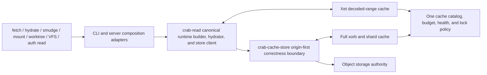

# Plan 017: Harden local cache, deduplication, and hydration

> **Executor instructions**: Deliver one phase per PR. Read the whole phase,
> its dependencies, and its STOP conditions before editing. Rebuild the
> evidence map when the drift check finds changes. Every PR must delete the
> path it replaces, update this plan's status/evidence, and prove the listed
> acceptance criteria. Do not add compatibility for disposable local state or
> unshipped configuration.
>
> **Drift check (run first)**:
> `git diff --stat 63bfc8c..HEAD -- crab/src/main.rs crab/src/cache crab/src/cmd/cache.rs crab/src/cmd/clone.rs crab/src/cmd/doctor.rs crab/src/cmd/fetch.rs crab/src/cmd/hydrate.rs crab/src/cmd/mount.rs crab/src/cmd/prune.rs crab/src/cmd/release.rs crab/src/cmd/worktree.rs crab/src/core/config.rs crab/src/git crab/src/lfs crab/src/metadata crab/src/read crates/crab-auth-server crates/crab-cache crates/crab-cache-store crates/crab-metadata crates/crab-read crates/crab-vfs packages/web/content/docs/cli/storage/local-cache.mdx packages/web/content/docs/cli/daily-workflow/fetching-updates.mdx packages/web/content/docs/cli/reference/crab-cache.mdx crab/docs/design/cache.md crab/docs/guides/cache.md`
> If hydration ownership, cache layout, chunk-index generation handling,
> replica restore, or any cache configuration changed, refresh the current-
> state table before implementation. Read `crates/AGENTS.md` before changing a
> shared crate.
> Also inspect `git status --short` and `git diff --stat`: the commit-only
> drift check does not include uncommitted implementation work.

## Status

### Required local RustFS qualification

User-requested delivery gate: qualify the actual Crab executable against a
local RustFS S3 service, using the supplied local credentials without retaining
them in source, reports, or logs. Use bucket `crabbuild` and a unique per-run
repository prefix; preserve existing service data and never run bucket-wide GC.
The console is not the S3 endpoint: verify the running service and use its S3
API endpoint for command traffic.

Context: in-process adapter tests cannot prove command configuration, remote
helper installation, cache persistence across process exits, or real S3 request
behavior. This gate supplements, and does not replace, the provider/platform
and lifecycle acceptance criteria below.

Execution and acceptance:

1. Record executable revision/features, RustFS image identity, isolated cache
   roots, unique remote prefix, and independent fixture hashes. Use generated
   large files with duplicate and partially modified versions. Keep artifacts
   on the mounted workspace volume, outside the source checkout.
2. Run real init/add, Git commit, Crab push, lazy clone, and hydrate processes.
   Every hydrated version must equal its independently recorded input bytes;
   verify pointer state before hydration and clean Git state afterward.
3. Exercise duplicate/modified pushes and inspect actual xorb/shard traffic and
   remote objects. Report observed deduplication; do not infer it from matching
   files, elapsed time, or a success exit code alone.
4. Use separate processes for cold hydration, warm rehydration, and fetch then
   hydrate. Attribute requests by family; warmed eligible xorb body reads must
   be zero while metadata remains available. An enforced body-read denial
   must still permit byte-identical warm hydration.
5. Exercise disposable-cache corruption, cache unavailability, and scoped
   clean/prune followed by reconstruction. Healthy origin must recover correct
   bytes; unavailable/corrupt origin must fail without publishing partial files
   or replacing pointers. Preserve unrelated cache/service sentinels.
6. Retain machine-readable commands, exit status, byte/request evidence, and
   failed cases. Repeat affected cases after fixes. Separate measured passes
   from skipped or blocked gates; RustFS alone is not AWS/GCS/Azure or native
   mount qualification.

Status: PARTIAL. Draft PR #147 is an implementation checkpoint, not phase
acceptance or permission to merge unfinished work. Retained local results are
below; provider, native mount, resource, and full lifecycle gates remain open.

### Installed RustFS command checkpoint, 2026-09-03

Run `cache-f410.E7nt8I` used the existing RustFS service on port 9000 and unique
repository prefix `cache-qualification/cache-f410.E7nt8I` in `crabbuild`.
No pre-existing service data was deleted. The installed CLI was built by
`make install` at revision `67d3a9f`; SHA-256
`df2266780679f5af3da66037ebe43e6aa0794f503633343759ac651f84a9e1e9`.
RustFS image identity:
`sha256:41fe89380f4120a337790c02af192c3fe7bb55c3edc2e6e9357b487b47c6ab21`.
Generated inputs, command logs, hashes, request records, and failed attempts
are retained outside the checkout on the workspace volume under that run ID.

| Measured case | Result and retained evidence |
|---|---|
| Initial add/commit/push/lazy clone | Three 128 MiB files, including an exact duplicate and a one-MiB variant; add preserves bytes and Git stores pointers. Push creates four xorbs totaling 135,467,870 bytes. |
| Fresh reader, cold/warm hydration | Independent hashes pass. Cold hydration makes 14 xorb GETs; warm hydration with all origin xorb GETs denied makes zero. No complete xorb cache entries installed. `fresh-reader-workload/report.json`. |
| Separate-process fetch then hydrate | Fetch makes 10 xorb GETs and leaves pointers. Later hydrate succeeds with xorb GETs denied, zero attempted xorb reads, matching hashes, and clean Git state. Same report. |
| Corruption, clean, unavailable origin | Corrupt seven real range entries, recover correct bytes from origin; scoped clean preserves an unrelated sentinel; denied cold origin fails and leaves all pointers unchanged; restored origin succeeds. Same report. |
| Incremental duplicate/delta | A fourth exact duplicate adds no xorbs. A one-MiB edit creates one 1,154,373-byte xorb, retaining existing xorbs. Updated 512 MiB checkout hydrates correctly. `incremental-workload/report.json`. |
| Unsafe root | A root symlink is bypassed; origin hydration succeeds and its external target contains only the unchanged sentinel. Same report. |
| Natural root/prune | FAIL on the installed checkpoint: filter-process creates `bloom.bin` under a 0755 root; later private-cache access is disabled and prune rejects it. `incremental-workload/report-with-prune.json`. Earlier warm fixtures precreated 0700 roots and did not cover this producer. |

The first request gateway rejected SlateDB checkpoint writes and caused a
timed-out cold hydrate. The corrected gateway permits bounded writes only to
this run's repository metadata; it still denies xorb body reads when requested.
The interrupted attempt and its empty temporary files remain recorded; the
fresh-reader run uses a separate checkout, not erased failure evidence.

Open findings: hydrate JSONL labels failed per-file reads `skipped` and the
batch boundary loses typed causes; cold range hydration transfers substantially
more bytes than the unique xorb set; reusable qualification tooling has not yet
been integrated into the repository. These passes do not close those gaps.

### Fresh-root bloom producer repair — focused and installed proof

`CleanSession` now delegates persistence to `LocalCache` at the fixed disposable
path `hints/clean-bloom.bin`. The standalone ambient writer and unbounded reader
are removed. The synchronous cache boundary reuses pinned descriptor access,
the existing byte reservation, publication lease, and completed-file catalog
registration. Encoding remains product-owned; input is capped at one MiB.
No new configuration, runtime, dependency, or remote format is introduced.
The synchronous `CleanSession` signatures present in tag `v1.1.0` are preserved.
The old root-level `bloom.bin` is not read or migrated and remains outside
automatic cleanup authority. Existing unsafe roots are not silently chmodded.

Focused proof passes: two actual filter processes under umask 022 create/reopen
a missing root with private modes, followed by successful prune and clean.
All 218 cache tests pass with all features, 166 with only `local-cache`, and
116 with only `xet-chunk-cache`; strict all-target cache Clippy passes each
feature combination. The 56 clean and 37 filter-process tests pass, as do six
actual CLI clean/maintenance tests. Read/write bounds, missing-root inspection,
budget bypass, symlink target preservation, catalog registration, and scoped
cleanup have new regressions. The new leaf-link fixture initially assumed
publication must reject a symlink; the shared `renameat` contract safely
replaces the link itself. The corrected fixture proves read rejection and
unchanged external target bytes, without changing the production primitive.
Installed RustFS requalification passes all 24 command steps in
`fixed-bloom-workload/report.json`, without precreating any cache root and with
umask 022. Artifact SHA-256:
`f819746058ed08a29187d6995b9a03dc47837b903f78d83557289964e58e8913`;
build label `67d3a9f-bloom-dirty`, with the exact source-diff fingerprint retained
in the report. The four 128 MiB files independently match their expected hashes.
Cold hydrate makes 15 xorb body requests; warm hydrate makes zero even with
origin xorb reads denied. Cold fetch makes 14, and a separate hydrate process
again makes zero under denial. Eight corrupt ranges recover correctly; cache
clean preserves unrelated state. Cold denial returns nonzero with all pointers
unchanged, and restoring origin recovers the files. Adding unchanged hydrated
content leaves Git's index unchanged. Configuring a one-MiB budget, pruning the
naturally created root, and hydrating again all succeed; the sentinel survives,
no retained range file exceeds that entry budget, and Git state is clean.
This closes the reproduced bloom root-poisoning path, not physical-root byte
accounting, the JSONL failure diagnostic, or the other producer/platform gates.
Workspace formatting and whitespace checks pass. Strict CLI library Clippy
still stops in `crates/crab-vfs/src/nfs.rs` and `coordinator.rs` on eight
previously recorded diagnostics; no suppression or unrelated fix is included.
The sibling global JSON shard-hint writer, optional profiling producer, and
persistent index owners still require the Phase 4/5 audit. Bloom positives still
require the canonical remote file-index/shard proof, so last-writer-wins hint
replacement cannot itself authorize omitting staged content.

- **Priority**: P1
- **Effort**: XL, eight independently landable phases
- **Risk**: HIGH
- **Depends on**: current v1 xorb/shard layouts and chunk-index generation
  contract
- **Category**: correctness, availability, security, performance,
  operability, tests, documentation
- **Planned at**: commit `63bfc8c`, 2026-09-02
- **Delivery status**: IN PROGRESS (Phase 0 delivered)

**Current database gate — implementation and qualification in progress.** The
original root-replacement failures are now fixed by a descriptor-bound SQLite
owner; both rollback and connection-drop tests pass unchanged. Native macOS
WAL/root-swap, process-death recovery, and writer-exclusion tests also pass.
The intermittent reservation `BUSY` failure was traced to maintenance's
deferred read-to-write upgrade. Maintenance now acquires its writer before
reading owners; the unchanged eight-thread regression passes 200 consecutive
runs. This closes that attributed race, not every contention/lifecycle gate.
Catalog maintenance, owner release, and fill publication now share a retained
root: new regressions reproduced and fixed mutation of a replacement catalog.
Published fills retain a payload lease through registration, including across
explicit object/range maintenance. Main-file replacement inside the retained
root, other index owners, and complete crash/accounting proof remain open.
Non-mutating inspection and full product/platform acceptance remain open.
The earlier passing test counts below are historical checkpoints, not a claim
that every current gate has passed.
See [database lifetime execution slices](#database-lifetime-execution-slices)
for the reproduction, owner contract, dependencies, and acceptance criteria.
The database gate still blocks release claims for the affected surface, not
independent implementation or qualification work.

### Delivery ledger

| Phase | Status | Retained proof |
|---|---|---|
| 0. Observable contract and truthful docs | DONE | `crab-storage` request classifier tests; cache-store non-installing origin-shape regression; web build/typecheck/lint/tests/link check |
| 1. Canonical read runtime | IN PROGRESS; acceptance open | Shared builder owns range attachment; inline/delayed reads share verified reconstruction; CLI reopening and actual VFS warm-range/startup regressions pass; VFS cache consolidation and separate-process/provider proof outstanding |
| 2. Cache failure isolation | IN PROGRESS; acceptance open | Source-specific xorb/body/metadata repair and bounded fallback pass; actual reconstruction retains origin/restore/writer failures; remaining family faults and broader diagnostic/provider qualification outstanding |
| 3. Unified budget/lifecycle | IN PROGRESS; acceptance open | Incoming-space admission, root-bound reservation/publication/registration, and payload-lease handoff have focused proof; full accounting, crash recovery, and bounded owner cleanup remain outstanding |
| 4. Private tenancy | IN PROGRESS; acceptance open | Unix private payload/maintenance paths plus descriptor-bound catalog/xorb-index SQLite connections. Catalog inventory/deletion, reservation release, and fill publication now use the same retained root; non-mutating health, main-file replacement, other index owners, ACLs, and native OS qualification remain open. |
| 5. Operability/state cleanup | IN PROGRESS; acceptance open | Object/range helpers inspect private payloads without repair; shared health, CLI stats/doctor, scoped hints, and state removal outstanding |
| 6. Concurrency/startup | IN PROGRESS; acceptance open | Retained xorb results own/charge buffers and keys; four whole-file consumers stream; shared outputs reject size violations and close owned resources on cancellation. Configured output/decode admission, cross-process fills, startup, and resource qualification remain open |
| 7. Qualification/release docs | TODO | — |

### Design refresh: baseline versus working tree

The evidence map below describes **planning baseline `63bfc8c`**, not every
current working-tree behavior. On 2026-09-02 the tree already contains partial
implementation of Phases 1–4 and 6. Preserve that work; reconcile it against the
acceptance criteria rather than implementing the baseline fixes a second time.
`IN PROGRESS` records implementation, not acceptance. Only `DONE` records an
accepted phase. Earlier proof entries have not been rerun by this documentation
refresh; a named test below is an existing fixture, not a fresh passing result.

| Area | Present in the working tree | Still required before acceptance |
|---|---|---|
| Read ownership | `ReadRuntimeBuilder` now opens decoded ranges from the object cache's root/budget; caller-controlled attachment and old hydrator constructors are removed. `HydrationRuntime` and delayed smudge delegate reconstruction to `crab-read`. Typed availability failures now survive Xet and CLI atomic reconstruction. | Complete separate-process and full sibling-surface proof, including real restore/provider failure cases. |
| Warm reuse | The configured hydration fixture exposed Xet's detached cache-write race during later qualification. `hydrator/cache_completion.rs` now tracks operation-local cache owners through scheduled/running writes; the shared hydrator waits before success and cancels writes on cancellation/drop. The unchanged reopen/blocked-origin fixture passes. | Separate-process `crab fetch` → `crab hydrate` proof through actual commands; provider matrix. Reopening in one process is stronger than manually injecting a cache but is not process-boundary proof. Cache writes remain best-effort; failed admission/eviction cannot promise a later hit. |
| VFS startup | `ChunkCache::open` now degrades to a non-storing trait handle; pipeline/coordinator no longer precreate chunk directories. The four failing fixtures use private cache children with retained owners. Real shared-hydrator ranges and pipeline startup have focused byte/request proof; daemon/coordinator restart preserves live sentinels. | The separate file-window cache still needs failure isolation, per-read identity/lifecycle, private I/O, and budget ownership. Complete canonical VFS cache consolidation and actual native mounted-read qualification; feature-enabled unit tests are not kernel-mount proof. |
| Failure isolation | `crates/crab-cache-store/src/xorb_read.rs` separates local/service/origin verified attempts; term resolution shares its metadata path. Bounded service-body failures reach origin. `StoreClient` and the Xet reconstruction wrapper retain typed sources; CLI classification preserves origin integrity, product availability errors, and writer I/O. | Complete body/index/hint/write faults and classification for remaining shared failure classes. Unknown reconstructed failures retain their source but still use the internal diagnostic. Actual auth-view and real-provider failure qualification remain open. |
| Unified capacity | `[cache].max_bytes`, a Crab-owned range store, and the catalog exist. Admission accounts for incoming bytes and active reservations. Root-bound fills retain their byte reservation and shared payload lease through registration; object/range maintenance skips that handoff. | All-family accounting, actual access-based LRU, bounded reconciliation, command/background lifecycle, and multi-process crash/publication proof remain acceptance work. Catalog totals are not exact physical-root accounting. |
| Private tenancy | `crates/crab-cache/src/private_fs.rs` pins Unix payload parents and maintenance. Catalog/xorb-index connections retain a private SQLite VFS through close. Catalog maintenance and fill owners now retain one root through publication, registration, and release; root-swap fixtures pass on macOS. | Complete main-file replacement/generation proof, remaining index caller ownership, non-mutating WAL inspection, aggregate contention/cancellation bounds, effective-permission/ACL review, and remaining consumers. The implementation is gated to Linux/macOS; native Linux proof and Windows support are not delivered. |
| Cache ownership | Shared `clean_cache` replaces both whole-root deletion paths. Catalog deletion rechecks fixed payload layouts, leases, and reservations under a writer transaction. Inventory streams through pinned directories without opening SQLite files. Live workspaces, mirrors, and profiles still have cache-root consumers in `crab/src/cmd/repack.rs`, `crab/src/cmd/mirror.rs`, and `crab/src/core/tracing_init.rs`. | Move retained/live state to its owner or establish explicit lifetime protection before broadening catalog eviction. Bounded-time reconciliation and complete byte accounting remain open. Never classify an unknown subtree as disposable merely by its location. |
| Diagnostics and hints | `crab/src/cmd/doctor.rs::check_cache` still reports directory size; `crates/crab-cache/src/shard_hints.rs` still rewrites JSON. | Shared health model, non-mutating inspection, transactional scoped hints, and removal of unused local-placement state without deleting remote proof records. |
| Read memory | `XorbReadState` owns/charges retained slices and keys. Release verification and speculation use verified sinks; Crab-to-LFS migration and protected-view repacking stream through operation-owned files. `ReconstructionBuffer` uses checked/fallible reservation and rejects growth or short success. The shared writer rejects overlong writes and closes its destination independently of retained upstream handles. | Configured pointer/range output admission, aggregate decoded length checks before allocation, queued output, caller-held results, cross-process fill coordination, and measured whole-process resource bounds remain open. Fallible allocation is not a memory budget. |

### Immediate mitigation checkpoints

These are residual working-tree gaps, not instructions to discard the partial
implementation. The owning phases below supply the complete acceptance bar.

| Checkpoint | Concrete source boundary | Required regression before closing |
|---|---|---|
| Remaining error provenance | Generic object bodies, cache indexes/hints, and shared diagnostic classification | Extend the passing xorb/reconstruction matrix to remaining families and error classes; verify actionable classification as well as retained sources. |
| Restore/service qualification | Actual restore orchestrator and authenticated view entry points | Build on passing injected-availability and CLI atomic-read proof with real restore/service failure cases; cancellation and cleanup retain the same contract. |
| Maintenance cleanup authority | Explicit cleanup, catalog inventory, object/range stats/prune/verify, and targeted object eviction use private payload access; SQLite authority remains open | Complete database/root ownership and reservation protection across maintenance. Private payload deletion alone does not authorize later pathname-based index cleanup or establish cancellation bounds during SQLite waits. |
| Incoming space and database ownership | `CacheCatalog::reserve_sync`, `maintain_locked`, SQLite owner lifecycle | Below-high-watermark admission, reservation retention, and non-creating Drop have focused proof. Still close physical accounting, live-database protection, interrupted publication, and owner release under contention. |
| Complete private access | `private_fs` plus every cache-root filesystem/SQLite consumer | Each consumer uses the common verified boundary or explicitly bypasses cache. Native OS tests prove owner-only access, not merely Unix mode bits or a cross-compile. |
| VFS cache ownership | Chunk-cache startup now has degradation and private-creation proof. `HydrationService` still owns separate file-window payloads/sidecars and verification state. | Close file-window cache read/write failure isolation and byte identity through the actual read method, then consolidate lifetime/accounting with the canonical read cache. Qualify native mounted reads, not only startup or isolated helpers. |
| Actual cross-command reuse | CLI fetch/hydrate composition and `ReadRuntimeBuilder` | Launch separate configured CLI processes, warm via fetch, deny origin xorb body reads, hydrate and independently compare bytes. No manually attached test cache substitutes for this test. |

### Read-runtime implementation proof, 2026-09-02

Against the uncommitted `63bfc8c` working tree, not a release artifact:

- Shared builder derives decoded-range placement/capacity from `LocalCache`;
  CLI and server adapters no longer open or attach it themselves. The shared
  crate declares the range-cache feature it actually consumes.
- `crab/src/git/prefetch.rs` now retains protocol tasks and temporary outputs
  only. It clones the canonical hydrator, including its byte semaphore and
  restore hook, and submits the complete pointer for hash/size verification.
  The separate Xet constructor, chunk-to-byte budget conversion, and shared
  hint-injection API are deleted. Completed outputs are removed at shutdown.
- The five `git::prefetch::tests` pass; the configured hydration regression
  passes warm inline/delayed reads, rejects inconsistent pointer size, and
  verifies output-temp deletion. Three `crab-read` hydrator tests pass, including
  automatic root/budget attachment and unsafe-root degradation.
- Two `core::config::tests::overlay_cache` tests pass: `max_bytes` resolves and
  retired/unknown capacity/root fields fail parsing. `CacheOverlay` already
  enforces `deny_unknown_fields`; no extra parser compatibility was needed.
- `cargo check -p crab -p crab-auth-server --locked` passes. The four migrated
  add/push/incomplete-shard integration targets compile through the new factory.
- All 121 cache tests and 63 shared-read tests pass. The term-resolver repair
  fixture now injects a private cache explicitly instead of mutating the
  process-wide cache-root environment.
- `cargo clippy -p crab-cache --all-targets --all-features --locked -- -D warnings`
  and `cargo clippy -p crab-read --lib --locked -- -D warnings` pass. Read
  `--all-targets` remains red on the unchanged baseline test lint at
  `upload_pack.rs:2343`, confirmed in `git show HEAD`. No suppression or
  baseline edits were made.
- User docs now describe shared range attachment and `[cache].max_bytes`
  without claiming fully offline or globally bounded operation. A fresh web
  build, typecheck, nine tests, and link check (398 pages / 4,292 fragments)
  pass. Web lint exits successfully with 16 warnings in untouched sources.

At this checkpoint, the remaining restore-error fix covered the dependency path:
`RestoreAvailability` → `StoreClient::map_read_error` → Xet reconstruction →
`ShardHydrator::reconstruct_to_writer_unverified` → `CrabError`. Both the
adapter and reconstruction boundary then stringified errors. The later
reconstruction proof below covers that source-preservation gap; changing only
the final `Availability` conversion would not have restored the lost type.

All compiling commands used the external `crab-f410` target directory required
below. These results advance Phase 1; they do not close its real-command,
process-boundary, provider, or OS acceptance gates.

### Bounded cache-service fallback proof, 2026-09-02

- `CachingStore::get_with_etag_bounded` uses the HTTP client's single bounded
  GET rather than a separate cache HEAD followed by another size-check policy.
  Both declared oversize and streamed oversize now reach the same origin
  fallback, with structured family/operation/path/recovery diagnostics.
- Dependency contract: `CacheClient::get_bounded` checks `Content-Length`
  before collecting and checks every chunk before extending the body.
  `LocalCache::get_or_fetch_bounded_with` already bounds and verifies local
  bytes, so the redundant outer local-size check is removed too.
- `bounded_read_bypasses_oversized_cache_service_and_still_verifies_origin`
  exercises a real loopback HTTP server with fixed-length and chunked bodies.
  Healthy origin succeeds and populates verified cache; wrong-hash and
  oversized origins still fail without publishing invalid bytes.
- Request counts remain exact: one origin GET for healthy/wrong-hash bodies;
  two attempts for an oversized origin because `crab-storage::retry` already
  gives `StorageError::CorruptObject` one retry. No retry policy changed here.
- Cache-store tests pass with `remote-client` (47) and without it (27).
  Strict all-target/all-feature cache-store clippy passes after mechanical
  fixture borrow cleanup; the inverted-range assertion still tests the same
  invalid bounds using an explicit `Range` value.

This closes the optional-service bounded-body failure gap, not all Phase 2
acceptance. Xorb/metadata and reconstruction progress are recorded below.

### Source-specific xorb repair proof, 2026-09-02

- Moved xorb range/result-cache mechanics into
  `crates/crab-cache-store/src/xorb_read.rs`. Each local/service/origin attempt
  now reads and validates its own metadata and payload. Origin parser failures
  no longer trigger a second origin attempt under the label of cache repair.
- `xorb_chunk_metadata` is the shared metadata boundary. Term resolution now
  consumes its verified metadata instead of carrying a second footer parser,
  hash checker, and fallible-eviction repair loop. The common Xet parser also
  enforces format/chunk limits and validates compression/offset metadata that
  the deleted parser skipped.
- Replaced `LocalCache::get_or_fetch_read_xorb_with` with `put_read_xorb`;
  source routing stays in cache-store, while cache persistence stays in cache.
  Complete read-cache installation still avoids the add-side placement index.
  The first refactor pass violated that separation; its existing regression
  caught it, and the source implementation was corrected.
- `corrupt_origin_xorb_fails_once_with_origin_provenance` passes 15 combinations
  of footer/metadata/payload/truncation corruption and non-installing/full/
  selective/metadata reads. Assertions cover exact HEAD/range/body counts,
  retained verification-error type, and absence of invalid cache fills.
- `repair_preserves_read_policy_when_cache_eviction_fails` passes all four
  read modes with writable and non-writable cache parents. Healthy origin
  results survive failed removal and failed reinstallation; request shape and
  the caller's installation policy remain unchanged.
- Invalid requested ranges leave a verified local xorb intact and issue no
  origin request. A malformed loopback cache-service response falls through
  to one non-installing origin body read; an invalid origin then fails with
  origin provenance instead of being retried as another cache fault.
- Cache-store tests pass with remote service support (49) and without (28).
  All-feature cache tests pass (148). Shared-read tests pass (61); two tests
  of the removed duplicate metadata parser are replaced by the source-boundary
  matrix, while the term-resolver repair integration still passes.
- Direct shared-error conversion tests pass for CLI and auth-server, retaining
  the source. The CLI uses the existing corruption code `CRAB-E0020`, integrity
  category, exit 4, and terminal retry classification. This is conversion
  proof, **not** proof that the Xet reconstruction path preserves that error.
- CLI/auth-server consumer compilation passes. No persistent object format,
  provider transport retry policy, dependency version, or error-code golden
  file changed in this refactor.

The next implementation step retained sources through the adapter and upstream
reconstruction wrapper. The pinned Xet client provides `ClientError::internal`
for a typed error, but its `InternalError` and `FileReconstructionError` variants
do not expose that nested error via `std::error::Error::source`. The shared
boundary must explicitly bridge that contract; the following proof exercises
actual failing reconstruction, not only enum conversions.

### Reconstruction error identity proof, 2026-09-02

- `StoreClient::map_read_error` now uses `ClientError::internal`; no text or
  cloned client error replaces the source. `ReconstructionError` borrows
  through the pinned dependency's Arc wrappers to expose the standard source
  chain. Runtime initialization also retains its typed error.
- Shared reconstruction tests exercise real shard/xorb bytes and Xet calls:
  corrupt origin, typed availability denial, failing writer with writer-drop
  proof, token cancellation, source-reported cancellation, and healthy
  byte-identical output. Both upstream and final-flush failures retain the same
  writer source/replay policy. All 68 shared-read tests pass; strict library clippy
  passes. No dependency patch/version change was needed.
- CLI `ReadFailure` adds user-facing classification without taking ownership
  away from that shared source chain. Origin integrity uses `CRAB-E0020` /
  exit 4; writer I/O uses `CRAB-E0070` / exit 5 and cannot replay a potentially
  partial writer. Product restore failures retain their existing diagnostic,
  details, hints, and retry policy, except I/O replay remains terminal.
  The non-test LOC increase pays for these two owner boundaries: Xet's borrowed
  Arc-backed source cannot be moved into an owned product error without loss.
  The wrappers replace text-only conversions, not a second reconstruction path.
- `hydrate_preserves_failure_diagnostics_without_publishing` passes through
  configured product assembly and atomic reconstruction. Expired restore
  credentials and corrupt origin retain typed causes and leave the pointer
  destination unchanged with no temporary output left behind. Its read-only
  writer case also retains I/O identity. Origin damage is injected directly
  into the isolated in-memory backend: the production immutable writer
  correctly refused the fixture's initial attempt to overwrite an xorb.
- All 50 CLI error tests and two auth-server error tests pass. Auth view/repack
  now uses the shared server conversion instead of its text-only converter.
  The final auth-server dependency/consumer compilation check passes.
  Unknown reconstructed failures retain their source rather than being
  discarded, but broader diagnostic classification remains acceptance work.
- The configured warm-cache hydration regression, five delayed-smudge tests,
  and both error-code catalog tests pass; no golden file changed. Formatting,
  local design links, and `git diff --check` pass.
- Strict CLI library clippy is **not passing**. With dependencies it stops on
  eight VFS findings in files identical to `HEAD`; `--no-deps` reports 477 CLI
  findings. A focused diagnostic capture reports no finding in `ReadFailure`;
  it still reports existing workflow/pack conversion and catalog match arms.
  This is not a clean CLI lint result or proof that every other finding is
  unrelated. No lint suppression or baseline edits were made.

This advances Phases 1–2, not full acceptance: separate-process commands,
real archival restore/provider errors, actual protected-view failure cases,
remaining cache families, and native OS/resource gates remain open. The local
CLI linker reports the existing large `__eh_frame` warning; tests exit zero.

### Ownership-aware explicit cleanup proof, 2026-09-02

- Deleted the CLI's recursive size/delete helpers and `LocalCache::clean`.
  `crab cache clean` and `crab optimize cache clean` both use the shared
  `clean_cache` implementation and the real command cancellation token.
- Cleanup streams fixed payload layouts through pinned directory descriptors,
  never traverses unknown subtrees, and leaves directories in place. It retains
  databases and side files, mirrors, workspaces, profiles, unknown files, and
  unpublished temporaries. File/byte counts come from successfully removed
  descriptors, not a pre-delete recursive estimate. Retained subtrees count
  once; busy and unsafe entries have separate counts. Missing roots stay missing.
- Common payload deletion now validates the opened file and obtains both the
  parent's mutation lock and the file's exclusive lock. Atomic publication
  participates in the same nonblocking parent lock. A second-process test proves
  publication/deletion cannot acquire that lock while it is held; an active
  reader still prevents removal. This does not yet cover catalog or legacy
  pathname mutations, nor does it protect against a same-user process deliberately
  ignoring the advisory lock protocol.
- Dependency evidence: pinned `fs4` uses advisory `flock` on Unix; its contract
  requires an open readable/writable descriptor and careful duplicate handling.
  Directory streams share the live descriptor and release mutation locks
  explicitly before continuing. Pinned `errno` 0.3.14 is now a direct optional
  dependency so directory iteration distinguishes errors from EOF; no version,
  checksum, override, or vendor change. Tokio's child-token/drop-guard contract
  cancels a dropped caller's worker without cancelling its parent token.
- All 155 cache tests pass; local-cache-only cleanup tests pass (6); strict
  all-target/all-feature cache clippy passes. Cache-store's 49 all-feature tests
  pass, including unsafe-cache and failed-eviction origin fallback cases.
  The range-cache-only feature check and all three CLI cache-command unit
  tests pass. Formatting and `git diff --check` pass. Strict CLI clippy remains
  unqualified as recorded in the preceding reconstruction proof.
- `crab/tests/cache_clean.rs` launches the built CLI twice, once for each
  command spelling. Both remove a real cached chunk, preserve a workspace
  sentinel, and print accurate removal totals. This is native macOS command
  proof, not an installed-release or Linux/Windows qualification claim.
- Docs no longer promise a root wipe or a nonexistent clean `--dry-run` flag.
  The shared API has dry-run coverage; CLI help confirms only logging options
  are exposed today. Web build/typecheck, nine tests, lint (16 warnings in
  untouched sources), and links (398 pages / 4,292 fragments) pass.

The additional shared policy/descriptor code replaces duplicate deletion paths;
its remaining LOC increase pays for ownership filtering, streaming traversal,
cross-process locking, and safety regressions. No destructive operation touched
real user cache data: removal tests use disposable fixtures only.

Acceptance remains open. Next: migrate catalog and legacy prune/verify scanning
and deletion onto this ownership/private-filesystem boundary, then resolve
SQLite lifecycle, incoming-space admission, all-family accounting, effective
ACLs, and native OS/resource qualification. Do not broaden automatic eviction
or mark Phases 3–4 accepted based on explicit cleanup alone.

### Catalog deletion ownership proof, 2026-09-02

- `CacheCatalog::evict_candidate` now checks the shared fixed payload layout
  before any deletion. A broad or forged family label cannot authorize removing
  an unknown file, profile, or database. Candidate deletion uses `private_fs`
  with the same pinned-parent and actual-file locking as explicit cleanup.
- Candidate selection remains paginated. After selection, an immediate SQLite
  writer transaction rechecks both leases and reservations and spans unlink plus
  catalog row removal. Late owners are retained; successful deletion reports the
  byte length of the opened file rather than assuming the scanned length was
  still current. `final_bytes` remains catalog-derived, not a quiescent filesystem
  measurement; complete accounting is not accepted by this change.
- The maintenance lock uses a private descriptor-relative open instead of
  pathname creation/chmod. A symlinked lock leaves its target's bytes and mode
  unchanged and prevents maintenance from starting.
- Owner Drop opens existing SQLite only, with no creation/schema initialization.
  SQLite's NOFOLLOW contract covers filename components. Its first use rejected
  macOS `/var` aliases and left owner rows behind; the regression caught this.
  Drop now resolves only ambient ancestors outside the cache root, preserving
  root/database components for NOFOLLOW. Missing and symlink-replaced databases
  remain untouched. This is not a replacement for a pinned SQLite VFS/owner
  boundary or proof against concurrent pathname replacement.
- Dependency evidence: pinned rusqlite 0.34 maps `TransactionBehavior::Immediate`
  to `BEGIN IMMEDIATE`; bundled SQLite's WAL writer path admits one writer.
  READ_WRITE without CREATE requires an existing database. No dependency,
  lockfile, configuration, or persistent format change was needed in this slice.
- Three old eviction tests used non-payload names such as `shards/old`. Those
  paths are intentionally retained now. Tests use hash-addressed private files
  and explicit timestamps, removing their timing sleeps. New tests cover forged
  family labels, post-selection owners, an actual read descriptor, replaced
  payload parents, a lock symlink, and stale owner Drop.
- All 161 cache tests pass; all 11 catalog tests pass with local-cache only.
  Strict all-target/all-feature cache clippy and the range-cache-only compile
  check pass. Test code now lives in `catalog/tests.rs`; production deletion
  removes the previous independent pathname/locking implementation.
- All 49 cache-store tests and the real CLI cleanup smoke test pass after this
  change. CLI compilation retains the existing large `__eh_frame` linker
  warning; this is not a clean strict CLI-clippy claim. Formatting and
  `git diff --check` pass. All deletion tests use disposable fixture roots.

Phases 3–4 remain in progress. At this proof checkpoint, the catalog's recursive
scanner still used pathnames; the subsequent inventory slice below replaces it.
Database and side-file access, legacy prune/verify scanners/deletion, incoming-space
admission, owner release under contention, and native OS/resource gates remain
acceptance work. Do not interpret this deletion proof as full catalog safety.

### Pinned catalog inventory: current proof and remaining design

The Unix catalog scanner now uses descriptor-relative `fstatat` with
`AT_SYMLINK_NOFOLLOW`. It streams one entry at a time, rejects unsafe
owner/mode/type/link state, and bounds traversal depth to 32. Invalid UTF-8
catalog keys are rejected instead of merging names through lossy conversion.
Failed inventory rolls back reconciliation before unseen rows or payloads can
be removed. `CacheCatalog::maintain_sync` retains one `PinnedRoot` through lock
creation, inventory, and payload deletion.

This is deliberately metadata-only. Bundled SQLite in `libsqlite3-sys` 0.32.0
documents that closing another descriptor for a locked inode releases the
process's POSIX locks. Opening database files merely to stat them would violate
that dependency contract; scanning must not bypass SQLite's deferred-close
ownership. The actual second-process writer-lock regression passes.

Observed on this working tree: `cargo test -p crab-cache --locked --all-features`
passes **167 tests** using the worktree's external Cargo target. New inventory
fixtures cover root replacement during traversal, 5,000 files, excessive
depth, unsafe-entry rollback, SQLite writer-lock preservation, and invalid
catalog keys. The macOS fixture filesystem rejects non-UTF-8 filenames, so
that case tests key rejection without claiming an on-disk invalid-name scan.
This run does not requalify every earlier consumer, provider, or platform.

Complete these bounded slices before accepting Phases 3–4; keep them within
the existing private-filesystem and catalog owners:

| Slice / context | Deliverable | Acceptance criteria |
|---|---|---|
| Root lifetime: pathname replacement can separate accounting from deletion | Bind database, lock, inventory, and mutation to one validated root identity, or abort/bypass before mutation when identity cannot be retained. Audit the pinned SQLite/OS contracts before choosing the mechanism. | Filesystem scans plus catalog/root replacement, owner release, and reserved publication now pass. Continue main-file replacement, remaining index owners, and native-platform qualification; replacement/outside sentinels must remain unchanged. |
| Database ownership: private initialization is implemented; ongoing SQLite I/O remains pathname-based | Complete the owner for DB/WAL/SHM inspection, checkpoint, close, and removal. Shared private precreation/metadata checks have replaced pathname chmod, but they do not establish lifetime identity; no generic file eviction of database files. | Parent/leaf swaps cannot redirect writes; cross-process writer locks remain intact; owner Drop never recreates state; cancelled/failed open leaves no unsafe files. Static mode/link rejection and permissive-umask creation now pass; replacement/lifecycle proof remains open. |
| Maintenance convergence: a safe streaming scan can still monopolize one transaction | Bounded reconciliation pages, cancellation, and explicit incomplete-generation state; migrate legacy prune/verify to the same access boundary. | Interrupted pages do not authorize unseen-row deletion; concurrent reads stay live; repeated passes converge; million-entry proof reports transaction duration, RAM, descriptors, and cancellation latency against predeclared limits. |
| Admission: incoming demand is now implemented; physical accounting remains open | Preserve the passing demand-aware maintenance and transactional reservation path while completing database/temporary accounting and crash-safe publication. | The 10 MiB budget / 8 MiB existing / 3 MiB incoming regression passes, including leased-entry bypass. Still prove multi-process writes, crash/restart, and root-byte reconciliation against the full declared allowance. |

The scanner's bounded depth and 5,000-entry fixture are not million-entry
resource proof. The catalog still uses one full-scan transaction and opens
SQLite separately by pathname. Its recorded total is not an atomic filesystem
snapshot. Those limitations remain release gates, not accepted exceptions.

### Incoming-space admission and reservation handoff proof

- `reserve_sync` checks registered bytes plus active reservations and inserts
  the new reservation in one immediate writer transaction. If it cannot fit,
  it makes one coalesced maintenance attempt with the incoming byte demand,
  then rechecks transactionally. A stale maintenance result never grants space.
- Maintenance subtracts both incoming bytes and other reservations from the
  available capacity. It preserves fixed-layout deletion authority and active
  leases/reservations; no new payload family becomes eligible. No-room remains
  a cache bypass, not an origin-data failure.
- All four publication paths—object bytes, file-backed xorbs, preverified
  file-backed xorbs, and decoded ranges—hold their reservation until the
  completed entry is registered. The common registration method consumes the
  guard and is now crate-private; there are no external production callers.
  Test-only SQLite triggers reject registration without a matching live
  reservation, so a swallowed registration error cannot make the test pass.
- Focused regressions cover replacement below the high watermark, leased
  working sets, simultaneous fill reservations, eight concurrent connections,
  real `LocalCache` replacement/reuse, and all publication paths. Filesystem
  regressions prove repeated pinned-root scans and deletion after root rename
  do not affect a replacement tree.
- Observed: all **176** cache tests, strict cache all-target/all-feature
  Clippy, **20** local-cache-only catalog tests, and **19** range-cache-only
  catalog tests pass. Compiling commands use the per-worktree external target.
  No dependency, lockfile, config, or stored-format changes in this slice.
- Consumer proof: all **50** cache-store tests and strict all-target/all-feature
  cache-store Clippy pass. The new leased-working-set regression returns exact
  origin bytes with one body request, retains the leased payload, and skips the
  unadmittable cache entry. The actual CLI cleanup integration test passes for
  both command spellings. CLI linking still emits the existing large
  `__eh_frame` warning; no clean whole-CLI Clippy claim is made. Formatting and
  `git diff --check` pass.

This closes the identified admission and normal publication handoff defects,
not Phase 3. Failure/crash between publication and registration, stale-owner
cleanup under contention, exact DB/WAL/SHM/temporary accounting, bounded
maintenance, SQLite root identity, and native OS/provider qualification remain
open. Concurrent-connection proof is not eight-process crash qualification.

### Retained xorb-result memory ownership

- Pinned `bytes` 1.11.1 implements `Bytes::slice` by cloning the backing owner
  and changing the visible region. The raw-chunk parser returns such slices.
  Previously the result cache charged only visible bytes and offsets: a tiny
  result could retain a complete xorb, and both owned range-key copies were
  omitted from its budget.
- `XorbReadState` now copies retained data into its own allocation, charges
  actual buffer capacities plus both keys and entry structures, and caps
  entries at 4,096 as well as the existing 64 MiB charge budget. Allocation
  failures and entries that cannot fit bypass only this optional cache. The
  verified cold result remains unchanged. Table/queue slack is bounded by
  entry count but is not included in the 64 MiB charge; no RSS cap is claimed.
- Unit fixtures cover backing-allocation independence, both key copies,
  byte-pressure eviction, small-entry pressure, oversized key capacity, empty
  results, and duplicate insertion. Actual `CachingStore` reads prove a tiny
  warm range owns separate storage, incurs no new origin request, and installs
  no full xorb. Cold/warm overlapping requests preserve order and multiplicity.
- The audit also confirmed why compressed-body limits cannot stand in for
  decoded admission: the Crab builder may pack compressed data whose decoded
  sum approaches the u32 shard/offset boundary. Do not impose the 256 MiB
  compressed-object limit on decoded output without bounded request splitting
  through the owning read APIs and sibling-consumer proof.
- Observed after this slice: **59** all-feature and **38** no-default-feature
  cache-store tests, strict all-target/all-feature cache-store Clippy, and all
  **68** shared read tests pass. The latter exercise actual Xet reconstruction,
  origin/availability/writer failures, cancellation, and byte identity. No
  dependency, public API, configuration, or remote-format change was needed.
- The configured CLI hydration regression also passes: real staged/pushed
  fixtures, runtime reopening, inline/delayed warm reads, and unchanged atomic
  destinations on failure. This is still one-process command-path proof, not
  the pending separate-process fetch/hydrate qualification. The existing large
  `__eh_frame` linker warning remains. Formatting, whitespace, and local-doc
  links pass; full CLI lint/provider/OS acceptance is not implied.

Phase 6 remains open. At this checkpoint, `reconstruct_file` and
`reconstruct_range_from_pointer` still preallocated directly from pointer/range
sizes; the later output-safety slice below makes reservation checked/fallible
without yet adding configured admission. Xorb range collection still needs
checked aggregate decoded lengths before allocation. Queued data, metadata,
caller-held outputs, startup scans, and multi-process fills are not bounded by
this retained-result fix. The following caller migration removes four whole-file
collectors; VFS range consumers still need bounded output admission and
cached/uncached sibling proof.

### Streaming whole-file consumers: implementation and focused proof

- Release deep verification and speculative warming now use the canonical
  verified writer with a sink. Release compares the verified pointer hash and
  actual streamed size to the manifest only after reconstruction succeeds.
  Pointer equality alone cannot pass deep verification. Speculative pointer
  probes are capped at the existing Crab/LFS format boundaries.
- Both marked and inline Crab-to-LFS conversion branches call
  `lfs_pointer_for_crab_content`. It verifies into an owned temporary file,
  hashes incrementally for LFS, uses the existing verified multipart upload,
  and atomically installs the local object. No decoded whole-file `Vec` or
  upload-sized `Bytes` copy remains in that conversion. Raw Git/LFS export
  parsing and other migration modes are unchanged; no full migration memory
  bound is claimed.
- Protected-view repacking verifies into an anonymous file, then feeds the
  existing chunker in 64 KiB reads on a blocking worker. Dropping the rewrite
  cancels reconstruction and signals the worker; the worker checks between
  reads. Repacking errors abort the enclosing view before publication.
  Pinned `tempfile` 3.27.0 owns anonymous-file cleanup through the last handle,
  including process death; no pathname reopening is needed for these bytes.
- The auth boundary retains worker join errors and boxes its shared read
  error payload. This fixes the enlarged-result production lint failure while
  preserving nested sources, verified by the existing error-chain tests.
- Observed: **37** filter tests, **16** release tests, **79** LFS migration
  selector/module tests, **68** shared-read tests, and **83** auth-server tests
  pass. Real shard/xorb fixtures exercise cold/warm speculation, unchanged
  pointer files, corrupt origin, wrong pointer size, and release manifest
  hash/size mismatch. The **13 MiB** LFS local/remote round trip exercises
  multipart upload and independently compares bytes; invalid sources leave no
  installed object, remote payload, or temporary file. The filtered-view test
  now reconstructs its published multi-window content and compares all bytes.
- Strict auth-server **library and binary** Clippy passes. All-target Clippy
  still reports two unchanged receive-test findings: a cloned slice reference
  in `receive/workflow.rs:796` and the tuple complexity in
  `receive.rs:3237`. Those files have no working-tree diff. Full CLI lint is
  not newly qualified here; the existing large `__eh_frame` linker warning
  persists. Formatting and whitespace checks pass.

This is prerequisite implementation, **not Phase 6 acceptance**. Still prove
above-limit supported journeys after defining the in-memory contract, complete
marked/inline history-rewrite and process-kill tests, qualify actual request
cancellation, and measure temporary disk/RSS. View builders/export parsers,
caller-held outputs, queued decode, and process-wide resource accounting remain
open. The later output-safety slice below classifies size violations as
integrity failures; a dedicated resource-admission diagnostic remains open.
The non-test code increase pays for bounded probes, operation-owned streaming
conversion, and off-runtime chunking; the old whole-file paths were removed.
One test-only stored-file fixture is shared by the three CLI consumers.

### Reconstruction output safety: current implementation and remaining work

- `crates/crab-read/src/hydrator/buffer.rs` replaces the growing cursor with
  checked `u64` → `usize` conversion, `try_reserve_exact`, and a writer that
  cannot append beyond the declared output. Exact clamped ranges succeed;
  short successful reconstruction and overlong writes are integrity failures.
  An original source failure takes precedence over incomplete output.
- The operation owns the buffer independently of upstream writer handles.
  Dropping the operation releases its allocation and seals remaining handles.
  The full-file hasher similarly owns the destination and takes it before
  returning an error. A cancellation test initially exposed a retained-writer
  race; fixing ownership, not relaxing the assertion, resolved it.
- Scalar and vectored writes are checked before forwarding bytes. Whole-file
  success still requires actual Blake3 and exact size; shard-coverage summation
  uses checked addition. Existing CLI integrity classification maps these size
  violations to `CRAB-E0020`. Allocation failure currently retains an I/O
  source; it is not the future resource-admission diagnostic.
- Dependency contract: pinned Tokio-util 0.7.18's child-token drop guard signals
  child cancellation without cancelling the caller's parent. Cancellation is
  not a task join; explicit ownership prevents retained handles from retaining
  the output. An arbitrary blocking destination that never returns from
  `Write` is not covered by a bounded cancellation-latency claim.
- Fresh focused proof: all **80** `crab-read` library tests pass. This includes
  impossible capacity without panic, no-growth overrun, short-range rejection,
  source-error precedence, exact/empty/EOF ranges, scalar/vectored admission,
  cancellation during availability, and dropping a pending reconstruction.
- Fresh downstream proof: **16** CLI release tests, both `crab_to_lfs` tests,
  `hydrate_preserves_failure_diagnostics_without_publishing`,
  `hydrate_command_materializes_pointer_from_replica_backed_hydrator`, and all
  **83** auth-server library tests pass. These runs use `cargo test --locked
  --lib` with the named package/filter and the external worktree target.
  LFS size violations now exercise `CRAB-E0020`; warm inline/delayed bytes and
  unchanged atomic destinations still pass. The CLI linker retains its large
  `__eh_frame` warning. The separate VFS run below is failing, not qualified.

No public return type, configured limit, or remote format changed in this
slice. A large representable pointer can still reserve a large allocation;
successful `Vec<u8>` results have no attached memory reservation. Therefore
neither per-runtime admission nor a whole-process memory bound is accepted.
The decision and execution gates are recorded in Phase 6 below.

### VFS sibling proof: initial failure and startup repair

Initial diagnostic command:

```bash
CARGO_TARGET_DIR="$HOME/Workspace/crabbuild-target/crab-f410" \
  cargo test -p crab-vfs --locked --features nfs --lib hydration::tests
```

The initial run observed **23 passed / 4 failed** on native macOS. Failures:
`store_backed_xorb_fetcher_reads_warmed_local_xorb_range`,
`prefetch_next_read_window_skips_when_window_cache_is_unavailable`,
`read_window_prefetch_claims_each_window_once_until_failure`, and
`read_window_prefetch_claims_compact_when_key_set_fills`. They fail during
cache setup with `UnsafeRoot`, before exercising reconstruction. A prior
default-feature invocation selected **zero** hydration tests because the
module requires `nfs` or `fuse`; that invocation is not hydration proof.

The fixtures passed ordinary `tempfile::tempdir()` roots directly to the cache.
Pinned tempfile 3.27.0 documents default, potentially world-readable directory
permissions; it does not promise `0700`. The shared private-cache check now
correctly rejects those roots. The helper also dropped its temporary-directory
owner immediately after construction. The corrected fixtures give the cache
an owned private child and retain the temporary owner through the test.

The source audit found the corresponding production integration work:

- Pipeline/coordinator precreated chunk directories using ordinary defaults;
  both branches are now removed. `crab-cache` owns private creation and
  validation; existing unsafe directories are not chmodded into acceptance.
- `ChunkCache::open` previously propagated a disposable cache failure through
  pipeline, daemon, and coordinator startup. It now logs that degradation and
  returns a stateless non-storing cache handle. Xet's public trait explicitly
  permits a miss after a put. This creates no alternate storage or read path.
- `Result<Self>` and the trait-returning `xet_handle` signatures are present
  in both release tags `v1.0.1` and `v1.1.0` and remain unchanged. The no-storage
  handle preserves that source contract without making caching mandatory.
  Remaining VFS API consolidation shares the open source-compatibility
  decision in Phase 6; no approval is assumed.
- A CRC-valid wrong chunk could survive subsequent fills. The shared range
  owner now verifies the existing `crab-chunk` namespace against its decoded
  Blake3 identity and removes only the bad entry through private filesystem
  access. VFS consumes the shared namespace constant. Other xorb-range keys
  retain their existing semantics; invalid chunk-range requests do not evict
  healthy data. The repair test first failed, then passed after fixing this
  owner boundary rather than dropping the repair assertion.
- The VFS synchronous cache bridge bypasses current-thread Tokio runtimes;
  pinned Tokio 1.52.1 documents that `block_in_place` panics there. Optional
  cache access no longer introduces that panic. Old `DiskCache`/manager
  ownership comments were removed from the adapter.

**Focused proof:** the original hydration module's **27** tests pass. New
tests exercise actual shard/xorb data through both configured window-cache
and uncached VFS reads, including a window-spanning request, EOF, and clamping.
The first read makes exactly **one** xorb body request; after that path is
blocked, all tested ranges return independently compared bytes with **zero**
additional xorb body attempts. Pipeline hydration startup also reads actual
origin data while retaining an unavailable chunk-cache sentinel and live
overlay sentinel, then shuts down its workers.

With `fuse,nfs`, **10** chunk-cache tests, **31** hydration-selected tests,
**13** coordinator tests, and **35** daemon tests pass. These include a dedicated
child-process permissive-umask check, unsafe mode/symlink/file roots, corruption
repair, coordinator owner release across restart, and continued registry use.
The `crab-cache` range-only feature's **16** tests and strict all-target,
all-feature cache Clippy pass. A test-only feature enables the existing shared
origin counter; no dependency versions or remote formats changed.
All **59** all-feature cache-store tests, **80** shared-read library tests,
and the configured CLI warm-hydration regression also pass after this change.
The CLI linker still emits the existing large `__eh_frame` warning.

Strict VFS `fuse,nfs` Clippy is **not passing**: library checks report six
`unused_async` trait implementations and one option expression in unchanged
`nfs.rs`, plus the unchanged drain/collect expression in coordinator shutdown.
All-target checks also report existing test findings. One new test-fixture
borrow warning was fixed, and four old `expect`-then-compare assertions in the
touched chunk module became direct equality assertions without weakening
their expected values. No production lint suppression or baseline file changed. The
diagnostic-span audit found no remaining primary span on edited/new lines;
that is scoped evidence, not a clean whole-VFS lint result. VFS production
source shrank by 25 lines including comments; the added shared guard owns the
chunk namespace's identity invariant rather than adding another read path.
Strict **minimal-feature VFS library** Clippy passes; this does not replace
the failing feature-enabled library/all-target gates above.

**Remaining acceptance:** do not interpret startup/fixture proof as fully
qualified mounts. The separate `read_ranges` file-window cache still performs
pathname reads/writes, propagates some local failures, and uses a per-session
verified flag followed by a length-only shortcut. It is not covered by the
chunk-record identity fix. Its payloads/sidecars and VFS-specific cache roots
and default capacities still need canonical budget/lifetime ownership. The
tagged-API decision covers removing this duplicate ownership cleanly rather
than adding another permanent cache policy. Preserve registry, snapshots,
overlays, and active mount state during that work. Required proof includes
same-length post-warm corruption, failed window writes, path replacement,
cancelled fills, and actual mounted reads on supported native runners.

Broader product release, recovery, provider, security, and supportability gates
are coordinated in [Plan 018](018-product-readiness-roadmap.md). This plan
remains the implementation owner for local caching and reads.

## Outcome

Crab will have one canonical read runtime for fetch, explicit hydrate, filter
smudge, clone auto-hydrate, mount, worktree prefetch, VFS, and authenticated
reads. All those paths will use the same bounded local cache policy and the
same byte-identical reconstruction contract.

A successful fetch or cold hydrate will populate the Xet decoded xorb-range
cache. A later hydrate of the same ranges will work with xorb body reads disabled
and issue zero origin body GETs. The full-xorb cache remains a separate
optimization for workflows that intentionally install whole xorbs; ordinary
hydration will not write a duplicate full-xorb body.

Local cache state remains disposable. Missing, corrupt, stale, oversized,
permission-denied, or schema-incompatible cache data cannot make valid origin
data unavailable. One product-level byte budget bounds every cache family.
Cache contents are private to one OS user. Stats, verify, prune, and doctor
report the complete cache without mutating it merely by inspection.

## Why this mattered at the planning baseline

Crab already has useful local accelerators, but they are not one product:

- fetch, filter smudge, mount, and worktree prefetch attach the Xet range
  cache; the explicit remote-backed hydrate path deliberately does not;
- the cache-backed object reader downloads an entire cold xorb for a range
  request but does not persist that full body;
- product documentation promises fetch-to-offline-hydrate reuse that the
  explicit hydrate path cannot currently deliver;
- the documented `[cache].max_size` setting is unsupported, while the real range
  and shard budgets use unrelated fields and the local object cache has a
  private 10 GiB default;
- normal writes do not invoke object-cache pruning, the shard cache is
  unbounded by default, and several SQLite/JSON cache families are outside
  stats, verify, and budget accounting;
- one bounded read path treats a local stat/oversize failure as fatal before
  trying a healthy origin;
- cache directories contain reconstructable private repository data but use
  ordinary process umask and documentation currently suggests machine-wide
  sharing;
- two store clients and two hydrators split the same reconstruction invariant
  between the product binary and `crab-read`.

This is not a request for another cache layer. It is a hardening and ownership
plan for the layers already present.

## Evidence map at planning baseline `63bfc8c`

| Surface | Current evidence | Product consequence |
|---|---|---|
| Fetch entry point | `crab/src/cmd/fetch.rs:123-135` attaches an Xet chunk-cache handle to the CLI hydrator. | Fetch can populate decoded xorb ranges. |
| Explicit hydrate | `crab/src/main.rs:4219-4227` constructs `ShardHydrator` without the Xet cache because the full-xorb cache is assumed sufficient. | Fetch-to-explicit-hydrate reuse is not wired. |
| Filter smudge | `crab/src/main.rs:5968-5993` attaches the Xet cache. | Git checkout behavior differs from explicit hydrate. |
| Mount and worktree | `crab/src/cmd/mount.rs:2121-2133` and `crab/src/cmd/worktree.rs:845-859` attach the Xet cache. | Sibling read surfaces have duplicated cache construction and failure policy. |
| Other CLI consumers | `crab/src/cmd/clone.rs:471`, `crab/src/cmd/release.rs:808-811`, `crab/src/lfs/migrate.rs:675-695`, and `crab/src/read/mod.rs:398` construct the CLI hydrator. | Consolidation must cover clone, release, migration, and read-session callers, not only command names that expose hydrate. |
| Dead alternate entry point | `crab/src/cmd/hydrate.rs:3246-3260` defines `run_hydrate_with_cache`; no production caller exists. | The apparent shared path does not establish product behavior. |
| CLI hydration mechanics | `crab/src/cmd/hydrate.rs:1250-1292`, `:1432-1446`, and `:1570-1594` use the range cache only when a caller attaches it. | Cache use is caller policy rather than a canonical read invariant. |
| Xorb range retrieval | `crab/src/git/store_client.rs:639-655` always calls `get_xorb_chunks_without_install`. | A cold range read does not install a full local xorb. |
| Cold non-installing read | `crates/crab-cache-store/src/lib.rs:299-388` downloads a complete cold xorb and returns requested ranges without storing the body. | The range cache must receive decoded ranges or the download has no local reuse. |
| Existing regression proof | `crates/crab-cache-store/src/lib.rs:3643-3683` proves a cold full-coverage non-installing request performs one origin GET and leaves the full-xorb cache empty. | Current behavior is intentional at the object-cache boundary. |
| Duplicate read owners | `crab/src/git/store_client.rs:71`, `crab/src/cmd/hydrate.rs:600`, `crates/crab-read/src/store_client.rs:37`, and `crates/crab-read/src/hydrator.rs:18` split store and hydration orchestration. | Cache policy and reconstruction can drift across product surfaces. |
| Shared read callers | `crates/crab-vfs/src/integration.rs:11` accepts `crab-read`; `crates/crab-auth-server/src/view.rs:317-321` constructs it at a server composition boundary. | A CLI-only factory cannot establish the invariant; assembly must be reusable across composition boundaries. |
| Shared-crate boundary | `crates/AGENTS.md` assigns reusable read/hydration orchestration to `crab-read` and cache fallback to `crab-cache-store`. | Canonical mechanics belong below the binary; product restore/config wiring stays in `crab`. |
| Chunk dedup index | `crab/src/metadata/metadb/stores/chunk_index.rs:1-11`, `:49-73`, and `:107-290` implement memory to SQLite to remote lookup with lazy local fill. | Local persistent dedup lookup is present and useful. |
| Generation invalidation | `crab/src/metadata/metadb/mod.rs:525-576` invalidates local chunk tiers when the remote GC generation changes. | A stale local dedup index is not placement authority. |
| Candidate revalidation | `crab/src/git/push.rs:11380-11585` revalidates candidate chunks against their remote xorb before reuse. | Dedup correctness remains origin-bound. Preserve this. |
| Unused local placement index | `crates/crab-cache/src/local_cache.rs:719` exposes local cached-xorb candidate lookup; repository search finds no production caller. | Local placement tables and writes add state without accelerating production. |
| Remote xorb proof index | `crab/src/git/push.rs:942-1069` and `:1271-1324` consume remote xorb proof/index records. | Do not delete the whole xorb-index database; separate live remote proof data from unused local placement data. |
| Shard hints | `crates/crab-cache/src/shard_hints.rs:1-14` defines advisory hints; `:264-275` rewrites one JSON file. | Concurrent processes can lose unrelated hints; fallback is safe but locality degrades. |
| Product budgets | `crab/src/core/config.rs:1049-1053`, `:1276-1277`, and `:2095-2099` define a 256 MiB range-cache default and an unbounded shard cache. | Product limits do not cover one coherent resource. |
| Object-cache budget | `crates/crab-cache/src/local_cache.rs:34-38` and `:180-215` privately default chunks/xorbs to 10 GiB and shards to no limit. | Runtime behavior differs from product configuration. |
| Prune invocation | `crab/src/cmd/prune.rs:57-91` applies product budgets; repository search finds no normal write-time prune caller. | Cache growth depends on a user remembering a maintenance command. |
| Xet cache contract | `Cargo.toml:50-53` pins `xet-client`; its disk cache evicts on put and initializes by scanning existing entries. | The range layer is bounded, but startup and ownership must be handled explicitly. |
| Xet integration boundary | `crates/crab-cache/src/xet_chunk_cache.rs:1-115` obtains an upstream cache behind the public `ChunkCache` trait; the pinned 1.6.0 implementation keys process instances by directory and randomly evicts. | Crab can retain the reconstructor trait contract while replacing upstream disk ownership with a budget-aware local implementation. |
| Bounded cache read | `crates/crab-cache-store/src/lib.rs:735-847` propagates `cached_size` failure before origin fallback. | Disposable local damage can block a healthy remote read. |
| Cache integrity | `crates/crab-cache/src/local_cache.rs:1105-1138` verifies object families and evicts corrupt entries. | Integrity foundations exist but do not cover all cache families. |
| Cache stats | `crab/src/main.rs:6044-6104` opens an Xet cache before scanning and omits SQLite, hints, bloom data, and object chunk bytes from the displayed object total. | A read-only diagnostic can initialize state and cannot explain total disk use. |
| Cache verify | `crab/src/cmd/cache.rs:143-173` covers local objects and Xet range files. | Persistent indexes and hints have no user-facing health proof. |
| Doctor | `crab/src/cmd/doctor.rs:999-1017` reports only directory existence and size. | Permissions, corruption, budget drift, and disabled families are not actionable. |
| Cache root | `crates/crab-cache/src/root.rs:5-18` uses `CRAB_CACHE_DIR`, then the home cache path. | `crab/src/cmd/cache.rs:3` incorrectly mentions `XDG_CACHE_HOME`; a custom Xet-only directory further fragments roots. |
| Permissions | `crates/crab-cache/src/local_cache.rs:1469-1482`, `crates/crab-cache/src/xet_chunk_cache.rs:87-101`, and `crates/crab-cache/src/shard_hints.rs:212-247` rely on ordinary directory/file creation. | The OS umask, not Crab, protects reconstructable repository bytes. |
| Baseline web documentation | At the planned commit, `packages/web/content/docs/cli/storage/local-cache.mdx` and `packages/web/content/docs/cli/daily-workflow/fetching-updates.mdx` promised cross-command reuse, hit-rate output, multi-user sharing, and unsupported `[cache].max_size`. Phase 0 now documents the current limitations. | Phase 1 and later must remove limitations only with retained acceptance proof. |
| Live qualification | `crab/tests/replica_live_cross_region.rs:1749` proves push/clone/hydrate correctness. | No retained test proves fetch, disabled origin, and zero-GET hydrate reuse. |

The relevant local cache families today are:

| Family | Default location under cache root | Role | Correctness authority |
|---|---|---|---|
| Decoded xorb ranges | `chunks/` | Hydration/read reuse | No |
| Full xorbs | `xorbs/` | Whole-object reuse and selected write workflows | No |
| Full shards | `shards/` | Metadata/read reuse | No |
| Persistent chunk index | `buckets/<bucket>/chunk-index.sqlite` | Dedup lookup accelerator | No; candidates require remote validation |
| Remote xorb proof/index | `xorb-index/index.db` | Avoid repeated proof/metadata work | No; records remain origin-bound |
| Local xorb placements | tables in `xorb-index/index.db` | Intended local dedup accelerator | No; currently unused by production |
| Shard hints | `shard-hints.json` | File-to-shard locality hint | No |
| Bloom/manifests/stages | cache-root subtrees | Negative lookup and workflow accelerators | No |

## Target architecture



Each product/server composition adapter owns its resolved configuration,
credentials, replica/tier restore policy, and command/server observability.
One `crab-read` runtime builder owns common cache/store/hydrator assembly;
`crab-read` also owns reusable range selection and byte reconstruction.
`crab-cache-store` owns the rule that every cache miss or cache-only failure
falls through to origin. `crab-cache` owns local layout, integrity, budget
accounting, permissions, locking, and diagnostics.

## Design decisions

### Acceptance vocabulary: warm payload reuse is not universal offline access

Unless explicitly called **fully offline**, “disabled origin” tests in this
plan disable origin xorb body GETs and report metadata/HEAD/auth requests
separately. Fully offline tests must also warm every required pointer, index,
and shard, restart the process, disable all network access, and document the
supported local authorization/session conditions. Neither case may bypass
current protected-view authorization or promise that cached bytes disappear
when remote access is revoked. Do not advertise universal offline access from
a zero-xorb-body-GET test.

### 1. Object storage remains authoritative

No cache row, hint, bloom result, local placement, or cached body proves that a
remote placement is committed and readable. Existing generation checks and
remote candidate validation remain mandatory. Cache corruption is repaired by
evicting/quarantining only the affected derived family and retrying origin.
Origin corruption or a byte-identical reconstruction failure remains fatal.

### 2. The decoded xorb-range cache is the canonical hydration cache

Every hydrated read uses one attached Xet cache handle. A cold origin read
validates the complete xorb, decodes requested chunks, and stores the decoded
ranges. A subsequent request for those ranges does not need a full-xorb body.

Ordinary hydrate must not install a second full-xorb copy. Full-xorb install is
reserved for callers whose declared workflow needs complete-body reuse. This
keeps one physical cached representation for the common read path while
preserving the existing whole-object optimization where it pays rent.

### 3. One read implementation, one shared runtime builder

Move reusable CLI hydration/store mechanics to `crab-read` and delete the
duplicate implementation from `crab`. Route every read surface through one
shared runtime builder. Keep replica/tier restoration and configuration
composition at the CLI/server boundary; if the shared hydrator needs it,
inject the smallest pre-read availability interface rather than making a
shared crate depend on a product/server crate or duplicating the hydrator.

`crab` may keep one narrow adapter that maps its resolved `Config` into the
shared builder. `crab-auth-server` may do the same for its view-local temporary
cache and server policy. Those adapters cannot implement cache fallback,
selection, reconstruction, or cache-handle policy themselves.

Do not preserve `run_hydrate_with_cache`, aliases, old constructors, or dual
paths after all callers move. Tests alone do not justify compatibility.

### 4. One root and one product byte budget

`CRAB_CACHE_DIR` remains the only root override. Hard-cut product
configuration to:

```toml
[cache]
max_bytes = 10737418240
```

The default is 10 GiB. Delete the top-level `chunk_cache_bytes` and
`shard_cache_bytes` settings and `[cache].chunk_cache_dir`; they describe
implementation layers rather than a product resource. Do not migrate or
alias unshipped settings. Configuration must reject unknown cache keys, so
`max_size` and typos fail with an actionable parse error rather than silently
doing nothing.

The budget covers every disposable payload and index under the cache root.
Credentials, profiles, retained qualification evidence, and authoritative
repository staging must not live under this budgeted root. If a current
subtree is authoritative or cannot be safely evicted, move it to its owning
state root before enabling unified pruning.

Use a 100% high watermark and 90% low watermark. Writes reserve space; command
completion and long-lived background maintenance prune to the low watermark.
An object larger than the total budget is served from origin but not cached.
Budget accounting includes SQLite side files and temporary files. Eviction
never removes an active reader/writer lease.

Implement the public `xet_client::chunk_cache::ChunkCache` trait in
`crab-cache` and make that Crab-owned decoded-range store participate in the
same catalog, reservations, integrity, tenancy, and leases as every other
family. Delete direct use of upstream `get_cache`/`DiskCache`; retain the
public trait consumed by Xet reconstruction. This avoids an uncoordinated
random inner eviction policy and a second directory-scanning state manager.
Do not patch or vendor `xet-client`.

Use one transactional, disposable SQLite catalog for family, relative path,
logical key, size, last access, and active reservation/lease metadata. Cached
bodies remain self-identifying and hash/checksum-verifiable so catalog loss can
be rebuilt in bounded pages. Batch access-time updates; do not write SQLite on
every chunk hit. Normal startup trusts the last clean catalog generation and
does not scan the root. An unclean generation reconciles incrementally under
the maintenance lock while reads continue through verified files and origin.

### 5. Local cache is private to one OS user

The default and custom root are single-user state. On Unix, create directories
with mode `0700` and files with mode `0600`, independent of umask. Refuse to
read or write through a symlinked cache component. An owner mismatch or unsafe
root disables local cache and falls back to origin; `doctor` reports the exact
path and repair command. Apply the platform-equivalent private ACL on Windows.

Do not add a shared-local-cache mode. Multi-user/team sharing belongs to the
authenticated remote cache service because local files contain enough data to
reconstruct private repository content.

### 6. Diagnostics observe; maintenance mutates explicitly

`crab cache stats` uses read-only scanners and does not create a missing cache,
open a write-capable database, or initialize Xet state. Failure to inspect one
family does not hide healthy families. Human and JSON output report effective
root, effective budget, total bytes, temporary bytes, over-budget state, and
per-family entries/bytes/health.

Do not report a persistent hit rate until a retained metrics design exists.
Commands may emit invocation-local source counts such as origin, range-cache,
full-xorb, and shard-cache bytes.

`crab cache verify` covers every family, including SQLite `quick_check`, schema
identity, referenced local files, hint/catalog decoding, and Xet range files.
It may remove or rebuild only derived state whose exact family is proven
invalid. `doctor` is non-mutating and turns the same health model into concrete
repair guidance.

## Scope

In scope:

- local range, xorb, shard, index, hint, bloom, manifest, and workflow cache
  policy;
- fetch, hydrate, smudge, clone auto-hydrate, mount, worktree, VFS, and auth
  read wiring;
- local persistent dedup lookup and its remote validation boundary;
- local security, budget, integrity, concurrency, startup, diagnostics, tests,
  and user/developer documentation.

Out of scope:

- remote cache-service implementation and deployment;
- cloud xorb/shard layout or hashing changes;
- Git object-pack caching;
- authoritative add/staging/push ownership from Plans 011-016;
- remote GC policy;
- speculative cache warming or predictive prefetch;
- compatibility or migration for current local cache contents/configuration.

## Phase 0: Lock the observable contract and correct documentation

**Context**

The present documentation makes claims that are neither configured nor
measured. Implementation work needs an origin-request-counting harness so
later phases can prove cache reuse without timing assertions. This phase must
not add a test that canonizes the known missing explicit-hydrate wiring.

**Work**

1. Add a provider-neutral test origin that counts HEAD, range, and full-body
   GETs and can be disabled after warming. Exercise it in existing passing
   cache-store and hydration tests.
2. Define one source-outcome test vocabulary: range-cache hit, full-object hit,
   origin hit, cache repair, and reconstruction failure.
3. Correct web docs, CLI help, `crab/docs/design/cache.md`, and
   `crab/docs/guides/cache.md` to describe behavior at this commit. Remove the
   unsupported `[cache].max_size`, persistent hit-rate claim, `XDG_CACHE_HOME`
   claim, fetch-to-offline-explicit-hydrate guarantee, and multi-user sharing
   recommendation.
4. Link this plan as the tracked path to the target contract. Do not document
   later-phase behavior as already available.

**Acceptance criteria**

- The test origin deterministically distinguishes cache hits from origin
  reads and can fail any unexpected request.
- Existing cache-store non-installing behavior and byte-identical hydration
  pass through the new harness.
- Every documented setting maps to a parsed field and a runtime consumer.
- `rg` finds no remaining user-facing recommendation of `max_size`, an XDG
  cache root, shared-local use, a persistent CLI hit rate, or
  fetch-to-offline-explicit-hydrate behavior.
- Documentation clearly labels local cached data as reconstructable private
  repository content.

**Proof**

- Focused cache-store and hydration tests with request counters.
- Web typecheck, lint, tests, and link check for affected docs.
- A config-documentation field audit included in the PR description.

**STOP if** the harness cannot distinguish metadata/proof requests from xorb
body requests. Fix observability before claiming a zero-origin acceptance
result.

## Phase 1: Establish one canonical read runtime and cache reuse

**Context**

The highest-value gap is not missing storage; it is inconsistent attachment of
the existing range cache. Fixing one hydrate constructor would leave duplicate
owners and invite the next divergence. This phase moves the invariant to its
intended boundary.

**Work**

1. Move reusable `StoreClient` and `ShardHydrator` mechanics from `crab` into
   `crab-read`. Reconcile with the existing shared implementations rather than
   adding a third abstraction.
2. Add one shared `crab-read` runtime builder that accepts the resolved cache
   policy, opens one Xet handle, constructs `CachingStore`, and accepts an
   optional pre-read availability hook. Keep only narrow composition adapters
   in `crab` and `crab-auth-server`.
3. Route fetch, explicit hydrate, filter smudge, clone auto-hydrate, mount,
   worktree prefetch, VFS, and authenticated reads through the factory.
4. On a cold range request, populate decoded ranges after complete xorb
   identity/footer/payload validation. Preserve non-installing full-xorb
   behavior.
5. Delete the old CLI store client/hydrator, `run_hydrate_with_cache`,
   duplicated cache-open branches, obsolete tests, and old exports.

**Acceptance criteria**

- Fetch followed by disabled-origin explicit hydrate reconstructs identical
  bytes and issues zero xorb body GETs.
- Cold explicit hydrate populates decoded ranges; a second hydrate with origin
  disabled issues zero xorb body GETs.
- Smudge, mount, worktree prefetch, VFS, and auth reads use the same constructor
  and pass the same warm/offline contract where the surface supports offline
  execution.
- Cold ordinary hydrate leaves the full-xorb object cache empty.
- A caller that explicitly requests whole-xorb install still reuses a verified
  full-xorb body.
- Repository search finds one production `ShardHydrator`, one reusable store
  client, and one shared cache/store/hydrator assembly policy. Composition
  adapters contain mapping and injection only.
- All exit and cancellation paths close `crab-read`/SlateDB resources.

**Proof**

- Unit tests for range-cache population, full-xorb non-installation, and
  corruption rejection.
- Multi-surface integration matrix using the Phase 0 origin counter.
- E2E: fetch, disable origin, explicit hydrate, compare digest, assert zero
  origin xorb body GETs.
- Existing replica/restore and live cross-region hydration tests.

**STOP if** canonicalization requires `crab-read` to depend on `crab`, if
replica restoration is silently dropped, or if any read surface cannot name
which owner enforces byte-identical reconstruction.

## Phase 2: Make disposable cache failures non-authoritative

**Context**

At the planning baseline, a bounded path performed a fallible cached-size
check before origin fallback. The working tree now has bounded-body fallback
and source-specific xorb repair proof. Complete the same policy across generic
bodies, indexes, hints, and writes; preserve it through reconstruction instead
of repeating the already-delivered xorb refactor. See the delivery ledger for
the distinction between passing boundary tests and open end-to-end acceptance.

**Work**

1. Replace preflight size authority with a bounded verified local read. On
   local stat, open, size, digest, decode, or schema failure, quarantine/evict
   the exact entry and continue to origin.
2. Treat cache directory creation, cache write, rename, metadata update, and
   maintenance failures as best-effort at the read boundary. Emit structured
   diagnostics without changing successful origin results.
3. Keep origin size/digest/footer/decode failures fatal and distinguish them
   from cache failures in error types and telemetry.
   Attach provenance at the read boundary; a parser's error type alone does
   not identify where its input came from. Preserve typed restore/availability
   errors through the CLI conversion so recovery guidance remains actionable.
   In `StoreClient`, use the pinned client's typed-error entry point; bridge
   the upstream reconstruction wrapper's missing `Error::source` links in
   `crab-read`. Preserve the same source through CLI and auth-server adapters.
   Do not stringify, parse display text, clone `ClientError` (its pinned clone
   implementation stringifies), or patch the dependency. Test the real Xet
   reconstruction call, not only direct error conversions.
4. Make corrupt chunk-index, xorb-index, bloom, and hint state rebuildable from
   their owning authoritative source. Do not broaden one corrupt family into a
   whole-root delete.
5. Preserve request bounds: fallback may not turn a bounded read into an
   unbounded memory allocation.

**Acceptance criteria**

- Truncated, oversized, wrong-hash, unreadable, and disappearing local entries
  all fall through to a valid origin and return identical bytes.
- Read-only/full-disk cache roots do not fail a valid origin read.
- A corrupt SQLite index is quarantined and rebuilt or bypassed without using
  unvalidated placement data.
- If a read reaches a corrupt origin xorb, it fails with origin provenance;
  cache repair does not retry or relabel that failure. A valid immutable warm
  cache hit need not contact origin merely to discover remote corruption.
- Actual failing reconstruction retains the typed origin-integrity or restore
  source through `std::error::Error::source`, with the intended CLI code,
  category, retry policy, and server classification. Writer I/O errors remain
  attributable; cancellation is distinguishable and releases owned resources.
- Peak memory remains within the existing bounded read limit during repair.
- Every cache failure emits family, operation, path-safe identity, and recovery
  action without credentials or repository contents.

**Proof**

- Fault-injection table tests at every local read/write boundary.
- Property tests combining cache corruption position with requested range.
- Integration test with healthy origin plus an unwritable cache root.
- Existing reconstruction and cache-store suites.

**STOP if** an error cannot be attributed to cache versus origin, or if repair
would require deleting authoritative staging/user data.

## Phase 3: Enforce one cache budget and lifecycle

**Context**

The baseline split range/object budgets and relied on explicit object pruning.
The working tree has the single configuration field, Crab-owned range cache,
and a partial catalog. Incoming-demand admission and normal reservation handoff
now have focused proof. All-family accounting, database ownership, interrupted
publication, and maintenance lifecycle remain open; code presence does not
establish a bounded disk budget.

**Work**

1. Introduce the single `[cache].max_bytes` contract and reject unknown cache
   keys. Delete the old layer-specific fields and custom range-cache root.
2. Replace direct upstream `DiskCache` use with a Crab-owned decoded-range
   implementation of the public `ChunkCache` trait. Register its entries and
   active leases in the common cache catalog.
3. Build one transactional cache catalog with a separate non-mutating
   inspection interface. Account for every file under the effective root,
   including the catalog itself, SQLite WAL/SHM files, and temporaries.
4. Add active leases/reservations and one cross-process maintenance lock.
   Evict least-recently-used disposable entries to the 90% low watermark.
5. Enforce the budget after writes, at short-lived command completion, and in
   bounded background maintenance for mount/filter/auth processes. Coalesce
   maintenance rather than scanning on every chunk.
6. Do not cache a single entry larger than the budget. Serve it with bounded
   origin streaming.
7. Move any authoritative state discovered under the root to its correct
   repository/product state owner before enabling eviction.
8. Treat a SQLite database and its side files as one owner-managed lifecycle,
   not independent LRU victims. Reserve for the incoming object before filling
   it, including atomic-replacement overhead; maintenance must make space for
   that request even when current usage alone is below the high watermark.
   Keep read leases on the actual open descriptor and make cancellation clean
   up owned temporaries without recreating a removed catalog during Drop.

**Acceptance criteria**

- After a command reaches quiescence, total cache-root bytes are at or below
  90% of `max_bytes`.
- During writes, total bytes never exceed `max_bytes` plus explicitly reported
  active reservations and one atomic-write temporary copy.
- Active readers/writers survive concurrent prune; closed entries are evicted
  in deterministic LRU order.
- Eight concurrent processes cannot each perform a full-root prune or corrupt
  accounting.
- An entry larger than the budget returns correct bytes, leaves no cached copy,
  and does not trigger an eviction loop.
- Missing cache state and an empty root remain valid.
- Losing or corrupting the catalog preserves every authoritative/live-state
  sentinel; bounded rebuild does not delete an open SQLite side file.
- A cache below the high watermark can admit a new fitting object by evicting
  eligible older entries. It does not remain permanently unable to replace a
  full cache working set.
- The only user-facing capacity setting is `[cache].max_bytes`; unknown keys
  fail parsing.
- Xet reconstruction consumes the same public `ChunkCache` trait, while
  repository search finds no production `get_cache` or `DiskCache` use.

**Proof**

- Deterministic clock LRU tests across all families.
- Multi-process writer/reader/pruner tests with kill injection.
- Scale proxy with at least one million catalog entries and bounded peak RAM,
  file descriptors, and scan concurrency.
- Filesystem-size reconciliation before and after every destructive test.

**STOP if** cataloging requires a repository-sized in-memory map, an active
lease can be evicted, or any budgeted subtree is not provably disposable.
Before enabling destructive maintenance, Phase 4's race-safe path boundary is
also required. Accounting-only work may land first; a pathname precheck is not
authorization to recursively delete through a subsequently swapped directory.

## Phase 4: Enforce private local tenancy

**Context**

Cached xorbs, chunks, and shards can reconstruct private repository content.
Ordinary umask and a shared-directory recommendation are not an adequate
security boundary.

**Decoded-range maintenance checkpoint, 2026-09-02 — partial delivery**

- `xet_chunk_cache.rs` no longer enumerates or deletes range files through
  ambient pathnames. One pinned root covers scanning and subsequent actions.
  The shared scan accepts a selection policy; catalog inventory retains its
  existing full metadata-only traversal, while range maintenance traverses
  only the fixed layout from `clean.rs`. Unknown names and subtrees are not
  deletion authority. Missing roots remain missing.
- `private_fs::PinnedRoot::remove_file_if` keeps the parent mutation lock and
  exclusive payload lease across verification and conditional unlink. A
  healthy replacement cannot be published through the shared writer during
  this interval. Cancellation/errors retain the file and release both locks.
  Dry-run pruning takes the same locks and reports actual eligible sizes;
  busy/disappeared entries are skipped, not counted as removed or verified.
- Range verification streams one descriptor in 64 KiB blocks. Length, offset
  coverage, CRC, and the existing `crab-chunk` namespace's Blake3 identity are
  checked. Normal xorb-range keys are not interpreted as decoded-data hashes.
  A scan uses a child cancellation token, so dropping its async owner signals
  the blocking worker without cancelling sibling work. This is cooperative
  cancellation, not an OS-blocking-I/O latency guarantee.
- Existing range fixtures now use real Base64 key/item names and private
  writers. The old `ab-key/old` fake payload is intentionally not cleanup
  authority; prune's equivalent fixture now accounts for the real 12-byte
  range header. No golden/baseline/suppression was changed.
- Dependency contracts checked: pinned Xet 1.6.0 cache-item serialization;
  fs4 0.13.1 shared/exclusive advisory locks and nonblocking acquisition.
  Existing payload publication, explicit cleanup, and catalog deletion use
  the same parent/file lock boundary. This does not protect against a process
  with the same user's authority deliberately ignoring advisory locks.

Fresh retained proof against this working tree:

- 22 decoded-range tests with only `xet-chunk-cache` enabled; 16 private-FS,
  21 catalog, and 5 cleanup tests with all cache features; 51 object-cache
  tests with only `local-cache` enabled. All pass.
- `crab/tests/cache_maintenance.rs` launches real CLI processes with isolated
  configuration. `cache verify` removes a CRC-consistent wrong chunk;
  `prune --dry-run --json` retains a healthy range and reports its exact
  16-byte record; `prune --json` removes it. Both unknown and unpublished
  sentinels survive. The existing `cache_clean` integration test also passes
  for both command spellings. Total: 117 distinct focused tests in this slice.
- The new CLI fixture initially used unsupported `cache verify --json` and
  put a cache budget in the tracked project config. The harness was corrected
  to existing source contracts: text-only verification, JSON prune envelopes,
  and `REPO_CONFIG_REL` (`.crab/local.toml`). No product flags/config policy or
  expected correctness outcome changed to make the fixture pass.
- Strict cache Clippy passes both all-feature/all-target and minimal
  `local-cache`/all-target combinations. CLI-target strict Clippy stops in
  `crab-vfs` on the same eight earlier NFS/coordinator diagnostics; it does
  not establish a clean CLI lint gate. Formatting and whitespace checks pass.
  The CLI build retains the existing Darwin large-`__eh_frame` linker warning.
- No cloud/provider operation, installed-release test, or native mounted-read
  qualification was performed. Current API-change approval remains pending;
  this slice preserves existing public function signatures and remote formats.

Execution slices and remaining acceptance, in order:

| Slice | Context and implementation boundary | Acceptance criteria |
|---|---|---|
| Object-cache payload maintenance — implemented, broader acceptance open | `local_cache/maintenance.rs` now owns one eviction loop plus streaming stats/verify through shared pinned selection and conditional deletion. `local_cache/xorb_file.rs` owns file-based metadata and full verification. | Maintain the payload regression matrix below. Finish SQLite/index ownership and reservation coverage in the next slice before accepting complete maintenance safety. |
| Destructive-command root scope — implemented | Private modes and canonical payload names alone do not make a checkout a disposable cache. Clean, verify, and prune now share the CLI root guard before either object/range pass. | Actual command spellings reject the current directory and ancestors, including relative paths, without touching payloads; missing roots stay absent. The focused matrix below passes. This policy check does not replace descriptor/database identity proof. |
| Catalog/database authority — root-bound catalog and fills implemented, broader qualification open | Maintenance opens SQLite through its pinned inventory/deletion root. Lease/reservation release reopens relative to the captured directory, never the replaced root pathname. Fills use that same root through private temporary publication and registration, retaining a payload lease through the handoff. | Preserve the root-swap and object/range maintenance matrix. Qualify main-file replacement within a retained root, xorb-index/persistent-index caller ownership, crash/publication recovery, and aggregate cancellation bounds; root pinning is not per-file generation proof. |
| Native tenancy and diagnostics | Mode checks alone do not establish effective ACLs or Windows support, and doctor still lacks the shared health model. | Native supported-OS tests prove effective owner-only access and non-mutating diagnostics; otherwise record an explicit release gate. |

Prune still collects up to one million range entries for sorting. Complete
physical accounting, catalog-row reconciliation, reserved fills, truthful busy
diagnostics, and bounded-time maintenance remain Phases 3/5/6 work. This
checkpoint does not accept Phase 4 or the complete `crab cache verify` command.

**Object-cache maintenance checkpoint, 2026-09-02 — partial delivery**

`LocalCache::prune`, `prune_with_options`, `evict_bytes`, `verify`, and `stats`
now live in `local_cache/maintenance.rs`. They use the same pinned root,
fixed-layout selection, and conditional deletion boundary as decoded ranges.
Three eviction implementations and the old pathname walkers/deleters are
removed. Sorting remains bounded by the existing million-entry cap; stats
and verify stream without collecting all entries. Public signatures and
existing chunk/xorb versus optional shard limit semantics are unchanged.

Unknown filenames/subtrees, unpublished temporaries, live owners, and database
files are retained rather than classified as corrupt payloads. Busy files
are excluded from checked/removed totals. Operational I/O failures propagate;
only invalid content/format or a truncated xorb authorizes corrupt-entry
removal. Stats count recognized object families without opening SQLite or
creating a missing root. These family totals are not physical-root accounting.

File-based metadata and full xorb verification now share `xorb_file.rs`.
Async adapters transfer the owned descriptor into a cancellable blocking
worker; identity-only operations return that same descriptor when a caller
needs further reads. No clone can keep seeking through a caller's reused
cursor after cancellation. Full verification checks aggregate identity,
each decoded chunk, and the footer payload digest. The previous file checker
checked chunks but omitted that serialized digest. Metadata-only and explicitly
preverified contracts remain distinct; the latter still requires a digest from
already-verified bytes. Pinned Tokio 1.52.1 `into_std` completion/ownership and
Xet 1.6.0 keyed `HashedWrite` contracts were read before changing these paths.

The earlier invalid-filename deletion test is intentionally removed with that
policy. Its replacement verifies retained filenames and live subtrees across
prune, verify, and stats; no expected/golden/baseline file was changed. Do not
reintroduce broad cleanup merely to satisfy the retired assertion.

At this historical payload checkpoint, xorb index row cleanup still used a
pathname-based SQLite connection. The descriptor-bound owner below replaces
that opener, but its busy timeout can still delay cancellation.
Payload guards do not share one root identity with that database or consult
every catalog reservation; doctor and CLI stats are not yet non-mutating.
Those are the next acceptance gates, not claims covered by this checkpoint.

Fresh proof for the object-maintenance slice (267 distinct focused tests):

- 56 object-cache tests with only `local-cache`; 22 decoded-range, 16 private
  filesystem, 5 cleanup, and 21 catalog tests. The private filesystem tests
  also pass without the range feature. All pass.
- 59 cache-store and 80 read tests pass through the changed file-based
  metadata/verification path. The configured CLI warm-hydration regression
  still returns identical bytes with origin xorb bodies blocked.
- Three actual CLI integration tests pass: both cleanup spellings, decoded
  range verify/prune, and chunk/shard/xorb verify/prune. The object test checks
  exact byte totals, retained unknown files, and preserved remote xorb proof
  records after local payload/index-row deletion.
- All four prune command tests pass. Two fixtures previously used non-private
  temporary roots; they now use a private child, seed under the normal budget,
  and then lower the budget. This models a valid configuration change without
  depending on writes violating admission. Existing assertions are unchanged.
- Strict cache Clippy passes all-feature/all-target, minimal `local-cache`,
  and minimal `xet-chunk-cache` combinations. Formatting and whitespace checks
  pass. Earlier CLI/VFS lint blockers are not cleared or suppressed by this
  work; the Darwin large-`__eh_frame` link warning remains.
- The new footer-digest fixture proves aggregate identity and all decoded
  chunks remain valid while the footer digest is wrong. Memory validation,
  file-backed put, `contains_verified`, and maintenance all reject that file.
  An operational-read-error fixture confirms I/O errors are not corruption.

No public Rust return type, CLI flag, dependency version, or remote format
changed. No provider, installed-release, or mounted-read qualification was
performed. The tagged API decision remains open and the full plan remains
unaccepted.

**Destructive-command root checkpoint, 2026-09-02 — partial delivery**

Source review found `cache clean` had a broad-root guard that `cache verify`
and `prune` did not call. The new real-command regression failed before the
fix: verification accepted a disposable checkout as its cache root. Canonical
payload names and private permissions do not authorize treating a live checkout
as disposable. The shared CLI guard now rejects filesystem/home roots and the
current directory or its ancestors before either payload pass. Existing missing
roots remain no-ops. No new configuration, public Rust API, or remote format is
introduced; `crab optimize cache` aliases reach the same owners.

The canonical path is only policy validation. Original paths still reach the
private-I/O boundary for no-follow checks and descriptor pinning. This does not
close a pathname replacement between validation and SQLite open, effective ACLs,
catalog reservations, or native Windows access. Those acceptance rows stay open.

Fresh focused proof (12 Rust tests, not a full-suite claim):

- `cargo test -p crab --locked --test cache_maintenance --test cache_clean`:
  five tests pass. One fixture covers 32 rejection cases: eight command forms
  across current/ancestor roots and absolute/relative spellings. Another covers
  eight missing-root no-ops. Rejected cases retain both corrupt canonical payloads
  and ordinary user files; existing safe-root maintenance and remote-proof tests
  still pass. Every destructive target is test-created, not a real user root.
- `cargo test -p crab --locked --lib cmd::cache::tests`: three pass, including
  cancellation, symlink rejection, and recognized-only cleanup.
- `cargo test -p crab --locked --lib cmd::prune::tests`: four pass, including
  cancellation and preview/apply behavior. All Cargo runs used the dedicated
  external `crab-f410` target. Formatting and whitespace checks pass.
- Web typecheck, lint (zero errors, 16 existing warnings), nine tests, fresh
  production build, and link check (398 pages, 4,292 fragments) pass after the
  root-policy documentation update. No deployment was performed.

The local prune guide also no longer advertises worktree-reference scanning,
`--verify-remote`, unconditional re-fetchability, or nonexistent summary fields.
Current modification-time ordering and incomplete physical-root accounting are
explicit. CLI/VFS strict-lint blockers from the earlier checkpoint are not
cleared or suppressed; the Darwin linker warning remains. Full-plan acceptance,
provider/installed-artifact/native-mount proof, and the tagged API decision remain
open. The next implementation boundary is database/root ownership.

**Historical private SQLite initialization checkpoint, 2026-09-02**

This section records the earlier preflight-only owner and its proof. The
descriptor-bound implementation below supersedes its pathname lifetime;
non-mutating inspection and complete caller/root integration remain open.

`private_fs/platform/database.rs` now owns opening policy for the catalog and
local xorb index. Catalog stats and lease/reservation cleanup use the same path
without creating a missing root/database. The xorb index validates the whole
cache-owned chain, not just its immediate `xorb-index` directory. Existing main,
journal, WAL, and SHM entries receive owner/mode/type/link checks through
`fstatat`; neither inspection nor creation opens/closes an extra descriptor for
an existing SQLite inode. Inventory now shares that metadata primitive.

New databases are created exclusively through the pinned parent as `0600`, then
closed before SQLite opens. Other Crab openers serialize on the parent during
this interval. SQLite receives `NOFOLLOW` and no `CREATE` flag; only ambient OS
aliases outside the cache root are resolved. All pathname chmod has been removed
from these database owners. This adds one shared creation/inspection policy
instead of a second schema or compatibility reader; production-code growth is
the private precreation and metadata enforcement, not API forwarding.

Dependency proof: pinned rusqlite 0.34.0 delegates open/close to SQLite and sets
its default busy timeout to five seconds. Bundled libsqlite3-sys 0.32.0's Unix
VFS derives journal/WAL mode from the main database (`findCreateFileMode`) and
SHM mode from the open database's metadata (`unixOpenSharedMemory`). Its
`NOFOLLOW` handling rejects symlinks during full-path resolution. Existing
catalog/index timeouts remain two/thirty seconds; read-only/owner cleanup use
the dependency's five-second value. Directory contention has a bounded wait
using that caller policy, not a new user-facing setting. These waits are not
yet cancellation-aware or an aggregate operation deadline.

Historical checkpoint proof, 266 distinct focused Rust tests, before the
root-replacement regressions below were added:

- 57 local-object tests, 22 all-feature catalog tests, 20 private-filesystem
  tests, and 22 decoded-range tests pass. Private-FS tests pass under each
  minimal `local-cache` and `xet-chunk-cache` feature set. Catalog's second-
  process writer-lock check now also reopens/closes through the shared helper.
- New fixtures reject main/journal/WAL/SHM symlinks, hard links, and public
  modes for create, read, and existing-write access without changing targets.
  Cache-root/intermediate links, traversal, and unsafe modes are rejected.
  Catalog and xorb-index callers separately prove target bytes/modes survive.
- An isolated child with umask zero creates private main/journal/WAL/SHM files
  without chmod. Eight separate creators retain all eight committed rows.
  Missing non-creating opens leave the path missing; reopen retains contents.
- A concurrency run exposed a macOS unlink race: `fstatat` returned a regular
  journal with `nlink=0`. That is now treated as disappearance, while multiple
  links still fail closed. The existing 64-thread/eight-round remote proof test
  passes 20 consecutive runs; its assertions were not weakened.
- 59 cache-store and 80 shared-read tests pass. Five real CLI cleanup/
  maintenance tests and configured warm hydration pass, including preserved
  remote-proof records, retained files, and identical 143,360-byte output.
- Strict cache Clippy passes all-feature/all-target and both minimal feature
  combinations. Formatting and whitespace checks pass. All Cargo commands use
  the dedicated external `crab-f410` target. Earlier CLI/VFS lint blockers and
  the Darwin linker warning are not cleared or suppressed by this slice.

**Acceptance left open at that checkpoint:** standard SQLite still resolves
pathnames after the private preflight. A root replaced between preflight/open or before later
journal/WAL/SHM operations is not bound to the pinned payload root. Read-only
SQLite queries can still update/create WAL bookkeeping; the stats API comment
now states that limitation. Finish lifetime/root identity, non-mutating health,
contention-safe owner cleanup, and cancellation before accepting the database
owner. Root-swap tests must cover open, transaction, checkpoint, and close—not
just static links or filesystem inventory. No dependency version, schema,
public return type, or remote format changed. No provider, installed-release,
or native-mount qualification ran. The tagged API decision remains open.

### Database lifetime execution slices

**Original failure, before the descriptor-bound owner.** The former
`crates/crab-cache/src/private_fs/platform/database.rs::open_database` validated
the directory and entries, then returned a native path-backed SQLite connection.
The pinned directory did not remain SQLite's authority. The earlier macOS run
on 2026-09-02 at `63bfc8c` plus the uncommitted tree gave:

| Existing regression | Observed result |
|---|---|
| `rollback_after_root_replacement_preserves_replacement_files` | FAIL: replacement journal is absent after rollback and close. |
| `connection_drop_after_root_replacement_preserves_replacement_files` | FAIL: replacement journal is absent after dropping the active connection. |
| `ofd_reservations_interoperate_with_native_sqlite_across_processes` | PASS: the RESERVED-byte probe excludes a conflicting writer in both cross-process directions on this host. |

The root-swap fixture opens a private database, starts a write transaction,
moves the root, recreates the original name, and installs replacement database
and journal sentinels. The database sentinel survives; reading the journal
sentinel returns `NotFound`. All mutations are inside test-owned temporary
directories. This demonstrates redirected cleanup, not loss of an acknowledged
remote push or a demonstrated cross-user exploit. The subsequent implementation
below preserves both original regression assertions.

Reproduce separately so a failed safety gate cannot hide the lock probe:

```bash
CARGO_TARGET_DIR="$HOME/Workspace/crabbuild-target/crab-f410" \
  cargo test -p crab-cache --locked --no-default-features \
  --features local-cache --lib after_root_replacement_preserves_replacement_files
CARGO_TARGET_DIR="$HOME/Workspace/crabbuild-target/crab-f410" \
  cargo test -p crab-cache --locked --no-default-features \
  --features local-cache --lib ofd_reservations_interoperate_with_native_sqlite_across_processes
```

Before the owner implementation, the first command exited 101 with two
failures; the second exited 0 with one pass. The first now passes unchanged.
These results qualify only their measured properties; full platform and
installed-product proof remains open.

**Dependency contract.** `Cargo.lock` pins rusqlite 0.34.0 and libsqlite3-sys
0.32.0. In the latter's bundled `sqlite3/sqlite3.c`, `sqlite3PagerClose` calls
`pagerUnlockAndRollback`; its moved-database check does not bind every cleanup
operation to Crab's directory. `sqlite3WalOpen` requests a read-write/create WAL
handle before interpreting the returned access flags. A read-only main open
therefore does not by itself prove non-mutating inspection. `unixSetSystemCall`
ignores its VFS parameter and changes a shared syscall table: overriding that
table is not per-cache isolation. Re-read these contracts when the lockfile
changes; do not infer lifetime safety from `NOFOLLOW` alone.

**Target owner contract.** One crate-private database owner must retain the
verified root and the connection through its entire lifetime. Main database,
journal, WAL, SHM, temporary-file creation, checkpoint, rollback, and cleanup
must resolve through that authority. Close the connection before releasing its
filesystem/VFS context. Local database failure degrades the disposable cache;
it never authorizes removing or repairing an unrelated replacement entry.
Preserve remote proof records and publication invariants at the callers.

A descriptor-relative SQLite VFS is now the working-tree implementation under
qualification. It uses SQLite's public extension boundary and an explicitly
selected, non-default VFS. Do not patch the dependency, change
process-global cwd/syscalls, switch journal modes merely to silence the test,
or load the complete database into memory as a substitute for bounded storage.
Any alternative must satisfy the same full-lifetime and locking tests.

| Slice / owner | Context and deliverable | Prerequisite | Acceptance criteria |
|---|---|---|---|
| Lifetime and lock contract / cache + storage reviewer | Inventory catalog, xorb-index, stats, cleanup, and other cache-root SQLite consumers; choose the narrow owner mechanism against pinned SQLite contracts. | Existing failing fixtures; current schema/caller inventory | Every open/close/side-file operation has a named authority. Record rollback and WAL lock-state behavior, descriptor lifetime, busy/cancel bounds, and same-process plus cross-process interoperability. A RESERVED-byte pass alone cannot select the backend. |
| Owner implementation / cache | Bind file creation, access, removal, and connection destruction to the verified owner; eliminate the replaced ambient-path owner. | Reviewed mechanism and locking contract | Both red tests pass unchanged. Root/parent replacement before open, during transaction, checkpoint, rollback, and close leaves replacement bytes/modes intact. Failure at partial initialization releases every descriptor and lock; process death permits safe restart. |
| Caller and inspection integration / cache + CLI | Route catalog, xorb-index, owner cleanup, and health through the selected owner; audit persistent dedup databases separately rather than assuming they use this helper. | Owner implementation; Phase 2 cache-failure policy | Real caller tests preserve remote proofs and active reservations. Missing or contended state cannot create a replacement database on Drop. Inspection changes no database, journal, WAL, or SHM bytes/entries; inability to inspect is reported, not repaired. No live database is labelled immutable to bypass locking. |
| Platform and product qualification / cache + release | Exercise the integrated owner, cache bypass, and maintenance under native OS and process faults. | Caller integration; Plan 018 Phase 0 support matrix | Fresh full affected-package tests and strict lints pass; separate processes commit/reopen consistently under WAL and rollback modes. Native supported OS fixtures cover permissions, path swaps, read-only access, cancellation, and kill/restart. Valid origin still hydrates when local ownership cannot be established. |

**Specific locking gate.** The implementation uses open-file-description locks.
Proof now covers rollback/WAL cross-process writer exclusion, PENDING-reader
exclusion, WAL regions, and killed-writer recovery, not only one RESERVED byte.
All simultaneous in-process catalog/index connections must use this owner;
mixing native POSIX and custom OFD connections to the same inode in one process
is unsupported. Keep that caller boundary explicit, audit new consumers, and
qualify the remaining native platforms. Do not reach into SQLite's private
file layouts or describe these fixtures as exhaustive lock-state proof.

**STOP.** A mechanism requires an unapproved dependency patch, leaves a path-
based side-file escape, weakens transaction/recovery locking, or claims
read-only health by bypassing a live WAL. Keep the gate red and record the
specific unresolved contract. The tagged read-buffer/VFS API decision is
separate; it does not authorize source-breaking database changes.

### Descriptor-bound SQLite implementation checkpoint

`private_fs/platform/database.rs` now returns a crate-private `Database` owner.
The catalog and xorb-index callers retain it through their transactions and
close. A connection-specific VFS retains the pinned parent, uses descriptor-
relative file operations, and is unregistered only after SQLite confirms close.
No default VFS, process-global syscall table, dependency, schema, public return
type, or remote format is changed. `DerefMut<Connection>` is deliberately not
exposed: moving a connection out could outlive its callback storage.

The filesystem boundary is split by responsibility into `vfs.rs`, `file.rs`,
`locking.rs`, and `shm.rs`. The additional production code owns real SQLite I/O,
rollback locking, WAL mappings/locks, sync, and lifetime; it is not an adapter
around the old ambient-path opener. The old opener is removed. This is a
substantial FFI surface and still needs independent/native-platform review.

Current contracts and limits:

- Open-file-description locks use SQLite's byte ranges, including retained
  PENDING state on a failed exclusive upgrade and WAL dead-man initialization.
  Main and side files share a connection-owned directory authority.
- All simultaneous in-process connections to these private files must use
  this owner. The caller audit finds the runtime catalog/index paths routed
  through it. Native SQLite interoperability is qualified across processes,
  not mixed native/custom descriptors for the same inode in one process.
  Persistent dedup indexes remain a separate owner audit.
- Namespace creation/removal uses a short directory lock with the caller's
  existing busy timeout. A direct macOS probe reproduced `openat(O_CREAT)`
  returning `ENOENT` during concurrent leaf deletion despite a live parent.
  The retained owner-level regression covers coordinated creation/removal.
  Callback waits are bounded individually, not yet cancellation-aware or one
  aggregate deadline.
- `CANTOPEN` is retained for failed opens: pinned SQLite's `hasHotJournal`
  uses it to recover a disappeared-journal race under an exclusive lock.
- SQLite read-only **main** connections retain their existing native writable
  WAL/SHM bookkeeping semantics. Enforcing read-only side files here broke
  seven catalog inspection tests; non-mutating health needs its own complete
  design and proof. This checkpoint does not claim it is implemented.
- Unnamed SQLite temporaries are private, immediately unlinked, and descriptor-
  owned. Their live physical bytes still need explicit Phase 3 accounting;
  directory totals alone cannot count unlinked open files.
- SQLite closes before its VFS registration. If a forgotten statement makes
  close return BUSY, the exceptional path retains both owners rather than
  creating dangling C callbacks. No production caller may forget statements;
  normal transaction/statement lifetimes remain borrowed.

New focused native macOS fixtures pass: root replacement before the first
transaction; WAL commit/rollback/checkpoint/close with replacement sentinels;
native/custom writer exclusion in both process directions and both journal
modes; killed dirty-page writers recovering only committed rows; PENDING-lock
reader exclusion; eight independent WAL writers retaining 64 transactions;
and a WAL index spanning multiple mapping regions. Existing rollback/Drop,
private creation, static-link, and concurrent-creator tests are preserved.

**Maintenance contention fix.** A 200-repeat stress attempt reproduced `BUSY`
at `scan_catalog`'s insertion after `remove_stale_owners` read the deferred
transaction. Pinned SQLite's `btreeBeginTrans` deliberately does not wait on
a conflicting read-to-write upgrade; increasing the busy timeout would not
repair that ordering. `maintain_locked` now begins IMMEDIATE before reading
owners, matching reservation admission and final eviction. The remaining
xorb-index transactions write first, so they do not share this read-upgrade
path. No retries, timeout, schema, or test assertions were relaxed.

After the fix, the original eight-thread reservation regression passed 200
consecutive runs. All-feature cache tests (207), minimal decoded-range tests
(110), and strict cache all-target Clippy with all features and each minimal
`local-cache` / `xet-chunk-cache` selection passed. These are focused macOS
results, not native Linux/Windows, provider, installed-artifact, or full-plan
acceptance. The final local-cache-only selection also passes 156 tests. Five
actual CLI cleanup/maintenance tests pass, preserving remote proof records and
retained state. The configured hydration test initially failed and led to the
separate cache-write completion correction below; it was not waived. The
existing Darwin linker warning and earlier CLI/VFS lint blockers are not
cleared by these focused results.

The killed-writer fixture additionally retains both child pipes through reap
and requires SIGKILL termination. Rust's `Child::wait` otherwise closes stdin,
which can race signal delivery and let the child unwind its transaction;
ordinary rollback must not count as process-death recovery proof.

### Root-bound catalog and publication checkpoint

Two additional native macOS regressions first failed: maintenance mutated a
replacement catalog after its payload root had been pinned, and owner Drop
removed matching owner rows from a copied replacement catalog. The fix routes
catalog opening through `PinnedRoot::open_database` and retains that root in
leases and reservations. Maintenance locks, inventory, SQLite access, and
victim deletion use one directory authority. Release opens existing state
relative to that authority and does not initialize a missing database.

The same reservation now owns its relative destination through temporary-file
creation, publication, catalog registration, and release. `ReservedFile` moves
the reservation with the unpublished file; byte-backed and file-backed writers
use that owner rather than reopening a configured root midway. Registration
derives the destination from the reservation instead of accepting another
pathname. The old path-based payload creation entry points are test fixtures
only; production has one reserved fill path.

Publication retains a shared payload flock until registration/owner release.
This closes the rename-to-registration interval for clean, prune, verify, and
targeted eviction without adding a second SQL lookup to each maintenance path.
The payload descriptor remains leased while the owner row is removed, so
deletion cannot slip between row release and descriptor release. A dropped
unpublished fill cleans its own temporary and reservation.

Directory descriptors have the opposite lock requirement: distinct operations
must not share flock ownership. `descendant_parent` now reopens `.` relative
to the pinned descriptor instead of using `File::try_clone`. Dependency proof:
Rust documents that `try_clone` shares the underlying handle; pinned fs4
0.13.1 uses `rustix::fs::flock` on Unix and tests lock replacement semantics.
A native regression proves independent exclusion for root-level and nested
parents opened from the same pinned root. Payload clones intentionally share
their lease; directory operation descriptors intentionally do not.

Regression matrix:

- `maintenance_keeps_catalog_and_inventory_in_the_same_replaced_root`:
  replacement catalog/payload bytes unchanged; original eligible payload evicted.
- `owner_cleanup_releases_only_the_original_root_after_replacement`: copied
  replacement catalog unchanged; original lease and reservation rows released.
- `reserved_fill_publishes_and_registers_in_its_original_root`: byte-backed
  and streamed fills publish/register in the original root; replacement bytes
  survive and no replacement catalog is created.
- `publication_lease_survives_cleanup_until_registration` and
  `range_publication_lease_survives_all_range_maintenance`: object/range
  cleanup, prune/preview, and verify skip active publication; object targeted
  and byte-target eviction also retain it. Eligibility returns after release.
- `dropping_an_unpublished_fill_releases_temporary_and_reservation`: no
  published payload or abandoned temporary/reservation after owner Drop.

This adds one retained root descriptor and, during a fill, one payload lease;
it does not keep a SQLite connection open for every reservation. No public
signature, configuration, dependency, schema, or remote-format change is needed.
Root correlation is now implemented for these callers, but replacing a main
database file within the retained directory still needs generation/lifetime
proof. Other xorb-index and persistent-dedup caller paths, non-mutating health,
crash publication, complete physical-byte accounting, and aggregate cleanup
deadlines remain open. This checkpoint does not accept Phases 3 or 4.

Fresh focused proof: all-feature cache tests **214**, minimal `local-cache`
tests **162**, and minimal `xet-chunk-cache` tests **116** pass. Strict cache
all-target Clippy passes with all features and each minimal selection. The
eight-thread reservation regression passes **50** additional consecutive runs
after the root/publication changes. Cache-store **59**, shared-read **83**, and
actual CLI cleanup/maintenance **5** tests pass. These are local macOS results
using the external `crab-f410` target, not full-workspace/provider/native-mount
or installed-release proof. The existing Darwin linker warning remains.
The configured reopened warm-hydration fixture also passes with identical
143,360-byte output and blocked origin xorb bodies; the NFS-feature-enabled
VFS canonical-range regression passes. Formatting, whitespace, and 21 local
Markdown links pass validation.

The separate catalog-only `CacheLease` API currently has fixture consumers,
not production read consumers. Its row alone does not protect against every
explicit maintenance path; production readers and the new publication owner
hold actual file leases. Resolve that redundant ownership surface before
accepting the complete lifecycle, rather than claiming SQL leases alone now
protect all callers.

### Cache-write completion checkpoint

The integrated configured-hydration fixture initially failed after prefetch,
runtime reopening, and disabling origin xorb bodies. Earlier passing runs had
not established a completion boundary. Pinned Xet 1.6.0's
`file_reconstruction/reconstruction_terms/xorb_block.rs::retrieve_data` spawns
`ChunkCache::put` in a detached Tokio task; `FileReconstructor::run_impl` joins
output writing, not that task. Reconstructed output therefore did not prove
the decoded ranges had been installed when prefetch returned.

`crates/crab-read/src/hydrator/cache_completion.rs` now supplies an operation-
local cache owner. Its last Arc signals completion, including writes scheduled
but not yet polled. The shared reconstruction boundary awaits that signal on
success; cancellation/error/drop cancels pending put attempts. An in-flight
counter incremented inside `put` would miss the scheduled interval. A sleep
in the fixture or CLI would only hide it. No Xet patch, process-global drain,
new configuration, or public API was introduced; the additional small owner
exists for lifecycle/cancellation, not renamed forwarding.

Cache errors retain Xet's best-effort semantics: unsuccessful admission,
unavailable storage, and concurrent eviction still cannot promise a future
hit. This completion point does not impose a global disk-latency or memory
budget, make directory writes power-loss durable, or join every upstream task.

Focused proof: 83 shared-read tests and strict library Clippy pass. New tests
cover queued/running cache owners, the actual Xet path held at cache put,
successful and failing writes, cancellation, and dropped reconstruction.
The original CLI fixture passes unchanged in ten consecutive runs, with
identical 143,360-byte output, blocked warmed xorb bodies, reopened caches,
and inline/delayed reads. Exact
separate-process fetch → hydrate, provider, native-mount, and installed-artifact
acceptance remain open.

Sibling proof: the NFS-feature-enabled VFS
`canonical_ranges_survive_unavailable_chunk_storage_and_reuse_warm_bytes`
fixture passes (one test, not a native mount); all five delayed-prefetch tests
pass; `cargo check -p crab-auth-server --locked` passes. Strict shared-read
all-target Clippy still fails only at the unchanged
`upload_pack.rs:2343` cloned-reference test lint, confirmed against `HEAD`.
Library Clippy is clean; no lint suppression or baseline change was made.
Formatting, whitespace, and 26 local Markdown links pass validation.

### Remaining private-tenancy work and acceptance

**Work**

1. Create Unix cache directories as `0700` and files as `0600`; apply private
   owner ACLs on Windows.
2. Validate the root owner, type, and permissions before reading. Walk with
   no-follow semantics and reject symlinked path components and special files.
   Validate and lease the descriptor actually consumed; publication and
   cleanup must use the pinned parent. Audit effective ACLs and inherited
   permissions as well as mode bits. Include SQLite, hints, diagnostics, and
   destructive maintenance, not only payload hot paths.
3. For an unsafe root, disable local caching and continue from origin. Make
   `doctor` report the exact unsafe property and an explicit repair command.
4. Make atomic replacement preserve private mode and verify the destination
   remains inside the canonical root.
5. Update user docs: one OS user per local cache; use the authenticated remote
   cache service for team reuse.

**Acceptance criteria**

- New roots/files have private modes even under a permissive umask.
- Group/world-readable roots, wrong-owner roots, symlink swaps, FIFOs, and
  device nodes are never consumed as cached repository bytes.
- An unsafe cache cannot block a valid origin read or redirect a cache write
  outside the root.
- `doctor` detects every unsafe fixture without mutating it.
- Windows tests prove the equivalent owner-only ACL contract or the platform
  is explicitly blocked from release with retained evidence.
- Logs and JSON diagnostics disclose no cached contents or credentials.

**Proof**

- Unix permission and symlink-race tests.
- Windows ACL CI tests.
- Integration read through each unsafe-root fixture with a healthy origin.
- Security review of path canonicalization and atomic rename boundaries.

**STOP if** the platform cannot enforce private local access or the no-follow
contract. Do not ship a warning-only shared cache containing private bytes.

## Phase 5: Complete operability and remove unused derived state

**Context**

Current stats and verify commands see only part of the root. Opening stats can
initialize the Xet cache. Local xorb-placement rows are written but unused,
while the live remote proof index shares their database. Shard hints use a
global JSON read-modify-write that loses updates across processes.

**Work**

1. Make `crab cache stats` and `--json` use the Phase 3 read-only catalog. Show
   effective root/budget, total and per-family entries/bytes, temporary bytes,
   over-budget state, last maintenance, and independent family errors.
2. Extend verify to decoded ranges, xorbs, shards, chunks,
   manifests/stages/bloom,
   chunk-index databases, remote xorb proof/index rows, and hints. Use SQLite
   `PRAGMA quick_check` plus schema and referenced-file validation.
3. Reuse the same health model in `doctor` with non-mutating, actionable
   repair guidance.
4. Hard-delete unused local xorb-placement tables, write paths, API, and tests.
   Retain the production remote xorb proof/index contract.
5. Replace `shard-hints.json` with a transactional, scoped cache table keyed by
   storage scope and file identity. Preserve advisory stale-miss fallback; do
   not make hints authoritative.
6. Ensure cache inspection never opens a write-capable database, creates a
   directory, or performs a full Xet initialization scan.

**Acceptance criteria**

- Stats' total bytes reconcile with filesystem allocation within a documented
  sparse-file tolerance and include every cache family.
- A broken family is reported while all other family stats remain visible.
- Stats on a missing root creates no path or database.
- JSON output has a versioned stable schema and contains no unsupported hit
  rate.
- Verify identifies one corrupt fixture per family and repairs only disposable
  derived state when repair is requested.
- Two concurrent hint writers retain both unrelated updates; scope A never
  returns scope B's hint.
- Repository search finds no production local-placement table/API writer and
  still finds all remote xorb proof/index consumers.

**Proof**

- Golden human/JSON CLI tests and filesystem reconciliation tests.
- SQLite corruption/schema/reference fixture tests.
- Concurrent hint update and scope-isolation tests.
- Doctor tests for budget, permissions, corruption, and unavailable families.

**STOP if** remote proof records cannot be separated safely from unused local
placements, or a proposed repair cannot prove that its target is derived.

## Phase 6: Bound concurrency and startup cost

**Context**

Fill coordination is process-local; separate handles/processes still need
qualified coalescing. The working tree replaces upstream disk ownership with
a Crab-owned range store and catalog, but bounded startup/reconciliation is
not accepted. Retained in-memory result buffers/keys now have explicit charging
and an entry bound. Pointer/range outputs now reserve fallibly and enforce
exact lengths, but their allocation and transient decode still require
configured admission; an on-disk byte budget cannot bound them.

**Work**

1. Canonicalize process-local cache handles by effective root so one process
   does not rescan or create independent fill-lock domains.
2. Add cross-process, content-keyed/striped `fs4` fill locks with double-check
   after acquisition. Use bounded wait and cancellation. On timeout, read
   origin independently without treating cache coordination as availability
   authority.
3. Make normal range-cache/catalog open O(1) or bounded-page lazy. Run
   unavoidable reconciliation scans through `spawn_blocking` or an equivalent
   async factory. Do not hold a Tokio worker during large directory scans.
4. Bound lock files, open descriptors, scan batches, maintenance work, and
   queued decoded bytes. Reclaim stale lock artifacts safely.
5. Emit invocation-local coalescing and source counters for qualification.
6. Validate pointer/range sizes and checked aggregate decoded lengths before
   allocating. Route large supported reads through the existing streaming
   writer boundary; in-memory APIs need an explicit bounded contract and
   fallible allocation. Include retained range keys, offsets, copies, and
   queued output in memory accounting. Preserve requested range order and
   multiplicity if normalizing overlaps; do not change returned bytes.

**Acceptance criteria**

- Eight processes requesting the same cold xorb concurrently produce one
  origin body GET under normal lock timing and identical bytes for all
  callers.
- A killed lock owner does not strand readers; timeout/cancellation never
  corrupts a cache entry.
- Different xorbs hydrate concurrently up to the configured existing I/O
  bounds.
- Opening a million-entry cache does not block an async liveness sentinel and
  remains within explicit RAM/file-descriptor budgets.
- Stats and multiple read surfaces reuse one process-local handle/scan.
- Cache lock failure falls back to origin and cannot become a product outage.
- Extreme pointer sizes, repeated/overlapping range lists, and aggregate-size
  overflow return a bounded error or use the approved streaming path before
  an oversized allocation. Tests assert no panic, bounded peak memory, and
  no partially published output; successful requests retain exact bytes.

**Proof**

- Multi-process local HTTP origin test with request counters and kill
  injection.
- Tokio liveness test around large-cache initialization.
- Contention/descriptor/peak-RAM scale proxy with retained metrics.
- Cancellation tests at lock wait, origin read, decode, cache write, and rename.

**STOP if** coalescing requires an unbounded wait, cache locks become a remote
correctness lease, or synchronous dependency work remains on a Tokio worker.

### Read-memory execution slices

These slices implement Phase 6 item 6; they do not replace its process-fill or
startup gates. Caller streaming and in-memory output safety are **IN PROGRESS**
with focused proof above; configured admission and the other slices remain
**OPEN**. Land caller streaming before enforcing
a new in-memory limit. A legitimate large file must not become unreadable merely
because an internal convenience API used to return its entire contents.

| Slice / owner | Context and implementation boundary | Dependency | Acceptance criteria |
|---|---|---|---|
| Stream whole-file consumers / CLI and auth server | The four consumers now use verified sinks or operation-owned files and incremental consumers; complete the remaining entry-point/resource qualification, preserving the implementation above. | Existing verified writer contract; private temporary-file ownership | Above-limit valid files still complete through all four entry points. Deep verification actually reads bytes and detects corrupt origin plus manifest hash/size mismatch. Both marked and inline Crab-to-LFS blobs preserve SHA-256/size. View output reconstructs identically. Failure/cancellation leaves no published partial output or abandoned operation-owned temporary file. |
| Admit in-memory outputs / `crab-read` and VFS | Checked conversion, fallible reservation, no-growth writers, exact lengths, and operation-owned cancellation are implemented. Add explicit byte admission and returned-result lifetime accounting without restoring growing cursors. Preserve range clamping and empty-range semantics. | Streaming consumers above; return-type decision below; audited effective limits and error mapping | At-limit requests succeed; over-limit and unrepresentable requests fail before proportional allocation. Short/overlong output cannot report success. VFS cached and uncached ranges remain exact, including EOF and requests spanning windows. CLI/server/VFS callers retain an actionable typed failure. |
| Admit decode and retained lifetimes / read and cache-store | A compressed xorb limit is not a decoded-byte limit. Charge checked aggregate requested bytes, offsets, keys, copies, queued results, and active decode; preserve duplicate-range semantics. Bound request splitting and its queues rather than rejecting valid large compressed xorbs indiscriminately. | Explicit output contract above; pinned Xet range/decode contract | Highly compressible, repeated, overlapping, overflowing, and many-concurrent requests stay within declared component budgets. No permit cycle or starvation under cancellation. Returned bytes and offsets match the unsplit reference. Test both warm and cold paths. |
| Qualify the complete pipeline / read consumers and release | Removing a whole-file `Vec` does not bound downstream builders, export parsers, temporary disk, or caller-retained results. Measure those owners separately and retain exclusions. | All preceding slices; Phase 3 disk ownership and Phase 7 environment | Real command/view fixtures retain peak RSS, temporary bytes, descriptors, request counts, and independent hashes. Every advertised workload meets predeclared thresholds; no whole-process bound is inferred solely from a semaphore or the 64 MiB result-cache charge. |

Source anchors for the first two slices:

- `crab/src/git/filter_process.rs`: speculative hydrate callback.
- `crab/src/cmd/release.rs`: `verify_deep_manifest_content_with` and existing
  `deep_verify_*` tests.
- `crab/src/lfs/migrate.rs`: `lfs_pointer_for_crab_content`, both `migrate_import`
  branches, and `lfs_pointer_for_content`; reuse the verified streaming upload
  in `crates/crab-lfs/src/object_store.rs::put_stream_with_size`.
- `crates/crab-auth-server/src/view/repack.rs`: `ViewCrabRepacker::rewrite`;
  builder/export-parser retention needs separate accounting after streaming.
- `crates/crab-vfs/src/hydration.rs`: `read_range_via_hydrator` and
  `ensure_read_window_cached`; cover both paths, not only cached windows.
- `crates/crab-read/src/hydrator.rs`: shared writer verifies actual whole-file
  Blake3 and size before returning success. A sink preserves verification;
  pointer equality alone does not. Writers may receive bytes before final
  verification, so publication remains the consumer's responsibility.

Before admission code, record the precise units, limit values, and permit
lifetime at the owning boundary. Prefer existing resolved read policy; do not
silently reinterpret the disk budget or add another configuration knob.
Account for output retained after a returned `Vec`: releasing a construction
permit at return only bounds construction, not caller-held memory. Either keep
an explicit caller envelope or retain ownership through the result lifetime;
audit consumers before changing a public return type.

#### Output-admission decision and implementation gate

**Decision remains OPEN:** whether the tagged Rust API may return an
owner-backed buffer rather than `Vec<u8>`. Both local release tags `v1.0.1`
and `v1.1.0` contain the Vec-returning shared read methods. `publish = false`
does not prove the absence of source consumers. Obtain an explicit source-
compatibility decision before changing those signatures; CLI behavior and
stored formats need not change. Do not silently add a second legacy reader.
The same decision now covers tagged VFS constructor/cache interfaces: removing
duplicate file-window/chunk-cache ownership must not silently leave ignored
legacy parameters or an extra permanent implementation. Approval has been
requested for these source-level changes; it has not been received. This does
not authorize changes to CLI commands or remote formats.

If the API change is approved, prefer an owner-backed `Bytes` result retaining
the output reservation through clones and slices. Pinned `bytes` 1.11.1's
`Bytes::from_owner` releases the owner after the last reference; converting
that value to `Vec` or `BytesMut` copies and does **not** transfer the reservation.
Audit such copies at every consumer. If Vec compatibility is required, define
and prove a caller-owned retention envelope first; do not describe a permit
dropped on return as lifetime accounting.

Before implementation, record this contract in the PR:

| Resource | Required decision / invariant | Acceptance probe |
|---|---|---|
| Output storage | Byte units; exact resolved cap; charge allocation capacity and bounded owner overhead; reserve before allocation, release with the last owner. Use the existing read policy, not the disk budget. | At-limit, over-limit, many small retained results, clones/slices, and cancellation leave counters within cap and return to zero after all owners drop. |
| Admission wait | A caller may retain result A while awaiting B. Choose bounded/fail-fast admission or another proven non-deadlocking policy; indefinite wait for caller-held output is not acceptable. | Hold A to exhaust capacity, request B, and observe the declared error/deadline without dropping A. Independent runtimes and aggregate accounting have explicit scope. |
| Decode and output | Independent bounded pools or staged ownership; output cannot consume all permits needed to decode itself. Include duplicate/overlapping ranges and bounded splitting. | Saturated decode/output, large compressed xorbs, and cancellation complete without a permit cycle and preserve reference bytes/offsets. |
| VFS results and windows | Account for both uncached results and cached-window fills/slices. An 8 MiB default window is not a hard cap: requests can expand it. | Real shared-hydrator tests with and without the window cache cover window-spanning reads, EOF, oversize, retained outputs, and cache-write failure. |
| Diagnostics | A typed resource rejection retains requested/allowed units and actionable guidance across CLI, server, and VFS; do not reuse egress/pack limits for memory. | Public-entry failure assertions check code/category/source and unchanged destinations, without changing diagnostic baselines merely to silence failures. |

This decision blocks the source-breaking API consolidation only. Failure
isolation, private maintenance, scoped hints, and independent qualification may continue within
their existing authorization and dependencies.

Dependency proof: pinned `xet-runtime` 1.6.0's
`utils/adjustable_semaphore.rs::acquire_many` clamps an oversized request to
the total permits. It does **not** reject an oversized allocation. Admission
must therefore check the requested bytes itself. Do not hold all permits for
the output while reconstruction needs the same pool for decode: separate
staged reservations or independent bounded pools must eliminate that cycle.
The Crab xorb builder's checked uncompressed-size rollover is at the u32 layout
boundary (`crates/crab-xet/src/xorb/builder.rs`), not its compressed target size.
Qualification must include valid high-compression inputs on that distinction.

## Phase 7: Qualify and publish the product contract

**Context**

Unit and mocked integration proof are not enough for a product cache. The
release gate must exercise actual CLI actions, process boundaries, provider
semantics, disk pressure, corruption, cancellation, and private tenancy.

**Work**

1. Run the full read-surface matrix on RustFS and the supported real S3, GCS,
   and Azure stores. Retain request counts, cache source counts, digests,
   resource peaks, and tool versions.
2. Qualify warm/offline reuse, cold fallback, corruption repair, disk-full,
   budget pruning, concurrent fill, kill/restart, permission denial, and
   cache-root relocation.
3. Update `crab/docs/design/cache.md`, `crab/docs/guides/cache.md`, web docs,
   CLI reference/help, example config, and doctor runbook to one delivered
   contract.
4. Record the delivered evidence and residual limitations in this plan and
   `plans/README.md`.

**Acceptance criteria**

- Fetch then disabled-origin explicit hydrate is byte-identical with zero xorb
  body GETs on RustFS and every supported real provider.
- Repeated hydrate, smudge, mount, worktree, VFS, and auth reads show the
  expected cache source without divergent reconstruction behavior.
- Corrupt/unsafe/unwritable/over-budget local state never blocks valid origin
  data and never accepts invalid origin data.
- Ten concurrent cold clients coalesce safely, remain within stated resource
  budgets, and recover after one client is killed.
- Fresh clone/hydrate and fsck succeed after every destructive maintenance
  scenario.
- Published settings, defaults, output examples, security guidance, and
  limitations exactly match live CLI behavior.
- CI retains an artifact containing command lines, commit, provider/version,
  request counts, digests, cache totals, peak RAM, peak descriptors, and final
  pass/fail assertions.

**Proof**

- Full Rust workspace checks in CI/dedicated runners.
- Cross-platform Linux/macOS/Windows cache suites.
- RustFS plus real-provider qualification artifact.
- Documentation link/type/lint/test gates.

**STOP if** provider request accounting is unavailable, an advertised platform
lacks its tenancy proof, or evidence cannot bind results to the tested commit
and effective configuration.

## Cross-phase test matrix

| Scenario | Required result | First required phase |
|---|---|---|
| Cold fetch, offline explicit hydrate | Identical bytes, zero xorb body GETs after fetch | 1 |
| Cold explicit hydrate, repeat offline | First fills decoded ranges; second has zero body GETs | 1 |
| Cold ordinary hydrate | No duplicate full-xorb object | 1 |
| Full-xorb installing caller | Verified whole object is reused | 1 |
| Corrupt local range/xorb/shard | Exact entry removed; healthy origin succeeds | 2 |
| Corrupt origin with warm cache miss | Fatal integrity error | 2 |
| Read-only or full cache filesystem | Healthy origin succeeds; cache diagnostic emitted | 2 |
| Budget overflow | Quiescent total returns to 90% low watermark | 3 |
| Object larger than budget | Served, not cached, no eviction loop | 3 |
| Concurrent read and prune | Active entry survives; no partial body observed | 3 |
| Unsafe owner/mode/symlink | Cache disabled; origin succeeds; doctor fails actionably | 4 |
| Missing cache root and stats | No path created | 5 |
| One corrupt diagnostic family | Other family stats remain visible | 5 |
| Concurrent hints in two scopes | Both updates retained; no cross-scope result | 5 |
| Eight identical cold processes | One normal-path origin body GET | 6 |
| Fill owner killed | Waiters recover; no corrupt final entry | 6 |
| Million-entry startup | Bounded resources; async runtime remains live | 6 |
| Real S3/GCS/Azure warm read | Same source counts and digest contract | 7 |

## Global acceptance criteria

This track is complete only when all are true:

- one canonical reusable hydrator/store client serves every read surface;
- fetch and explicit hydrate share the decoded range cache, proven by a
  disabled-origin zero-body-GET E2E test;
- ordinary hydration does not create a redundant full-xorb copy;
- every local cache-only failure falls back to valid origin data, while origin
  integrity failures remain fatal;
- one effective root and one 10 GiB-by-default product budget cover all
  disposable local cache state;
- cache data is private to one OS user on every supported platform;
- stats are read-only and complete, verify covers every family, and doctor is
  actionable;
- unused local placement state is deleted, live remote proof/index behavior is
  retained, and hints are transactional and storage-scoped;
- multi-process fills and startup scans are bounded and cancel-safe;
- published docs/config/help exactly match qualified behavior;
- RustFS and real-provider evidence reaches Feature Validation Level 5.

## Recommended PR sequence

| PR | Phase | Primary ownership | Depends on |
|---|---|---|---|
| 1 | Contract/test harness and truthful docs | `crab`, docs, web | — |
| 2 | Canonical read runtime and reuse | `crab-read`, `crab-cache-store`, `crab` | PR 1 |
| 3 | Cache failure isolation | `crab-cache-store`, `crab-cache` | PR 2 |
| 4 | Private tenancy (Phase 4) | `crab-cache`, doctor, docs | PR 3 |
| 5 | Unified budget/lifecycle (Phase 3) | `crab-cache`, product config | PR 4 |
| 6 | Operability/state cleanup | `crab-cache`, metadata, CLI | PRs 4-5 |
| 7 | Concurrency/startup | `crab-cache`, `crab-read` | PRs 4, 6 |
| 8 | Qualification/release docs | tests, scripts, docs | PRs 1-7 |

Phase numbers remain stable, but private tenancy now lands before destructive
budget enforcement: the working-tree audit identified path-race and live-state
ownership prerequisites. Phase 3 accounting-only work can be prepared earlier;
its eviction acceptance cannot precede Phase 4. Phase 5 diagnostic scaffolding
can proceed alongside accounting, but final acceptance requires both. No phase
should bypass these dependencies merely because its unit tests pass.

## Rejected alternatives

- **Attach `.with_xet_chunk_cache` only in explicit hydrate**: fixes one call
  site but preserves duplicate hydration owners and divergent failure policy.
- **Install every cold hydrate xorb into the full-object cache**: produces a
  second cached representation for the common path and spends full-xorb disk
  for sparse range reads.
- **Keep separate range, shard, and object budgets**: exposes implementation
  layers and still cannot bound total disk usage.
- **Add aliases for `max_size` or retain old budget settings**: the behavior is
  unshipped and local caches are disposable; compatibility would create two
  policy paths.
- **Persist hit counters merely to match current docs**: introduces locking,
  lifetime, privacy, and interpretation problems without a product decision.
  Use command-local source counts first.
- **Allow a shared local cache with permissive modes**: cached private bytes
  need an authenticated sharing boundary, not filesystem convention.
- **Make cache corruption fatal for diagnosis**: converts a disposable
  accelerator into an availability dependency. Verify/doctor provide explicit
  diagnosis without breaking normal reads.
- **Delete the entire xorb-index database**: remote proof/index consumers are
  live in push. Delete only unused local-placement state.
- **Require the remote cache service for normal reads**: local caching must
  remain useful with direct object-store remotes and cannot become a new data
  server dependency.

## Repository-wide STOP conditions

Stop the active PR and update this plan before proceeding when any occurs:

- object storage is no longer the independently verifiable source of truth;
- a cache miss/corruption/permission failure can block a healthy origin;
- byte-identical reconstruction differs among read surfaces;
- a proposed dependency points from a shared crate to the product binary;
- budget eviction can touch authoritative staging, Git, credentials, or user
  files;
- a new config/env option is proposed instead of consolidating the current
  policy;
- a cache format/config compatibility path is proposed without a tagged,
  shipped contract;
- provider qualification cannot measure actual origin body requests;
- a supported OS cannot enforce the local tenancy contract;
- `$HOME/Workspace` is unavailable for Rust build artifacts. Do not fall back
  to a target directory in this checkout.

## Commands executors will need

Use a unique target directory for this worktree on every compiling command:

```bash
test -d "$HOME/Workspace" && test -w "$HOME/Workspace"
mkdir -p "$HOME/Workspace/crabbuild-target/crab-f410"

CARGO_TARGET_DIR="$HOME/Workspace/crabbuild-target/crab-f410" \
  cargo test -p crab-cache --locked --features local-cache,xet-chunk-cache

CARGO_TARGET_DIR="$HOME/Workspace/crabbuild-target/crab-f410" \
  cargo test -p crab-cache-store --locked

CARGO_TARGET_DIR="$HOME/Workspace/crabbuild-target/crab-f410" \
  cargo test -p crab-read --locked

CARGO_TARGET_DIR="$HOME/Workspace/crabbuild-target/crab-f410" \
  cargo test -p crab --locked

CARGO_TARGET_DIR="$HOME/Workspace/crabbuild-target/crab-f410" \
  cargo clippy --workspace --all-targets --all-features --locked -- -D warnings

CARGO_TARGET_DIR="$HOME/Workspace/crabbuild-target/crab-f410" \
  cargo fmt --all -- --check

cd packages/web
npm install
npm run typecheck
npm run lint
npm run test
npm run check:links
```

Run focused proof locally. Run broad suites, multi-process scale, real-provider
qualification, and cross-platform ACL proof in CI or a dedicated environment.
Never print credentials or perform bucket-wide GC while qualifying this plan.

## Maintenance notes

- Update the status and evidence for a phase in the same PR that delivers it.
- Record exact request counts and resource peaks; do not substitute elapsed
  time for boundedness proof.
- Keep docs truthful after every intermediate phase. A landed phase may remove
  a documented limitation only when its acceptance test is retained.
- Any new cache family must declare authority, root, budget, integrity,
  eviction, tenancy, stats, verify, doctor, and concurrency policy before
  landing.
- Delete phase-specific scaffolding and obsolete tests when the canonical path
  makes them unnecessary.
